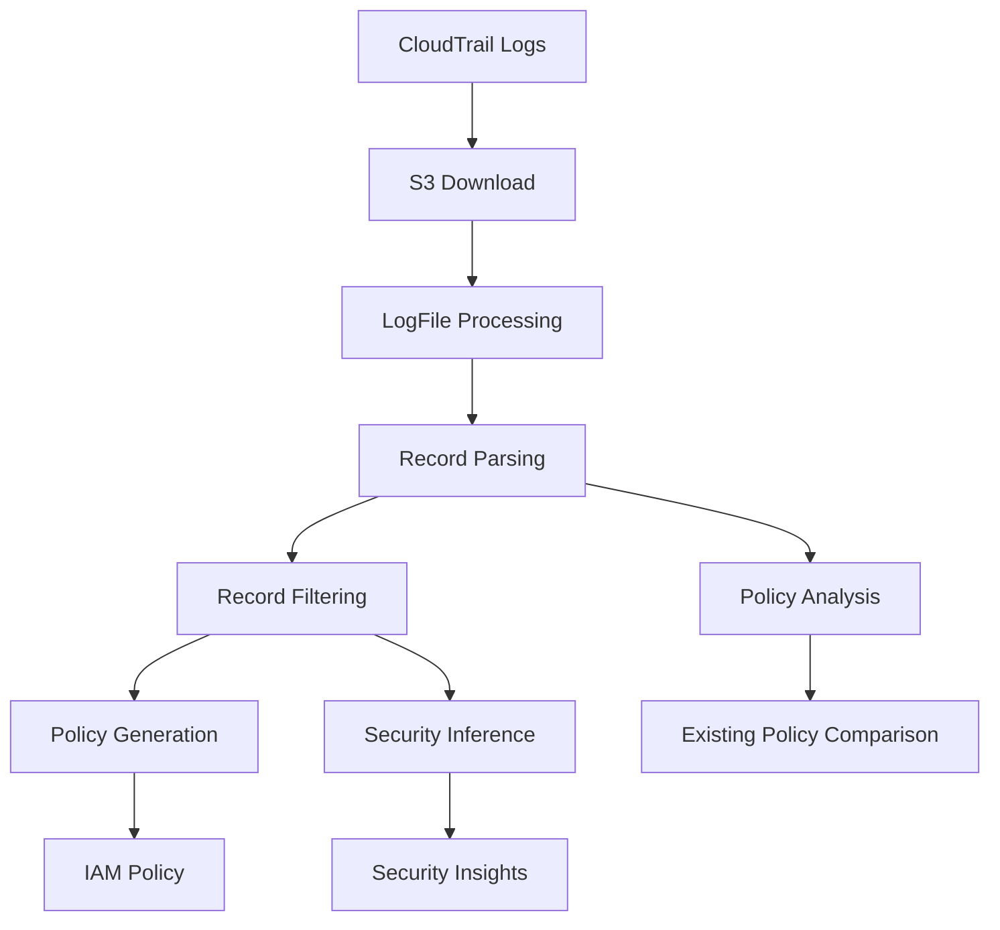

# `trailscraper`

## TrailScraper Repository Documentation

### Tree Structure
```
trailscraper/
├── trailscraper/                 # Main package directory
│   ├── __init__.py               # Package initialization
│   ├── cli.py                    # Command-line interface
│   ├── cloudtrail.py             # CloudTrail event processing
│   ├── iam.py                    # IAM policy parsing and analysis
│   ├── policy_generator.py       # Policy generation from CloudTrail data
│   ├── s3_download.py            # S3 log download utilities
│   ├── collection_utils.py       # Data collection utilities
│   ├── guess.py                  # Security inference algorithms
│   ├── time_utils.py             # Time-based filtering utilities
│   └── boto_service_definitions.py  # AWS service mappings
└── setup.py                      # Package installation configuration
```

### Purpose
TrailScraper is a Python-based tool designed for analyzing AWS CloudTrail logs to support security auditing, compliance monitoring, and access pattern analysis. It transforms raw CloudTrail event data into structured formats that enable security professionals to:

- Audit user and service access patterns
- Generate IAM policies from actual usage data
- Identify potential security risks through behavioral analysis
- Support compliance reporting with evidence-based access reviews

The tool is particularly valuable for organizations seeking to implement least-privilege access controls, conduct security audits, or automate compliance verification processes.

### Architecture


The system follows a pipeline architecture where CloudTrail data flows through several processing stages:
1. **Data Acquisition**: Logs are downloaded from S3 buckets
2. **Data Processing**: Raw JSON logs are parsed into structured records
3. **Data Filtering**: Records are filtered by time range and role ARNs
4. **Analysis & Generation**: Records are converted to IAM policies or used for security inference
5. **Output**: Results are presented as structured policies or insights

### Entry Points
**CLI Interface (`cli.py`)**:
- Command-line tool for executing trailscraper operations
- Accepts arguments for log sources, time ranges, and analysis options
- Targets security analysts, compliance officers, and DevOps engineers

**Importable APIs**:
- `trailscraper.cloudtrail.parse_records()` - Parse CloudTrail JSON records
- `trailscraper.cloudtrail.filter_records()` - Filter CloudTrail records by criteria
- `trailscraper.iam.parse_policy_document()` - Parse IAM policy documents
- `trailscraper.policy_generator.generate_policy()` - Generate IAM policies from access data
- `trailscraper.s3_download.download_cloudtrail_logs()` - Download CloudTrail logs from S3

### Core Features
1. **CloudTrail Log Processing** - Parse and structure CloudTrail JSON events into manageable objects
2. **IAM Policy Generation** - Automatically create IAM policies from actual access patterns
3. **Security Inference** - Apply heuristics to identify potential security issues
4. **Time-based Filtering** - Filter logs by specific time ranges for focused analysis
5. **Role-based Access Filtering** - Filter records by assumed role ARNs for targeted analysis
6. **Policy Comparison** - Analyze existing policies against actual usage patterns

### Dependencies
**External Dependencies**:
- `boto3` - AWS SDK for Python interactions with S3 and CloudTrail services
- `json` - Standard library for JSON parsing and serialization
- `argparse` - Command-line argument parsing
- `datetime` - Time and date manipulation utilities

**Internal Modules**:
- `record_sources/` - Configuration for log data sources
- `collection_utils.py` - Common data collection utilities
- `time_utils.py` - Time-based filtering capabilities

### Extension Points
The system supports extension through:
- Custom policy generation rules in `policy_generator.py`
- Additional security inference algorithms in `guess.py`
- New service mappings in `boto_service_definitions.py`
- Custom filtering criteria in `cloudtrail.py`
- Alternative data source configurations in `record_sources/`

### Configuration
The system supports configuration through:
- Environment variables for AWS credentials
- Command-line arguments for operational parameters
- Configuration files in `record_sources/` for defining log sources
- Runtime parameters for specifying time ranges and filtering criteria

### Key Modules Overview
- **cloudtrail.py**: Core CloudTrail event processing including LogFile and Record classes for handling CloudTrail data structures
- **iam.py**: IAM policy parsing and analysis capabilities for evaluating permissions and access control
- **policy_generator.py**: Generates IAM policies from access patterns and CloudTrail data analysis
- **s3_download.py**: Handles downloading CloudTrail logs from S3 buckets with configurable retrieval options
- **cli.py**: Implements command-line interface for executing trailscraper operations with various analysis options
- **boto_service_definitions.py**: Defines AWS service mappings and endpoint information for service identification
- **guess.py**: Implements security inference algorithms for heuristic-based analysis of access patterns
- **collection_utils.py**: Provides utility functions for collecting and organizing log data from various sources
- **time_utils.py**: Provides time-based filtering and temporal analysis utilities for CloudTrail events

---

## Modules

- [`trailscraper`](trailscraper.md)
- [`trailscraper/record_sources`](trailscraper/record_sources.md)

