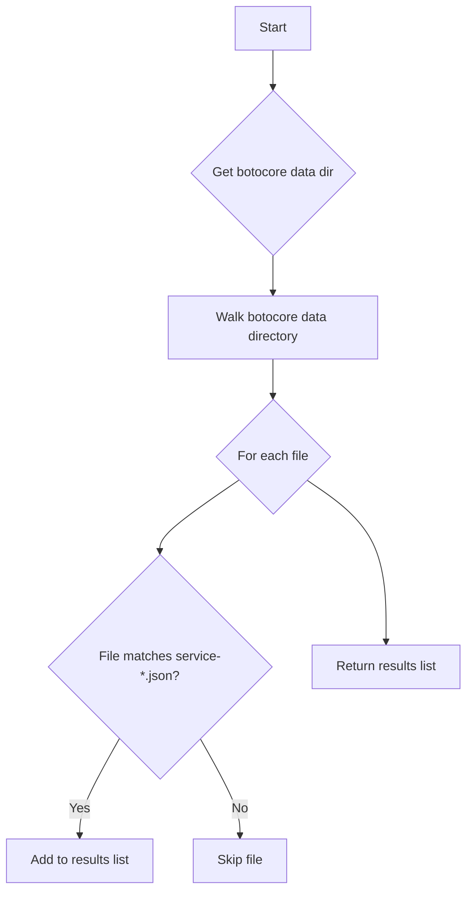

# `boto_service_definitions.py`

## `trailscraper.boto_service_definitions.boto_service_definition_files` · *function*

## Summary:
Retrieves all AWS service definition JSON files from the botocore package data directory.

## Description:
This function enumerates all AWS service definition files packaged with botocore by walking the botocore data directory and filtering for files matching the pattern 'service-*.json'. These service definition files contain metadata about AWS services and their operations, which are used by the trailscraper system for analyzing AWS service usage patterns.

The function is extracted as a separate utility to encapsulate the logic for discovering service definition files, making it reusable and testable. This separation allows other components to easily access AWS service metadata without duplicating the file discovery logic.

## Args:
    None

## Returns:
    list[str]: A list of absolute file paths pointing to AWS service definition JSON files in the format 'service-*.json'.

## Raises:
    None explicitly raised

## Constraints:
    Preconditions:
    - The botocore package must be installed and available in the Python environment
    - The botocore data directory structure must follow the expected layout
    
    Postconditions:
    - Returns a list of valid file paths (though individual files may not exist)
    - The returned list contains only files matching the 'service-*.json' pattern

## Side Effects:
    - Reads from the file system to enumerate directory contents
    - Makes a call to pkg_resources.resource_filename() to resolve package data location

## Control Flow:


## Examples:
```python
# Typical usage in trailscraper system
service_files = boto_service_definition_files()
for service_file in service_files:
    with open(service_file, 'r') as f:
        service_def = json.load(f)
    # Process AWS service definition
```

## `trailscraper.boto_service_definitions.service_definition_file` · *function*

## Summary:
Returns the most recent service definition file for a specified AWS service by filtering and sorting available definition files.

## Description:
This function retrieves all AWS service definition files from the botocore package data directory and filters them to find files associated with a specific AWS service. It then sorts the matching files alphabetically and returns the most recent version (last item in the sorted list).

The function is designed to extract the latest service definition file for a given AWS service, which typically corresponds to the most recent API version available in the botocore package. This is useful for trailscraper systems that need to analyze AWS service usage patterns based on the most up-to-date service definitions.

This logic is extracted into its own function to encapsulate the complex file filtering and selection logic, making it reusable and testable. Separating this concern allows other components to easily obtain service definition files without duplicating the file discovery and sorting logic.

## Args:
    servicename (str): The name of the AWS service to find definition files for. This should match the service directory name within the botocore data structure.

## Returns:
    str: The absolute path to the most recent service definition file for the specified service.

## Raises:
    IndexError: When no service definition files are found for the specified servicename, causing an attempt to access [-1] on an empty list.

## Constraints:
    Preconditions:
    - The botocore package must be installed and available in the Python environment
    - The servicename parameter must be a valid service name that exists in the botocore data structure
    - The botocore data directory structure must follow the expected layout
    
    Postconditions:
    - Returns a valid file path string (though the file may not exist)
    - If matching files exist, returns the alphabetically last file from the filtered set

## Side Effects:
    - Reads from the file system to enumerate directory contents via the boto_service_definition_files() function
    - Makes a call to pkg_resources.resource_filename() indirectly through boto_service_definition_files()

## Control Flow:
```mermaid
flowchart TD
    A[Start] --> B[Call boto_service_definition_files()]
    B --> C[Filter files with fnmatch pattern "**/{servicename}/*/service-*.json"]
    C --> D{Are matching files found?}
    D -->|No| E[Raise IndexError]
    D -->|Yes| F[Sort matching files alphabetically]
    F --> G[Return last (highest version) file]
```

## Examples:
```python
# Find the most recent definition file for EC2 service
ec2_definition = service_definition_file("ec2")
print(ec2_definition)  # e.g., "/path/to/botocore/data/ec2/2023-01-01/service-2.json"

# Find the most recent definition file for S3 service  
s3_definition = service_definition_file("s3")
print(s3_definition)  # e.g., "/path/to/botocore/data/s3/2023-07-01/service-2.json"
```

## `trailscraper.boto_service_definitions.operation_definition` · *function*

## Summary:
Retrieves the definition of a specific AWS service operation from the service definition file.

## Description:
This function fetches the definition of a particular AWS service operation by loading the corresponding service definition file and extracting the requested operation from its operations dictionary. It serves as a utility for accessing detailed metadata about AWS service operations within the trailscraper system.

The function is extracted into its own component to encapsulate the logic for retrieving specific operation definitions from service definition files. This separation allows other components to easily access operation metadata without duplicating the file reading and JSON parsing logic, promoting code reuse and maintainability.

## Args:
    servicename (str): The name of the AWS service (e.g., 'ec2', 's3') for which to retrieve the operation definition.
    operationname (str): The name of the specific operation within the service (e.g., 'DescribeInstances', 'GetObject').

## Returns:
    dict: The operation definition dictionary containing metadata about the specified AWS service operation.

## Raises:
    FileNotFoundError: When the service definition file for the specified servicename cannot be found.
    KeyError: When the operationname is not found in the operations dictionary of the service definition.
    json.JSONDecodeError: When the service definition file contains invalid JSON.

## Constraints:
    Preconditions:
    - The botocore package must be installed and available in the Python environment
    - The servicename must correspond to a valid AWS service with available definition files
    - The operationname must exist in the service definition file for the specified servicename
    
    Postconditions:
    - Returns a dictionary containing the operation definition metadata
    - The returned dictionary is a direct reference to data within the loaded JSON structure

## Side Effects:
    - Reads from the file system to load the service definition file
    - Parses JSON content from disk into Python data structures

## Control Flow:
```mermaid
flowchart TD
    A[Start] --> B[Get service definition file path using service_definition_file()]
    B --> C[Open service definition file with UTF-8 encoding]
    C --> D[Load JSON content from file]
    D --> E{Operation name exists in operations dict?}
    E -->|No| F[KeyError raised]
    E -->|Yes| G[Return operation definition]
```

## Examples:
```python
# Retrieve the definition for EC2's DescribeInstances operation
try:
    desc_instances_def = operation_definition("ec2", "DescribeInstances")
    print(desc_instances_def["http"]["method"])  # Prints HTTP method for the operation
except (FileNotFoundError, KeyError, json.JSONDecodeError) as e:
    print(f"Could not retrieve operation definition: {e}")
```

