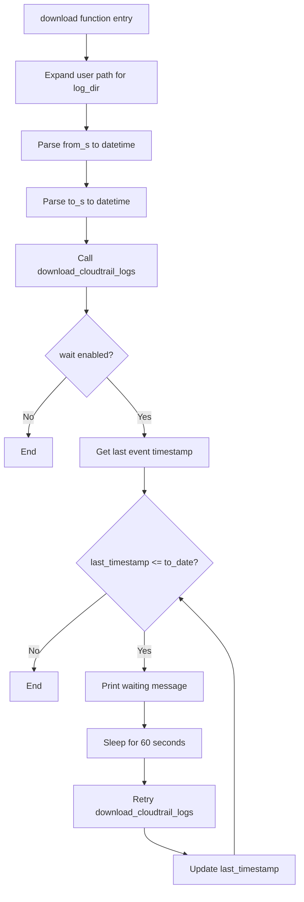
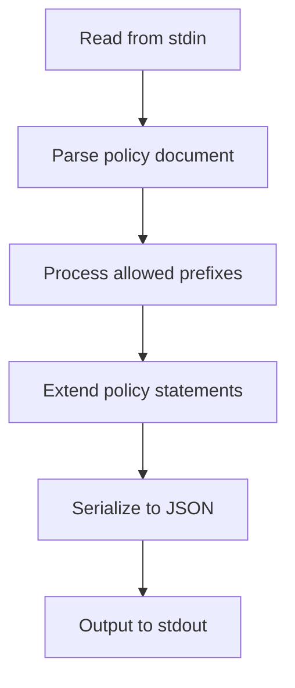

# `cli.py`

## `trailscraper.cli.root_group` · *function*

## Summary:
Configures logging levels for the CLI application based on the verbose flag.

## Description:
This function initializes logging configuration for the trailscraper CLI tool. It adjusts the logging verbosity by setting appropriate log levels for the main application logger and related AWS service libraries (botocore and s3transfer). This function is typically called at the beginning of CLI command execution to establish the desired logging behavior.

## Args:
    verbose (bool): When True, enables debug-level logging for the main application logger and info-level logging for botocore and s3transfer libraries. When False, logging levels remain at their default settings.

## Returns:
    None: This function does not return any value.

## Raises:
    None: This function does not explicitly raise any exceptions.

## Constraints:
    Preconditions:
        - The logging module must be properly imported and available
        - This function should be called before any logging operations that depend on the configured levels
    
    Postconditions:
        - If verbose=True: main logger level is set to DEBUG, botocore and s3transfer loggers are set to INFO
        - If verbose=False: logging levels remain unchanged from their previous state

## Side Effects:
    - Modifies global logging configuration by calling logging.getLogger() and setting level attributes
    - Changes log level settings for the main application logger and botocore/s3transfer libraries

## Control Flow:
```mermaid
flowchart TD
    A[Call root_group(verbose)] --> B{verbose == True?}
    B -- Yes --> C[Get main logger]
    B -- Yes --> D[Set main logger level to DEBUG]
    B -- Yes --> E[Get botocore logger]
    B -- Yes --> F[Set botocore logger level to INFO]
    B -- Yes --> G[Get s3transfer logger]
    B -- Yes --> H[Set s3transfer logger level to INFO]
    C --> I[End]
    D --> I
    E --> I
    F --> I
    G --> I
    H --> I
    B -- No --> I[End]
```

## Examples:
```python
# Configure for verbose debugging output
root_group(verbose=True)

# Configure for normal logging output
root_group(verbose=False)
```

## `trailscraper.cli.download` · *function*

## Summary:
Downloads CloudTrail log files from S3 to a local directory and optionally waits for logs to catch up to a specified time range.

## Description:
The download function orchestrates the retrieval of CloudTrail log files from AWS S3 to a local directory. It accepts various filtering parameters to specify which logs to download and handles both immediate downloads and polling for log completion. This function is typically invoked through the command-line interface to fetch CloudTrail data for analysis.

The function first expands the user home directory in the log directory path, then parses human-readable time strings into datetime objects. It initiates the download process using the underlying download_cloudtrail_logs function, and if the wait flag is enabled, it continuously polls the local directory to ensure all logs have been downloaded up to the specified end time.

## Args:
    bucket (str): Name of the S3 bucket containing CloudTrail log files.
    prefix (str): Base prefix to prepend to all generated S3 key paths for CloudTrail logs.
    org_id (str or None): Organization ID for organization trails; if None, regular account trails are used.
    account_id (str): AWS account ID to generate prefixes for.
    region (str): AWS region to generate prefixes for.
    log_dir (str): Local directory path where downloaded CloudTrail log files will be stored.
    from_s (str): Human-readable start date/time for the date range (inclusive).
    to_s (str): Human-readable end date/time for the date range (inclusive).
    wait (bool): Whether to poll for log completion after initiating download.
    parallelism (int): Maximum number of concurrent download threads to use.

## Returns:
    None: This function does not return any value.

## Raises:
    None explicitly raised: The function delegates to other functions that may raise AWS-related exceptions such as ClientError, NoSuchBucket, AccessDenied, etc., but these are not explicitly caught or re-raised by this function.

## Constraints:
    Preconditions:
        - from_s must be a valid human-readable time string that can be parsed by dateparser
        - to_s must be a valid human-readable time string that can be parsed by dateparser
        - from_date must be less than or equal to to_date
        - account_id must be a valid AWS account ID string
        - region must be a valid AWS region string
        - log_dir must be a writable directory path
        - parallelism must be a positive integer
        - If org_id is provided, it must be a valid organization ID string

    Postconditions:
        - Files matching the generated S3 prefixes will be downloaded to the log_dir
        - If wait=True, the function will continue polling until all logs up to to_date are present
        - The log_dir will contain CloudTrail log files organized by date and timestamp

## Side Effects:
    - Creates directories in the local filesystem as needed
    - Downloads files from S3 to the local filesystem
    - Writes log messages at INFO level for download progress
    - May cause network I/O to AWS S3
    - May cause repeated I/O operations when wait=True due to polling

## Control Flow:


## Examples:
    # Download CloudTrail logs for a specific account and region
    download(
        bucket="my-cloudtrail-bucket",
        prefix="AWSLogs/",
        org_id=None,
        account_id="123456789012",
        region="us-east-1",
        log_dir="/tmp/cloudtrail-logs",
        from_s="2023-12-20",
        to_s="2023-12-22",
        wait=False,
        parallelism=5
    )
    
    # Download CloudTrail logs and wait for completion
    download(
        bucket="aws-cloudtrail-logs",
        prefix="CloudTrail/",
        org_id="o-1234567890",
        account_id="123456789012",
        region="us-east-1",
        log_dir="./cloudtrail-logs",
        from_s="2023-12-01 00:00:00",
        to_s="2023-12-31 23:59:59",
        wait=True,
        parallelism=10
    )

## `trailscraper.cli.select` · *function*

## Summary:
Selects and outputs CloudTrail records from either AWS API or local files within a specified time range, optionally filtered by assumed role ARNs.

## Description:
The select function serves as a command-line interface endpoint that retrieves CloudTrail records from either the AWS CloudTrail API or local log files, applies time and role-based filtering, and outputs the results as JSON. This function acts as the core data retrieval and filtering mechanism for the trailscraper CLI tool, enabling users to extract specific CloudTrail events for analysis or policy generation.

The function abstracts away the complexity of choosing between different data sources (API vs local files) and provides a unified interface for record selection based on time ranges and role filtering. It's designed to be called from CLI commands and follows the typical pattern of CLI functions that process data and output results.

## Args:
    log_dir (str): Path to the local directory containing CloudTrail log files. Required when use_cloudtrail_api is False.
    filter_assumed_role_arn (str or None): ARN of assumed role to filter records by. If None or empty, no role filtering is applied.
    use_cloudtrail_api (bool): Flag indicating whether to fetch records from AWS CloudTrail API (True) or local files (False).
    from_s (str): Human-readable start time for the record selection range (inclusive).
    to_s (str): Human-readable end time for the record selection range (inclusive).

## Returns:
    None: This function does not return a value directly. Instead, it outputs JSON-formatted records to stdout via click.echo.

## Raises:
    None explicitly raised by this function. However, underlying functions may raise exceptions such as:
    - boto3.exceptions.ClientError when using CloudTrail API and AWS credentials are invalid
    - FileNotFoundError when local directory doesn't exist
    - PermissionError when insufficient permissions to read files/directories
    - ValueError when time parsing fails

## Constraints:
    Preconditions:
    - When use_cloudtrail_api is False, log_dir must be a valid directory path
    - from_s and to_s must be parseable by dateparser into valid datetime objects
    - When use_cloudtrail_api is True, AWS credentials must be configured for CloudTrail API access
    - from_date must be less than or equal to to_date
    
    Postconditions:
    - Records returned will be within the specified time range [from_date, to_date]
    - If filter_assumed_role_arn is specified, only records with matching assumed_role_arn will be returned
    - Output is formatted as JSON with a "Records" key containing the filtered records

## Side Effects:
    - Writes JSON-formatted records to stdout using click.echo
    - May perform network requests when using CloudTrail API (use_cloudtrail_api=True)
    - May read files from disk when using local directory source (use_cloudtrail_api=False)
    - May log warnings when all records are filtered out (via filter_records function)

## Control Flow:
```mermaid
flowchart TD
    A[select called] --> B[Expand user home in log_dir]
    B --> C[Parse from_s to datetime]
    C --> D[Parse to_s to datetime]
    D --> E{use_cloudtrail_api flag}
    E -- True --> F[CloudTrailAPIRecordSource().load_from_api]
    E -- False --> G[LocalDirectoryRecordSource().load_from_dir]
    F --> H[Filter records by time and role]
    G --> H
    H --> I[Extract raw_source from records]
    I --> J[Output as JSON via click.echo]
```

## Examples:
```python
# Select records from local files between specific times
select("/var/log/cloudtrail", None, False, "2023-01-01", "2023-01-02")

# Select records from CloudTrail API for a specific role
select(None, "arn:aws:iam::123456789012:role/AdminRole", True, "1 hour ago", "now")
```

## `trailscraper.cli.generate` · *function*

## Summary:
Generates an IAM policy document from CloudTrail event records provided via standard input.

## Description:
This function reads CloudTrail event records from standard input, processes them through the trailscraper pipeline, and outputs a generated IAM policy document in JSON format. It serves as the command-line entry point for the policy generation workflow, enabling users to pipe CloudTrail logs into the tool for automated permission analysis.

The function follows a clear data processing pipeline: it reads JSON-formatted CloudTrail records from stdin, parses them into structured records, generates IAM policy statements from those records, and outputs the resulting policy as formatted JSON. This design enables integration with various CloudTrail data sources through standard input redirection or piping.

## Args:
    None: This function takes no parameters directly. All input is read from standard input.

## Returns:
    None: This function does not return a value. Instead, it outputs the generated policy JSON to standard output.

## Raises:
    json.JSONDecodeError: Raised when the input from stdin is not valid JSON format.
    KeyError: Raised when the parsed JSON does not contain the expected 'Records' key.
    Exception: May propagate exceptions from underlying parsing or policy generation functions such as those from Record.to_statement() or policy_generator.generate_policy().

## Constraints:
    Preconditions:
        - Standard input must contain valid JSON with a 'Records' key containing a list of CloudTrail event records
        - Each CloudTrail record must contain required fields for successful parsing (eventSource, eventName, eventTime)
        - The input data must be properly formatted according to AWS CloudTrail event schema
        
    Postconditions:
        - The function outputs a valid IAM policy document in JSON format to standard output
        - All CloudTrail records are processed through the parsing and policy generation pipeline
        - Invalid records are filtered out during parsing
        - The output policy document follows AWS IAM policy format with Version="2012-10-17"

## Side Effects:
    - Reads from standard input stream (stdin)
    - Writes to standard output stream (stdout) via click.echo()
    - May generate warning log messages during record parsing if records cannot be processed
    - No external state mutations or I/O operations beyond standard streams

## Control Flow:
```mermaid
flowchart TD
    A[Start generate()] --> B[Read from stdin using click.get_text_stream]
    B --> C[Parse JSON from stdin using json.load]
    C --> D{JSON contains 'Records' key?}
    D -- Yes --> E[Extract Records array]
    D -- No --> F[Raise KeyError]
    E --> G[Parse records using parse_records()]
    G --> H{Any records parsed successfully?}
    H -- Yes --> I[Generate policy using policy_generator.generate_policy()]
    H -- No --> J[Generate empty policy with empty Statement list]
    I --> K[Convert policy to JSON using policy.to_json()]
    K --> L[Output JSON to stdout using click.echo()]
    J --> K
    F --> M[Exit with error]
```

## Examples:
```bash
# Generate policy from CloudTrail logs in a file
cat cloudtrail-logs.json | trailscraper generate

# Generate policy from AWS CLI CloudTrail query
aws cloudtrail lookup-events --start-time 2023-01-01T00:00:00Z --end-time 2023-01-01T01:00:00Z | trailscraper generate

# Generate policy from piped JSON data
echo '{"Records": [{"eventSource": "s3.amazonaws.com", "eventName": "GetObject", "eventTime": "2023-01-01T12:00:00Z", "resources": [{"ARN": "arn:aws:s3:::my-bucket/*"}]}]}' | trailscraper generate
```

## `trailscraper.cli.guess` · *function*

## Summary:
Extends IAM policy statements with additional actions based on allowed prefixes and outputs the enhanced policy as JSON.

## Description:
Processes an AWS IAM policy document from standard input by extending each statement with inferred actions matching the specified allowed prefixes, then outputs the enhanced policy in JSON format. This function serves as a command-line interface for policy analysis and enhancement, enabling users to expand partial policy permissions into more comprehensive representations.

The function is extracted into its own component to separate the CLI interaction logic from the core policy processing logic, allowing for independent testing and reuse of the policy enhancement functionality. It follows the pattern of reading from stdin, processing the input through domain-specific logic, and writing results to stdout.

## Args:
    only (list[str]): A list of string prefixes that define which action categories should be considered for statement extension. Each prefix is capitalized using title() before processing.

## Returns:
    None: This function does not return a value directly, but outputs the enhanced policy JSON to standard output.

## Raises:
    KeyError: When the input policy document is missing required keys ('Statement' or 'Version') during parsing.
    json.JSONDecodeError: When the input from stdin is not valid JSON.
    TypeError: When the policy object cannot be serialized to JSON.

## Constraints:
    Preconditions:
        - Input from stdin must be valid JSON representing an AWS IAM policy document
        - The policy document must contain 'Statement' and 'Version' keys
        - The 'only' parameter must be iterable containing string values
    Postconditions:
        - Output is a valid JSON string representing the enhanced IAM policy document
        - The enhanced policy maintains the original policy version
        - All statements in the output are either unchanged or extended with additional actions

## Side Effects:
    - Reads from standard input (stdin)
    - Writes to standard output (stdout) via click.echo
    - No external state mutations or I/O operations beyond standard streams

## Control Flow:


## Examples:
```bash
# Basic usage with pipe
echo '{"Version":"2012-10-17","Statement":[{"Effect":"Allow","Action":"s3:GetObject","Resource":"arn:aws:s3:::example-bucket/*"}]}' | trailscraper guess --only '["s3:"]'

# Using with file input
cat policy.json | trailscraper guess --only '["ec2:", "s3:"]'
```

## `trailscraper.cli.last_event_timestamp` · *function*

## Summary:
Retrieves and displays the timestamp of the most recent CloudTrail event from log files in a specified directory.

## Description:
This function serves as a command-line utility that identifies the latest CloudTrail event timestamp among all valid log files in a given directory. It expands user paths, initializes a local directory record source, and outputs the most recent event time to standard output.

The function is designed to be used as part of a command-line interface for analyzing CloudTrail log data. It provides a quick way to determine the newest event time available in a CloudTrail log directory, which is useful for time-based filtering and synchronization operations.

This logic is extracted into its own function rather than being inlined to separate the concerns of CLI argument processing from the core business logic of determining the latest event timestamp. This promotes reusability and testability while maintaining clean separation between presentation layer (CLI) and domain logic (event timestamp determination).

## Args:
    log_dir (str): Path to the directory containing CloudTrail log files. Can be a relative path or absolute path, and may include tilde (~) for home directory expansion.

## Returns:
    None: This function does not return a value directly. Instead, it outputs the timestamp via click.echo.

## Raises:
    FileNotFoundError: When the specified log directory does not exist.
    PermissionError: When there are insufficient permissions to read the log directory or files.
    IndexError: When no valid CloudTrail log files exist in the specified directory, causing failure to determine the latest timestamp.

## Constraints:
    Preconditions: The log_dir parameter must point to a valid directory containing CloudTrail log files with proper naming conventions.
    Postconditions: The function will output exactly one timestamp value to stdout, or raise an appropriate exception if no valid files are found.

## Side Effects:
    I/O: Reads files from the filesystem to process CloudTrail log entries.
    Output: Writes the latest event timestamp to standard output using click.echo.
    Logging: May emit warning messages through the logging system for files with invalid filenames during validation.

## Control Flow:
```mermaid
flowchart TD
    A[Call last_event_timestamp(log_dir)] --> B{log_dir expanded with os.path.expanduser}
    B --> C[Create LocalDirectoryRecordSource(log_dir)]
    C --> D[Call last_event_timestamp_in_dir()]
    D --> E{Valid log files exist?}
    E -->|No| F[Raise IndexError]
    E -->|Yes| G[Get latest timestamp from most recent file]
    G --> H[Output timestamp via click.echo]
```

## Examples:
```python
# Typical usage in CLI context
$ trailscraper last-event-timestamp ~/cloudtrail-logs
# Outputs: 2023-01-15 14:30:45+00:00

# Using absolute path
$ trailscraper last-event-timestamp /var/log/cloudtrail/
# Outputs: 2023-01-15 14:30:45+00:00
```

