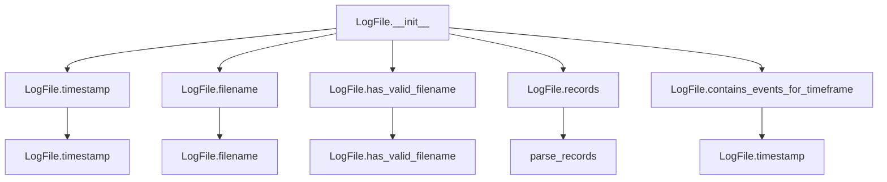
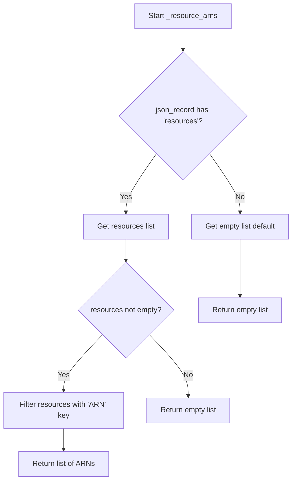
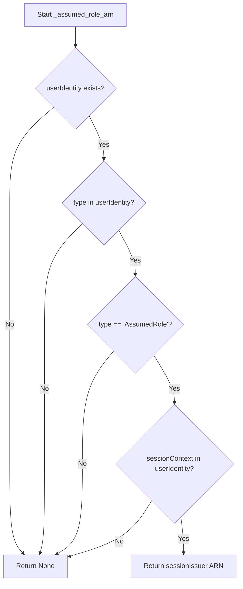
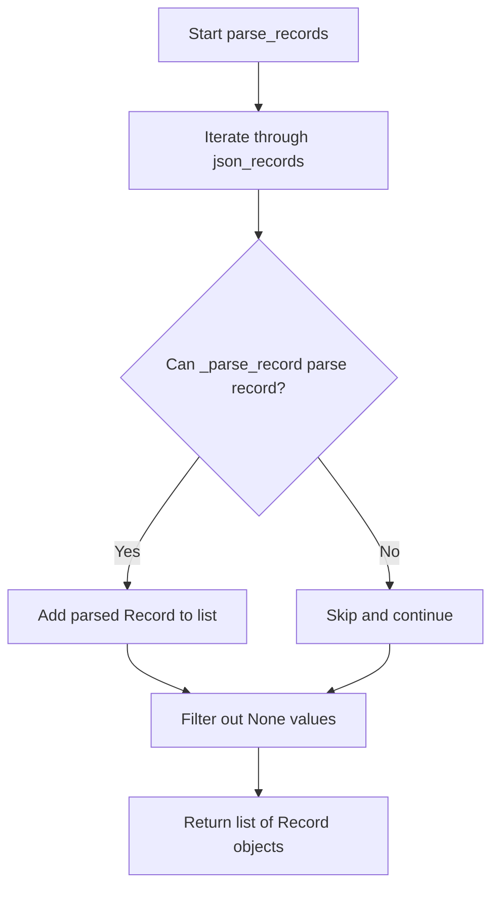
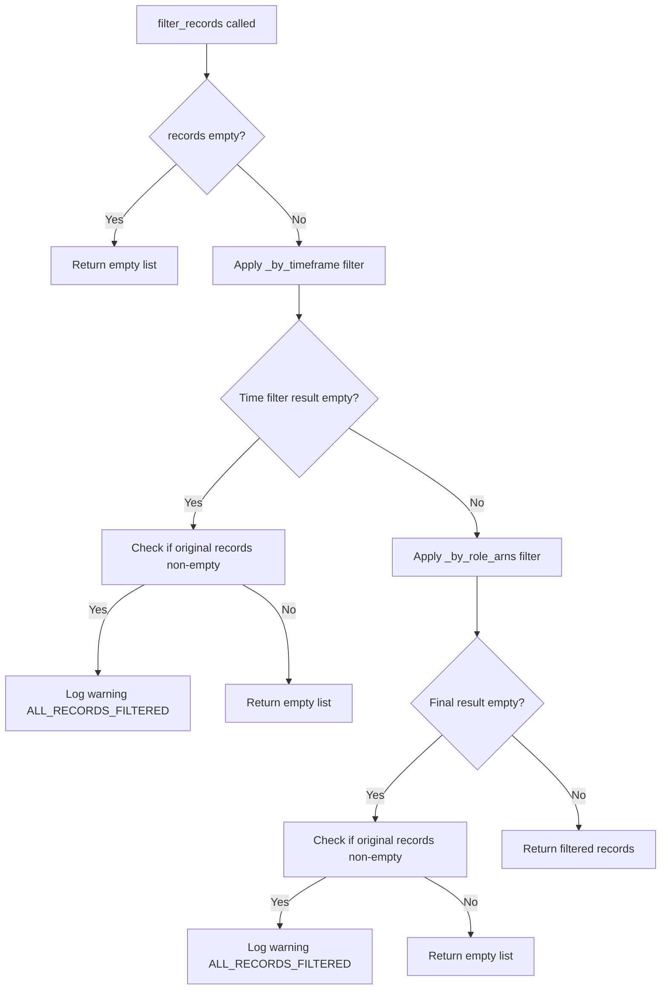

# `cloudtrail.py`

## `trailscraper.cloudtrail.Record` · *class*

## Summary:
Represents an AWS CloudTrail event record and provides conversion to IAM policy statements for permission analysis.

## Description:
The Record class encapsulates metadata from AWS CloudTrail events and translates them into IAM policy statements. It serves as a bridge between CloudTrail event data and IAM policy analysis, enabling security auditing and permission validation workflows. This class is particularly useful for converting raw CloudTrail events into structured IAM policy representations that can be analyzed, compared, and merged.

The class handles special mappings for various AWS services including S3, KMS, API Gateway, and STS, ensuring accurate translation of CloudTrail event names and sources into appropriate IAM action formats. It's typically instantiated by CloudTrail parsing components and used in security analysis pipelines.

## State:
- `event_source` (str): The AWS service that generated the event (e.g., "s3.amazonaws.com", "ec2.amazonaws.com")
- `event_name` (str): The specific operation performed (e.g., "GetObject", "RunInstances")
- `raw_source` (any): Original raw event data, preserved for debugging or extended processing
- `event_time` (datetime): Timestamp when the event occurred
- `resource_arns` (list[str]): List of ARNs representing resources affected by the event, defaults to ["*"] if not specified
- `assumed_role_arn` (str): ARN of the assumed role if the event was performed via a role assumption

All attributes are initialized in `__init__` and participate in equality comparisons and hashing.

## Lifecycle:
- Creation: Instantiate with `Record(event_source, event_name, resource_arns=None, assumed_role_arn=None, event_time=None, raw_source=None)`
- Usage: Call `to_statement()` to convert the record into an IAM Statement object for policy analysis
- Destruction: Standard Python garbage collection applies; no special cleanup required

## Method Map:
```mermaid
graph TD
    A[Record] --> B[to_statement()]
    B --> C{event_source == "sts.amazonaws.com" AND event_name == "GetCallerIdentity"?}
    C -->|Yes| D[return None]
    C -->|No| E{event_source == "apigateway.amazonaws.com"?}
    E -->|Yes| F[_to_api_gateway_statement()]
    E -->|No| G[_source_to_iam_prefix()]
    G --> H[_event_name_to_iam_action()]
    F --> I[Statement]
    H --> J[Statement]
    I --> K[Return Statement]
    J --> K
```

## Raises:
- `ValueError`: May be raised by underlying components during statement creation if operation definitions are invalid
- `FileNotFoundError`: May occur when `operation_definition` is called for services with missing definition files
- `KeyError`: May be raised when `operation_definition` cannot find the requested operation in service definitions
- `json.JSONDecodeError`: May occur when service definition files contain invalid JSON

## Example:
```python
# Create a record for an S3 PutObject event
record = Record(
    event_source="s3.amazonaws.com",
    event_name="PutObject",
    resource_arns=["arn:aws:s3:::my-bucket/*"],
    event_time=datetime.datetime.now(pytz.UTC)
)

# Convert to IAM statement
statement = record.to_statement()
print(statement)  # Outputs the IAM statement representation

# Create a record for an EC2 RunInstances event
record2 = Record(
    event_source="ec2.amazonaws.com",
    event_name="RunInstances",
    resource_arns=["arn:aws:ec2:us-east-1:123456789012:instance/*"]
)

# Convert to IAM statement
statement2 = record2.to_statement()
print(statement2)  # Outputs the IAM statement for EC2 RunInstances
```

### `trailscraper.cloudtrail.Record.__repr__` · *method*

## Summary:
Returns a string representation of the CloudTrail record showing key identifying attributes.

## Description:
This method provides a human-readable string representation of a CloudTrail record object, displaying essential metadata including the event source, event name, event time, and associated resource ARNs. It is used primarily for debugging and logging purposes to quickly visualize the core characteristics of a CloudTrail event record.

## Args:
    None

## Returns:
    str: A formatted string containing the record's event source, event name, event time, and resource ARNs in the format "Record(event_source=<value> event_name=<value> event_time=<value> resource_arns=<value>)"

## Raises:
    None

## State Changes:
    Attributes READ: self.event_source, self.event_name, self.event_time, self.resource_arns
    Attributes WRITTEN: None

## Constraints:
    Preconditions: The Record instance must have all attributes (event_source, event_name, event_time, resource_arns) properly initialized
    Postconditions: The returned string format is consistent and contains all requested attribute values

## Side Effects:
    None

### `trailscraper.cloudtrail.Record.__eq__` · *method*

## Summary:
Compares two Record objects for equality based on key identifying attributes.

## Description:
This method determines whether two Record instances are equal by comparing their core identifying attributes. It is part of the standard Python object comparison protocol and enables Record objects to be used in contexts requiring equality checks, such as set operations, dictionary keys, and membership testing.

## Args:
    other (object): Another object to compare against this Record instance.

## Returns:
    bool: True if the other object is a Record instance with identical values for event_source, event_name, event_time, resource_arns, and assumed_role_arn; False otherwise.

## Raises:
    None

## State Changes:
    Attributes READ: event_source, event_name, event_time, resource_arns, assumed_role_arn
    Attributes WRITTEN: None

## Constraints:
    Preconditions: The other object can be any object type, but equality is only considered when it's a Record instance
    Postconditions: Returns a boolean value indicating equality status

## Side Effects:
    None

### `trailscraper.cloudtrail.Record.__hash__` · *method*

## Summary:
Computes a hash value for the CloudTrail record based on its core identifying attributes.

## Description:
This special method implements the hash protocol for CloudTrail record objects, enabling them to be used in hash-based collections such as sets and as dictionary keys. The hash is deterministically computed from the record's identifying characteristics to ensure semantic equivalence.

The method creates a tuple containing the record's identifying attributes and returns their hash value. This ensures that two records with identical attribute values will produce the same hash, while records with different attribute values will generally have different hashes.

## Args:
    None

## Returns:
    int: A hash value uniquely representing this record's identifying characteristics.

## Raises:
    TypeError: If any of the attributes being hashed are unhashable (e.g., mutable objects).

## State Changes:
    Attributes READ: 
    - self.event_source: String representing the AWS service that generated the event
    - self.event_name: String representing the name of the API operation performed  
    - self.event_time: datetime object representing when the event occurred
    - self.resource_arns: Iterable of ARNs of resources involved in the event (converted to tuple for hashing)
    - self.assumed_role_arn: String representing the ARN of the IAM role assumed during the event

## Constraints:
    Preconditions:
    - All referenced attributes must be defined on the instance
    - All attributes must be hashable (immutable objects)
    - The resource_arns attribute must be iterable
    
    Postconditions:
    - The returned hash value is consistent for records with identical attribute values
    - Records with different attribute combinations will have different hash values (though hash collisions are theoretically possible)

## Side Effects:
    None

### `trailscraper.cloudtrail.Record.__ne__` · *method*

## Summary:
Implements the not-equal comparison operator for Record objects, returning True when the record differs from another object.

## Description:
This magic method defines the behavior of the `!=` operator for Record instances. It returns the logical negation of the equality comparison with another object, making it possible to test whether two Record objects are not equal. This method is automatically called when using the `!=` operator between Record instances or between a Record and other objects.

## Args:
    other (object): Another object to compare against this Record instance.

## Returns:
    bool: True if the other object is not equal to this Record instance according to the Record's equality definition; False if they are equal.

## Raises:
    None

## State Changes:
    Attributes READ: event_source, event_name, event_time, resource_arns, assumed_role_arn (through __eq__ method)
    Attributes WRITTEN: None

## Constraints:
    Preconditions: The other object can be any object type, but equality comparison is only meaningful when it's a Record instance
    Postconditions: Always returns a boolean value (True or False)

## Side Effects:
    None

### `trailscraper.cloudtrail.Record._source_to_iam_prefix` · *method*

## Summary:
Converts an AWS service endpoint to its corresponding IAM action prefix, handling special cases and providing a default mapping.

## Description:
This method transforms AWS service endpoints (like "monitoring.amazonaws.com") into IAM action prefixes (like "cloudwatch"). It's designed to map CloudTrail event sources to appropriate IAM action prefixes for permission analysis. The method implements special case mappings for specific AWS services while falling back to a default pattern of using the first part of the service endpoint.

The method is called during the creation of IAM statements from CloudTrail records, specifically in the `to_statement` method where it helps construct Action objects with proper prefixes.

## Args:
    None - This is a method that operates on instance attributes

## Returns:
    str: The IAM action prefix derived from the event source. Returns a special case prefix when matched, otherwise returns the first part of the event source split by dots.

## Raises:
    None explicitly raised - The method uses dictionary lookup and string operations that don't raise exceptions under normal circumstances

## State Changes:
    Attributes READ: self.event_source
    Attributes WRITTEN: None - This is a pure transformation method

## Constraints:
    Preconditions:
    - self.event_source must be a string representing a valid AWS service endpoint
    - The event_source should follow the standard AWS endpoint format (e.g., "service.region.amazonaws.com")

    Postconditions:
    - Returns a valid IAM action prefix string
    - The returned prefix corresponds to a recognized AWS service for IAM actions

## Side Effects:
    None - This method performs no I/O operations or external service calls

### `trailscraper.cloudtrail.Record._event_name_to_iam_action` · *method*

## Summary:
Transforms a CloudTrail event name into its corresponding IAM action name by applying service-specific mappings and regex normalization.

## Description:
This method converts CloudTrail event names to IAM action names, which is useful for analyzing permissions and access patterns. It handles special cases for S3 and KMS services, then applies regex transformations to normalize event naming conventions. The method follows these steps in order:
1. Applies service-specific mappings for S3 and KMS events
2. Normalizes "DeleteBucketCors" to "PutBucketCORS"
3. Removes numeric, version, and underscore suffixes from event names
4. Converts "Cors$" suffix to "CORS"

## Args:
    None - This is a method that operates on instance attributes

## Returns:
    str: The normalized IAM action name derived from the CloudTrail event name

## Raises:
    None explicitly raised - The method uses dictionary lookups and regex operations that would not raise exceptions under normal circumstances

## State Changes:
    Attributes READ: self.event_source, self.event_name
    Attributes WRITTEN: None - This is a pure transformation method

## Constraints:
    Preconditions: 
    - self.event_source must be a string representing the AWS service
    - self.event_name must be a string representing the CloudTrail event
    
    Postconditions:
    - Returns a string that represents a valid IAM action name
    - The returned string is normalized according to AWS IAM action naming conventions

## Side Effects:
    None - This method performs no I/O operations or external service calls

### `trailscraper.cloudtrail.Record._to_api_gateway_statement` · *method*

## Summary:
Converts an API Gateway CloudTrail event into an IAM Statement representing the HTTP method and resource path accessed.

## Description:
This method transforms a CloudTrail record with API Gateway event source into an IAM Statement that captures the HTTP method and resource path involved in the API call. It retrieves the operation definition from AWS service definitions to extract HTTP method and request URI information, then constructs a statement with wildcard resource paths to represent the API endpoint pattern.

The method is specifically designed for API Gateway events and is called by the `to_statement()` method when processing records with the "apigateway.amazonaws.com" event source. This separation allows for clean handling of API Gateway-specific logic while maintaining a unified interface for statement generation.

## Args:
    self: The Record instance containing the CloudTrail event data

## Returns:
    Statement: An IAM Statement with Effect="Allow", Action containing the API Gateway HTTP method, and Resource representing the API endpoint pattern

## Raises:
    KeyError: When the operation definition for the event_name doesn't contain expected 'http' key with 'method' and 'requestUri' fields, or when the operation definition itself is malformed
    FileNotFoundError: When the API Gateway service definition file cannot be found
    json.JSONDecodeError: When the service definition file contains invalid JSON

## State Changes:
    Attributes READ: self.event_name
    Attributes WRITTEN: None

## Constraints:
    Preconditions:
    - The Record instance must have a valid event_name attribute
    - The event_name must correspond to a valid API Gateway operation in the service definitions
    - The operation definition must contain HTTP method and request URI information
    
    Postconditions:
    - Returns a properly formatted Statement object with Allow effect
    - The Action in the statement uses the apigateway service prefix with the HTTP method as action
    - The Resource uses a wildcard pattern for the request URI with path parameters replaced by asterisks

## Side Effects:
    - Reads from the file system to load AWS service definition files
    - Parses JSON content from disk into Python data structures
    - Makes use of regular expression compilation and substitution

### `trailscraper.cloudtrail.Record.to_statement` · *method*

## Summary:
Converts a CloudTrail record into an IAM Statement representation, excluding STS GetCallerIdentity events and handling API Gateway events specially.

## Description:
Transforms a CloudTrail record into an IAM Statement that represents the permissions granted by the recorded event. This method serves as the primary interface for converting CloudTrail data into IAM policy format for access analysis and permission auditing.

The method implements special handling for:
1. STS GetCallerIdentity events, which are excluded from IAM statements (returning None)
2. API Gateway events, which require custom statement construction due to their HTTP-based nature

For all other events, it creates a standard IAM Statement with Allow effect, using the service prefix and action derived from the event source and event name respectively.

## Args:
    self: The Record instance containing CloudTrail event data

## Returns:
    Statement or None: An IAM Statement object with Allow effect for most events, or None for STS GetCallerIdentity events. For API Gateway events, returns the result from _to_api_gateway_statement().

## Raises:
    None explicitly raised - The method delegates to other methods that may raise exceptions, but doesn't raise exceptions itself

## State Changes:
    Attributes READ: self.event_source, self.event_name, self.resource_arns
    Attributes WRITTEN: None - This is a pure transformation method

## Constraints:
    Preconditions:
    - self.event_source must be a valid AWS service endpoint string
    - self.event_name must be a valid CloudTrail event name string
    - self.resource_arns should be a list of ARNs or default to ["*"]

    Postconditions:
    - For STS GetCallerIdentity events: returns None
    - For API Gateway events: returns result from _to_api_gateway_statement() method
    - For all other events: returns Statement with Effect="Allow", properly constructed Action, and sorted Resource list

## Side Effects:
    - Calls helper methods that may perform I/O operations (file system access for service definitions)
    - Uses regular expressions for string manipulation
    - May trigger exceptions from delegated methods when processing API Gateway events

## `trailscraper.cloudtrail.LogFile` · *class*

## Summary:
Represents a CloudTrail log file with methods to extract metadata, validate file format, and parse event records.

## Description:
The LogFile class provides an abstraction for working with AWS CloudTrail log files. It encapsulates the file path and offers methods to extract key metadata such as timestamps, filenames, and to validate the file format. The class is designed to work with gzipped JSON CloudTrail log files and provides functionality to parse the contained event records into structured data for security analysis.

This class serves as a foundational component in the trailscraper system for processing CloudTrail logs, enabling operations like time-based filtering and event record extraction while maintaining clean separation between file handling and data processing logic.

## State:
- `_path` (str): The absolute or relative path to the CloudTrail log file. Must be a valid file path pointing to a gzipped JSON file. This is the only instance attribute and is initialized in `__init__`.

## Lifecycle:
- Creation: Instantiate with a file path string pointing to a CloudTrail log file
- Usage: Call methods in any order to extract metadata or process records
- Destruction: No explicit cleanup required; relies on Python's garbage collection

## Method Map:


## Raises:
- `IndexError`: May be raised in `timestamp()` method if the filename doesn't match the expected CloudTrail naming convention
- `ValueError`: May be raised in `timestamp()` method if date/time parsing fails due to malformed timestamp in filename
- `IOError` or `OSError`: Raised during file reading operations in `records()` method when the file cannot be opened or read

## Example:
```python
# Create a LogFile instance
log_file = LogFile("/path/to/CloudTrail_log.json.gz")

# Check if file has valid format
if log_file.has_valid_filename():
    print(f"File: {log_file.filename()}")
    print(f"Timestamp: {log_file.timestamp()}")

# Extract records from the log file
records = log_file.records()

# Filter logs by time range
from datetime import datetime
start_time = datetime(2023, 1, 1)
end_time = datetime(2023, 1, 2)
if log_file.contains_events_for_timeframe(start_time, end_time):
    print("Log file contains events in the specified timeframe")
```

### `trailscraper.cloudtrail.LogFile.__init__` · *method*

## Summary:
Initializes a LogFile instance with the path to a CloudTrail log file.

## Description:
Constructs a LogFile object by storing the provided file path in the internal `_path` attribute. This constructor serves as the entry point for creating LogFile instances, which are then used to extract metadata, validate file formats, and parse event records from AWS CloudTrail log files.

The LogFile class relies on this path to perform all subsequent operations including timestamp extraction, filename validation, and record parsing. This method is called during the instantiation phase of the CloudTrail log processing pipeline.

## Args:
    path (str): The absolute or relative path to the CloudTrail log file. Must point to a valid gzipped JSON file following AWS CloudTrail naming conventions.

## Returns:
    None: This method does not return a value.

## Raises:
    None: This method does not raise any exceptions.

## State Changes:
    Attributes READ: None
    Attributes WRITTEN: self._path (stores the provided path parameter)

## Constraints:
    Preconditions:
        - The path argument must be a string representing a valid file path
        - The file at the specified path must be accessible and readable
        - The file should be a gzipped JSON file following CloudTrail naming conventions
        
    Postconditions:
        - The LogFile instance is properly initialized with the provided path
        - The `_path` attribute contains the exact path string provided as input

## Side Effects:
    None: This method performs no I/O operations or external service calls. It only stores the provided path in an instance attribute.

### `trailscraper.cloudtrail.LogFile.timestamp` · *method*

## Summary:
Extracts and parses the timestamp component from a CloudTrail log filename, returning it as a UTC-aware datetime object.

## Description:
Parses the timestamp portion of a CloudTrail log filename and converts it into a timezone-aware datetime object in UTC. This method is designed to work with CloudTrail log files that follow a specific naming convention where the timestamp is located at the fourth field (index 3) after splitting by underscores.

The method expects the timestamp string to be in a format where:
- Characters 0-3: Year (4 digits)
- Characters 4-5: Month (2 digits)
- Characters 6-7: Day (2 digits)
- Characters 9-10: Hour (2 digits)
- Characters 11-12: Minute (2 digits)

The method skips characters at positions 8 and 13, suggesting these positions may contain separators (like 'T' or 'Z') that are not part of the numeric components.

The method is primarily used for time-based filtering and sorting of CloudTrail log files, particularly in the `contains_events_for_timeframe` method which compares log file timestamps against date ranges.

## Args:
    None

## Returns:
    datetime.datetime: A timezone-aware datetime object representing the timestamp extracted from the filename, with UTC timezone applied. The datetime object contains year, month, day, hour, and minute components.

## Raises:
    ValueError: When the filename does not contain a valid timestamp format that can be parsed into integers, or when the timestamp string doesn't match the expected numeric format (e.g., insufficient characters or invalid numeric values).

## State Changes:
    Attributes READ: self._path (via self.filename())
    Attributes WRITTEN: None

## Constraints:
    Preconditions:
        - The LogFile instance must have a valid _path attribute set during initialization
        - The filename must follow the CloudTrail naming convention with a timestamp at index 3 after splitting by '_'
        - The timestamp string must contain valid numeric values for year, month, day, hour, and minute in the expected positions
        - The timestamp string must be at least 13 characters long to accommodate all required components
    
    Postconditions:
        - Returns a datetime.datetime object with UTC timezone
        - The returned datetime object represents the exact time from the filename
        - The method does not modify any instance state

## Side Effects:
    None

### `trailscraper.cloudtrail.LogFile.filename` · *method*

## Summary:
Returns the base filename portion from the full file path stored in the LogFile instance.

## Description:
Extracts and returns only the filename component from the complete file path stored in the `_path` attribute. This method provides a clean abstraction for accessing just the filename portion without requiring direct string manipulation or path operations elsewhere in the codebase.

This method is called during the CloudTrail log processing pipeline when various metadata about the log file needs to be extracted, such as for validation, timestamp extraction, or logging purposes.

## Args:
    None

## Returns:
    str: The base filename portion of the full file path stored in `self._path`. Returns an empty string if the path is empty or contains only directory separators.

## Raises:
    None

## State Changes:
    Attributes READ: self._path
    Attributes WRITTEN: None

## Constraints:
    Preconditions: The `self._path` attribute must be a valid string representing a file path.
    Postconditions: The returned value is always a string containing only the filename portion without any directory components.

## Side Effects:
    None

### `trailscraper.cloudtrail.LogFile.has_valid_filename` · *method*

## Summary:
Validates that a CloudTrail log file has a properly formatted filename matching the AWS CloudTrail naming convention.

## Description:
Checks whether the file's basename matches the expected CloudTrail log filename pattern: `[0-9]+_CloudTrail_[a-z0-9-]+_[0-9TZ]+_[a-zA-Z0-9]+\.json\.gz`. This validation ensures that only legitimate CloudTrail log files are processed, preventing errors when attempting to parse non-CloudTrail files. The method is typically called during file discovery and filtering stages of the CloudTrail log processing pipeline, before attempting to extract records or timestamps from the file.

## Args:
    None

## Returns:
    bool: True if the filename matches the CloudTrail log naming convention, False otherwise.

## Raises:
    None

## State Changes:
    Attributes READ: self._path (accessed via self.filename())
    Attributes WRITTEN: None

## Constraints:
    Preconditions: The LogFile instance must have a valid _path attribute set during initialization.
    Postconditions: The method returns a boolean indicating filename validity without modifying object state.

## Side Effects:
    None

### `trailscraper.cloudtrail.LogFile.records` · *method*

*No documentation generated.*

### `trailscraper.cloudtrail.LogFile.contains_events_for_timeframe` · *method*

## Summary:
Determines whether the log file contains events within a specified time range, including a one-hour buffer at the end of the range.

## Description:
Checks if the timestamp of this CloudTrail log file falls within the given date range. This method is used to filter log files based on their timestamp to ensure they contain events for a specific timeframe. The method accounts for potential timestamp variations by extending the upper bound of the time range by one hour.

## Args:
    from_date (datetime.datetime): The start of the time range to check against.
    to_date (datetime.datetime): The end of the time range to check against.

## Returns:
    bool: True if the log file's timestamp is within the range [from_date, to_date + 1 hour), False otherwise.

## Raises:
    None explicitly raised.

## State Changes:
    Attributes READ: self._path (via filename() method), self.timestamp()
    Attributes WRITTEN: None

## Constraints:
    Preconditions: 
    - from_date and to_date must be datetime objects with timezone information
    - Both dates should be in UTC timezone for consistency with the log file timestamps
    
    Postconditions:
    - Returns a boolean value indicating time range inclusion
    - The comparison uses <= operator for both bounds, making the range inclusive on both ends

## Side Effects:
    None

## `trailscraper.cloudtrail._resource_arns` · *function*

## Summary:
Extracts Amazon Resource Names (ARNs) from the resources section of a CloudTrail JSON record.

## Description:
Processes a CloudTrail event record to extract all ARNs from the resources field. This utility function is designed to handle CloudTrail JSON records and safely extract resource identifiers while gracefully managing missing or malformed data.

## Args:
    json_record (dict): A CloudTrail JSON event record containing a 'resources' field

## Returns:
    list[str]: A list of ARN strings extracted from resources that contain an 'ARN' key. Returns an empty list if no resources are found or if no resources contain ARN information.

## Raises:
    None explicitly raised

## Constraints:
    Preconditions:
        - The input json_record must be a dictionary-like object
        - The 'resources' key, if present, must be iterable
    
    Postconditions:
        - Always returns a list of strings
        - Returns empty list when no ARNs are found or when input is malformed

## Side Effects:
    None

## Control Flow:


## Examples:
    >>> record = {'resources': [{'ARN': 'arn:aws:s3:::my-bucket'}, {'name': 'test'}]}
    >>> _resource_arns(record)
    ['arn:aws:s3:::my-bucket']
    
    >>> record = {'resources': []}
    >>> _resource_arns(record)
    []
    
    >>> record = {'other_field': 'value'}
    >>> _resource_arns(record)
    []
```

## `trailscraper.cloudtrail._assumed_role_arn` · *function*

## Summary:
Extracts the Amazon Resource Name (ARN) of the session issuer from CloudTrail records for assumed role events.

## Description:
This function processes CloudTrail JSON records to identify when an AWS principal assumes a role and returns the ARN of the role that was assumed. It specifically handles events where the user identity type is 'AssumedRole' and contains session context information.

## Args:
    json_record (dict): A CloudTrail event record in JSON format containing user identity information

## Returns:
    str or None: The ARN of the session issuer (the role that was assumed) when the event represents an assumed role scenario, or None if the event does not represent an assumed role or lacks required session context

## Raises:
    KeyError: When accessing nested dictionary keys that don't exist in the json_record structure
    TypeError: When json_record is not a dictionary or when accessing keys on non-dictionary objects

## Constraints:
    Preconditions:
        - The json_record parameter must be a dictionary
        - The json_record must contain a 'userIdentity' key
        - For assumed role events, the 'userIdentity' must contain 'type' set to 'AssumedRole'
        - For assumed role events, the 'userIdentity' must contain 'sessionContext' key
    
    Postconditions:
        - Returns either a string ARN or None
        - Does not modify the input json_record parameter

## Side Effects:
    None: This function is pure and has no side effects

## Control Flow:


## Examples:
```python
# Example 1: Assumed role event
record = {
    "userIdentity": {
        "type": "AssumedRole",
        "sessionContext": {
            "sessionIssuer": {
                "arn": "arn:aws:iam::123456789012:role/MyRole"
            }
        }
    }
}
result = _assumed_role_arn(record)
# Returns: "arn:aws:iam::123456789012:role/MyRole"

# Example 2: Non-assumed role event
record = {
    "userIdentity": {
        "type": "Root"
    }
}
result = _assumed_role_arn(record)
# Returns: None

# Example 3: Missing session context
record = {
    "userIdentity": {
        "type": "AssumedRole"
    }
}
result = _assumed_role_arn(record)
# Returns: None
```

## `trailscraper.cloudtrail._parse_record` · *function*

## Summary:
Parses a CloudTrail JSON event record into a structured Record object for security analysis.

## Description:
Converts a raw CloudTrail JSON event record into a Record object that encapsulates event metadata and enables IAM policy analysis. This function serves as the primary entry point for transforming CloudTrail event data into a format suitable for security auditing and permission validation workflows.

The function extracts key event information including the event source, event name, timestamp, and resource ARNs, while gracefully handling malformed records by returning None and logging warnings. It is designed to be robust against incomplete or malformed CloudTrail records.

## Args:
    json_record (dict): A CloudTrail JSON event record containing at minimum the following keys:
        - 'eventSource' (str): The AWS service that generated the event (e.g., "s3.amazonaws.com")
        - 'eventName' (str): The specific operation performed (e.g., "GetObject", "RunInstances")  
        - 'eventTime' (str): ISO formatted timestamp string in UTC (format: "%Y-%m-%dT%H:%M:%SZ")
        - 'resources' (list): Optional list of resource information containing ARN data
        - 'userIdentity' (dict): Optional user identity information for role assumption detection

## Returns:
    Record or None: A Record object containing parsed event data when successful, or None when the record cannot be parsed due to missing required fields. The Record object contains all parsed metadata including event source, event name, timestamp, resource ARNs, and assumed role information.

## Raises:
    KeyError: Raised when required fields ('eventSource', 'eventName', 'eventTime') are missing from the json_record, causing parsing to fail. Also raised when accessing nested fields in userIdentity or resources that don't exist.

## Constraints:
    Preconditions:
        - The json_record parameter must be a dictionary-like object
        - The json_record must contain 'eventSource', 'eventName', and 'eventTime' keys
        - The 'eventTime' must be in the format "%Y-%m-%dT%H:%M:%SZ"
        - The 'eventTime' string must be a valid date/time that can be parsed by datetime.strptime
        
    Postconditions:
        - Returns a properly constructed Record object when all required fields are present and valid
        - Returns None when required fields are missing or malformed
        - The returned Record object has properly parsed datetime with UTC timezone
        - The Record object preserves the original raw json_record in the raw_source attribute

## Side Effects:
    - Writes warning messages to the logging system when parsing fails due to missing keys
    - No external state mutations or I/O operations beyond logging

## Control Flow:
```mermaid
flowchart TD
    A[Start _parse_record] --> B{Required keys present?}
    B -- No --> C[Log warning and return None]
    B -- Yes --> D[Parsing eventTime to datetime with UTC timezone]
    D --> E[Call _resource_arns(json_record)]
    E --> F[Call _assumed_role_arn(json_record)]
    F --> G[Create Record object with all parsed data]
    G --> H[Return Record]
```

## Examples:
```python
# Successful parsing of S3 event
json_record = {
    "eventSource": "s3.amazonaws.com",
    "eventName": "GetObject",
    "eventTime": "2023-01-01T12:00:00Z",
    "resources": [{"ARN": "arn:aws:s3:::my-bucket/*"}],
    "userIdentity": {"type": "AssumedRole", "sessionContext": {"sessionIssuer": {"arn": "arn:aws:iam::123456789012:role/MyRole"}}}
}
record = _parse_record(json_record)
# Returns a Record object with all parsed data including resource ARNs and assumed role ARN

# Failed parsing - missing required field
json_record = {
    "eventSource": "s3.amazonaws.com",
    "eventName": "GetObject"
    # Missing eventTime - this will cause KeyError and return None
}
record = _parse_record(json_record)
# Logs warning "Could not parse {...}: 'eventTime'" and returns None

# Failed parsing - malformed timestamp
json_record = {
    "eventSource": "s3.amazonaws.com",
    "eventName": "GetObject",
    "eventTime": "invalid-date-format"
}
record = _parse_record(json_record)
# Logs warning and returns None due to datetime parsing failure
```

## `trailscraper.cloudtrail.parse_records` · *function*

## Summary:
Processes a list of CloudTrail JSON event records and converts them into structured Record objects for security analysis.

## Description:
Transforms raw CloudTrail JSON event records into a list of structured Record objects by applying the internal `_parse_record` function to each item. This function serves as the main interface for converting CloudTrail event data into a format suitable for security auditing and permission validation workflows.

The function iterates through all provided JSON records, attempts to parse each one using the internal parsing logic, and filters out any records that could not be successfully parsed. Records that cannot be parsed (due to missing required fields or malformed data) are silently excluded from the result set.

## Args:
    json_records (list[dict]): A list of CloudTrail JSON event records to be parsed. Each record should be a dictionary containing CloudTrail event data with standard fields like 'eventSource', 'eventName', and 'eventTime'.

## Returns:
    list[Record]: A list of Record objects representing successfully parsed CloudTrail events. Returns an empty list if no records can be parsed or if the input list is empty. Each Record object contains parsed event metadata including event source, event name, timestamp, resource ARNs, and assumed role information.

## Raises:
    None: This function does not raise exceptions directly. Any parsing failures result in None values being filtered out rather than raising exceptions.

## Constraints:
    Preconditions:
        - The json_records parameter must be iterable
        - Each item in json_records should be a dictionary-like object that can be processed by _parse_record
        - Individual records should contain required fields for parsing (eventSource, eventName, eventTime)
        
    Postconditions:
        - Returns a list of Record objects or an empty list
        - All returned Record objects are successfully parsed and validated
        - No None values are present in the returned list

## Side Effects:
    - Calls the internal _parse_record function for each record in json_records
    - May generate warning log messages when individual records cannot be parsed (handled by _parse_record)
    - No external I/O operations or state mutations beyond logging

## Control Flow:


## Examples:
```python
# Basic usage with valid CloudTrail records
json_records = [
    {
        "eventSource": "s3.amazonaws.com",
        "eventName": "GetObject",
        "eventTime": "2023-01-01T12:00:00Z",
        "resources": [{"ARN": "arn:aws:s3:::my-bucket/*"}]
    },
    {
        "eventSource": "ec2.amazonaws.com",
        "eventName": "RunInstances",
        "eventTime": "2023-01-01T12:05:00Z"
    }
]

parsed_records = parse_records(json_records)
# Returns list of two Record objects

# Usage with mixed valid/invalid records
json_records_with_errors = [
    {
        "eventSource": "s3.amazonaws.com",
        "eventName": "GetObject",
        "eventTime": "2023-01-01T12:00:00Z"
    },
    {
        "eventSource": "ec2.amazonaws.com",
        "eventName": "RunInstances"
        # Missing eventTime - this record will be filtered out
    }
]

parsed_records = parse_records(json_records_with_errors)
# Returns list with one Record object (the second record was filtered out)
```

## `trailscraper.cloudtrail._by_timeframe` · *function*

## Summary:
Filters CloudTrail records by a specified time range, allowing records with missing timestamps to pass through.

## Description:
Creates a predicate function that determines whether a CloudTrail record falls within a given time range. Records with missing event times (None) are always included in the results, while records with valid timestamps are filtered based on whether their event time falls within the specified inclusive range.

This function is extracted into its own utility to provide reusable time-based filtering logic for CloudTrail record processing pipelines, separating the filtering concern from the data processing logic.

## Args:
    from_date (datetime.datetime): The start of the time range (inclusive).
    to_date (datetime.datetime): The end of the time range (inclusive).

## Returns:
    callable: A predicate function that accepts a record object and returns True if the record's event_time is either None or falls within the [from_date, to_date] range.

## Raises:
    None

## Constraints:
    Preconditions:
    - Both from_date and to_date should be datetime objects
    - from_date should be less than or equal to to_date
    
    Postconditions:
    - The returned predicate function will always return True for records with event_time = None
    - The returned predicate function will return True for records with event_time within [from_date, to_date]
    - The returned predicate function will return False for records with event_time outside [from_date, to_date]

## Side Effects:
    None

## Control Flow:
```mermaid
flowchart TD
    A[Call _by_timeframe(from_date, to_date)] --> B[Return lambda(record)]
    B --> C{record.event_time is None?}
    C -- Yes --> D[Return True]
    C -- No --> E{from_date ≤ record.event_time ≤ to_date?}
    E -- Yes --> F[Return True]
    E -- No --> G[Return False]
```

## Examples:
```python
# Filter records from January 1, 2023 to January 31, 2023
from_date = datetime.datetime(2023, 1, 1)
to_date = datetime.datetime(2023, 1, 31)
time_filter = _by_timeframe(from_date, to_date)

# Apply filter to a list of records
filtered_records = list(filter(time_filter, cloudtrail_records))
```

## `trailscraper.cloudtrail._by_role_arns` · *function*

## Summary:
Creates a filter predicate that determines whether a CloudTrail record should be included based on assumed role ARN matching.

## Description:
This function generates a predicate function that can be used to filter CloudTrail records by checking if the record's assumed role ARN matches any of the specified role ARNs. When no role ARNs are specified (or the list is empty), all records are included. This allows for flexible filtering of CloudTrail events based on the IAM roles that were assumed to perform the actions.

## Args:
    arns_to_filter_for (list[str] or None): A list of role ARN strings to filter for. If None, defaults to an empty list. If empty list, all records are included.

## Returns:
    callable: A predicate function that accepts a CloudTrail record object and returns True if the record should be included based on role ARN matching, False otherwise.

## Raises:
    None explicitly raised.

## Constraints:
    Preconditions:
    - The input parameter `arns_to_filter_for` should be a list of strings or None
    - The returned predicate function expects record objects with an `assumed_role_arn` attribute
    
    Postconditions:
    - The returned function will always return a boolean value
    - If `arns_to_filter_for` is empty or None, the predicate will always return True
    - If `arns_to_filter_for` contains elements, the predicate will return True only for records whose `assumed_role_arn` is in the list

## Side Effects:
    None.

## Control Flow:
```mermaid
flowchart TD
    A[Call _by_role_arns] --> B{arns_to_filter_for is None?}
    B -- Yes --> C[Set arns_to_filter_for = []]
    B -- No --> C
    C --> D[Return lambda function]
    D --> E[lambda(record): record.assumed_role_arn in arns_to_filter_for OR len(arns_to_filter_for) == 0]
    E --> F{record.assumed_role_arn in arns_to_filter_for?}
    F -- Yes --> G[Return True]
    F -- No --> H{len(arns_to_filter_for) == 0?}
    H -- Yes --> G
    H -- No --> I[Return False]
```

## Examples:
```python
# Filter for specific roles
role_filters = ["arn:aws:iam::123456789012:role/AdminRole", "arn:aws:iam::123456789012:role/PowerUser"]
filter_func = _by_role_arns(role_filters)
# Usage: filtered_records = list(filter(filter_func, cloudtrail_records))

# Include all records (no filtering)
all_filter = _by_role_arns([])
# Usage: all_records = list(filter(all_filter, cloudtrail_records))

# Include all records (None parameter)
any_filter = _by_role_arns(None)
# Usage: all_records = list(filter(any_filter, cloudtrail_records))
```

## `trailscraper.cloudtrail.filter_records` · *function*

## Summary:
Filters CloudTrail records by time range and assumed role ARNs, returning only records that match the specified criteria.

## Description:
Processes a collection of CloudTrail records through two sequential filters: first by time range (inclusive), then by assumed role ARNs. When no records remain after filtering but the original input was not empty, a warning is logged indicating all records were filtered out.

This function extracts the filtering logic to enable reusable, composable record processing pipelines while maintaining clean separation between filtering concerns and data processing workflows.

## Args:
    records (iterable): Collection of CloudTrail record objects to filter
    arns_to_filter_for (list[str] or None): List of role ARNs to include in results; if None or empty, all records pass through
    from_date (datetime.datetime): Start of time range (inclusive); defaults to Unix epoch (1970-01-01 UTC)
    to_date (datetime.datetime): End of time range (inclusive); defaults to current UTC time

## Returns:
    list: Filtered records matching both time range and role ARN criteria, or empty list if no records match

## Raises:
    None explicitly raised.

## Constraints:
    Preconditions:
    - Records should be iterable objects with appropriate attributes for filtering
    - from_date should be timezone-aware datetime object
    - to_date should be timezone-aware datetime object
    - from_date should be less than or equal to to_date
    
    Postconditions:
    - All returned records will have event times within [from_date, to_date] range
    - All returned records will have assumed_role_arn matching arns_to_filter_for (if specified)
    - If no records match criteria but input was not empty, warning is logged via Python logging module

## Side Effects:
    - Logs a warning message via Python logging module when all records are filtered out

## Control Flow:


## Examples:
```python
import datetime
import pytz
from trailscraper.cloudtrail import filter_records

# Filter records from last 24 hours for specific role
to_date = datetime.datetime.now(tz=pytz.utc)
from_date = to_date - datetime.timedelta(hours=24)
role_arns = ["arn:aws:iam::123456789012:role/AdminRole"]

filtered = filter_records(
    records=cloudtrail_events,
    arns_to_filter_for=role_arns,
    from_date=from_date,
    to_date=to_date
)

# Filter all records from a specific date range
from_date = datetime.datetime(2023, 1, 1, tzinfo=pytz.utc)
to_date = datetime.datetime(2023, 12, 31, tzinfo=pytz.utc)

filtered = filter_records(
    records=cloudtrail_events,
    from_date=from_date,
    to_date=to_date
)
```

