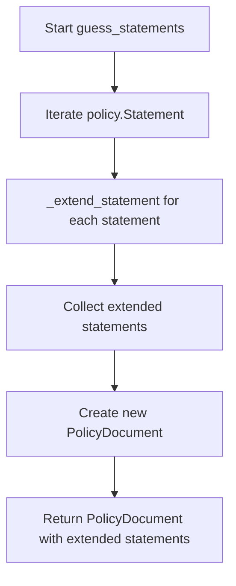

# `guess.py`

## `trailscraper.guess._guess_actions` · *function*

## Summary:
Flattens and filters action permissions based on allowed prefix patterns.

## Description:
Processes a collection of action objects by applying prefix-based filtering to each action. This utility function extracts matching action permissions from input actions according to specified allowed prefixes and returns a flattened list of results.

The function iterates through each action in the input collection, calls the `matching_actions` method on each action with the provided `allowed_prefixes`, and flattens all results into a single list. This is typically used in policy analysis workflows to narrow down action sets based on permitted prefixes.

## Args:
    actions (iterable): Collection of objects that support a `matching_actions` method. Each object in this collection is expected to have a method that accepts `allowed_prefixes` as a parameter.
    allowed_prefixes (iterable): Collection of string prefixes used to filter action permissions. Objects returned by `matching_actions` will match these prefixes.

## Returns:
    list: Flattened list containing results from calling `matching_actions` on each action. The exact type of items in the returned list depends on what `matching_actions` returns for each action.

## Raises:
    AttributeError: If any item in `actions` does not have a `matching_actions` method.
    TypeError: If `allowed_prefixes` is not iterable or if `matching_actions` expects a specific type that is not provided.

## Constraints:
    Preconditions:
        - `actions` must be iterable with objects implementing `matching_actions` method
        - `allowed_prefixes` must be iterable (typically list or set of strings)
    Postconditions:
        - Returned list contains flattened results from all `matching_actions` calls
        - Empty input collections result in empty output list

## Side Effects:
    None

## Control Flow:
```mermaid
flowchart TD
    A[Start _guess_actions] --> B{actions empty?}
    B -- Yes --> C[Return empty list]
    B -- No --> D[Iterate actions]
    D --> E[Call action.matching_actions(allowed_prefixes)]
    E --> F[Flatten results]
    F --> G[Return flattened list]
```

## Examples:
```python
# Basic usage with action objects that support matching_actions
actions = [action1, action2, action3]
prefixes = ["ec2:", "s3:"]
result = _guess_actions(actions, prefixes)
# Returns flattened list of actions matching the prefixes

# Empty input handling
empty_result = _guess_actions([], ["ec2:"])
# Returns empty list
```

## `trailscraper.guess._extend_statement` · *function*

## Summary:
Extends an IAM policy statement with additional actions based on allowed prefixes, potentially creating a second statement with wildcard resource access.

## Description:
Processes an IAM policy statement to determine if additional actions can be inferred from the allowed prefixes. When extended actions are found, returns both the original statement and a new statement with those extended actions and wildcard resource access. When no extensions are found, returns only the original statement.

This function is used in policy analysis workflows to expand partial action permissions into more complete representations while maintaining the original statement's integrity.

## Args:
    statement (Statement): The IAM policy statement to extend, containing Action (list of action objects), Effect (string), and Resource (list) components
    allowed_prefixes (iterable): Collection of string prefixes used to filter and extend action permissions, typically a list or set of strings

## Returns:
    list[Statement]: Either a list containing just the original statement, or a list containing the original statement plus a new statement with extended actions and wildcard resource access

## Raises:
    None explicitly raised by this function

## Constraints:
    Preconditions:
        - statement must be a valid Statement object with Action, Effect, and Resource attributes
        - allowed_prefixes must be iterable (typically list or set of strings)
        - statement.Action must contain objects that support a matching_actions method
    Postconditions:
        - Returns a list of Statement objects (minimum 1, maximum 2 elements)
        - If returning 2 statements, the second statement will have the same Effect as the first but with extended actions and wildcard resource

## Side Effects:
    None

## Control Flow:
```mermaid
flowchart TD
    A[Start _extend_statement] --> B{extended_actions found?}
    B -- Yes --> C[Create extended statement]
    C --> D[Return [original, extended]]
    B -- No --> E[Return [original]]
```

## Examples:
```python
# Basic usage with extended actions
statement = Statement(Action=[action1], Effect="Allow", Resource=["arn:aws:s3:::bucket/*"])
allowed_prefixes = ["s3:"]
result = _extend_statement(statement, allowed_prefixes)
# Returns [original_statement, extended_statement_with_wildcard_resource]

# Usage with no extended actions
statement = Statement(Action=[action1], Effect="Allow", Resource=["arn:aws:s3:::bucket/*"])
allowed_prefixes = ["ec2:"]
result = _extend_statement(statement, allowed_prefixes)
# Returns [original_statement] (no extension made)
```

## `trailscraper.guess.guess_statements` · *function*

## Summary:
Processes an IAM policy document by extending each statement with additional actions based on allowed prefixes, returning a new policy document with the extended statements.

## Description:
Transforms an IAM policy document by applying statement extension logic to each statement within the policy. For each statement in the input policy, the function determines if additional actions can be inferred from the allowed prefixes and creates extended versions of statements when applicable. This allows for more comprehensive policy analysis by expanding partial action permissions into complete representations.

The function leverages the `_extend_statement` helper function to process individual statements and maintains the original policy version while replacing the statements with their extended versions.

## Args:
    policy (PolicyDocument): The input IAM policy document containing a Version and Statement components
    allowed_prefixes (iterable): Collection of string prefixes used to filter and extend action permissions, typically a list or set of strings

## Returns:
    PolicyDocument: A new policy document with the same version as the input but with extended statements. The returned document contains either the original statements or extended statements with additional actions and wildcard resource access.

## Raises:
    None explicitly raised by this function

## Constraints:
    Preconditions:
        - policy must be a valid PolicyDocument object with a Version and Statement attribute
        - policy.Statement must be iterable (typically list or tuple of Statement objects)
        - allowed_prefixes must be iterable (typically list or set of strings)
        - Each statement in policy.Statement must be compatible with the _extend_statement function
    Postconditions:
        - Returns a new PolicyDocument instance with identical Version to input
        - The Statement field contains extended statements processed through _extend_statement
        - The number of statements in the result may be equal to or greater than the input due to statement expansion

## Side Effects:
    None

## Control Flow:


## Examples:
```python
# Basic usage with policy containing statements
from trailscraper.iam import PolicyDocument, Statement

# Create a policy with a statement
statement = Statement(
    Effect="Allow",
    Action=["s3:GetObject"],
    Resource=["arn:aws:s3:::example-bucket/*"]
)
policy = PolicyDocument(Statement=statement, Version="2012-10-17")

# Apply statement extensions
allowed_prefixes = ["s3:"]
extended_policy = guess_statements(policy, allowed_prefixes)

# The result will contain extended statements based on allowed prefixes
```

