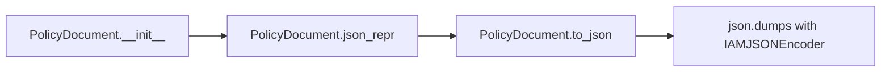
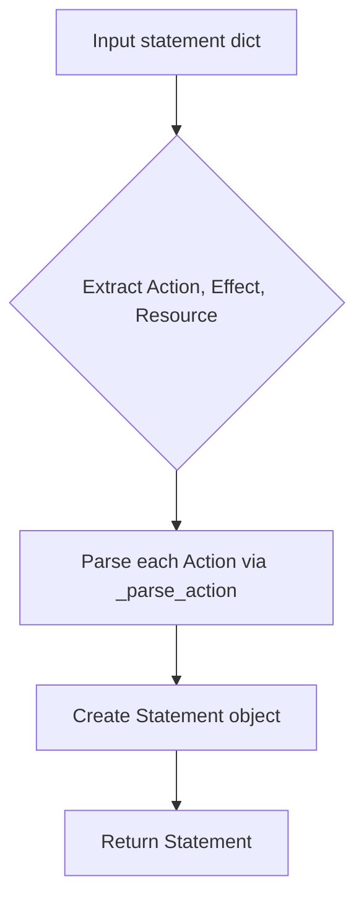

# `iam.py`

## `trailscraper.iam.BaseElement` · *class*

## Summary:
BaseElement is an abstract base class that provides standardized equality, hashing, and representation behaviors for IAM-related elements, requiring subclasses to implement JSON serialization.

## Description:
BaseElement serves as a foundation for IAM (Identity and Access Management) elements in the trailscraper system. It defines a contract that ensures all IAM elements can be compared for equality, hashed consistently, and represented as JSON. The class is designed to be subclassed, with subclasses required to implement the `json_repr()` method that provides the actual JSON serialization logic.

This abstraction enables consistent handling of IAM elements throughout the system while allowing specific implementations to define their unique JSON representations. Known usage patterns include creating specialized IAM element classes that inherit from BaseElement and implement the required `json_repr()` method.

## State:
- `json_repr()`: Abstract method that must be implemented by subclasses to return a JSON-serializable representation of the element
- The class maintains no instance state beyond what is defined by subclasses
- All comparison, hashing, and representation behaviors are derived from the JSON representation returned by `json_repr()`

## Lifecycle:
- Creation: Instances are created through subclass constructors; BaseElement itself cannot be instantiated due to the abstract `json_repr()` method
- Usage: Typically used in collections where equality comparison, hashing, and JSON serialization are needed
- Destruction: No special cleanup required; standard Python garbage collection applies

## Method Map:
```mermaid
graph TD
    A[BaseElement] --> B[json_repr()]
    A --> C[__eq__]
    A --> D[__hash__]
    A --> E[__repr__]
    B -->|Must implement| F[Subclass]
    C -->|Uses json_repr| F
    D -->|Uses json_repr| F
    E -->|Uses json_repr| F
```

## Raises:
- `NotImplementedError`: Raised by `json_repr()` method when called directly on BaseElement instances (cannot be instantiated)
- `TypeError`: May be raised during equality comparisons when comparing with incompatible types

## Example:
```python
# Typical usage pattern
class User(BaseElement):
    def __init__(self, user_id, name):
        self.user_id = user_id
        self.name = name
    
    def json_repr(self):
        return {
            "type": "user",
            "id": self.user_id,
            "name": self.name
        }

# Create instances
user1 = User("123", "Alice")
user2 = User("123", "Alice")
user3 = User("456", "Bob")

# Equality comparison
assert user1 == user2  # True - same JSON representation
assert user1 != user3  # True - different JSON representation

# Hashing
user_set = {user1, user2, user3}  # Works correctly with hash-based collections

# Representation
print(repr(user1))  # Shows JSON representation
```

### `trailscraper.iam.BaseElement.json_repr` · *method*

## Summary:
Returns a representation of the IAM element that uniquely identifies it for comparison and serialization purposes.

## Description:
This abstract method defines the interface for creating a standardized representation of IAM elements. It serves as the foundation for equality comparison (__eq__), hashing (__hash__), and string representation (__repr__) operations. All subclasses of BaseElement must implement this method to provide their specific identity representation.

The return value should be a JSON-serializable structure that uniquely identifies the element's logical identity. Different subclasses may return different types of representations (e.g., strings for simple elements like Actions, dictionaries for complex elements).

## Args:
    None

## Returns:
    The return type varies by subclass implementation. Examples include:
    - String representation (e.g., "prefix:action" for Action elements)
    - Dictionary representation for complex IAM elements
    - Other JSON-serializable structures that uniquely identify the element

## Raises:
    NotImplementedError: Raised by the base implementation to enforce that subclasses must provide their own implementation.

## State Changes:
    Attributes READ: None
    Attributes WRITTEN: None

## Constraints:
    Preconditions: This method should only be called on properly initialized instances of subclasses of BaseElement.
    Postconditions: The return value must be consistent with the element's logical identity and JSON-serializable.

## Side Effects:
    None

### `trailscraper.iam.BaseElement.__eq__` · *method*

## Summary:
Compares two BaseElement instances for equality based on their JSON representations.

## Description:
This method implements the equality operator (`==`) for BaseElement objects. It first verifies that the compared object is of the same class type, then compares their JSON representations to determine equality. This approach ensures consistent comparison based on the object's serialized form rather than object identity.

## Args:
    other (BaseElement): Another BaseElement instance to compare against

## Returns:
    bool: True if both objects are of the same class and have identical JSON representations, False otherwise

## Raises:
    None explicitly raised

## State Changes:
    Attributes READ: 
    - self.__class__ (used for type checking)
    - self.json_repr() (returns the JSON representation for comparison)

## Constraints:
    Preconditions:
    - The other object must be an instance of BaseElement or its subclass
    - Both objects must have a working json_repr() method implementation
    
    Postconditions:
    - Returns boolean value indicating equality status
    - Does not modify either object's state

## Side Effects:
    None

### `trailscraper.iam.BaseElement.__ne__` · *method*

## Summary:
Implements the "not equal" comparison operator for BaseElement instances by negating the result of equality comparison.

## Description:
This method defines the behavior of the `!=` operator for BaseElement objects. It delegates to the `__eq__` method and returns the logical negation of its result. This follows Python's standard convention for implementing comparison operators where `a != b` is equivalent to `not (a == b)`.

## Args:
    other (BaseElement): Another BaseElement instance or subclass instance to compare against

## Returns:
    bool: True if the objects are not equal according to the equality definition, False if they are equal

## Raises:
    None explicitly raised

## State Changes:
    Attributes READ: 
    - self (used to call __eq__ method)
    - other (passed to __eq__ method for comparison)

## Constraints:
    Preconditions:
    - The other object must be comparable with this object (typically another BaseElement instance)
    - The `__eq__` method must be properly implemented for correct behavior
    
    Postconditions:
    - Returns boolean value indicating inequality status
    - Does not modify either object's state

## Side Effects:
    None

### `trailscraper.iam.BaseElement.__hash__` · *method*

## Summary:
Computes and returns a hash value based on the JSON representation of the IAM element.

## Description:
This method implements Python's magic `__hash__` protocol to make instances of `BaseElement` and its subclasses hashable. It computes the hash by calling `json_repr()` on the instance and applying Python's built-in `hash()` function to the result. This ensures that two equivalent IAM elements will have the same hash value, enabling their use in hash-based collections like sets and dictionaries.

The method is part of the equality and hashing contract defined by `BaseElement`, which also includes `__eq__` and `__ne__` methods. When two elements are equal according to `__eq__`, they must have identical hash values.

## Args:
    None

## Returns:
    int: An integer hash value computed from the JSON representation of the element.

## Raises:
    TypeError: If `json_repr()` returns an unhashable type (though this would indicate a bug in subclasses).

## State Changes:
    Attributes READ: self (through the `json_repr()` method call)
    Attributes WRITTEN: None

## Constraints:
    Preconditions: The instance must have a valid `json_repr()` implementation in its subclass that returns a hashable type.
    Postconditions: The returned hash value will be consistent for equivalent instances throughout the program's execution.

## Side Effects:
    None

### `trailscraper.iam.BaseElement.__repr__` · *method*

## Summary:
Returns the string representation of the IAM element by delegating to its JSON representation method.

## Description:
This special method (dunder method) is automatically invoked by Python's repr() function and returns a string representation of the IAM element. It delegates to the object's json_repr() method and converts the result to a string. This provides a consistent representation for all IAM elements that inherit from BaseElement.

## Args:
    None

## Returns:
    str: A string representation of the IAM element, derived from its json_repr() method.

## Raises:
    NotImplementedError: If called on a BaseElement instance (abstract base class) without a concrete implementation.
    TypeError: If json_repr() returns a non-string value that cannot be converted to string.

## State Changes:
    Attributes READ: None (relies on json_repr() method which may read instance attributes)
    Attributes WRITTEN: None

## Constraints:
    Preconditions: The object must have a valid json_repr() implementation in its concrete subclass.
    Postconditions: The returned string will be the result of str(json_repr()).

## Side Effects:
    None

## `trailscraper.iam.Action` · *class*

## Summary:
Represents an AWS IAM action with a service prefix and action name, providing utilities for action normalization and finding equivalent actions with different prefixes.

## Description:
The Action class encapsulates an AWS IAM action in the format "prefix:action" and provides functionality to normalize actions by removing common prefixes and plural forms. It's designed to help identify equivalent IAM actions that may be expressed with different naming conventions (e.g., "ListInstances" vs "DescribeInstances").

This class is particularly useful in IAM policy analysis where actions might be expressed in various forms but refer to the same underlying operation. The class inherits from BaseElement, which provides standardized equality, hashing, and representation behaviors based on the JSON representation.

The class depends on a global constant `BASE_ACTION_PREFIXES` which contains common IAM action prefixes (such as "List", "Get", "Describe") used in the `_base_action()` method to strip these prefixes from action names.

## State:
- `action` (str): The IAM action name (e.g., "RunInstances", "ListObjects")
- `prefix` (str): The AWS service prefix (e.g., "ec2", "s3", "lambda")
- Both attributes are required during initialization and form the complete IAM action identifier

## Lifecycle:
- Creation: Instantiate with `Action(prefix, action)` where prefix is the AWS service prefix and action is the action name
- Usage: Typically used in collections where equality comparison and JSON serialization are needed; methods like `matching_actions()` are used to find equivalent actions
- Destruction: Standard Python garbage collection applies

## Method Map:
```mermaid
graph TD
    A[Action] --> B[json_repr()]
    A --> C[_base_action()]
    A --> D[matching_actions()]
    C -->|Strips prefixes and plural| E[_base_action helper]
    D -->|Calls known_iam_actions| F[known_iam_actions]
    D -->|Filters matches| G[Filtering logic]
```

## Raises:
- `AttributeError`: May be raised if `BASE_ACTION_PREFIXES` is not defined in the module scope (this is a dependency that must be satisfied)
- `TypeError`: May occur during equality comparisons if comparing with incompatible types (inherited from BaseElement)

## Example:
```python
# Create an action
action = Action("ec2", "DescribeInstances")

# Get JSON representation
json_repr = action.json_repr()  # Returns "ec2:DescribeInstances"

# Find matching actions with different prefixes
matches = action.matching_actions(["List", "Get"])  # Finds equivalent actions with List/Get prefixes

# Actions are comparable based on their JSON representation
other_action = Action("ec2", "ListInstances")
assert action != other_action  # Different actions
```

### `trailscraper.iam.Action.json_repr` · *method*

## Summary:
Returns a colon-separated string representation of the IAM action combining prefix and action components.

## Description:
This method provides a standardized string representation of an IAM action by joining the action's prefix and action components with a colon separator. It's used to create a unique identifier for IAM actions that can be easily serialized and deserialized.

## Args:
    None

## Returns:
    str: A colon-separated string in the format "prefix:action" representing the IAM action.

## Raises:
    None

## State Changes:
    Attributes READ: self.prefix, self.action
    Attributes WRITTEN: None

## Constraints:
    Preconditions: The Action instance must have both self.prefix and self.action attributes initialized.
    Postconditions: The returned string will always be in the format "prefix:action" where prefix and action are the respective attribute values.

## Side Effects:
    None

### `trailscraper.iam.Action._base_action` · *method*

## Summary:
Returns the base action name by removing prefixes and trailing plural 's' characters from the action string.

## Description:
This method processes the action string stored in `self.action` to extract the core action name by stripping away common prefixes and handling plural forms. It's designed to normalize action names for comparison and matching purposes in IAM policy evaluation.

The method first removes any prefixes defined in `BASE_ACTION_PREFIXES` using regular expressions, then removes any trailing 's' character to handle plural forms. This normalization allows for consistent comparison of similar actions regardless of their prefixed or plural variations.

Known callers:
- `matching_actions`: Called within the `matching_actions` method to generate potential action matches for policy validation
- This method is part of the IAM action processing pipeline where normalized action names are needed for comparison

This logic is separated into its own method to avoid code duplication and provide a clean abstraction for action name normalization.

## Args:
    None

## Returns:
    str: The normalized base action name with prefixes removed and trailing 's' stripped

## Raises:
    None explicitly raised

## State Changes:
    Attributes READ: self.action
    Attributes WRITTEN: None

## Constraints:
    Preconditions: 
    - `self.action` must be a string
    - `BASE_ACTION_PREFIXES` must be defined in the module scope and contain valid regex patterns
    
    Postconditions:
    - Returns a string with prefixes removed
    - Returns a string with trailing 's' removed (if present)
    - The returned string represents the core action name

## Side Effects:
    None

### `trailscraper.iam.Action.matching_actions` · *method*

## Summary
Generates and filters potential IAM action matches based on allowed prefixes, returning only those that exist in the known IAM permissions catalog.

## Description
This method creates potential IAM action combinations by prefixing the base action with various prefixes and then filters these candidates against the known IAM actions for the same service prefix. It's designed to find alternative representations of the same IAM action that might be valid but aren't identical to the current action instance.

The method constructs two sets of potential matches for each allowed prefix:
1. Actions with the base action name (singular form) 
2. Actions with the base action name plus "s" (plural form)

It then filters these candidates against the known IAM actions for the current action's prefix, ensuring only valid actions are returned while excluding the current action instance itself.

This method is particularly useful for identifying equivalent IAM actions that differ only in their prefix formatting (like singular vs plural forms) or different prefix variations that represent the same underlying permission.

## Args
    allowed_prefixes (list[str], optional): A list of string prefixes to test against the base action. If None or empty, defaults to BASE_ACTION_PREFIXES constant. Typically contains AWS action prefixes such as "iam:", "ec2:", "s3:", etc.

## Returns
    list[Action]: A list of Action instances that represent valid IAM actions matching the current action's prefix, excluding the current action itself. Each returned action is confirmed to exist in the known IAM permissions catalog for the same prefix.

## Raises
    None explicitly raised by this method, though underlying operations may raise exceptions from:
    - String manipulation operations (re.sub)
    - File I/O operations in known_iam_actions function
    - List comprehension operations

## State Changes
    Attributes READ: 
    - self.prefix: Used to determine the service prefix for filtering known actions
    - self._base_action(): Called to extract the base action name without prefixes
    
    Attributes WRITTEN: None

## Constraints
    Precondition: 
    - The current Action instance must have valid prefix and action attributes
    - If allowed_prefixes is provided, it should be a list of strings
    - BASE_ACTION_PREFIXES constant must be defined in the module scope and contain valid prefix strings
    - The _base_action() method should successfully extract a base action name
    
    Postcondition: 
    - Returns only Action instances that exist in known_iam_actions(self.prefix)
    - Excludes the current action instance from results (self != potential_match)
    - All returned actions share the same prefix as the current action
    - Returned actions are valid IAM actions for the service prefix

## Side Effects
    - Calls known_iam_actions(self.prefix) which performs file I/O operations
    - May trigger file reading from 'known-iam-actions.txt'
    - Depends on global BASE_ACTION_PREFIXES constant availability
    - Uses regular expression operations via re.sub

## `trailscraper.iam.Statement` · *class*

## Summary:
Represents an AWS IAM policy statement with action, effect, and resource components, enabling policy merging and comparison operations.

## Description:
The Statement class encapsulates a single AWS IAM policy statement, containing the action permissions, effect (Allow/Deny), and resource constraints. It serves as a fundamental building block for IAM policy manipulation and analysis within the trailscraper system. This class is designed to work with other Statement instances to merge compatible policies and provides standardized comparison operations for sorting and deduplication.

The class inherits from BaseElement, which provides consistent equality, hashing, and representation behaviors based on the JSON representation. Statement instances are typically created by policy parsing components and manipulated through merge operations to consolidate similar permissions.

## State:
- `Action` (list): Collection of Action objects representing the permissions granted or denied
- `Effect` (str): Policy effect, either "Allow" or "Deny"
- `Resource` (list): Collection of resource identifiers that the policy applies to

All attributes are required during initialization and must be compatible with the operations performed by the class methods.

## Lifecycle:
- Creation: Instantiate with `Statement(Action, Effect, Resource)` where Action and Resource are collections and Effect is a string
- Usage: Typically used in policy consolidation workflows where statements with identical effects are merged using the `merge()` method
- Destruction: Standard Python garbage collection applies; no special cleanup required

## Method Map:
```mermaid
graph TD
    A[Statement] --> B[json_repr()]
    A --> C[merge(other)]
    A --> D[__lt__(other)]
    A --> E[__action_list_strings()]
    C -->|Validates Effect match| F[ValueError]
    C -->|Combines Action and Resource| G[New Statement]
    D -->|Compares Effect| H[Effect ordering]
    D -->|Compares Actions| I[Action string representation]
    D -->|Compares Resources| J[Resource string representation]
```

## Raises:
- `ValueError`: Raised by `merge()` method when attempting to combine statements with different Effect values
- `TypeError`: May be raised during equality comparisons if comparing with incompatible types (inherited from BaseElement)

## Example:
```python
# Create two statements with same effect
action1 = Action("ec2", "DescribeInstances")
action2 = Action("ec2", "RunInstances")
resource1 = "arn:aws:ec2:us-east-1:123456789012:instance/*"
resource2 = "arn:aws:ec2:us-east-1:123456789012:volume/*"

stmt1 = Statement([action1], "Allow", [resource1])
stmt2 = Statement([action2], "Allow", [resource2])

# Merge compatible statements
merged = stmt1.merge(stmt2)

# Compare statements
assert stmt1 < stmt2  # Based on sorting criteria
```

### `trailscraper.iam.Statement.__init__` · *method*

*No documentation generated.*

### `trailscraper.iam.Statement.json_repr` · *method*

## Summary:
Returns a dictionary representation of the IAM statement's core attributes for JSON serialization.

## Description:
This method provides a standardized dictionary format containing the essential components of an IAM statement: Action, Effect, and Resource. It is primarily used during serialization processes to convert Statement objects into JSON-compatible dictionaries. The method accesses the instance attributes directly and returns them in a consistent format regardless of their specific data types.

## Args:
    None beyond the implicit self parameter

## Returns:
    dict: A dictionary with exactly three keys:
        - 'Action': Value from self.Action attribute
        - 'Effect': Value from self.Effect attribute  
        - 'Resource': Value from self.Resource attribute

## Raises:
    AttributeError: If any of the required attributes (Action, Effect, Resource) are not defined on the instance

## State Changes:
    Attributes READ: self.Action, self.Effect, self.Resource
    Attributes WRITTEN: None

## Constraints:
    Preconditions: The Statement instance must have 'Action', 'Effect', and 'Resource' attributes defined
    Postconditions: The returned dictionary contains exactly three keys with their corresponding attribute values

## Side Effects:
    None

### `trailscraper.iam.Statement.merge` · *method*

## Summary:
Merges two IAM statements with identical effects by combining their actions and resources while eliminating duplicates and maintaining sorted order.

## Description:
Combines two Statement objects that share the same Effect value into a new Statement with merged Action and Resource collections. This method ensures that duplicate actions and resources are removed while preserving the sorted order of both collections. The merge operation is only valid when both statements have identical Effect values, raising a ValueError otherwise.

The method is typically called during policy consolidation or optimization phases where multiple IAM statements need to be aggregated into fewer, more efficient statements. It's commonly used in tools that analyze or optimize AWS IAM policies by merging equivalent statements.

## Args:
    other (Statement): Another Statement instance to merge with this one. Must have the same Effect value as self.

## Returns:
    Statement: A new Statement instance containing the merged actions and resources from both input statements.

## Raises:
    ValueError: When the Effect attribute of self and other statements differ, indicating they cannot be meaningfully merged.

## State Changes:
    Attributes READ: self.Effect, self.Action, self.Resource, other.Effect, other.Action, other.Resource
    Attributes WRITTEN: None

## Constraints:
    Preconditions: 
    - Both self and other must be Statement instances
    - self.Effect must equal other.Effect
    - All Action and Resource objects must have json_repr() methods available
    Postconditions:
    - The returned Statement has the same Effect as both input statements
    - Action list contains unique actions from both statements, sorted by action.json_repr()
    - Resource list contains unique resources from both statements, sorted alphabetically

## Side Effects:
    None

### `trailscraper.iam.Statement.__action_list_strings` · *method*

## Summary:
Creates a dash-separated string representation of all action identifiers in the statement.

## Description:
Generates a compact string representation by joining the JSON representations of all actions in the statement with hyphens. This method is primarily used for sorting and comparison operations within the Statement class, particularly in the `__lt__` method to establish a consistent ordering of statements based on their action sets.

## Args:
    None

## Returns:
    str: A dash-separated string containing all action identifiers from the statement's Action attribute. Returns an empty string if the Action list is empty.

## Raises:
    AttributeError: If any item in self.Action does not have a json_repr() method.

## State Changes:
    Attributes READ: self.Action
    Attributes WRITTEN: None

## Constraints:
    Preconditions: 
    - self.Action must be iterable
    - Each item in self.Action must have a json_repr() method that returns a string
    Postconditions: 
    - The returned string will be a concatenation of action representations separated by hyphens
    - Empty Action lists result in empty string return values

## Side Effects:
    None

### `trailscraper.iam.Statement.__lt__` · *method*

## Summary:
Defines lexicographic ordering for Statement objects based on Effect, Action, and Resource attributes.

## Description:
Implements the less-than comparison operator for Statement objects, providing a consistent ordering mechanism that prioritizes Effect values, followed by Action sets, and finally Resource strings. This method enables sorting and comparison of Statement objects in collections and is used internally by Python's sorting algorithms and set operations.

The comparison follows a hierarchical precedence:
1. Primary sort key: Effect attribute (lexicographically ordered)
2. Secondary sort key: Action attribute (sorted by dash-separated string representation)
3. Tertiary sort key: Resource attribute (lexicographically ordered by joined strings)

This method is automatically invoked during sorting operations, comparisons between Statement objects, and when Statement objects are used in ordered collections such as sorted lists or sets.

## Args:
    other (Statement): Another Statement object to compare against

## Returns:
    bool: True if self is considered "less than" other according to the defined ordering; False otherwise

## Raises:
    TypeError: If other is not a Statement instance (Python's default behavior for incomparable types)

## State Changes:
    Attributes READ: self.Effect, self.Action, self.Resource
    Attributes WRITTEN: None

## Constraints:
    Preconditions:
    - self must be a Statement instance
    - other must be a Statement instance
    - self.Action and other.Action must be iterable and contain objects with json_repr() method
    - self.Resource and other.Resource must be iterable

    Postconditions:
    - Returns a boolean value indicating the relative ordering
    - The comparison is deterministic and transitive
    - The ordering respects the hierarchical priority of Effect > Action > Resource

## Side Effects:
    None

## `trailscraper.iam.PolicyDocument` · *class*

## Summary:
PolicyDocument represents an AWS Identity and Access Management (IAM) policy document with version and statement components.

## Description:
The PolicyDocument class encapsulates the structure of an AWS IAM policy document, providing standardized methods for JSON serialization. It inherits from BaseElement, which provides consistent equality comparison, hashing, and representation behaviors for IAM elements. This class implements the required json_repr() method from BaseElement and is specifically designed for creating and serializing AWS IAM policy documents that follow the standard JSON format with Version and Statement fields.

The class enables consistent handling of IAM policies throughout the trailscraper system while maintaining compatibility with AWS services that require policy definitions in JSON format.

## State:
- Version: str, AWS IAM policy version identifier (default: "2012-10-17")
- Statement: dict or list[dict], AWS IAM policy statement(s) defining permissions

## Lifecycle:
- Creation: Instantiate with a Statement parameter and optional Version parameter
- Usage: Call to_json() method to serialize the policy to JSON string format
- Destruction: Standard Python garbage collection applies

## Method Map:


## Raises:
- None explicitly raised by __init__ method
- json.dumps may raise TypeError if the JSON serialization fails

## Example:
```python
# Create a basic policy document
statement = {
    "Effect": "Allow",
    "Action": "s3:GetObject",
    "Resource": "arn:aws:s3:::example-bucket/*"
}

policy = PolicyDocument(Statement=statement)

# Serialize to JSON
json_string = policy.to_json()
print(json_string)

# Create with custom version
policy_with_version = PolicyDocument(
    Statement=statement, 
    Version="2012-10-17"
)

# Policy documents support equality comparison through BaseElement
policy2 = PolicyDocument(Statement=statement)
assert policy == policy2  # True - same JSON representation
```

### `trailscraper.iam.PolicyDocument.__init__` · *method*

## Summary:
Initializes a PolicyDocument object with a statement and version.

## Description:
This method constructs a PolicyDocument instance by setting the version and statement attributes. It serves as the primary constructor for creating policy document objects with the specified AWS IAM policy version and statement configuration.

## Args:
    Statement: The IAM policy statement to be associated with this policy document.
    Version (str): The AWS IAM policy version. Defaults to "2012-10-17".

## Returns:
    None: This method does not return a value.

## Raises:
    None: This method does not explicitly raise exceptions.

## State Changes:
    Attributes READ: None
    Attributes WRITTEN: 
        - self.Version: Set to the provided Version parameter
        - self.Statement: Set to the provided Statement parameter

## Constraints:
    Preconditions: 
        - The Statement parameter should be a valid IAM policy statement structure
        - The Version parameter should be a valid AWS IAM policy version string
    Postconditions:
        - The instance will have self.Version set to the provided Version value
        - The instance will have self.Statement set to the provided Statement value

## Side Effects:
    None: This method performs no I/O operations or external service calls.

### `trailscraper.iam.PolicyDocument.json_repr` · *method*

## Summary:
Returns a dictionary representation of the policy document's version and statement.

## Description:
Converts the policy document's Version and Statement attributes into a JSON-compatible dictionary format. This method provides a standardized representation that can be used for serialization or further processing.

## Args:
    None

## Returns:
    dict: A dictionary containing:
        - 'Version' (str): The policy version string
        - 'Statement' (any): The policy statement data structure

## Raises:
    None

## State Changes:
    Attributes READ: self.Version, self.Statement
    Attributes WRITTEN: None

## Constraints:
    Preconditions: 
    - self.Version must be a string
    - self.Statement must be a valid data structure for JSON serialization
    
    Postconditions:
    - The returned dictionary contains exactly two keys: 'Version' and 'Statement'
    - The values correspond exactly to the instance's Version and Statement attributes

## Side Effects:
    None

### `trailscraper.iam.PolicyDocument.to_json` · *method*

## Summary:
Converts the policy document to a formatted JSON string representation.

## Description:
Serializes the policy document into a human-readable JSON string using a custom JSON encoder. This method leverages the document's existing `json_repr()` method to obtain the dictionary representation and applies custom formatting with indentation and sorted keys for better readability.

## Args:
    None beyond the implicit self parameter

## Returns:
    str: A formatted JSON string containing the policy document's Version and Statement data, with 4-space indentation and sorted keys for consistent output.

## Raises:
    TypeError: If the policy document's data structure contains non-serializable objects that cannot be handled by the JSON encoder.

## State Changes:
    Attributes READ: self.Version, self.Statement
    Attributes WRITTEN: None

## Constraints:
    Preconditions: 
    - The PolicyDocument instance must have valid data in self.Version and self.Statement attributes
    - Both attributes must be JSON-serializable
    - The IAMJSONEncoder class must be properly defined and accessible
    
    Postconditions:
    - The returned string is a valid JSON representation of the policy document
    - The output is consistently formatted with 4-space indentation and sorted keys

## Side Effects:
    None

## `trailscraper.iam.IAMJSONEncoder` · *class*

## Summary:
Custom JSON encoder that serializes objects with a json_repr() method to their JSON representation.

## Description:
IAMJSONEncoder extends the standard json.JSONEncoder to provide custom serialization behavior for objects that implement a json_repr() method. This allows objects to define their own JSON serialization logic while maintaining compatibility with standard JSON encoding for other types.

This encoder is particularly useful when working with complex domain objects that need special JSON formatting but should still integrate seamlessly with Python's standard JSON serialization mechanisms.

## State:
- Inherits all state from json.JSONEncoder base class
- No additional instance attributes beyond those inherited
- The encoder maintains no internal state beyond what's required for JSON serialization

## Lifecycle:
- Creation: Instantiated automatically by the json module when used with json.dumps() or json.dump()
- Usage: Called internally by the JSON serialization process when encountering objects that aren't natively serializable
- Destruction: Managed automatically by Python's garbage collector

## Method Map:
```mermaid
graph TD
    A[json.dumps()] --> B[IAMJSONEncoder.default()]
    B --> C{hasattr(o, 'json_repr')?}
    C -->|Yes| D[o.json_repr()]
    C -->|No| E[json.JSONEncoder.default()]
```

## Raises:
- No explicit exceptions raised by the constructor
- Exceptions may be raised by underlying json.JSONEncoder methods during serialization

## Example:
```python
import json
from trailscraper.iam import IAMJSONEncoder

class User:
    def __init__(self, name, email):
        self.name = name
        self.email = email
    
    def json_repr(self):
        return {'name': self.name, 'email': self.email}

user = User("John Doe", "john@example.com")
json_string = json.dumps(user, cls=IAMJSONEncoder)
# Result: '{"name": "John Doe", "email": "john@example.com"}'
```

### `trailscraper.iam.IAMJSONEncoder.default` · *method*

## Summary:
Handles custom JSON serialization for objects with a json_repr() method by delegating to that method when available.

## Description:
This method overrides the default JSON encoding behavior to provide special handling for objects that implement a `json_repr()` method. When serializing JSON data, if an object has this method, it will be called to obtain the appropriate JSON representation instead of using the default serialization approach. This allows objects to define their own JSON serialization logic while maintaining compatibility with standard JSON encoding processes.

## Args:
    o (Any): The object to serialize to JSON format

## Returns:
    Any: The JSON-serializable representation of the object, either from the object's json_repr() method or the parent class's default handling

## Raises:
    TypeError: When the object doesn't have a json_repr() method and the parent class cannot serialize it

## State Changes:
    Attributes READ: None
    Attributes WRITTEN: None

## Constraints:
    Preconditions: The object being serialized must either have a json_repr() method or be serializable by the parent JSONEncoder class
    Postconditions: The returned value is a JSON-serializable object that can be encoded by the JSON encoder

## Side Effects:
    None

## `trailscraper.iam._parse_action` · *function*

## Summary
Parses an IAM action string into its prefix and action components, creating an Action object.

## Description
This function takes a colon-separated string representing an IAM action and splits it into a prefix and action portion to construct an Action object. The function is designed to handle IAM action formatting where actions follow the pattern "prefix:action".

The parsing logic is extracted into its own function to separate the string parsing concern from the Action object construction, making the code more modular and testable. This allows the Action class to focus on its core responsibilities while providing a clean interface for creating Action objects from string representations.

## Args
    action (str): A colon-separated string in the format "prefix:action" representing an IAM action. If multiple colons are present, only the first colon is used for splitting.

## Returns
    Action: An Action object with the prefix and action components parsed from the input string. The prefix is the part before the first colon, and the action is the part after the first colon.

## Raises
    IndexError: If the input string does not contain at least one colon character, causing index access to fail when trying to access parts[1].

## Constraints
    Precondition: The input action parameter must be a string containing at least one colon character
    Postcondition: Returns an Action object with properly assigned prefix and action attributes

## Side Effects
    None

## Control Flow
```mermaid
flowchart TD
    A[Input action string] --> B{Split by ":"}
    B --> C[parts[0] = prefix]
    B --> D[parts[1] = action]
    C --> E[Create Action(prefix, action)]
    D --> E
    E --> F[Return Action object]
```

## Examples
```python
# Basic usage
action_obj = _parse_action("ec2:RunInstances")
# Returns Action object with prefix="ec2" and action="RunInstances"

# Multiple colons - only first colon is used for splitting
action_obj = _parse_action("s3:GetObject:version")
# Returns Action object with prefix="s3" and action="GetObject:version"
```

## `trailscraper.iam._parse_statement` · *function*

## Summary:
Parses an IAM policy statement dictionary into a structured Statement object with normalized action components.

## Description:
Converts a raw IAM policy statement dictionary into a Statement object by processing each action through the _parse_action helper function. This function serves as a bridge between raw policy data structures and the structured Statement objects used throughout the trailscraper IAM processing pipeline.

The function extracts the Action, Effect, and Resource fields from the input statement dictionary and creates a Statement instance with properly parsed action components. This extraction and transformation logic is separated into its own function to maintain clean responsibility boundaries and enable easier testing of the parsing process.

## Args:
    statement (dict): A dictionary representing an IAM policy statement containing 'Action', 'Effect', and 'Resource' keys. The 'Action' key should map to a list of action strings, 'Effect' should map to a string ("Allow" or "Deny"), and 'Resource' should map to a list of resource ARNs.

## Returns:
    Statement: A Statement object with normalized action components, containing Action (list of Action objects), Effect (string), and Resource (list of strings) attributes.

## Raises:
    KeyError: If the input statement dictionary is missing any of the required keys ('Action', 'Effect', or 'Resource').
    IndexError: If any action string in the Action list does not contain at least one colon character, causing _parse_action to raise an IndexError.

## Constraints:
    Precondition: The statement parameter must be a dictionary containing 'Action', 'Effect', and 'Resource' keys with appropriate values
    Postcondition: Returns a Statement object with properly initialized attributes

## Side Effects:
    None

## Control Flow:


## Examples:
```python
# Basic usage
statement_dict = {
    'Action': ['ec2:DescribeInstances', 'ec2:RunInstances'],
    'Effect': 'Allow',
    'Resource': ['arn:aws:ec2:us-east-1:123456789012:instance/*']
}
parsed_statement = _parse_statement(statement_dict)
# Returns Statement object with normalized actions

# Error case - missing key
try:
    bad_statement = {'Action': [], 'Effect': 'Allow'}
    _parse_statement(bad_statement)
except KeyError as e:
    print(f"Missing key: {e}")
```

## `trailscraper.iam._parse_statements` · *function*

## Summary:
Transforms a list of IAM policy statement dictionaries into a list of structured Statement objects.

## Description:
Processes a list of raw IAM policy statement dictionaries by applying the _parse_statement function to each individual statement. This function serves as the main entry point for converting raw IAM policy data into structured Statement objects that can be used for policy analysis and manipulation.

The function iterates through each statement in the input list and delegates the parsing of individual statements to the _parse_statement helper function. This design promotes code reuse and separation of concerns, keeping the parsing logic for individual statements isolated in its own function.

## Args:
    json_data (list): A list of dictionaries representing IAM policy statements. Each dictionary should contain 'Action', 'Effect', and 'Resource' keys with appropriate values.

## Returns:
    list: A list of Statement objects created by parsing each input statement dictionary.

## Raises:
    KeyError: If any statement dictionary in the input list is missing required keys ('Action', 'Effect', or 'Resource') when passed to _parse_statement.
    IndexError: If any action string in any statement's Action list does not contain at least one colon character, causing _parse_action to raise an IndexError.

## Constraints:
    Precondition: The json_data parameter must be a list where each element is a dictionary containing the required keys ('Action', 'Effect', and 'Resource')
    Postcondition: Returns a list of Statement objects with properly initialized attributes

## Side Effects:
    None

## Control Flow:
```mermaid
flowchart TD
    A[Input json_data list] --> B{Iterate through statements}
    B --> C[Call _parse_statement(statement)]
    C --> D{Parse individual statement}
    D --> E[Return Statement object]
    E --> F[Collect all Statement objects]
    F --> G[Return list of Statement objects]
```

## Examples:
```python
# Basic usage
raw_statements = [
    {
        'Action': ['ec2:DescribeInstances', 'ec2:RunInstances'],
        'Effect': 'Allow',
        'Resource': ['arn:aws:ec2:us-east-1:123456789012:instance/*']
    },
    {
        'Action': ['s3:GetObject'],
        'Effect': 'Deny',
        'Resource': ['arn:aws:s3:::example-bucket/*']
    }
]

parsed_statements = _parse_statements(raw_statements)
# Returns list of Statement objects

# Error case - malformed statement
try:
    bad_statements = [
        {'Action': [], 'Effect': 'Allow'},
        {'Action': ['ec2:DescribeInstances'], 'Effect': 'Deny', 'Resource': ['*']}
    ]
    _parse_statements(bad_statements)
except KeyError as e:
    print(f"Missing key in statement: {e}")
```

## `trailscraper.iam.parse_policy_document` · *function*

## Summary:
Parses an AWS IAM policy document from a JSON string or stream into a structured PolicyDocument object.

## Description:
Converts raw JSON-formatted IAM policy data into a structured PolicyDocument object that can be used for policy analysis and manipulation. This function handles both string inputs (using json.loads) and file-like stream inputs (using json.load), making it flexible for different input sources.

The function extracts the 'Statement' and 'Version' fields from the JSON data and processes the statements through the _parse_statements helper function before constructing the final PolicyDocument object.

This logic is extracted into its own function rather than being inlined because it encapsulates the complete parsing workflow for IAM policy documents, separating the concerns of input handling, data extraction, and object construction. This makes the parsing logic reusable and testable independently.

## Args:
    stream (str or file-like object): Either a JSON string containing the policy document or a file-like object with readable JSON content.

## Returns:
    PolicyDocument: A structured PolicyDocument object containing the parsed statements and version information.

## Raises:
    KeyError: When the parsed JSON is missing required keys ('Statement' or 'Version').

## Constraints:
    Precondition: The input stream must contain valid JSON with 'Statement' and 'Version' keys
    Postcondition: Returns a properly constructed PolicyDocument object with validated statement data

## Side Effects:
    None

## Control Flow:
```mermaid
flowchart TD
    A[Input stream] --> B{Is string?}
    B -->|Yes| C[json.loads(stream)]
    B -->|No| D[json.load(stream)]
    C --> E[Extract Statement, Version]
    D --> E
    E --> F[_parse_statements(Statement)]
    F --> G[Create PolicyDocument]
    G --> H[Return PolicyDocument]
```

## Examples:
```python
# Parse from JSON string
policy_json = '''
{
    "Version": "2012-10-17",
    "Statement": [
        {
            "Effect": "Allow",
            "Action": "s3:GetObject",
            "Resource": "arn:aws:s3:::example-bucket/*"
        }
    ]
}
'''

policy_doc = parse_policy_document(policy_json)

# Parse from file-like object
import io
json_stream = io.StringIO(policy_json)
policy_doc = parse_policy_document(json_stream)
```

## `trailscraper.iam.all_known_iam_permissions` · *function*

## Summary:
Returns a set of all known AWS IAM permissions by reading from a predefined file.

## Description:
This function provides access to a curated list of AWS Identity and Access Management (IAM) permissions stored in a text file. The function reads the file containing one IAM permission per line and returns them as a set for efficient lookup and deduplication.

The function is extracted into its own component to centralize the loading and management of known IAM permissions, providing a clean interface for other modules that need to validate or work with IAM permissions without duplicating file I/O logic.

## Returns:
    set[str]: A set containing all known IAM permissions, with each permission represented as a string. Each permission is read from the 'known-iam-actions.txt' file, with trailing newlines stripped.

## Constraints:
    Preconditions:
        - The file 'known-iam-actions.txt' must exist in the same directory as this module
        - The file must be readable and properly formatted with one IAM permission per line
    Postconditions:
        - Returns an immutable set of strings representing IAM permissions
        - All returned strings have trailing newlines removed

## Side Effects:
    - Reads from the filesystem: opens and reads from 'known-iam-actions.txt'
    - May raise IOError if the file cannot be opened or read

## Control Flow:
```mermaid
flowchart TD
    A[Start all_known_iam_permissions()] --> B{File exists and readable?}
    B -- Yes --> C[Open known-iam-actions.txt]
    C --> D[Read all lines]
    D --> E[Strip newlines from each line]
    E --> F[Create set from lines]
    F --> G[Return set of permissions]
    B -- No --> H[Raise IOError]
```

## `trailscraper.iam.known_iam_actions` · *function*

## Summary
Returns a list of IAM actions that belong to a specified service prefix from the known IAM permissions catalog.

## Description
This function retrieves all known AWS IAM permissions and organizes them by their service prefix, then returns all actions associated with the specified prefix. It serves as a lookup mechanism to find all IAM actions for a particular AWS service.

The function is extracted into its own component to provide a clean interface for accessing IAM action data organized by service prefixes, separating the data processing logic from the business logic that consumes this data. This enables efficient querying of IAM permissions by service without having to process the entire dataset repeatedly.

## Args
    prefix (str): The AWS service prefix (e.g., "ec2", "s3", "lambda") to filter IAM actions by. This corresponds to the first part of IAM action strings like "ec2:RunInstances".

## Returns
    list: A list of objects representing all IAM actions that belong to the specified prefix. Each object has a `prefix` attribute and an `action` attribute. Returns an empty list if the prefix is not found in the known IAM permissions.

## Raises
    None explicitly raised by this function, though underlying operations may raise exceptions from file I/O or parsing operations.

## Constraints
    Precondition: The function assumes that `all_known_iam_permissions()` returns a set of valid IAM action strings in the format "prefix:action"
    Postcondition: Returns a list of objects where all objects have the same prefix attribute as the input parameter

## Side Effects
    - Reads from the filesystem: accesses 'known-iam-actions.txt' file to load all known IAM permissions
    - May raise IOError if the file cannot be opened or read

## Control Flow
```mermaid
flowchart TD
    A[known_iam_actions(prefix)] --> B[Call all_known_iam_permissions()]
    B --> C[Pipe result through toolz.curried.map(_parse_action)]
    C --> D[Group results by prefix using toolz.curried.groupby]
    D --> E{Lookup prefix in grouped results?}
    E -- Yes --> F[Return matching actions list]
    E -- No --> G[Return empty list]
```

## Examples
```python
# Get all EC2 actions
ec2_actions = known_iam_actions("ec2")
# Returns list of objects like [object_with_prefix_and_action, object_with_prefix_and_action, ...]

# Get actions for a non-existent prefix
unknown_actions = known_iam_actions("nonexistent")
# Returns empty list []
```

