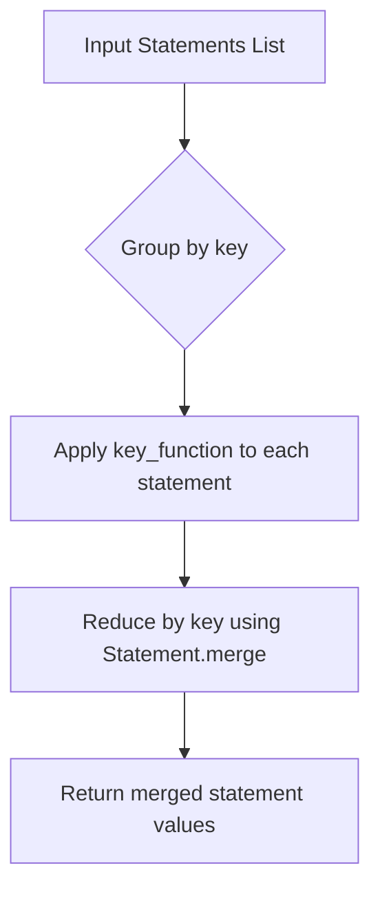
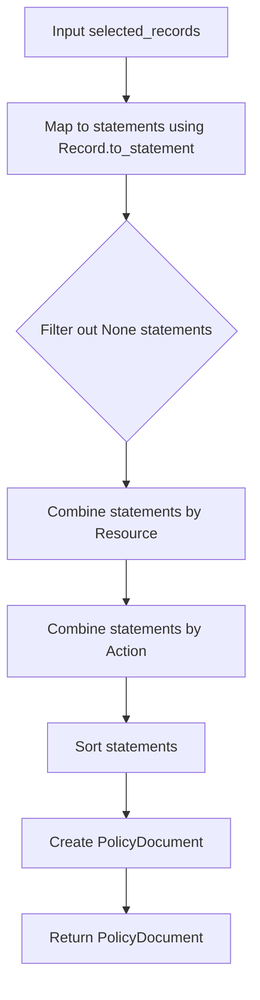

# `policy_generator.py`

## `trailscraper.policy_generator._combine_statements_by` · *function*

## Summary:
Creates a function that groups and merges IAM policy statements based on a specified key function, consolidating equivalent statements into single merged statements.

## Description:
This higher-order function generates a processor that takes a list of IAM policy statements and groups them by a computed key. Statements sharing the same key are merged using the Statement.merge method, producing a reduced set of consolidated statements. This function is used to optimize IAM policies by eliminating redundant statements with identical effects and combining their actions and resources.

The resulting function is typically used in policy optimization pipelines where multiple CloudTrail records or IAM statements need to be consolidated into a minimal set of equivalent statements.

## Args:
    key (callable): A function that takes a Statement object and returns a hashable value used for grouping statements. The key function determines which statements are considered equivalent for merging purposes.

## Returns:
    callable: A function that accepts a list of Statement objects and returns a list of merged Statement objects, where statements with identical keys have been combined.

## Raises:
    ValueError: When Statement.merge is called on statements with mismatched Effect values, indicating incompatible statements cannot be merged.

## Constraints:
    Preconditions:
    - Input statements must be valid Statement instances
    - Key function must return hashable values for grouping
    - All statements must be compatible for merging (same Effect values within groups)
    Postconditions:
    - Output contains one statement per unique key value
    - Each merged statement contains combined actions and resources from all input statements with that key
    - Statements with different Effect values remain separate

## Side Effects:
    None

## Control Flow:


## Examples:
```python
# Example usage for grouping by Effect only
from trailscraper.iam import Statement
from trailscraper.policy_generator import _combine_statements_by

# Create sample statements
stmt1 = Statement(["ec2:DescribeInstances"], "Allow", ["*"])
stmt2 = Statement(["ec2:RunInstances"], "Allow", ["*"])
stmt3 = Statement(["s3:GetObject"], "Deny", ["*"])

# Group and merge by Effect
group_by_effect = _combine_statements_by(lambda s: s.Effect)
result = group_by_effect([stmt1, stmt2, stmt3])

# Result will contain 2 statements: one Allow merged with ec2:DescribeInstances and ec2:RunInstances,
# and one Deny with s3:GetObject
```

## `trailscraper.policy_generator.generate_policy` · *function*

## Summary:
Generates an IAM policy document from a collection of CloudTrail records by converting them to statements and consolidating equivalent statements.

## Description:
Transforms a collection of CloudTrail records into a structured IAM policy document by converting each record into an IAM statement, filtering out irrelevant statements, consolidating equivalent statements by resource and action, and sorting the final result. This function serves as the core policy generation pipeline that enables security analysis and permission auditing from CloudTrail event data.

The function specifically excludes STS GetCallerIdentity events from the policy generation process, as these events don't represent actual permission grants. It optimizes the resulting policy by merging statements with identical resources or actions, reducing redundancy while preserving all necessary permissions.

## Args:
    selected_records (Iterable[Record]): Collection of CloudTrail Record objects to be converted into policy statements. Each record represents an AWS service operation performed in the account.

## Returns:
    PolicyDocument: An IAM policy document containing a list of consolidated statements representing the permissions captured by the input CloudTrail records. The policy has version "2012-10-17" and includes all valid statements from the input records.

## Raises:
    ValueError: When Statement.merge is called on statements with mismatched Effect values during the consolidation phase, indicating incompatible statements cannot be merged.

## Constraints:
    Preconditions:
    - Input records must be valid Record instances with proper event_source and event_name attributes
    - Each record's to_statement() method must return either a valid Statement object or None
    - All records should be from the same AWS account for meaningful policy consolidation
    
    Postconditions:
    - Output policy contains only statements with Effect="Allow"
    - Statements with identical Resources are merged into single statements
    - Statements with identical Actions are merged into single statements
    - Final statement list is sorted alphabetically by statement properties

## Side Effects:
    None

## Control Flow:


## Examples:
```python
# Basic usage with CloudTrail records
from trailscraper.cloudtrail import Record
from trailscraper.policy_generator import generate_policy

# Create sample records
record1 = Record(
    event_source="s3.amazonaws.com",
    event_name="GetObject",
    resource_arns=["arn:aws:s3:::my-bucket/*"]
)

record2 = Record(
    event_source="s3.amazonaws.com",
    event_name="PutObject",
    resource_arns=["arn:aws:s3:::my-bucket/*"]
)

# Generate policy from records
policy = generate_policy([record1, record2])
print(policy.Version)  # "2012-10-17"
print(len(policy.Statement))  # Number of consolidated statements
```

