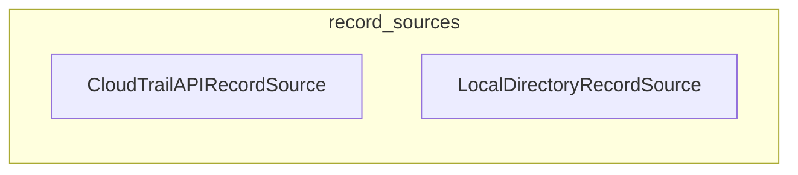

# `trailscraper.record_sources`

## Tree:
record_sources/
├── cloudtrail_api_record_source.py
└── local_directory_record_source.py

## Role:
Provides unified interfaces for fetching CloudTrail log records from different data sources, enabling flexible data ingestion for security analysis workflows.

## Description:
The record_sources module encapsulates the abstraction for retrieving CloudTrail log records from various origins. It provides two primary implementations: one that fetches events directly from the AWS CloudTrail API, and another that reads events from local CloudTrail log files. This module serves as a foundational component that allows higher-level systems to consume CloudTrail data without being concerned about the underlying data source.

This module is used throughout the trailscraper system to provide flexible data ingestion capabilities. The separation of concerns between API-based and file-based record sources enables the system to work with CloudTrail data regardless of whether it's stored locally or accessed via AWS services.

## Components:
- CloudTrailAPIRecordSource: Implements record source interface for fetching CloudTrail events from AWS API
- LocalDirectoryRecordSource: Implements record source interface for loading CloudTrail events from local files

## Public API:
- CloudTrailAPIRecordSource: Class for fetching CloudTrail events from AWS API
  - `__init__()`: Initializes the record source with AWS CloudTrail client
  - `load_from_api(from_date, to_date)`: Fetches CloudTrail events from AWS API within specified time range
- LocalDirectoryRecordSource: Class for loading CloudTrail events from local directory
  - `__init__(log_dir)`: Initializes the record source with directory path
  - `load_from_dir(from_date, to_date)`: Loads CloudTrail events from local files within specified time range
  - `last_event_timestamp_in_dir()`: Retrieves latest event timestamp from directory

## Dependencies:
- Internal: 
  - `trailscraper.log_file`: Used by LocalDirectoryRecordSource for file handling and parsing
  - `trailscraper.record`: Used by both classes for Record object creation and handling
- External:
  - `boto3`: Required for AWS API interactions in CloudTrailAPIRecordSource
  - `toolz`: Used for functional programming patterns in LocalDirectoryRecordSource

## Constraints:
- CloudTrailAPIRecordSource requires valid AWS credentials with CloudTrail permissions
- LocalDirectoryRecordSource requires directory path to contain properly formatted CloudTrail log files
- Both classes expect timezone-aware datetime objects for time-based filtering
- Time ranges should be within CloudTrail's retention period (typically 90 days for API source)
- CloudTrailAPIRecordSource creates a new boto3 client instance for each API call rather than using the instance's client

---

## Files

- [`cloudtrail_api_record_source.py`](record_sources/cloudtrail_api_record_source.md)
- [`local_directory_record_source.py`](record_sources/local_directory_record_source.md)

