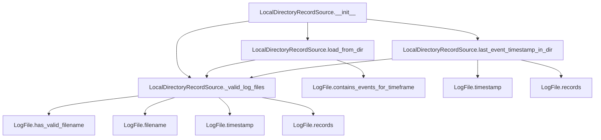

# `local_directory_record_source.py`

## `trailscraper.record_sources.local_directory_record_source.LocalDirectoryRecordSource` · *class*

## Summary:
A record source that loads CloudTrail log records from files in a local directory, filtering by timestamp and providing metadata about the latest event time.

## Description:
The LocalDirectoryRecordSource class provides an interface for reading and processing CloudTrail log files stored locally. It discovers valid CloudTrail log files in a specified directory, filters them based on timestamp ranges, and extracts event records for further analysis. This class serves as a bridge between local file storage and the trailscraper's event processing pipeline.

The class is designed to work with AWS CloudTrail log files that follow the standard naming convention and are stored in a hierarchical directory structure. It handles file validation, timestamp-based filtering, and provides metadata about the most recent event in the directory.

## State:
- `_log_dir` (str): The absolute or relative path to the directory containing CloudTrail log files. Must be a valid directory path. This is the only instance attribute and is set during initialization.

## Lifecycle:
- Creation: Instantiate with a directory path string pointing to a location containing CloudTrail log files
- Usage: Call `load_from_dir()` to retrieve records within a time range, or `last_event_timestamp_in_dir()` to get the latest event timestamp
- Destruction: No explicit cleanup required; relies on Python's garbage collection

## Method Map:


## Raises:
- `TypeError`: Raised during initialization if `log_dir` is not a string
- `FileNotFoundError`: Raised during file operations if the specified directory does not exist
- `PermissionError`: Raised during file operations if there are insufficient permissions to read the directory or files

## Example:
```python
from datetime import datetime
from trailscraper.record_sources.local_directory_record_source import LocalDirectoryRecordSource

# Create a record source for a directory containing CloudTrail logs
record_source = LocalDirectoryRecordSource("/path/to/cloudtrail/logs")

# Load records from a specific time range
from_date = datetime(2023, 1, 1)
to_date = datetime(2023, 1, 2)
records = record_source.load_from_dir(from_date, to_date)
# Returns a list of CloudTrail event records

# Get the timestamp of the most recent event in the directory
latest_timestamp = record_source.last_event_timestamp_in_dir()
# Returns a datetime object representing the latest event time
```

### `trailscraper.record_sources.local_directory_record_source.LocalDirectoryRecordSource.__init__` · *method*

## Summary:
Initializes a LocalDirectoryRecordSource with the path to a directory containing CloudTrail log files.

## Description:
Configures the record source with a directory path where CloudTrail log files are stored. This constructor stores the provided directory path as an instance attribute that will be used by all subsequent operations to locate and process CloudTrail log files. The method is part of the object's initialization lifecycle and prepares the instance for loading records or retrieving metadata about available events.

The initialization validates that the provided argument is a string, and subsequent operations will raise appropriate exceptions if the directory doesn't exist or isn't accessible.

## Args:
    log_dir (str): The absolute or relative path to the directory containing CloudTrail log files. Must be a valid directory path string.

## Returns:
    None: This method does not return a value.

## Raises:
    TypeError: Raised if `log_dir` is not a string type.

## State Changes:
    Attributes READ: None
    Attributes WRITTEN: self._log_dir (stores the provided directory path)

## Constraints:
    Preconditions:
    - The `log_dir` parameter must be a string
    - The directory path must be valid and accessible (though validation occurs during later operations)
    
    Postconditions:
    - The instance's `_log_dir` attribute is set to the provided directory path
    - The instance is ready for use with `load_from_dir()` and `last_event_timestamp_in_dir()` methods

## Side Effects:
    None: This method performs no I/O operations or external service calls. Directory validation occurs during later operations.

### `trailscraper.record_sources.local_directory_record_source.LocalDirectoryRecordSource._valid_log_files` · *method*

## Summary:
Returns an iterator of valid CloudTrail log file objects from the configured directory, filtering out files with invalid filenames and logging warnings for invalid ones.

## Description:
This method performs a recursive directory walk to discover all files in the configured log directory (`self._log_dir`), converts them to LogFile objects, and filters out those with invalid filenames according to AWS CloudTrail naming conventions. Invalid filenames are logged as warnings but do not cause the method to fail.

The method is designed as a reusable component that provides a clean interface for accessing only valid CloudTrail log files, ensuring downstream processing operations work with properly formatted log files. It's used by both `load_from_dir()` and `last_event_timestamp_in_dir()` methods to obtain filtered log file collections.

## Args:
    None

## Returns:
    Iterator[LogFile]: An iterator of LogFile objects representing valid CloudTrail log files found in the directory tree. Invalid files are filtered out and logged as warnings.

## Raises:
    None

## State Changes:
    Attributes READ: self._log_dir
    Attributes WRITTEN: None

## Constraints:
    Preconditions: The `self._log_dir` attribute must contain a valid directory path.
    Postconditions: The returned iterator contains only LogFile objects with valid filenames according to CloudTrail naming conventions.

## Side Effects:
    I/O: Performs filesystem operations to walk the directory tree.
    Logging: Writes warning messages to the logging system for files with invalid filenames.

### `trailscraper.record_sources.local_directory_record_source.LocalDirectoryRecordSource.load_from_dir` · *method*

## Summary:
Loads and filters CloudTrail log records from the configured directory that fall within a specified date range.

## Description:
Retrieves all valid CloudTrail log files from the configured directory and filters them based on whether they contain events within the specified date timeframe. Only log files whose timestamps indicate they contain events between `from_date` and `to_date` (inclusive of the end time plus one hour buffer) are processed. The method aggregates all matching records into a single list and returns them for further processing.

This method is part of the LocalDirectoryRecordSource class and serves as the primary interface for extracting CloudTrail events from a local directory structure. It leverages the `_valid_log_files()` helper method to ensure only properly formatted CloudTrail log files are considered, and uses the LogFile's built-in time filtering capabilities to efficiently narrow down relevant files.

## Args:
    from_date (datetime.datetime): The start of the time range to filter events by. Must be a timezone-aware datetime object.
    to_date (datetime.datetime): The end of the time range to filter events by. Must be a timezone-aware datetime object.

## Returns:
    list[dict]: A list of CloudTrail event records (as dictionaries) that occurred within the specified timeframe. Returns an empty list if no matching records are found.

## Raises:
    None explicitly raised by this method.

## State Changes:
    Attributes READ: self._log_dir (through _valid_log_files())
    Attributes WRITTEN: None

## Constraints:
    Preconditions:
    - The `from_date` and `to_date` parameters must be timezone-aware datetime objects
    - The configured log directory (`self._log_dir`) must be accessible and contain valid CloudTrail log files
    - Both dates should be in UTC timezone for consistency with CloudTrail log file timestamps
    
    Postconditions:
    - Returns a list containing all CloudTrail event records from valid log files within the specified timeframe
    - The returned list is ordered according to the chronological order of events within the log files

## Side Effects:
    I/O: Reads from the filesystem to access CloudTrail log files in the configured directory
    Logging: May emit warning messages if log files cannot be loaded or parsed

### `trailscraper.record_sources.local_directory_record_source.LocalDirectoryRecordSource.last_event_timestamp_in_dir` · *method*

## Summary:
Retrieves the latest event timestamp from all valid CloudTrail log files in the configured directory.

## Description:
This method identifies the most recent CloudTrail log file in the configured directory by sorting valid log files by their timestamp, then extracts the latest event timestamp from that file's records. It's used to determine the newest event time available in the log directory for time-based processing and synchronization.

The method follows a functional pipeline approach using toolz functions to process the log files in a chain: first getting valid log files, then sorting by timestamp, taking the last (most recent) file, extracting its records, sorting those records by event time, and finally taking the last (latest) event.

## Args:
    None

## Returns:
    datetime.datetime: The latest event timestamp found in any valid CloudTrail log file within the directory.

## Raises:
    IndexError: When no valid CloudTrail log files exist in the configured directory, causing the pipeline to fail when trying to access elements from an empty sequence.

## State Changes:
    Attributes READ: self._log_dir (through _valid_log_files call)
    Attributes WRITTEN: None

## Constraints:
    Preconditions: The configured log directory must contain at least one valid CloudTrail log file with proper naming convention.
    Postconditions: Returns the maximum event time from all valid log files in the directory.

## Side Effects:
    I/O: Reads files from the filesystem to process CloudTrail log entries.
    Logging: May emit warning messages through the logging system for files with invalid filenames during the validation process.

