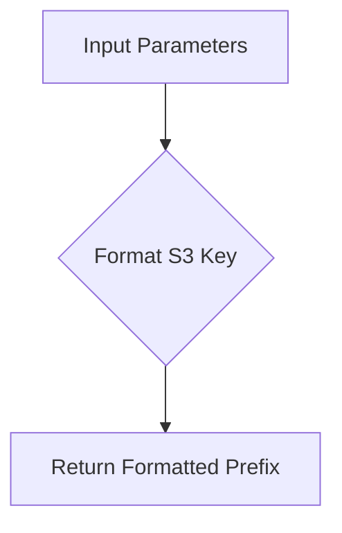
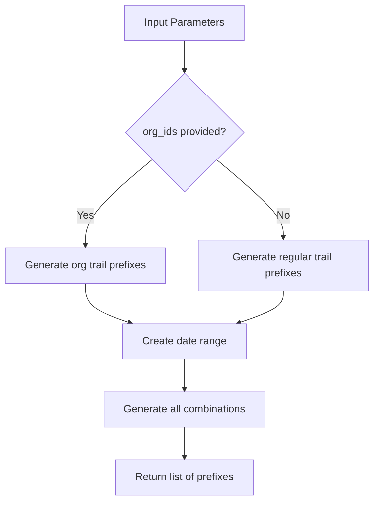
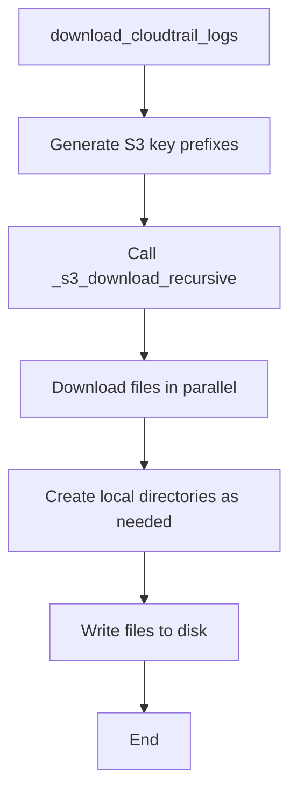

# `s3_download.py`

## `trailscraper.s3_download._s3_key_prefix` · *function*

## Summary:
Constructs an S3 key prefix path for AWS CloudTrail log files based on account, region, and date information.

## Description:
This utility function generates the standardized S3 key prefix path used by AWS CloudTrail to store log files. The resulting path follows AWS's standard directory structure for CloudTrail logs, making it suitable for retrieving logs from S3 buckets.

## Args:
    prefix (str): The base prefix to prepend to the S3 key path
    date (datetime.datetime): The date for which to construct the log path
    account_id (str): The AWS account ID associated with the logs
    region (str): The AWS region where the logs were generated

## Returns:
    str: A formatted S3 key prefix in the pattern: "{prefix}AWSLogs/{account_id}/CloudTrail/{region}/{year}/{month:02d}/{day:02d}/"

## Raises:
    None

## Constraints:
    Preconditions:
        - date must be a valid datetime object
        - account_id must be a non-empty string
        - region must be a non-empty string
        - prefix should be a string (though no validation is performed)

    Postconditions:
        - Returns a properly formatted S3 key prefix string
        - All date components are zero-padded to ensure proper sorting

## Side Effects:
    None

## Control Flow:


## Examples:
    >>> from datetime import datetime
    >>> _s3_key_prefix("logs/", datetime(2023, 12, 25), "123456789012", "us-east-1")
    'logs/AWSLogs/123456789012/CloudTrail/us-east-1/2023/12/25/'
```

## `trailscraper.s3_download._s3_key_prefix_for_org_trails` · *function*

## Summary:
Constructs an S3 key prefix path for AWS CloudTrail logs within an organization structure.

## Description:
Generates a standardized S3 object key prefix for accessing CloudTrail logs stored in AWS S3 buckets. This function formats the path according to AWS CloudTrail's standard directory structure for organization trails, which includes organizational ID, account ID, region, and date components.

## Args:
    prefix (str): The base prefix to prepend to the S3 key path
    date (datetime.date): The date for which to construct the path
    org_id (str): The AWS organization identifier
    account_id (str): The AWS account identifier
    region (str): The AWS region where the logs were generated

## Returns:
    str: A formatted S3 key prefix in the pattern: {prefix}AWSLogs/{org_id}/{account_id}/CloudTrail/{region}/{year}/{month:02d}/{day:02d}/

## Raises:
    None explicitly raised

## Constraints:
    Preconditions:
        - prefix must be a string
        - date must be a datetime.date object
        - org_id must be a string
        - account_id must be a string
        - region must be a string
    Postconditions:
        - Returns a properly formatted S3 key prefix string
        - Date components are zero-padded to ensure proper sorting in S3

## Side Effects:
    None

## Control Flow:
```mermaid
flowchart TD
    A[Start] --> B[Format prefix + AWSLogs/{org_id}/{account_id}/CloudTrail/{region}/]
    B --> C[Add year/{date.year}]
    C --> D[Add month/{date.month:02d}]
    D --> E[Add day/{date.day:02d}]
    E --> F[Return formatted string]
```

## Examples:
    >>> _s3_key_prefix_for_org_trails("logs/", datetime.date(2023, 12, 25), "o-1234567890", "123456789012", "us-east-1")
    "logs/AWSLogs/o-1234567890/123456789012/CloudTrail/us-east-1/2023/12/25/"
```

## `trailscraper.s3_download._s3_key_prefixes` · *function*

## Summary:
Generates a list of S3 key prefixes for AWS CloudTrail log files over a specified date range.

## Description:
Creates a comprehensive list of S3 object key prefixes used by AWS CloudTrail to store log files. The function handles both regular AWS account trails and organization trails, generating all necessary prefixes for a given date range, account IDs, and regions. This utility is essential for efficiently collecting CloudTrail logs from S3 storage.

## Args:
    prefix (str): Base prefix to prepend to all generated S3 key paths
    org_ids (list[str] or None): Organization IDs for organization trails; if None, regular account trails are used
    account_ids (list[str]): List of AWS account IDs to generate prefixes for (must be non-empty)
    regions (list[str]): List of AWS regions to generate prefixes for (must be non-empty)
    from_date (datetime.datetime): Starting date for the date range (inclusive)
    to_date (datetime.datetime): Ending date for the date range (inclusive)

## Returns:
    list[str]: A list of formatted S3 key prefixes for CloudTrail log retrieval. Returns an empty list if no combinations are generated.

## Raises:
    None

## Constraints:
    Preconditions:
        - from_date must be a valid datetime object
        - to_date must be a valid datetime object  
        - from_date must be less than or equal to to_date
        - account_ids must be a non-empty list
        - regions must be a non-empty list
        - If org_ids is provided, it must be a non-empty list

    Postconditions:
        - Returns a list of properly formatted S3 key prefixes
        - All date ranges are inclusive
        - All parameter combinations are generated
        - Returns an empty list if no valid combinations exist

## Side Effects:
    None

## Control Flow:


## Examples:
    >>> from datetime import datetime
    >>> from_date = datetime(2023, 12, 20)
    >>> to_date = datetime(2023, 12, 22)
    >>> prefixes = _s3_key_prefixes(
    ...     prefix="cloudtrail-logs/",
    ...     org_ids=None,
    ...     account_ids=["123456789012"],
    ...     regions=["us-east-1"],
    ...     from_date=from_date,
    ...     to_date=to_date
    ... )
    >>> print(len(prefixes))
    3

## `trailscraper.s3_download._s3_download_recursive` · *function*

## Summary:
Downloads files from an S3 bucket recursively based on specified prefixes to a local target directory using parallel processing.

## Description:
This function recursively lists and downloads files from an S3 bucket that match given prefixes to a local directory. It uses thread-local S3 clients for thread safety and downloads files in parallel to improve performance. The function handles directory creation and skips files that already exist locally.

## Args:
    bucket (str): Name of the S3 bucket to download from.
    prefixes (list[str]): List of prefixes to filter S3 object keys. Only objects whose keys start with these prefixes will be downloaded.
    target_dir (str): Local directory path where downloaded files will be stored.
    parallelism (int): Maximum number of concurrent download threads to use.

## Returns:
    None: This function does not return any value.

## Raises:
    None explicitly raised: The function relies on boto3's download_file method which may raise various AWS-related exceptions such as ClientError, NoSuchBucket, AccessDenied, etc., but these are not explicitly caught or re-raised by this function.

## Constraints:
    Preconditions:
        - The bucket must exist and be accessible with appropriate credentials
        - The target_dir must be writable
        - The prefixes list should contain valid S3 key prefixes
        - The parallelism parameter should be a positive integer
    
    Postconditions:
        - Files matching the prefixes will be downloaded to the target directory
        - Directories will be created as needed for the downloaded files
        - Existing files in the target directory will be skipped

## Side Effects:
    - Creates directories in the target filesystem as needed
    - Downloads files from S3 to the local filesystem
    - Writes log messages at INFO level for download progress
    - Creates thread-local S3 clients for each thread

## Control Flow:
```mermaid
flowchart TD
    A[Start _s3_download_recursive] --> B{Get files to download}
    B --> C[List S3 objects with pagination}
    C --> D{Has CommonPrefixes?}
    D -->|Yes| E[Recursively list prefixes]
    D -->|No| F{Has Contents?}
    F -->|Yes| G[Check if prefix matches]
    G --> H{Current prefix in prefixes?}
    H -->|Yes| I[Check if file exists locally]
    I --> J{File exists?}
    J -->|No| K[Add to download list]
    J -->|Yes| L[Skip and log]
    F -->|No| M[Continue pagination]
    E --> N[Return files to download]
    G --> O[Skip - not matching prefix]
    H --> P[Skip - not in prefixes]
    N --> Q[Download files in parallel]
    K --> R[Download file]
    R --> S[Create local directory if needed]
    S --> T[Write file to disk]
    Q --> U[End]
```

## Examples:
    # Download all logs from a specific date prefix
    _s3_download_recursive(
        bucket="my-logs-bucket",
        prefixes=["2023/12/25/"],
        target_dir="/tmp/logs",
        parallelism=10
    )
    
    # Download logs from multiple date ranges
    _s3_download_recursive(
        bucket="aws-cloudtrail-logs",
        prefixes=["2023/12/", "2023/11/"],
        target_dir="./cloudtrail-logs",
        parallelism=5
    )

## `trailscraper.s3_download.download_cloudtrail_logs` · *function*

## Summary:
Downloads AWS CloudTrail log files from S3 to a local directory based on specified filters and date ranges.

## Description:
This function serves as the main entry point for downloading CloudTrail logs from S3. It generates the appropriate S3 key prefixes based on organizational structure, account IDs, regions, and date ranges, then initiates the recursive download process to the specified target directory. The function leverages parallel processing to improve download performance.

## Args:
    target_dir (str): Local directory path where downloaded CloudTrail log files will be stored.
    bucket (str): Name of the S3 bucket containing CloudTrail log files.
    cloudtrail_prefix (str): Base prefix to prepend to all generated S3 key paths for CloudTrail logs.
    org_ids (list[str] or None): Organization IDs for organization trails; if None, regular account trails are used.
    account_ids (list[str]): List of AWS account IDs to generate prefixes for (must be non-empty).
    regions (list[str]): List of AWS regions to generate prefixes for (must be non-empty).
    from_date (datetime.datetime): Starting date for the date range (inclusive).
    to_date (datetime.datetime): Ending date for the date range (inclusive).
    parallelism (int): Maximum number of concurrent download threads to use.

## Returns:
    None: This function does not return any value.

## Raises:
    None explicitly raised: The function delegates to helper functions that may raise AWS-related exceptions such as ClientError, NoSuchBucket, AccessDenied, etc., but these are not explicitly caught or re-raised by this function.

## Constraints:
    Preconditions:
        - from_date must be a valid datetime object
        - to_date must be a valid datetime object  
        - from_date must be less than or equal to to_date
        - account_ids must be a non-empty list
        - regions must be a non-empty list
        - If org_ids is provided, it must be a non-empty list
        - The bucket must exist and be accessible with appropriate credentials
        - The target_dir must be writable
        - The parallelism parameter should be a positive integer

    Postconditions:
        - Files matching the generated prefixes will be downloaded to the target directory
        - Directories will be created as needed for the downloaded files
        - Existing files in the target directory will be skipped

## Side Effects:
    - Creates directories in the local filesystem as needed
    - Downloads files from S3 to the local filesystem
    - Writes log messages at INFO level for download progress
    - Creates thread-local S3 clients for each thread

## Control Flow:


## Examples:
    # Download CloudTrail logs for a specific account and region
    from datetime import datetime
    download_cloudtrail_logs(
        target_dir="/tmp/cloudtrail-logs",
        bucket="my-cloudtrail-bucket",
        cloudtrail_prefix="AWSLogs/",
        org_ids=None,
        account_ids=["123456789012"],
        regions=["us-east-1"],
        from_date=datetime(2023, 12, 20),
        to_date=datetime(2023, 12, 22),
        parallelism=5
    )
    
    # Download CloudTrail logs for multiple accounts and regions
    download_cloudtrail_logs(
        target_dir="./cloudtrail-logs",
        bucket="aws-cloudtrail-logs",
        cloudtrail_prefix="CloudTrail/",
        org_ids=["o-1234567890"],
        account_ids=["123456789012", "234567890123"],
        regions=["us-east-1", "us-west-2"],
        from_date=datetime(2023, 12, 1),
        to_date=datetime(2023, 12, 31),
        parallelism=10
    )

