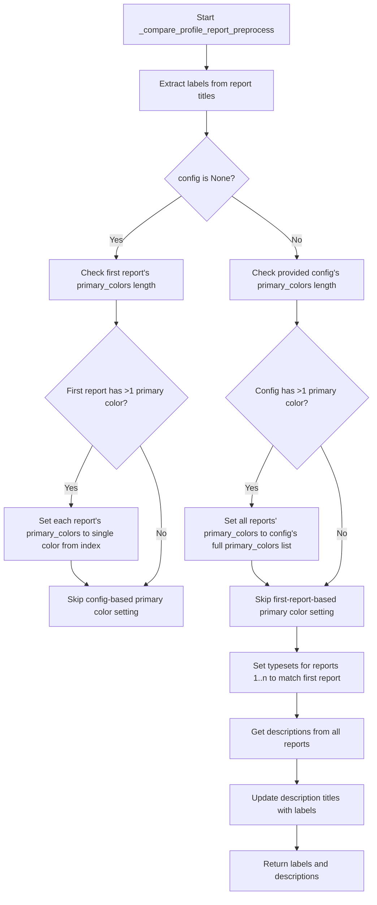
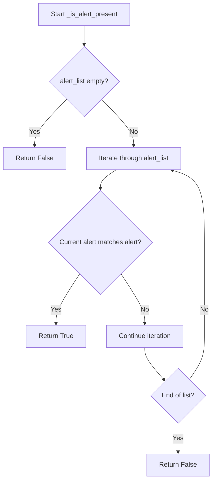
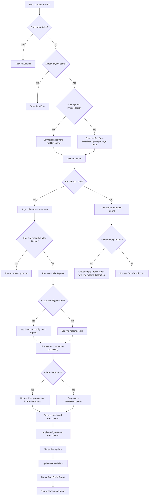

# `compare_reports.py`

## `src.ydata_profiling.compare_reports._should_wrap` · *function*

## Summary:
Determines whether two values should be compared using special equality semantics rather than standard equality.

## Description:
This utility function evaluates whether two values require special handling during comparison operations. It specifically avoids wrapping (returns False) for container types like lists and dictionaries, which don't support meaningful equality comparisons in the context of this system. For pandas DataFrame and Series objects, it uses their native `.equals()` methods for proper comparison. For other types, it attempts standard equality comparison with graceful error handling.

## Args:
    v1 (Any): First value to evaluate for comparison treatment
    v2 (Any): Second value to evaluate for comparison treatment

## Returns:
    bool: True if values should be compared using special semantics (DataFrame/Series equality or standard equality), False if they should not be wrapped (list/dict types).

## Raises:
    None explicitly raised - ValueError from equality comparisons is caught and handled gracefully

## Constraints:
    Preconditions: Both arguments can be any Python objects
    Postconditions: Always returns a boolean value indicating whether special comparison treatment is needed

## Side Effects:
    None

## Control Flow:
```mermaid
flowchart TD
    A[Start _should_wrap] --> B{v1 is list or dict?}
    B -- Yes --> C[Return False]
    B -- No --> D{v1 is DataFrame AND v2 is DataFrame?}
    D -- Yes --> E[Return v1.equals(v2)]
    D -- No --> F{v1 is Series AND v2 is Series?}
    F -- Yes --> G[Return v1.equals(v2)]
    F -- No --> H[Try v1 == v2]
    H --> I{ValueError raised?}
    I -- Yes --> J[Return False]
    I -- No --> K[Return v1 == v2]
```

## Examples:
    # DataFrame comparison - uses .equals() method
    df1 = pd.DataFrame({'a': [1, 2], 'b': [3, 4]})
    df2 = pd.DataFrame({'a': [1, 2], 'b': [3, 4]})
    result = _should_wrap(df1, df2)  # Returns True (uses equals())
    
    # List comparison - avoids wrapping
    list1 = [1, 2, 3]
    list2 = [1, 2, 3]
    result = _should_wrap(list1, list2)  # Returns False (container type)
    
    # Regular value comparison
    result = _should_wrap(5, 5)  # Returns True (standard equality)
    
    # Mismatched types - falls back to standard comparison
    result = _should_wrap("hello", "hello")  # Returns True
```

## `src.ydata_profiling.compare_reports._update_merge_dict` · *function*

## Summary:
Merges two dictionaries with special handling for overlapping keys by either wrapping values in lists or applying mixed merging logic.

## Description:
This utility function combines two dictionaries by taking all keys from both dictionaries. For keys that exist in both dictionaries, it applies special merging logic: if `_should_wrap()` returns True for the values, they are wrapped in a list; otherwise, `_update_merge_mixed()` is called to merge them. This function is used in profile report comparison operations to handle complex data structures requiring special merging semantics.

## Args:
    d1 (Any): First dictionary to merge
    d2 (Any): Second dictionary to merge

## Returns:
    dict: A merged dictionary containing all keys from both input dictionaries. The merge process follows these rules:
          - All keys from d1 are included in the result
          - All keys from d2 are included in the result  
          - For keys present in both dictionaries, the value is determined by:
            * If `_should_wrap(d1[k], d2[k])` returns True: `[d1[k], d2[k]]` (wrapped in list)
            * Otherwise: `_update_merge_mixed(d1[k], d2[k])` (mixed merging result)

## Raises:
    None explicitly raised

## Constraints:
    Preconditions:
    - Both arguments must be dictionary-like objects supporting the `**` unpacking operator
    - Keys in both dictionaries must be hashable (required for dictionary construction)
    - Values in dictionaries should be compatible with `_should_wrap` and `_update_merge_mixed` functions
    
    Postconditions:
    - The returned dictionary contains all keys from both input dictionaries
    - Input dictionaries are not modified
    - Return value is a new dictionary instance

## Side Effects:
    None

## Control Flow:
```mermaid
flowchart TD
    A[Start _update_merge_dict(d1, d2)] --> B[Create set of overlapping keys: {*d1} ∩ {*d2}]
    B --> C[Process overlapping keys]
    C --> D{For each overlapping key k:}
    D --> E{_should_wrap(d1[k], d2[k])?}
    E -- Yes --> F[Set value to [d1[k], d2[k]]]
    E -- No --> G[Set value to _update_merge_mixed(d1[k], d2[k])]
    D --> H{All overlapping keys processed?}
    H -- Yes --> I[Return {**d1, **d2, **{overlapping_keys: merged_values}}]
```

## Examples:
    # Basic merge with no overlapping keys
    d1 = {'a': 1, 'b': 2}
    d2 = {'c': 3, 'd': 4}
    result = _update_merge_dict(d1, d2)  # Returns {'a': 1, 'b': 2, 'c': 3, 'd': 4}
    
    # Merge with overlapping keys that should be wrapped
    d1 = {'a': 1, 'b': 2}
    d2 = {'b': 3, 'c': 4}
    result = _update_merge_dict(d1, d2)  # Returns {'a': 1, 'b': [2, 3], 'c': 4}
    
    # Merge with overlapping keys using mixed merging
    d1 = {'a': {'x': 1}, 'b': 2}
    d2 = {'a': {'y': 2}, 'b': 3}
    result = _update_merge_dict(d1, d2)  # Returns {'a': {...merged dict...}, 'b': [2, 3]}

## `src.ydata_profiling.compare_reports._update_merge_seq` · *function*

## Summary:
Merges two sequence-like objects into appropriate container types based on their input types.

## Description:
This utility function handles the merging of two sequence-like objects (lists, tuples, or single values) into appropriate container types. It provides different behaviors based on input types to support sequence comparison operations in the profiling system.

## Args:
    d1 (Any): First sequence or value to merge
    d2 (Any): Second sequence or value to merge

## Returns:
    Union[list, tuple]: 
    - If both inputs are lists: returns (d1, d2) as a tuple
    - If d1 is tuple and d2 is list: returns (*d1, d2) as a tuple  
    - Otherwise: returns a concatenated list containing both elements converted to lists

## Raises:
    None explicitly raised

## Constraints:
    Preconditions:
    - Both arguments can be any type (though behavior varies based on type)
    - Function assumes inputs are compatible with list/tuple operations
    
    Postconditions:
    - Return value is either a list or tuple
    - Input arguments are not modified

## Side Effects:
    None

## Control Flow:
```mermaid
flowchart TD
    A[Start: _update_merge_seq(d1, d2)] --> B{isinstance(d1, list) AND isinstance(d2, list)?}
    B -- Yes --> C[Return (d1, d2)]
    B -- No --> D{isinstance(d1, tuple) AND isinstance(d2, list)?}
    D -- Yes --> E[Return (*d1, d2)]
    D -- No --> F[Return [*(d1 if list else [d1]), *(d2 if list else [d2])]]
```

## Examples:
    # Both are lists - returns tuple of lists
    result = _update_merge_seq([1, 2], [3, 4])  # Returns ([1, 2], [3, 4])
    
    # First is tuple, second is list - returns tuple with unpacking
    result = _update_merge_seq((1, 2), [3, 4])  # Returns ((1, 2), [3, 4])
    
    # Mixed types - returns concatenated list
    result = _update_merge_seq("hello", [1, 2])  # Returns ["hello", [1, 2]]

## `src.ydata_profiling.compare_reports._update_merge_mixed` · *function*

## Summary:
Dispatches to appropriate merging strategy based on input types for comparing profile report data structures.

## Description:
This utility function serves as a dispatcher that routes input data to the appropriate merging strategy based on their types. When both inputs are dictionaries, it performs deep merging with special handling for certain data types. For all other combinations, it uses sequence-based merging logic. This function is part of the comparison system for profile reports and ensures proper handling of mixed data structures during comparison operations.

## Args:
    d1 (Any): First data structure to merge (can be dict, list, tuple, or any other type)
    d2 (Any): Second data structure to merge (can be dict, list, tuple, or any other type)

## Returns:
    Union[dict, list, tuple]: 
    - If both inputs are dictionaries: returns a merged dictionary with keys from both inputs
    - Otherwise: returns result from sequence merging logic

## Raises:
    None explicitly raised

## Constraints:
    Preconditions:
    - Both arguments can be any Python object type
    - Function assumes inputs are compatible with the underlying merge strategies
    
    Postconditions:
    - Return value type matches the dispatch logic (dict, list, or tuple)
    - Input arguments are not modified

## Side Effects:
    None

## Control Flow:
```mermaid
flowchart TD
    A[Start: _update_merge_mixed(d1, d2)] --> B{isinstance(d1, dict) AND isinstance(d2, dict)?}
    B -- Yes --> C[Return _update_merge_dict(d1, d2)]
    B -- No --> D[Return _update_merge_seq(d1, d2)]
```

## `src.ydata_profiling.compare_reports._update_merge` · *function*

## Summary:
Merges two dictionary-like objects with special handling for None values and type validation.

## Description:
This utility function serves as a safe merger for dictionary objects used in profile report comparison operations. It handles the case where the first argument might be None, performs type validation to ensure both arguments are dictionaries, and delegates the actual merging logic to `_update_merge_dict`.

## Args:
    d1 (Optional[dict]): First dictionary to merge, can be None
    d2 (dict): Second dictionary to merge, must be a dictionary

## Returns:
    dict: A merged dictionary containing all keys from both input dictionaries. When d1 is None, returns d2 directly. When both are dictionaries, returns the result of _update_merge_dict(d1, d2).

## Raises:
    TypeError: When either d1 or d2 is not a dictionary type

## Constraints:
    Preconditions:
    - d2 must be a dictionary type
    - If d1 is provided, it must also be a dictionary type
    
    Postconditions:
    - Returns a new dictionary instance
    - Neither input dictionary is modified
    - If d1 is None, returns d2 unchanged

## Side Effects:
    None

## Control Flow:
```mermaid
flowchart TD
    A[Start _update_merge(d1, d2)] --> B{Is d1 None?}
    B -- Yes --> C[Return d2]
    B -- No --> D{Are both d1 and d2 dicts?}
    D -- No --> E[Raise TypeError]
    D -- Yes --> F[Return _update_merge_dict(d1, d2)]
```

## `src.ydata_profiling.compare_reports._placeholders` · *function*

## Summary:
Ensures consistent data structure across multiple profile reports by populating missing scatter plot and table type placeholders with default values.

## Description:
This function normalizes the structure of BaseDescription objects in a list of reports to ensure all reports have consistent keys for scatter plots and table types. It is used during report comparison operations to prevent KeyError exceptions when accessing report data that may not exist in all reports.

## Args:
    reports (List[BaseDescription]): A list of BaseDescription objects representing profile reports that need structural normalization.

## Returns:
    None: This function modifies the input reports in-place and does not return any value.

## Raises:
    None: This function does not explicitly raise any exceptions.

## Constraints:
    Preconditions:
    - Input reports must be a list of BaseDescription objects
    - Each BaseDescription object must have 'scatter' and 'table' attributes with 'types' sub-attribute
    
    Postconditions:
    - All reports in the input list will have consistent scatter plot key structures
    - All reports in the input list will have consistent table type key structures

## Side Effects:
    - Modifies the input reports in-place by adding missing keys and default values
    - No external I/O operations or state mutations beyond modifying the input objects

## Control Flow:
```mermaid
flowchart TD
    A[Start _placeholders] --> B[Collect all scatter keys from reports]
    B --> C[Collect all table type keys from reports]
    C --> D[For each report in reports]
    D --> E[For each scatter key k1 in all keys]
    E --> F[Ensure k1 exists in report.scatter]
    F --> G[For each scatter key k2 in all keys]
    G --> H[Ensure k2 exists in report.scatter[k1]]
    H --> I[Set report.scatter[k1][k2] = "" (empty string)]
    I --> J[For each table type key]
    J --> K[Ensure key exists in report.table["types"]]
    K --> L[Set report.table["types"][key] = 0]
    L --> M[End]
```

## Examples:
```python
# Example usage in report comparison context
reports = [report1, report2, report3]  # List of BaseDescription objects
_placeholders(reports)  # Normalizes structure across all reports
# Now all reports have consistent scatter and table type structures
```

## `src.ydata_profiling.compare_reports._update_titles` · *function*

## Summary:
Updates the titles of ProfileReport objects in a list to make them distinguishable when comparing datasets.

## Description:
This function modifies the title attribute of ProfileReport objects in-place. When a report's title is the default "Pandas Profiling Report", it replaces it with a more descriptive title in the format "Dataset X" where X is an uppercase letter (A, B, C...). This helps users easily identify different datasets in comparison reports.

The function is called during the comparison process to ensure that each dataset being compared gets a unique, recognizable title.

## Args:
    reports (List[ProfileReport]): A list of ProfileReport objects whose titles need to be updated

## Returns:
    None: This function modifies the report objects in-place and does not return anything

## Raises:
    None: This function does not explicitly raise any exceptions

## Constraints:
    Preconditions:
    - The reports parameter must be a list of ProfileReport objects
    - Each ProfileReport object must have a config attribute with a title field
    
    Postconditions:
    - All ProfileReport objects in the list will have their title attribute modified if it was "Pandas Profiling Report"
    - The modification follows the pattern: "Dataset A", "Dataset B", "Dataset C", etc.

## Side Effects:
    - Modifies the config.title attribute of each ProfileReport object in the input list
    - No external I/O operations or state mutations beyond modifying the report objects

## Control Flow:
```mermaid
flowchart TD
    A[Start _update_titles] --> B{Report title == "Pandas Profiling Report"?}
    B -- Yes --> C[Update title to "Dataset " + chr(65 + idx)]
    B -- No --> D[Skip to next report]
    C --> E[Next report]
    D --> E
    E --> F{More reports?}
    F -- Yes --> B
    F -- No --> G[End]
```

## Examples:
```python
# Basic usage in comparison context
from ydata_profiling import ProfileReport

# Create two reports with default titles
report1 = ProfileReport(df1)
report2 = ProfileReport(df2)

# Compare them (this internally calls _update_titles)
comparison_report = report1.compare(report2)

# After comparison, report1.title becomes "Dataset A" and report2.title becomes "Dataset B"
```

## `src.ydata_profiling.compare_reports._compare_title` · *function*

## Summary:
Formats a comparison title for multiple report titles by either returning a common title or creating a descriptive comparison string.

## Description:
This utility function processes a list of report titles to generate an appropriate display title for comparison operations. When all titles are identical, it returns that single title. When titles differ, it formats them into a descriptive string indicating a comparison operation.

## Args:
    titles (List[str]): A list of title strings to be compared and formatted. Must contain at least one title.

## Returns:
    str: A formatted title string. If all titles are identical, returns the common title. Otherwise, returns a formatted string like "<em>Comparing</em> title1, title2 <em>and</em> titleN".

## Raises:
    None explicitly raised.

## Constraints:
    Preconditions:
    - The input list must contain at least one title
    - All elements in the list must be strings
    
    Postconditions:
    - Always returns a string
    - Returns either a single title or a formatted comparison string

## Side Effects:
    None.

## Control Flow:
```mermaid
flowchart TD
    A[Input titles list] --> B{All titles equal?}
    B -->|Yes| C[Return first title]
    B -->|No| D[Join all but last title with commas]
    D --> E[Format as "<em>Comparing</em> {joined_titles} <em>and</em> {last_title}"]
    E --> F[Return formatted string]
```

## Examples:
    >>> _compare_title(["Report A", "Report A", "Report A"])
    'Report A'
    
    >>> _compare_title(["Report A", "Report B"])
    '<em>Comparing</em> Report A <em>and</em> Report B'
    
    >>> _compare_title(["Report A", "Report B", "Report C"])
    '<em>Comparing</em> Report A, Report B <em>and</em> Report C'

## `src.ydata_profiling.compare_reports._compare_profile_report_preprocess` · *function*

## Summary:
Prepares profile reports for comparison by normalizing configurations and extracting descriptive metadata.

## Description:
Processes a list of ProfileReport objects to standardize their configuration settings and extract their descriptive metadata for comparison operations. This function ensures that reports have consistent styling configurations and properly formatted descriptions before being compared. It is typically used internally by the comparison functionality to prepare reports before generating comparison results.

## Args:
    reports (List[ProfileReport]): A list of ProfileReport objects to preprocess for comparison.
    config (Optional[Settings], optional): A Settings object to use for standardizing report configurations. If None, uses the first report's configuration. Defaults to None.

## Returns:
    Tuple[List[str], List[BaseDescription]]: A tuple containing:
        - labels (List[str]): A list of titles from each report's configuration
        - descriptions (List[BaseDescription]): A list of descriptive metadata from each report

## Raises:
    None explicitly raised by this function.

## Constraints:
    Preconditions:
        - reports must be a non-empty list of ProfileReport objects
        - Each report in reports must have a valid config attribute with title and html.style.primary_colors
        - Each report must have a valid typeset property
        - Each report must have a valid get_description() method

    Postconditions:
        - All reports in the input list have their primary_colors configuration standardized according to the logic:
          * If config is None and first report has multiple primary colors, each report gets its primary_colors set to the color at its index position
          * If config is provided and config has multiple primary colors, all reports get their primary_colors set to the full config list
        - All reports (except the first) have their _typeset attribute set to match the first report's _typeset
        - Each description's analysis.title is updated to match its corresponding label

## Side Effects:
    - Modifies the primary_colors configuration of ProfileReport objects in-place
    - Modifies the _typeset attribute of ProfileReport objects (except the first one) in-place
    - Updates the analysis.title attribute of BaseDescription objects in-place

## Control Flow:


## Examples:
```python
# Basic usage with multiple reports
from ydata_profiling import ProfileReport

# Create two profile reports
report1 = ProfileReport(df1)
report2 = ProfileReport(df2)

# Preprocess for comparison (typically done internally)
labels, descriptions = _compare_profile_report_preprocess([report1, report2])

# Usage with custom config for consistent styling
custom_config = Settings(title="Comparison Report")
labels, descriptions = _compare_profile_report_preprocess([report1, report2], custom_config)

# Typical workflow in comparison context
# This function is usually called by the compare() method internally
# report_comparison = report1.compare(other_report, config=custom_config)
```

## `src.ydata_profiling.compare_reports._compare_dataset_description_preprocess` · *function*

## Summary:
Extracts dataset titles from profile report descriptions for comparison labeling while preserving the original report objects.

## Description:
Processes a list of profile report descriptions to extract human-readable titles for dataset identification in comparison contexts. This function serves as a preprocessing step in dataset comparison workflows, separating metadata (titles) from the full report objects to enable proper labeling of datasets in comparative visualizations or analyses.

The function assumes that each report in the input list has a properly structured analysis attribute containing a title string. This preprocessing step is essential for creating meaningful comparisons between multiple datasets.

## Args:
    reports (List[BaseDescription]): A list of profile report descriptions containing analysis metadata with title information.

## Returns:
    Tuple[List[str], List[BaseDescription]]: A tuple containing:
        - labels (List[str]): Extracted dataset titles from each report's analysis.title attribute
        - reports (List[BaseDescription]): The original list of report descriptions (unchanged)

## Raises:
    AttributeError: If any report in the input list does not have an analysis attribute, or if the analysis attribute does not have a title property.

## Constraints:
    Preconditions:
        - Input reports must be a list of BaseDescription objects
        - Each BaseDescription object must have an analysis attribute
        - Each analysis object must have a title attribute of type str
    
    Postconditions:
        - The returned labels list has the same length as the input reports list
        - The returned reports list is identical to the input reports list
        - All titles in the labels list are strings

## Side Effects:
    None: This function performs no I/O operations or external state mutations.

## Control Flow:
```mermaid
flowchart TD
    A[Input reports list] --> B{Reports exist?}
    B -- Yes --> C[Extract titles from analysis.title]
    C --> D[Return (labels, reports)]
    B -- No --> D
```

## Examples:
```python
# Basic usage
from ydata_profiling.model import BaseDescription
from ydata_profiling.compare_reports import _compare_dataset_description_preprocess

# Assuming we have profile reports
labels, processed_reports = _compare_dataset_description_preprocess(reports_list)

# labels will contain ['Dataset 1', 'Dataset 2', ...]
# processed_reports will be identical to the input reports_list

# Error handling example
try:
    labels, processed_reports = _compare_dataset_description_preprocess(invalid_reports)
except AttributeError as e:
    print(f"Invalid report structure: {e}")
```

## `src.ydata_profiling.compare_reports.validate_reports` · *function*

## Summary
Validates a list of profile reports and their configurations for compatibility before performing comparison operations.

## Description
This function ensures that profile reports being compared are compatible in terms of count, type, and structure. It performs several validation checks to prevent errors during report comparison operations. The function is designed to be called internally by comparison functions to ensure proper report preparation.

## Args
- reports: A list of either ProfileReport or BaseDescription objects to be validated
- configs: A list of configuration dictionaries corresponding to each report

## Returns
None

## Raises
- ValueError: When fewer than two reports are provided, or when mixing timeseries and tabular reports, or when ProfileReport objects aren't initialized with DataFrames
- Warning: When more than two reports are provided (comparison unsupported), or when reports have different column sets

## Constraints
Preconditions:
- Reports list must contain at least two elements
- All reports must be of the same type (either all ProfileReport or all BaseDescription)
- Configs list must have the same length as reports list

Postconditions:
- All reports are validated for compatibility before comparison
- Appropriate warnings or errors are raised for incompatible configurations

## Side Effects
- Issues warnings to the user via Python's warnings module for unsupported scenarios
- Raises exceptions when validation fails

## Control Flow
```mermaid
flowchart TD
    A[Start validate_reports] --> B{len(reports) < 2?}
    B -- Yes --> C[Raise ValueError]
    B -- No --> D{len(reports) > 2?}
    D -- Yes --> E[Warn about unsupported >2 reports]
    D -- No --> F{All report_types same?}
    F -- No --> G[Raise ValueError about mixed types]
    F -- Yes --> H{isinstance(reports[0], ProfileReport)?}
    H -- Yes --> I{All reports have df?}
    I -- No --> J[Raise ValueError about missing DataFrames]
    H -- No --> K[Get features from variables keys]
    I -- Yes --> L[Get features from df.columns]
    L --> M{All features equal?}
    K --> M
    M -- No --> N[Warn about different columns]
    M -- Yes --> O[End]
```

## Examples
```python
# Valid usage with two compatible reports
reports = [profile_report1, profile_report2]
configs = [config1, config2]
validate_reports(reports, configs)  # No exception raised

# Invalid usage - too few reports
reports = [profile_report1]
try:
    validate_reports(reports, configs)
except ValueError as e:
    print(e)  # "At least two reports are required for this comparison"
```

## `src.ydata_profiling.compare_reports._apply_config` · *function*

## Summary:
Filters and modifies a BaseDescription object according to configuration settings, controlling which diagnostic elements are retained in the profiling report.

## Description:
This function applies configuration settings to a BaseDescription object by filtering out diagnostic elements that are disabled in the configuration. It selectively retains missing value diagrams, correlations, samples, duplicates, and scatter plots based on the corresponding configuration flags. The function acts as a configuration application layer that ensures only enabled features are included in the final report description.

## Args:
    description (BaseDescription): The base description object containing profiling results and diagnostic data
    config (Settings): Configuration object containing flags and settings that control which elements to retain

## Returns:
    BaseDescription: The modified description object with filtered diagnostic elements

## Raises:
    None explicitly raised

## Constraints:
    Preconditions:
    - description must be a valid BaseDescription instance with all expected dictionary attributes (missing, correlations, sample, duplicates, scatter)
    - config must be a valid Settings instance with properly initialized configuration dictionaries
    
    Postconditions:
    - The returned description object will have filtered missing diagrams, correlations, samples, duplicates, and scatter data
    - All dictionary-based attributes will either contain filtered data or be set to empty/default values based on configuration

## Side Effects:
    None

## Control Flow:
```mermaid
flowchart TD
    A[Start _apply_config] --> B{Filter missing diagrams by config.missing_diagrams}
    B --> C[description.missing filtered]
    C --> D{Filter correlations by config.correlations}
    D --> E[description.correlations filtered]
    E --> F{Check samples configuration}
    F --> G{Any samples > 0?}
    G -->|Yes| H[description.sample = original sample data]
    G -->|No| I[description.sample = []]
    H --> J{Check duplicates configuration}
    J --> K{config.duplicates.head > 0?}
    K -->|Yes| L[description.duplicates = original duplicates data]
    K -->|No| M[description.duplicates = None]
    L --> N{Check scatter configuration}
    N --> O{config.interactions.continuous?}
    O -->|Yes| P[description.scatter = original scatter data]
    O -->|No| Q[description.scatter = {}]
    P --> R[Return description]
    Q --> R
```

## Examples:
    # Basic usage with a profile description and settings
    filtered_description = _apply_config(profile_description, settings)
    
    # Usage in comparison workflow where configuration is applied to reduce report size
    config = Settings()
    config.missing_diagrams["bar"] = False  # Disable bar chart
    config.correlations["spearman"].calculate = False  # Disable spearman correlation
    filtered_desc = _apply_config(base_description, config)

## `src.ydata_profiling.compare_reports._is_alert_present` · *function*

## Summary:
Checks whether an alert with the same column name and alert type already exists in a list of alerts.

## Description:
This utility function determines if a specific alert (defined by its column name and alert type) is already present in a collection of alerts. It's used to prevent duplicate alerts or to identify existing alert conditions during report comparison operations. The function performs a shallow comparison based only on the column_name and alert_type attributes of Alert objects.

## Args:
    alert (Alert): The alert object to search for in the alert list
    alert_list (list): A list of Alert objects to search through

## Returns:
    bool: True if an alert with matching column_name and alert_type is found in the list, False otherwise

## Raises:
    None explicitly raised

## Constraints:
    Preconditions:
    - The alert parameter must be an instance of the Alert class
    - The alert_list parameter must be iterable (list-like structure)
    
    Postconditions:
    - The function returns a boolean value indicating presence/absence of matching alert
    - The original alert and alert_list objects remain unchanged

## Side Effects:
    None

## Control Flow:


## Examples:
    # Check if a HIGH_CORRELATION alert for 'age' column exists
    alert = Alert(alert_type=AlertType.HIGH_CORRELATION, column_name='age')
    existing_alerts = [Alert(alert_type=AlertType.HIGH_CORRELATION, column_name='age')]
    result = _is_alert_present(alert, existing_alerts)  # Returns True
    
    # Check if a MISSING_VALUES alert for 'income' column exists  
    alert = Alert(alert_type=AlertType.MISSING_VALUES, column_name='income')
    existing_alerts = [Alert(alert_type=AlertType.HIGH_CORRELATION, column_name='age')]
    result = _is_alert_present(alert, existing_alerts)  # Returns False
    
    # Empty alert list returns False
    alert = Alert(alert_type=AlertType.MISSING_VALUES, column_name='test')
    existing_alerts = []
    result = _is_alert_present(alert, existing_alerts)  # Returns False

## `src.ydata_profiling.compare_reports._create_placehoder_alerts` · *function*

## Summary:
Creates placeholder alerts for consistent comparison across multiple profile reports by ensuring each alert appears in all report lists.

## Description:
This function processes a tuple of alert lists from multiple profile reports and ensures that each alert appears in all report lists. When an alert exists in one report but not another, a placeholder alert with the `_is_empty` flag set to True is created and added to the other report lists. This provides a consistent structure for comparing alerts across different reports.

The function is used during report comparison operations to maintain alignment between different profile reports' alert structures, making it easier to visualize differences and similarities across reports.

## Args:
    report_alerts (tuple): A tuple containing lists of Alert objects for each report being compared. Each element in the tuple represents alerts from one report.

## Returns:
    tuple: A tuple of lists where each list contains the original alerts plus placeholder alerts for consistency. Each list corresponds to the same index in the input tuple.

## Raises:
    None explicitly raised

## Constraints:
    Preconditions:
    - The report_alerts parameter must be a tuple of lists
    - Each list in report_alerts should contain Alert objects
    - The Alert class must have a `_is_empty` attribute that can be set
    
    Postconditions:
    - The returned tuple maintains the same length as the input tuple
    - Each list in the returned tuple contains at least the original alerts from its corresponding input list
    - Placeholder alerts (with `_is_empty = True`) are added to ensure consistency across all report lists

## Side Effects:
    None

## Control Flow:
```mermaid
flowchart TD
    A[Start _create_placehoder_alerts] --> B[Initialize fixed list with empty lists]
    B --> C[For each report's alerts (idx, alerts)]
    C --> D[For each alert in alerts]
    D --> E[Add alert to fixed[idx]]
    E --> F[For each report in fixed (i, fix)]
    F --> G{i equals idx?}
    G -- Yes --> H[Skip this report]
    G -- No --> I[Check if alert present in report_alerts[i]]
    I --> J{Alert not present?}
    J -- Yes --> K[Create copy of alert]
    K --> L[Set _is_empty = True on copy]
    L --> M[Add copy to fix]
    J -- No --> N[Continue to next report]
    H --> O[Continue to next report]
    N --> P[Continue to next report]
    O --> Q[Continue to next alert]
    Q --> R[Continue to next report]
    R --> S[Return fixed as tuple]
```

## Examples:
    # Basic usage with two reports
    report1_alerts = [Alert(alert_type=AlertType.HIGH_CORRELATION, column_name='age')]
    report2_alerts = [Alert(alert_type=AlertType.MISSING_VALUES, column_name='income')]
    report_alerts = (report1_alerts, report2_alerts)
    
    # Result will contain:
    # - report1_alerts with HIGH_CORRELATION + MISSING_VALUES placeholder
    # - report2_alerts with MISSING_VALUES + HIGH_CORRELATION placeholder

## `src.ydata_profiling.compare_reports.compare` · *function*

## Summary:
Compares multiple profile reports or dataset descriptions and generates a unified comparison report with aligned configurations and metadata.

## Description:
The `compare` function takes a list of profile reports or dataset descriptions and merges them into a single comparison report. It handles both ProfileReport objects (full reports with DataFrames) and BaseDescription objects (summary descriptions). The function performs validation, aligns data structures, applies configuration settings, and creates a consolidated report that displays differences and similarities between datasets.

This function is typically called internally by the `ProfileReport.compare()` method when comparing two reports, but can also be used directly with multiple reports for more complex comparison scenarios.

## Args:
- reports (Union[List[ProfileReport], List[BaseDescription]]): A list of either ProfileReport objects or BaseDescription objects to be compared. All items in the list must be of the same type.
- config (Optional[Settings], default=None): Configuration settings to apply to the comparison. If None, uses the configuration from the first report. 
- compute (bool, default=False): Flag indicating whether to recompute the description set for ProfileReport objects when a custom config is provided.

## Returns:
- ProfileReport: A new ProfileReport object containing the merged comparison results from all input reports.

## Raises:
- ValueError: When no reports are provided or when ProfileReport objects are not initialized with DataFrames
- TypeError: When mixing different report types (ProfileReport vs BaseDescription) or when report types are inconsistent

## Constraints:
- Preconditions:
  - The reports list must contain at least two elements
  - All reports in the list must be of the same type (either all ProfileReport or all BaseDescription)
  - For ProfileReport objects, all must be initialized with DataFrames
- Postconditions:
  - Returns a valid ProfileReport object with merged comparison data
  - All input reports remain unmodified
  - Configuration settings are properly applied to the resulting comparison report

## Side Effects:
- Modifies the configuration of ProfileReport objects in-place when a custom config is provided and compute=True
- May modify the dataframes of ProfileReport objects to align column sets
- Creates a new ProfileReport object with merged data structures
- Uses the dacite library to deserialize the merged data back into a BaseDescription object

## Control Flow:


## Examples:
```python
# Basic usage with two ProfileReport objects
from ydata_profiling import ProfileReport

# Create two profile reports
report1 = ProfileReport(df1)
report2 = ProfileReport(df2)

# Compare them
comparison = compare([report1, report2])

# Usage with custom configuration
custom_config = Settings(title="My Comparison Report")
comparison = compare([report1, report2], config=custom_config)

# Usage with BaseDescription objects (from get_description() method)
desc1 = report1.get_description()
desc2 = report2.get_description()
comparison = compare([desc1, desc2])

# Error handling example
try:
    # This will raise ValueError because no reports are provided
    empty_comparison = compare([])
except ValueError as e:
    print(f"Error: {e}")

# This will raise TypeError because mixing report types
try:
    mixed_comparison = compare([report1, desc1])
except TypeError as e:
    print(f"Error: {e}")
```

