# `config.py`

## `src.ydata_profiling.config._merge_dictionaries` · *function*

## Summary:
Merges two dictionaries recursively, preserving existing keys in the target dictionary while adding new keys from the source dictionary.

## Description:
This utility function performs a deep merge of two dictionaries, where nested dictionaries are merged recursively. Keys from the first dictionary are only added to the second dictionary if they don't already exist. This function is commonly used for configuration merging where default settings should not override user-defined settings.

## Args:
    dict1 (dict): Source dictionary containing keys to be merged
    dict2 (dict): Target dictionary that will be modified and returned

## Returns:
    dict: The modified target dictionary (dict2) containing merged content from both dictionaries

## Raises:
    None explicitly raised

## Constraints:
    Preconditions:
    - Both arguments must be dictionaries
    - The function modifies dict2 in-place
    
    Postconditions:
    - All keys from dict1 that don't exist in dict2 are added to dict2
    - Nested dictionaries are merged recursively
    - Original dict2 reference is preserved and returned

## Side Effects:
    None

## Control Flow:
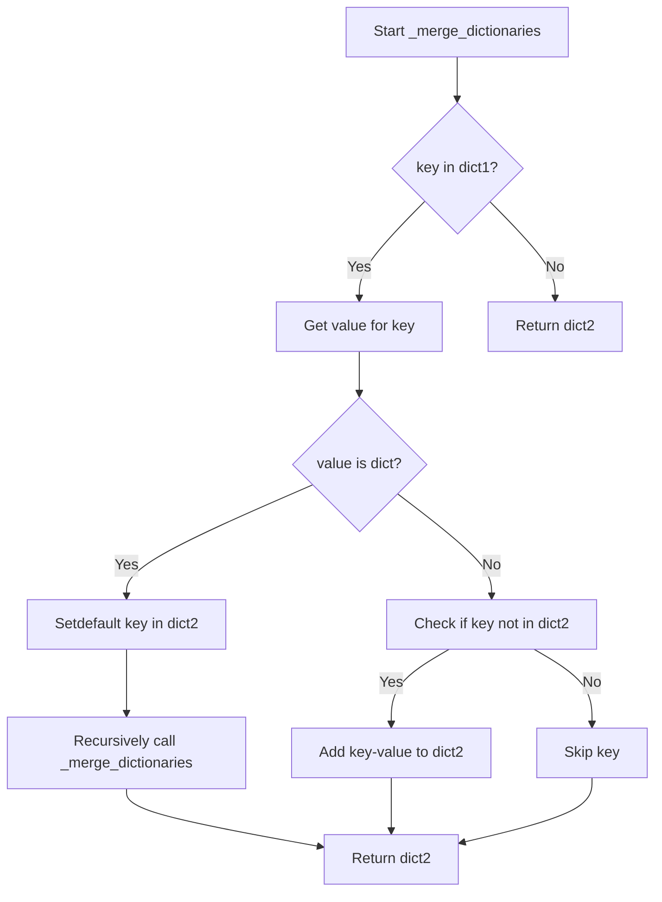

## Examples:
    # Basic usage
    dict1 = {'a': 1, 'b': 2}
    dict2 = {'c': 3}
    result = _merge_dictionaries(dict1, dict2)
    # Result: {'c': 3, 'a': 1, 'b': 2}
    
    # Nested dictionary usage
    dict1 = {'a': {'x': 1}, 'b': 2}
    dict2 = {'a': {'y': 2}}
    result = _merge_dictionaries(dict1, dict2)
    # Result: {'a': {'x': 1, 'y': 2}, 'b': 2}

## `src.ydata_profiling.config.Dataset` · *class*

## Summary:
Represents metadata configuration for a dataset, storing descriptive and attribution information.

## Description:
The Dataset class is a Pydantic-based configuration model that holds metadata about a dataset. It provides a structured way to store and validate dataset-related information such as description, creator, author, copyright details, and URL. This class is typically used as part of a larger profiling configuration to capture dataset context and provenance information.

## State:
- description: str - Dataset description or summary. Defaults to empty string.
- creator: str - Name of the entity or person who created the dataset. Defaults to empty string.
- author: str - Author or primary contributor to the dataset. Defaults to empty string.
- copyright_holder: str - Name of the copyright holder. Defaults to empty string.
- copyright_year: str - Year of copyright. Defaults to empty string.
- url: str - URL where the dataset can be accessed. Defaults to empty string.

All fields are string type with no validation constraints beyond being strings.

## Lifecycle:
- Creation: Instantiate with optional keyword arguments for any field values
- Usage: Access fields directly as attributes; Pydantic handles validation automatically
- Destruction: Managed by Python's garbage collection; no explicit cleanup required

## Method Map:
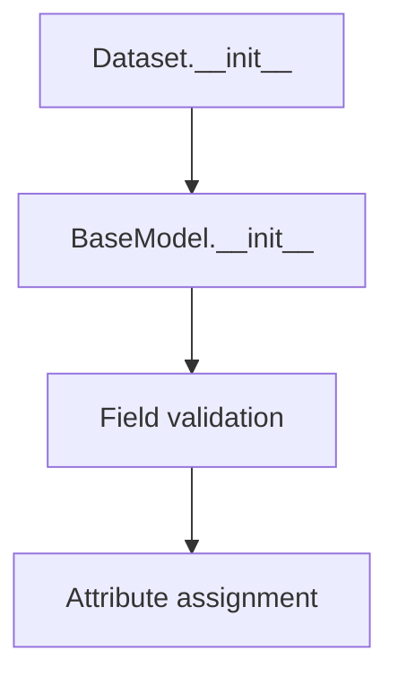

## Raises:
No exceptions are raised during initialization as all fields have default values and are simple string types.

## Example:
```python
# Create a dataset configuration
dataset_config = Dataset(
    description="Sales data for Q1 2023",
    creator="Data Science Team",
    author="John Doe",
    copyright_holder="Acme Corp",
    copyright_year="2023",
    url="https://example.com/datasets/sales-q1-2023"
)

# Access fields
print(dataset_config.description)  # "Sales data for Q1 2023"
print(dataset_config.creator)      # "Data Science Team"
```

## `src.ydata_profiling.config.NumVars` · *class*

## Summary:
Configuration class for numerical variable analysis settings in data profiling.

## Description:
The NumVars class defines configuration parameters used for analyzing numerical variables in data profiling. It specifies statistical thresholds and quantile values that control how numerical data is processed and reported during profiling operations. This class is typically instantiated by the profiling system to configure analysis behavior for numerical variables.

## State:
- quantiles: List[float] - Quantile levels to compute for numerical distributions. Default is [0.05, 0.25, 0.5, 0.75, 0.95]. Valid values are between 0 and 1.
- skewness_threshold: int - Threshold for determining when a distribution is considered skewed. Default is 20. Must be a positive integer.
- low_categorical_threshold: int - Threshold for treating numerical variables as categorical. Default is 5. Must be a positive integer.
- chi_squared_threshold: float - Threshold for chi-squared test in categorical analysis. Default is 0.999. Must be between 0 and 1.

All fields are immutable once set during initialization. The class enforces that quantiles are properly ordered and within valid ranges.

## Lifecycle:
- Creation: Instantiate with optional field overrides. All fields have sensible defaults.
- Usage: Used as a configuration object by profiling components. Fields are accessed read-only.
- Destruction: No special cleanup required; follows standard Python garbage collection.

## Method Map:
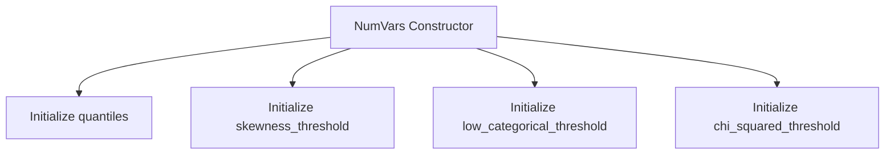

## Raises:
No exceptions are raised during normal instantiation. Pydantic validation may raise ValueError if invalid values are provided for fields that require specific constraints.

## Example:
```python
# Create default configuration
config = NumVars()

# Create custom configuration
custom_config = NumVars(
    quantiles=[0.1, 0.5, 0.9],
    skewness_threshold=15,
    low_categorical_threshold=3,
    chi_squared_threshold=0.99
)

# Access configuration values
print(config.quantiles)  # [0.05, 0.25, 0.5, 0.75, 0.95]
print(custom_config.skewness_threshold)  # 15
```

## `src.ydata_profiling.config.TextVars` · *class*

## Summary:
Configuration class for text variable analysis settings.

## Description:
TextVars is a Pydantic BaseModel that defines configurable options for text variable analysis. It controls which text statistics and transformations should be computed or applied when processing textual data in profiling reports. This class serves as a centralized configuration point for text-related operations, allowing users to enable or disable specific text analysis features.

## State:
- length: bool = True - Controls whether to compute text length statistics
- words: bool = True - Controls whether to compute word count statistics  
- characters: bool = True - Controls whether to compute character count statistics
- redact: bool = False - Controls whether to redact sensitive text data

All fields are boolean flags with default values that enable all text analysis features by default.

## Lifecycle:
- Creation: Instantiate with optional keyword arguments to override defaults
- Usage: Access field values directly as attributes
- Destruction: Managed automatically by Python's garbage collection

## Method Map:
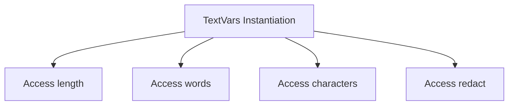

## Raises:
No exceptions are raised during instantiation as all fields have default values and are simple boolean types.

## Example:
```python
# Create default configuration
config = TextVars()

# Create custom configuration
custom_config = TextVars(
    length=False,
    redact=True
)

# Access configuration values
print(config.length)  # True
print(custom_config.redact)  # True
```

## `src.ydata_profiling.config.CatVars` · *class*

*No documentation generated.*

## `src.ydata_profiling.config.BoolVars` · *class*

## Summary:
Configuration class for boolean-related settings and string-to-boolean mappings used in data profiling.

## Description:
BoolVars is a Pydantic BaseModel subclass that defines configuration parameters for handling boolean values and string-to-boolean conversions in the ydata-profiling library. It provides default values for observation counts, imbalance thresholds, and common string representations of boolean values.

This class serves as a centralized configuration point for boolean-related operations throughout the profiling system, ensuring consistent handling of boolean data types and string representations across different components.

## State:
- n_obs: int = 3
  - Type: integer
  - Valid range: positive integers
  - Purpose: Number of observations for certain statistical calculations
  - Default value: 3

- imbalance_threshold: float = 0.5
  - Type: floating-point number
  - Valid range: 0.0 to 1.0
  - Purpose: Threshold for detecting class imbalance in categorical data
  - Default value: 0.5

- mappings: Dict[str, bool]
  - Type: dictionary mapping strings to booleans
  - Valid keys: "t", "f", "yes", "no", "y", "n", "true", "false"
  - Valid values: True or False
  - Purpose: String representations of boolean values for parsing
  - Default value: {"t": True, "f": False, "yes": True, "no": False, "y": True, "n": False, "true": True, "false": False}

## Lifecycle:
- Creation: Instantiate directly with optional field overrides or use defaults
- Usage: Access fields as attributes; typically used by profiling components that need boolean configuration
- Destruction: Managed automatically by Python's garbage collection; no explicit cleanup required

## Method Map:
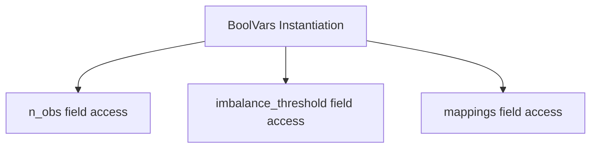

## Raises:
- No explicit exceptions raised during initialization as this is a Pydantic BaseModel with default values
- Validation errors may occur if invalid values are provided for fields (though defaults prevent this)

## Example:
```python
# Create instance with defaults
config = BoolVars()

# Access configuration values
print(config.n_obs)  # Output: 3
print(config.imbalance_threshold)  # Output: 0.5
print(config.mappings["true"])  # Output: True

# Create instance with custom values
custom_config = BoolVars(n_obs=5, imbalance_threshold=0.7)
```

## `src.ydata_profiling.config.FileVars` · *class*

## Summary:
Represents file variable configuration settings with an active flag.

## Description:
The FileVars class is a Pydantic BaseModel designed to manage configuration variables related to file processing. It provides a simple boolean flag to indicate whether file-related operations should be active. This class serves as a configuration container that can be easily serialized and validated.

## State:
- active: bool
  - Type: boolean
  - Default value: False
  - Valid values: True or False
  - Purpose: Controls whether file processing operations are enabled

## Lifecycle:
- Creation: Instantiate with optional 'active' parameter (defaults to False)
- Usage: Access the 'active' attribute to check if file operations should be performed
- Destruction: Managed automatically by Python's garbage collection

## Method Map:
```mermaid
graph TD
    A[FileVars.__init__] --> B[active = False]
    B --> C[FileVars.__repr__]
    C --> D[FileVars.dict()]
    D --> E[FileVars.json()]
```

## Raises:
- No exceptions are raised during initialization as this is a simple Pydantic model with a basic field

## Example:
```python
# Create a FileVars instance with default settings
file_vars = FileVars()

# Check if file operations are active
if file_vars.active:
    # Perform file processing
    pass

# Create a FileVars instance with active flag set to True
file_vars_active = FileVars(active=True)
```

## `src.ydata_profiling.config.PathVars` · *class*

## Summary:
Represents configuration variables for path-related functionality with an activation flag.

## Description:
A Pydantic BaseModel subclass used to manage configuration settings related to path handling. The class provides a simple boolean flag to indicate whether path-related operations should be active or inactive. This configuration class is likely part of a larger configuration system for profiling tools.

## State:
- active: bool, default=False
  - Controls whether path-related functionality is enabled
  - Valid values: True or False
  - Invariant: This is a simple boolean flag with no additional constraints

## Lifecycle:
- Creation: Instantiate with optional 'active' parameter (defaults to False)
- Usage: Access the 'active' attribute to check configuration state
- Destruction: Managed automatically by Python's garbage collection

## Method Map:
```mermaid
graph TD
    A[PathVars.__init__] --> B[BaseModel.__init__]
    B --> C[Field validation]
    C --> D[active = False (default)]
```

## Raises:
- No explicit exceptions raised by __init__
- Pydantic validation errors may occur if invalid values are provided for fields (though 'active' is a simple boolean)

## Example:
```python
# Create instance with default settings
config = PathVars()

# Create instance with custom settings
config = PathVars(active=True)

# Check configuration
if config.active:
    # Enable path-related functionality
    pass
```

## `src.ydata_profiling.config.ImageVars` · *class*

## Summary:
Represents configuration settings for image variable processing in data profiling.

## Description:
The ImageVars class defines a configuration model for controlling various aspects of image data processing during profiling. It specifies whether image analysis should be active, whether EXIF metadata should be extracted, and whether image hashing should be performed. This class is designed to be used as a configuration object within the ydata-profiling framework to control image-related features.

## State:
- active: bool, default=False - Controls whether image processing is enabled
- exif: bool, default=True - Controls whether EXIF metadata extraction is performed
- hash: bool, default=True - Controls whether image hashing is computed

All fields are boolean flags that determine the behavior of image processing operations. The class maintains these values as instance attributes with no additional invariants.

## Lifecycle:
- Creation: Instantiate with optional keyword arguments for field values
- Usage: Access field values directly as attributes
- Destruction: Managed automatically by Python's garbage collection

## Method Map:
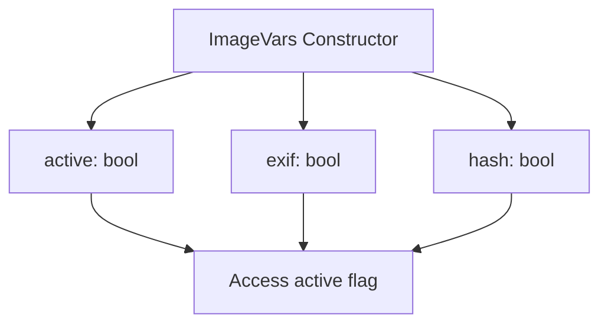

## Raises:
No exceptions are raised during instantiation as this is a simple Pydantic model with default values for all fields.

## Example:
```python
# Create with default values
config = ImageVars()

# Create with custom values
config = ImageVars(active=True, exif=False, hash=True)

# Access values
print(config.active)  # False
print(config.exif)    # True
print(config.hash)    # True
```

## `src.ydata_profiling.config.UrlVars` · *class*

## Summary:
Represents URL variable configuration settings for profiling functionality.

## Description:
The UrlVars class encapsulates configuration options related to URL handling in the profiling system. It serves as a structured data container for managing URL-related boolean flags, specifically tracking whether URL processing is active. This class is designed to be used as part of a larger configuration system and follows Pydantic's data validation patterns.

## State:
- active: bool
  - Type: boolean
  - Default value: False
  - Valid values: True or False
  - Purpose: Controls whether URL processing features are enabled in the profiling workflow

## Lifecycle:
- Creation: Instantiate directly with optional 'active' parameter (e.g., UrlVars(active=True))
- Usage: Access the 'active' attribute to determine URL processing status
- Destruction: Managed automatically by Python's garbage collection

## Method Map:
```mermaid
graph TD
    A[UrlVars.__init__] --> B[active attribute set]
    B --> C[UrlVars.__repr__]
    C --> D[UrlVars.dict()]
```

## Raises:
- No exceptions are raised during initialization as this is a simple Pydantic model with a default value

## Example:
```python
# Create instance with default settings
url_config = UrlVars()

# Check if URL processing is active
if url_config.active:
    print("URL processing is enabled")
else:
    print("URL processing is disabled")

# Create instance with active setting
url_config_active = UrlVars(active=True)
```

## `src.ydata_profiling.config.TimeseriesVars` · *class*

## Summary:
Configures settings for time series variable analysis in data profiling.

## Description:
The TimeseriesVars class defines configuration parameters for time series analysis operations within the ydata-profiling library. It specifies which time series variables should be analyzed, how they should be sorted, and various statistical parameters for autocorrelation, lag analysis, and significance testing.

This class is typically instantiated by the profiling configuration system when time series analysis is enabled. It serves as a centralized configuration object that encapsulates all time series-related parameters needed for analysis.

## State:
- active: bool, default=False - Enables or disables time series analysis
- sortby: Optional[str], default=None - Column name to sort time series data by
- autocorrelation: float, default=0.7 - Threshold for autocorrelation analysis
- lags: List[int], default=[1, 7, 12, 24, 30] - Time lags to analyze for autocorrelation
- significance: float, default=0.05 - Significance level for statistical tests
- pacf_acf_lag: int, default=100 - Maximum lag for partial autocorrelation and autocorrelation functions

## Lifecycle:
Creation: Instantiate with optional keyword arguments to override defaults
Usage: Used as part of a larger configuration object during data profiling
Destruction: Managed automatically by Python's garbage collection

## Method Map:
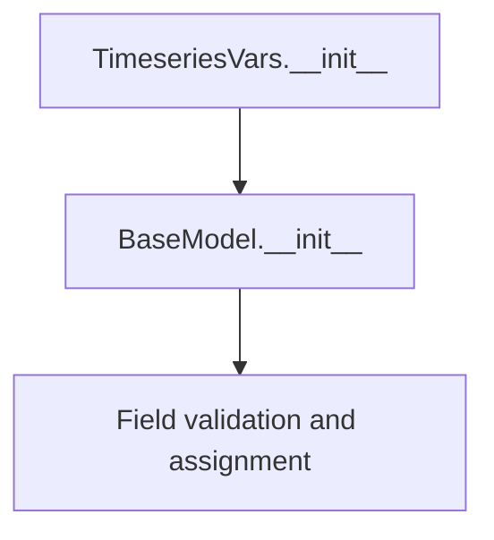

## Raises:
No explicit exceptions are raised by __init__ as this is a Pydantic BaseModel with default values for all fields.

## Example:
```python
# Create default configuration
config = TimeseriesVars()

# Create custom configuration
custom_config = TimeseriesVars(
    active=True,
    sortby="date_column",
    autocorrelation=0.8,
    lags=[1, 2, 3, 7, 14],
    significance=0.01
)
```

## `src.ydata_profiling.config.Univariate` · *class*

## Summary:
Configuration class that groups various variable type analysis settings for data profiling.

## Description:
The Univariate class serves as a central configuration container that aggregates settings for different variable types used in data profiling. It provides a structured way to define and manage analysis parameters for numerical, text, categorical, image, boolean, path, file, URL, and time series variables. This class is typically instantiated by the profiling system to configure analysis behavior across all supported variable types.

## State:
- num: NumVars - Configuration for numerical variable analysis. Default is a new NumVars() instance.
- text: TextVars - Configuration for text variable analysis. Default is a new TextVars() instance.
- cat: CatVars - Configuration for categorical variable analysis. Default is a new CatVars() instance.
- image: ImageVars - Configuration for image variable analysis. Default is a new ImageVars() instance.
- bool: BoolVars - Configuration for boolean variable analysis. Default is a new BoolVars() instance.
- path: PathVars - Configuration for path variable analysis. Default is a new PathVars() instance.
- file: FileVars - Configuration for file variable analysis. Default is a new FileVars() instance.
- url: UrlVars - Configuration for URL variable analysis. Default is a new UrlVars() instance.
- timeseries: TimeseriesVars - Configuration for time series variable analysis. Default is a new TimeseriesVars() instance.

All fields are immutable once set during initialization and represent separate configuration objects for different variable types.

## Lifecycle:
- Creation: Instantiate directly with optional keyword arguments to override defaults for specific variable type configurations
- Usage: Access individual configuration objects via their respective attributes (num, text, cat, etc.) to configure analysis for different variable types
- Destruction: Managed automatically by Python's garbage collection

## Method Map:
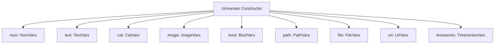

## Raises:
No exceptions are raised during normal instantiation as this is a Pydantic BaseModel with default values for all fields.

## Example:
```python
# Create default univariate configuration
config = Univariate()

# Create custom univariate configuration with specific settings
custom_config = Univariate(
    num=NumVars(quantiles=[0.1, 0.5, 0.9]),
    text=TextVars(length=False),
    image=ImageVars(active=True)
)

# Access individual variable type configurations
print(config.num.quantiles)  # [0.05, 0.25, 0.5, 0.75, 0.95]
print(custom_config.image.active)  # True
```

## `src.ydata_profiling.config.MissingPlot` · *class*

## Summary:
Configuration class for missing data plot settings in ydata-profiling.

## Description:
The MissingPlot class defines configuration parameters for visualizing missing data patterns in datasets. It serves as a structured container for plot-related settings that control how missing data is displayed in visualizations. This class is typically used internally by the profiling system to maintain consistent visualization parameters for missing data representations.

## State:
- force_labels: bool, default=True
  - Controls whether axis labels should be forcibly displayed on missing data plots
  - Valid values: True or False
  - When True, ensures labels appear even in compact visualizations
- cmap: str, default="RdBu"
  - Specifies the matplotlib colormap used for missing data visualizations
  - Valid values: String representing a matplotlib colormap name
  - Default "RdBu" provides a diverging color scheme suitable for missing vs present data

## Lifecycle:
- Creation: Instantiate directly with optional keyword arguments for force_labels and cmap
- Usage: Typically accessed as part of a larger configuration object or passed to plotting functions
- Destruction: Managed automatically by Python's garbage collection; no explicit cleanup required

## Method Map:
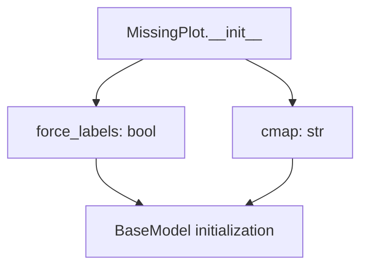

## Raises:
- No explicit exceptions raised during instantiation
- Pydantic validation may raise ValueError for invalid input types (though defaults prevent most issues)

## Example:
```python
# Create default configuration
config = MissingPlot()

# Create custom configuration
custom_config = MissingPlot(force_labels=False, cmap="viridis")

# Access configuration values
print(config.force_labels)  # True
print(config.cmap)          # "RdBu"
```

## `src.ydata_profiling.config.ImageType` · *class*

## Summary:
Represents supported image formats for profile reports in the ydata-profiling library.

## Description:
The ImageType enum defines the valid image formats that can be used when generating profile reports. It serves as a type-safe way to specify whether SVG or PNG images should be produced, ensuring consistency and preventing invalid format specifications throughout the profiling system.

This class is used internally by the profiling framework to control report generation output formats and is typically instantiated by the system rather than directly by users.

## State:
- svg: str value "svg" representing Scalable Vector Graphics format
- png: str value "png" representing Portable Network Graphics format

The enum values are immutable and represent the only valid image formats supported by the system.

## Lifecycle:
- Creation: Instantiated automatically as part of the enum definition; no explicit instantiation required by users
- Usage: Used as a type hint or value constraint in configuration objects and report generation methods
- Destruction: Managed automatically by Python's garbage collection

## Method Map:
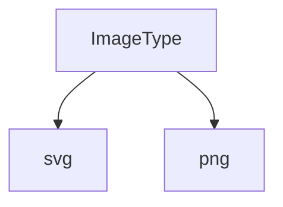

## Raises:
No exceptions are raised during initialization as this is a simple enum class.

## Example:
```python
from src.ydata_profiling.config import ImageType

# Using the enum values
format_svg = ImageType.svg  # Returns the svg enum member
format_png = ImageType.png  # Returns the png enum member

# Checking values
print(format_svg.value)  # Outputs: "svg"
print(format_png.value)  # Outputs: "png"

# Type checking in configuration
config = {"image_format": ImageType.png}
```

## `src.ydata_profiling.config.CorrelationPlot` · *class*

## Summary:
Configuration class for correlation plot visualization settings, defining color mapping parameters for correlation heatmaps.

## Description:
The CorrelationPlot class is a Pydantic BaseModel that encapsulates configuration parameters for correlation plot visualizations. It defines color scheme settings used when rendering correlation matrices, particularly for heatmap visualizations. This class is typically used as part of a larger configuration system to customize the appearance of correlation plots in data profiling reports.

## State:
- cmap: str, default="RdBu" - Color map name for the correlation plot. This determines the color scheme used to represent correlation values in the heatmap.
- bad: str, default="#000000" - Color for invalid or missing correlation values. This specifies the hex color code used to display cells with undefined or problematic correlation data.

## Lifecycle:
- Creation: Instantiate with optional custom color values or use defaults
- Usage: Typically passed as part of a configuration object to visualization functions or stored as part of a larger profile configuration
- Destruction: Managed automatically by Python's garbage collection; no explicit cleanup required

## Method Map:


## Raises:
- ValidationError: May be raised during instantiation if provided values don't meet Pydantic validation requirements (though none are specified in the current implementation)

## Example:
```python
# Create with default settings
config = CorrelationPlot()

# Create with custom settings
custom_config = CorrelationPlot(cmap="Blues", bad="#FF0000")

# Access configuration values
print(config.cmap)  # Output: "RdBu"
print(config.bad)   # Output: "#000000"
```

## `src.ydata_profiling.config.Histogram` · *class*

## Summary:
Configuration class for histogram visualization settings in data profiling.

## Description:
The Histogram class defines a set of configurable parameters for generating histograms in data profiling reports. It serves as a structured configuration object that controls various aspects of histogram rendering such as bin count, axis labels, and density calculations. This class is typically instantiated by the profiling system when configuring visualization settings for numerical variables.

## State:
- bins: int = 50
  - Type: int
  - Valid range: positive integers (typically 1-1000+)
  - Purpose: Number of bins to use in the histogram
- max_bins: int = 250
  - Type: int
  - Valid range: positive integers (typically 1-1000+)
  - Purpose: Maximum number of bins allowed for automatic bin selection
- x_axis_labels: bool = True
  - Type: bool
  - Valid values: True or False
  - Purpose: Whether to display x-axis labels on the histogram
- density: bool = False
  - Type: bool
  - Valid values: True or False
  - Purpose: Whether to normalize the histogram to show probability density instead of counts

## Lifecycle:
- Creation: Instantiate directly with optional keyword arguments for field values
- Usage: Used as a configuration object passed to histogram generation functions
- Destruction: No special cleanup required; follows standard Python garbage collection

## Method Map:
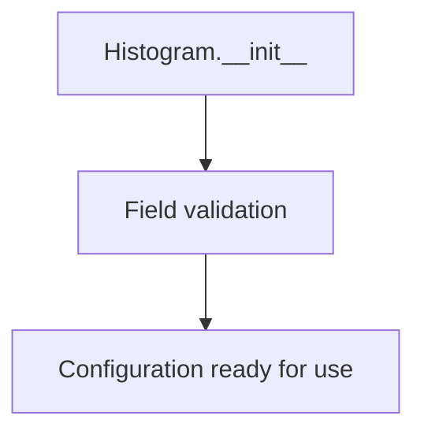

## Raises:
- ValidationError: May be raised by Pydantic during initialization if invalid values are provided for fields (though defaults prevent most validation errors)

## Example:
```python
from src.ydata_profiling.config import Histogram

# Create default histogram configuration
hist_config = Histogram()

# Create custom histogram configuration
custom_hist = Histogram(bins=100, x_axis_labels=False, density=True)
```

## `src.ydata_profiling.config.CatFrequencyPlot` · *class*

## Summary:
Configuration class for category frequency plot settings in data profiling.

## Description:
CatFrequencyPlot is a Pydantic BaseModel that defines configuration parameters for rendering category frequency plots in data profiling reports. It controls whether the plot is displayed, what type of visualization to use, the maximum number of unique categories to show, and optional color customization.

This class serves as a distinct abstraction for plot configuration, separating the concerns of visualization settings from the core data profiling logic. It ensures consistent configuration handling across different profiling contexts.

## State:
- show: bool, default=True - Controls whether the category frequency plot is displayed. When False, the plot is disabled.
- type: str, default="bar" - Specifies the plot type. Valid values are "bar" or "pie".
- max_unique: int, default=10 - Maximum number of unique categories to display in the plot.
- colors: Optional[List[str]], default=None - Optional list of color strings for customizing plot appearance. When None, default colors are used.

## Lifecycle:
- Creation: Instantiate with optional keyword arguments for any of the configurable attributes
- Usage: Access attributes directly for configuration purposes
- Destruction: Managed automatically by Python's garbage collection

## Method Map:
```mermaid
graph TD
    A[CatFrequencyPlot.__init__] --> B[show: bool]
    A --> C[type: str]
    A --> D[max_unique: int]
    A --> E[colors: Optional[List[str]]]
```

## Raises:
- ValidationError: Raised by Pydantic if invalid values are provided for any field during instantiation

## Example:
```python
# Create default configuration
config = CatFrequencyPlot()

# Create with custom settings
custom_config = CatFrequencyPlot(
    show=True,
    type="pie",
    max_unique=15,
    colors=["#FF0000", "#00FF00", "#0000FF"]
)

# Access configuration values
print(config.show)  # True
print(config.type)  # "bar"
```

## `src.ydata_profiling.config.Plot` · *class*

## Summary:
Configuration class for the entire ydata-profiling system, managing global settings and parameters for data profiling operations.

## Description:
The Settings class is a Pydantic BaseSettings class that serves as the central configuration container for the ydata-profiling library. It aggregates various configuration parameters that control the behavior of the profiling system, including parallel processing options, visualization settings, report formatting, and feature-specific configurations. This class provides a unified interface for configuring all aspects of the profiling process.

The class is designed to be instantiated by the profiling system and typically used as the main configuration object passed through the profiling pipeline. It acts as a distinct abstraction that separates configuration management from core profiling logic, ensuring consistent and maintainable configuration handling across different profiling contexts.

## State:
- pool_size: int, default=0
  - Type: int
  - Valid range: non-negative integers
  - Purpose: Number of processes to use for parallel execution (0 means use all available cores)
  - Invariant: Must be a non-negative integer

- parallelism: str, default="process"
  - Type: str
  - Valid values: "process", "thread", "none"
  - Purpose: Specifies the parallelism strategy to use for computation
  - Invariant: Must be one of the valid parallelism strategies

- image_format: ImageType, default=ImageType.svg
  - Type: ImageType (enum)
  - Valid values: ImageType.svg or ImageType.png
  - Purpose: Specifies the output format for generated plots
  - Invariant: Always one of the valid ImageType enum values

- plot: Plot, default=Plot()
  - Type: Plot
  - Purpose: Configuration for all plot-related settings
  - Invariant: Always a valid Plot instance

- title: str, default="Profile Report"
  - Type: str
  - Purpose: Title to use for the generated profile report
  - Invariant: Must be a string

- explorative: bool, default=True
  - Type: bool
  - Valid values: True or False
  - Purpose: Whether to enable explorative analysis features
  - Invariant: Must be a boolean value

- warn_filesize: float, default=100.0
  - Type: float
  - Valid range: positive numbers
  - Purpose: File size threshold (in MB) to warn about large files
  - Invariant: Must be a positive number

- minimal: bool, default=False
  - Type: bool
  - Valid values: True or False
  - Purpose: Whether to generate a minimal profile report with fewer visualizations
  - Invariant: Must be a boolean value

- dark_mode: bool, default=False
  - Type: bool
  - Valid values: True or False
  - Purpose: Whether to enable dark mode for HTML reports
  - Invariant: Must be a boolean value

- pool: Optional[Pool], default=None
  - Type: Optional[Pool]
  - Purpose: Explicit process pool to use for parallel execution
  - Invariant: Either None or a valid multiprocessing Pool instance

- All other attributes: Various optional dictionary configurations for different profiling features
  - These include configurations for variables, correlations, histograms, scatter plots, categorical analysis, and many other profiling aspects
  - All are optional dictionaries that allow fine-grained control over specific profiling components
  - They follow a pattern of being None by default and can be populated with configuration dictionaries

## Lifecycle:
- Creation: Instantiate directly with optional keyword arguments for any of the configurable attributes
- Usage: Access attributes directly for configuration purposes; typically used by the profiling system to control the entire profiling workflow
- Destruction: Managed automatically by Python's garbage collection; no explicit cleanup required

## Method Map:
```mermaid
graph TD
    A[Settings.__init__] --> B[pool_size: int]
    A --> C[parallelism: str]
    A --> D[image_format: ImageType]
    A --> E[plot: Plot]
    A --> F[title: str]
    A --> G[explorative: bool]
    A --> H[warn_filesize: float]
    A --> I[minimal: bool]
    A --> J[dark_mode: bool]
    A --> K[pool: Optional[Pool]]
    A --> L[Other configuration dictionaries]
```

## Raises:
- ValidationError: May be raised by Pydantic during instantiation if invalid values are provided for any field (though defaults prevent most validation errors)

## Example:
```python
from src.ydata_profiling.config import Settings

# Create default settings configuration
settings = Settings()

# Create with custom settings
custom_settings = Settings(
    title="Custom Data Profile",
    explorative=False,
    warn_filesize=50.0,
    dark_mode=True
)

# Access configuration values
print(settings.title)  # "Profile Report"
print(settings.explorative)  # True
print(settings.warn_filesize)  # 100.0
```

## `src.ydata_profiling.config.Theme` · *class*

## Summary:
Defines UI themes for the ydata profiling report interface.

## Description:
The Theme enum provides a set of predefined UI themes that can be applied to the profiling report interface. This abstraction ensures consistent theme selection throughout the application and prevents invalid theme values from being used.

## State:
- united (str): The "united" theme identifier
- flatly (str): The "flatly" theme identifier  
- cosmo (str): The "cosmo" theme identifier
- simplex (str): The "simplex" theme identifier

All enum values are string representations of theme names that correspond to CSS themes used in the web interface.

## Lifecycle:
- Creation: Instantiated automatically when imported or referenced
- Usage: Used as a type-safe enumeration when configuring report appearance
- Destruction: Managed automatically by Python's garbage collection

## Method Map:
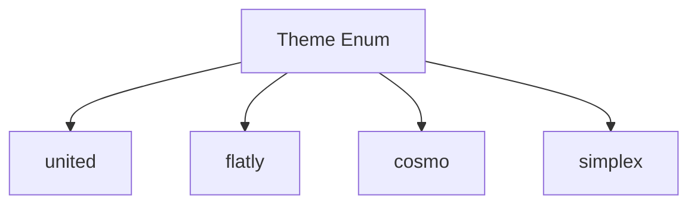

## Raises:
No exceptions are raised during initialization as this is a simple enum definition.

## Example:
```python
from src.ydata_profiling.config import Theme

# Using the theme enum
theme = Theme.united
print(theme.value)  # Output: "united"

# Valid theme usage
valid_themes = [Theme.united, Theme.flatly, Theme.cosmo, Theme.simplex]
```

## `src.ydata_profiling.config.Style` · *class*

## Summary:
Represents styling configuration for report generation, managing visual elements like colors, logo, and themes.

## Description:
The Style class encapsulates visual styling parameters for generating reports or dashboards. It provides a structured way to configure color schemes, logos, and themes while maintaining compatibility with Pydantic's validation features. This class is typically used by the profiling system to customize the appearance of generated reports.

## State:
- primary_colors: List[str], default=["#377eb8", "#e41a1c", "#4daf4a"]
  - Valid values: List of CSS color codes
  - Invariant: Must be a list of strings representing valid CSS colors
- logo: str, default=""
  - Valid values: Empty string or valid URL/path to logo image
  - Invariant: Should represent a valid logo resource location
- theme: Optional[Theme], default=None
  - Valid values: Instance of Theme enum or None
  - Invariant: When set, must be a valid Theme enum value
- _labels: List[str], private attribute, default=["_"]
  - Valid values: List of strings
  - Invariant: Private attribute managed internally by Pydantic

## Lifecycle:
- Creation: Instantiate with optional parameters or use defaults
- Usage: Access properties like primary_color or modify fields as needed
- Destruction: Managed automatically by Python garbage collection

## Method Map:
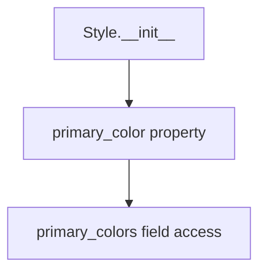

## Raises:
- No explicit exceptions raised by __init__
- Validation errors may occur during instantiation if invalid values are provided for fields

## Example:
```python
from src.ydata_profiling.config import Style

# Create default style
style = Style()

# Access primary color
color = style.primary_color  # Returns "#377eb8"

# Create style with custom settings
custom_style = Style(
    primary_colors=["#ff0000", "#00ff00"],
    logo="https://example.com/logo.png"
)
```

### `src.ydata_profiling.config.Style.primary_color` · *method*

## Summary:
Returns the primary color from the style configuration's color palette.

## Description:
This property provides access to the first color in the primary color palette defined for the style configuration. It serves as a convenient way to retrieve the main brand or accent color without having to manually index into the color list.

## Args:
    None

## Returns:
    str: The first color string from the primary_colors list, typically representing the main brand or accent color.

## Raises:
    IndexError: If primary_colors list is empty, though this is prevented by the default initialization.

## State Changes:
    Attributes READ: self.primary_colors
    Attributes WRITTEN: None

## Constraints:
    Preconditions: The primary_colors attribute must be initialized as a list with at least one element.
    Postconditions: Returns a string representing a color in hex format.

## Side Effects:
    None

## `src.ydata_profiling.config.Html` · *class*

## Summary:
Configuration class for HTML report generation settings, controlling presentation and asset handling options.

## Description:
The Html class manages configuration parameters for generating HTML reports in the ydata-profiling library. It defines various settings related to HTML formatting, asset management, and display options that control how generated reports appear in web browsers. This class is typically used internally by the profiling system to customize the appearance and behavior of HTML output.

## State:
- style: Style, default=Style()
  - Type: Style object
  - Valid values: Instance of Style class
  - Invariant: Must be a valid Style instance with proper color schemes and themes
- navbar_show: bool, default=True
  - Type: boolean
  - Valid values: True or False
  - Invariant: Controls visibility of navigation bar in generated reports
- minify_html: bool, default=True
  - Type: boolean
  - Valid values: True or False
  - Invariant: Controls whether generated HTML is minified for smaller file size
- use_local_assets: bool, default=True
  - Type: boolean
  - Valid values: True or False
  - Invariant: Controls whether to use local or CDN assets for styling
- inline: bool, default=True
  - Type: boolean
  - Valid values: True or False
  - Invariant: Controls whether CSS/JS is embedded inline or loaded separately
- assets_prefix: Optional[str], default=None
  - Type: string or None
  - Valid values: String prefix for asset paths or None
  - Invariant: When set, must be a valid string prefix for asset resolution
- assets_path: Optional[str], default=None
  - Type: string or None
  - Valid values: String path for assets or None
  - Invariant: When set, must be a valid string path for asset loading
- full_width: bool, default=False
  - Type: boolean
  - Valid values: True or False
  - Invariant: Controls whether report spans full browser width

## Lifecycle:
- Creation: Instantiate with optional parameters or use defaults via Pydantic's automatic validation
- Usage: Access configuration properties to control HTML report generation behavior
- Destruction: Managed automatically by Python garbage collection

## Method Map:
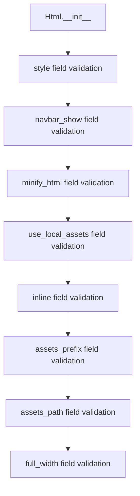

## Raises:
- ValidationError: May be raised during instantiation if invalid values are provided for fields
- All validation errors from Pydantic's BaseModel validation process

## Example:
```python
from src.ydata_profiling.config import Html

# Create default HTML configuration
html_config = Html()

# Create HTML configuration with custom settings
custom_html_config = Html(
    navbar_show=False,
    minify_html=False,
    full_width=True
)

# Access configuration properties
print(html_config.navbar_show)  # True
print(custom_html_config.full_width)  # True
```

## `src.ydata_profiling.config.Duplicates` · *class*

## Summary:
Configuration class for duplicate data handling settings in profiling reports.

## Description:
The Duplicates class defines configuration parameters for managing duplicate data detection and visualization in profiling reports. It specifies how many duplicate records to display and what key to use for identifying duplicates in the report output.

This class serves as a dedicated configuration abstraction for duplicate-related settings, separating these concerns from other profiling configurations and providing a consistent interface for specifying duplicate handling behavior.

## State:
- head: int, default value 10
  - Represents the maximum number of duplicate records to display in reports
  - Valid range: positive integers (typically 0 or greater)
  - Invariant: Must be a non-negative integer
- key: str, default value "# duplicates"
  - Represents the identifier/key used to label duplicate data sections in reports
  - Valid values: any string value
  - Invariant: Must be a string type

## Lifecycle:
- Creation: Instantiate with optional head and key parameters
- Usage: Used as part of a larger configuration object to control duplicate reporting behavior
- Destruction: Managed automatically by Python's garbage collection

## Method Map:
```mermaid
graph TD
    A[Create Duplicates Config] --> B[Use in Profiling]
    B --> C[Generate Report with Duplicates]
```

## Raises:
- ValidationError: Raised by Pydantic if invalid values are provided during instantiation (e.g., non-integral head values)

## Example:
```python
# Create default duplicates configuration
config = Duplicates()

# Create custom duplicates configuration
custom_config = Duplicates(head=5, key="# duplicate_records")

# Use in a larger profiling configuration context
from ydata_profiling import ProfileConfig
profile_config = ProfileConfig(duplicates=custom_config)
```

## `src.ydata_profiling.config.Correlation` · *class*

## Summary:
Configuration class for correlation analysis settings in data profiling.

## Description:
The Correlation class defines configuration parameters for correlation analysis operations within the ydata-profiling library. This class controls various aspects of how correlation matrices are calculated, displayed, and reported during data profiling. It serves as a structured way to configure correlation-related behaviors such as enabling/disabling calculations, setting thresholds, and controlling warning levels.

## State:
- key: str, default="", identifier/name for this correlation configuration
- calculate: bool, default=True, enables/disables correlation calculation
- warn_high_correlations: int, default=10, threshold for issuing warnings about high correlations
- threshold: float, default=0.5, correlation threshold value for filtering results
- n_bins: int, default=10, number of bins to use for correlation calculations

## Lifecycle:
- Creation: Instantiate with optional parameters to customize correlation behavior
- Usage: Typically used as part of a larger configuration object passed to profiling functions
- Destruction: No special cleanup required as it's a simple data container

## Method Map:
```mermaid
graph TD
    A[Correlation Config] --> B{calculate}
    A --> C{warn_high_correlations}
    A --> D{threshold}
    A --> E{n_bins}
    B --> F[Correlation Calculation]
    C --> G[Warning System]
    D --> H[Filtering Logic]
    E --> I[Binning Strategy]
```

## Raises:
- No explicit exceptions raised during initialization
- Validation errors may occur if invalid values are provided to Pydantic fields

## Example:
```python
# Create default correlation configuration
config = Correlation()

# Create custom correlation configuration
custom_config = Correlation(
    key="my_correlation",
    calculate=True,
    warn_high_correlations=15,
    threshold=0.7,
    n_bins=20
)
```

## `src.ydata_profiling.config.Correlations` · *class*

## Summary:
Configuration class for managing different correlation analysis methods in data profiling.

## Description:
The Correlations class provides a structured way to configure and manage multiple correlation analysis methods (Pearson, Spearman, and Auto) within the ydata-profiling library. This class serves as a container for different correlation configurations, allowing users to enable/disable specific correlation calculations and set appropriate parameters for each method.

This class is typically used as part of the broader Settings configuration object and is instantiated automatically when creating a profiling configuration. It's designed to provide a clean interface for configuring correlation analysis without requiring direct manipulation of individual Correlation objects.

## State:
- pearson: Correlation, default=Correlation(key="pearson"), configuration for Pearson correlation analysis
- spearman: Correlation, default=Correlation(key="spearman"), configuration for Spearman rank correlation analysis  
- auto: Correlation, default=Correlation(key="auto"), configuration for automatic correlation selection

All Correlation objects are initialized with specific keys to identify their respective correlation methods. These configurations control various aspects of correlation calculations such as enabling/disabling calculations, setting thresholds, and controlling warning levels.

## Lifecycle:
- Creation: Automatically instantiated as part of the Settings configuration object. Users typically don't create Correlations instances directly.
- Usage: Accessed through the Settings object's correlations attribute to configure correlation analysis behavior.
- Destruction: No special cleanup required as it's a simple Pydantic BaseModel container.

## Method Map:
```mermaid
graph TD
    A[Correlations Config] --> B[pearson Correlation]
    A --> C[spearman Correlation]
    A --> D[auto Correlation]
    B --> E[Correlation Calculation]
    C --> E
    D --> E
```

## Raises:
- No explicit exceptions raised during initialization
- Validation errors may occur if invalid values are provided to Pydantic fields when the configuration is processed

## Example:
```python
# Accessing correlations configuration from Settings
from ydata_profiling import Settings

# Default correlations configuration
settings = Settings()
correlations_config = settings.correlations

# The correlations_config contains:
# - pearson: Correlation(key="pearson")
# - spearman: Correlation(key="spearman") 
# - auto: Correlation(key="auto")

# Individual correlation configurations can be accessed like:
pearson_config = correlations_config.pearson
spearman_config = correlations_config.spearman
auto_config = correlations_config.auto
```

## `src.ydata_profiling.config.Interactions` · *class*

## Summary:
Configuration class for defining interaction settings in data profiling, controlling whether continuous variable interactions are computed and specifying target variables for analysis.

## Description:
The Interactions class serves as a configuration container that defines how interaction terms should be handled during data profiling. It determines whether to compute interactions between continuous variables and specifies which variables should be treated as targets in the analysis. This class is typically used as part of a larger configuration object for statistical profiling operations.

## State:
- continuous: bool, default=True
  - Controls whether interactions between continuous variables should be computed
  - When True, continuous variable interactions are calculated
  - When False, continuous variable interactions are skipped
- targets: List[str], default=[]
  - Specifies the list of variable names to be treated as target variables
  - Empty list indicates no specific targets are defined
  - Target variables are typically those being predicted or analyzed against other variables

## Lifecycle:
- Creation: Instantiate with optional parameters for continuous and targets
- Usage: Typically accessed as part of a configuration object during profiling operations
- Destruction: Managed automatically by Python's garbage collection

## Method Map:
```mermaid
graph TD
    A[Interactions.__init__] --> B[BaseModel.__init__]
    B --> C[Validate continuous field]
    C --> D[Validate targets field]
    D --> E[Return configured instance]
```

## Raises:
- ValidationError: If the continuous field is not a boolean or targets field is not a list of strings (inherited from BaseModel validation)

## Example:
```python
# Create default configuration (continuous=True, targets=[])
interactions = Interactions()

# Create custom configuration
interactions = Interactions(continuous=False, targets=['target_col1', 'target_col2'])

# Access configuration values
print(interactions.continuous)  # True
print(interactions.targets)     # []
```

## `src.ydata_profiling.config.Samples` · *class*

## Summary:
Configuration class for specifying sample data points to include in reports.

## Description:
The Samples class defines how many sample rows to display from the beginning (head), end (tail), and randomly selected (random) portions of a dataset in profiling reports.

## State:
- head: int, default=10, number of rows to show from the beginning of the dataset
- tail: int, default=10, number of rows to show from the end of the dataset  
- random: int, default=0, number of random rows to show from the dataset

## Lifecycle:
- Creation: Instantiate with optional parameters for head, tail, and random counts
- Usage: Used as a configuration object to control sample data display in profiling reports
- Destruction: No special cleanup required, uses standard Pydantic model lifecycle

## Method Map:
```mermaid
graph TD
    A[Samples Constructor] --> B[head=10, tail=10, random=0]
    B --> C[Configuration Object Ready]
```

## Raises:
- No exceptions raised during initialization

## Example:
```python
# Create default samples configuration
samples = Samples()

# Create custom samples configuration
samples = Samples(head=5, tail=5, random=3)

# Access values
print(samples.head)   # Output: 5
print(samples.tail)   # Output: 5
print(samples.random) # Output: 3
```

## `src.ydata_profiling.config.Variables` · *class*

## Summary:
Configuration class for managing variable descriptions in data profiling.

## Description:
The Variables class is a Pydantic BaseModel subclass used to store and manage metadata about variables (columns) in datasets being profiled. It provides a structured way to associate descriptive information with dataset variables through a dictionary-based interface. This class is part of the ydata-profiling configuration system and is typically instantiated with variable description mappings.

## State:
- descriptions: dict
  - Type: dict
  - Default value: {}
  - Purpose: Stores key-value pairs mapping variable names to their descriptions
  - Valid range: Any dictionary with string keys and arbitrary values

## Lifecycle:
- Creation: Instantiated as a Pydantic BaseModel, accepting optional descriptions parameter
- Usage: Accessible via standard dictionary operations and Pydantic field access patterns
- Destruction: Managed automatically by Python's garbage collection

## Method Map:
```mermaid
graph TD
    A[Variables.__init__] --> B[BaseModel.__init__]
    B --> C[Validate and set descriptions]
```

## Raises:
- ValidationError: Raised by Pydantic validation if invalid data is provided during instantiation

## Example:
```python
# Create a Variables configuration with descriptions
config = Variables(descriptions={"age": "Age of the person", "income": "Annual income"})

# Access descriptions
print(config.descriptions)  # {"age": "Age of the person", "income": "Annual income"}

# Modify descriptions
config.descriptions["email"] = "Email address"

# Access via Pydantic field access
print(config["descriptions"])  # {"age": "Age of the person", "income": "Annual income", "email": "Email address"}
```

## `src.ydata_profiling.config.IframeAttribute` · *class*

## Summary:
Represents valid HTML iframe attributes for embedding content in reports.

## Description:
An enumeration defining valid iframe attributes that can be used when generating embedded report content. This class provides type safety and clarity when specifying iframe attributes in report configurations, particularly for embedding HTML content within generated reports.

## State:
- src (str): HTML iframe attribute value "src" used to specify the URL of the content to embed
- srcdoc (str): HTML iframe attribute value "srcdoc" used to specify inline HTML content to display

## Lifecycle:
- Creation: Instantiated automatically as part of the Enum class; no explicit instantiation required
- Usage: Used as an enumeration member when configuring iframe embedding options in report generation
- Destruction: Managed automatically by Python's garbage collection

## Method Map:
```mermaid
graph TD
    A[IframeAttribute] --> B[src]
    A --> C[srcdoc]
```

## Raises:
- None: This is a simple Enum class with no constructor that raises exceptions

## Example:
```python
from src.ydata_profiling.config import IframeAttribute

# Using the enum values
iframe_attr = IframeAttribute.src  # Represents "src" attribute
iframe_attr = IframeAttribute.srcdoc  # Represents "srcdoc" attribute

# These can be used in configuration contexts
config = {
    "iframe_attribute": IframeAttribute.src,
    "embed_html": True
}
```

## `src.ydata_profiling.config.Iframe` · *class*

## Summary:
Represents configuration settings for embedding HTML content in reports using iframe elements.

## Description:
The Iframe class defines the configuration parameters for embedding content within HTML reports, specifically controlling the dimensions and attribute used for iframe elements. This class is designed to work with the IframeAttribute enumeration to ensure valid iframe attribute values when generating embedded report content.

## State:
- height (str): CSS height specification for the iframe element, defaults to "800px"
- width (str): CSS width specification for the iframe element, defaults to "100%"
- attribute (IframeAttribute): HTML iframe attribute to use for embedding content, defaults to IframeAttribute.srcdoc

## Lifecycle:
- Creation: Instantiate with optional height, width, and attribute parameters
- Usage: Typically used as part of report configuration when embedding HTML content
- Destruction: Managed automatically by Python's garbage collection

## Method Map:
```mermaid
graph TD
    A[Iframe.__init__] --> B[Iframe.height]
    A --> C[Iframe.width]
    A --> D[Iframe.attribute]
```

## Raises:
- ValidationError: May be raised by Pydantic during initialization if validation fails

## Example:
```python
from src.ydata_profiling.config import Iframe, IframeAttribute

# Create default iframe configuration
iframe_config = Iframe()

# Create custom iframe configuration
custom_iframe = Iframe(
    height="600px",
    width="90%",
    attribute=IframeAttribute.src
)

# Access configuration values
print(iframe_config.height)  # "800px"
print(iframe_config.attribute)  # IframeAttribute.srcdoc
```

## `src.ydata_profiling.config.Notebook` · *class*

## Summary:
Represents configuration settings for notebook report embedding using iframe elements.

## Description:
The Notebook class defines configuration parameters for embedding HTML content in notebook reports, specifically controlling how iframe elements are used when generating embedded report content. This class serves as a container for iframe configuration settings and is typically used in report generation workflows where embedded content needs to be displayed within notebook environments.

## State:
- iframe (Iframe): Configuration settings for iframe embedding, defaults to a new Iframe instance with default values (height="800px", width="100%", attribute=IframeAttribute.srcdoc)

## Lifecycle:
- Creation: Instantiate with optional iframe parameter or use default constructor
- Usage: Typically accessed as part of report configuration when generating embedded notebook reports
- Destruction: Managed automatically by Python's garbage collection

## Method Map:
```mermaid
graph TD
    A[Notebook.__init__] --> B[Notebook.iframe]
```

## Raises:
- ValidationError: May be raised by Pydantic during initialization if validation fails

## Example:
```python
from src.ydata_profiling.config import Notebook, Iframe

# Create default notebook configuration
notebook_config = Notebook()

# Create custom notebook configuration
custom_notebook = Notebook(
    iframe=Iframe(height="600px", width="90%")
)

# Access iframe configuration
print(notebook_config.iframe.height)  # "800px"
print(notebook_config.iframe.attribute)  # IframeAttribute.srcdoc
```

## `src.ydata_profiling.config.Report` · *class*

## Summary:
Configuration class for report formatting that controls numerical precision in output.

## Description:
The Report class is a Pydantic BaseModel configuration class that manages formatting parameters for generated reports. It specifically controls the numerical precision setting used when displaying floating-point numbers in reports. This class serves as a configuration container for report generation settings.

## State:
- precision: int, default value 8
  - Type: integer
  - Default: 8
  - Purpose: Controls the number of decimal places displayed for floating-point numbers in reports

## Lifecycle:
- Creation: Instantiated with optional precision parameter (defaults to 8)
- Usage: Used internally by reporting components to format numerical output
- Destruction: No special cleanup required; relies on Python's garbage collection

## Method Map:
```mermaid
graph TD
    A[Report.__init__] --> B[BaseModel.__init__]
    B --> C[Validation and Serialization]
```

## Raises:
- ValidationError: Raised by Pydantic BaseModel during initialization if precision is not a valid integer

## Example:
```python
# Create report configuration with default precision
config = Report()

# Create report configuration with custom precision
config = Report(precision=4)

# Access precision value
print(config.precision)  # Output: 8 (or custom value)
```

## `src.ydata_profiling.config.Settings` · *class*

## Summary:
Configuration class that serves as the central hub for managing all profiling settings in the ydata-profiling library.

## Description:
The Settings class is a Pydantic BaseSettings class that aggregates various configuration parameters controlling the behavior of the ydata-profiling system. It provides a unified interface for configuring all aspects of data profiling, including parallel processing, visualization settings, report formatting, and feature-specific configurations. This class acts as the primary configuration container that separates configuration management from core profiling logic, ensuring consistent and maintainable configuration handling across different profiling contexts.

The Settings class is designed to be instantiated by the profiling system and typically used as the main configuration object passed through the profiling pipeline. It supports programmatic configuration creation, file-based configuration loading, and dynamic updates while maintaining immutability guarantees. The class also supports environment variable configuration through the "profile_" prefix.

## State:
- title: str, default="Pandas Profiling Report"
  - Type: str
  - Purpose: Title to use for the generated profile report
  - Valid range: Any string value

- dataset: Dataset, default=Dataset()
  - Type: Dataset
  - Purpose: Metadata configuration for the dataset being profiled
  - Valid range: Instance of Dataset class

- variables: Variables, default=Variables()
  - Type: Variables
  - Purpose: Variable descriptions and metadata configuration
  - Valid range: Instance of Variables class

- infer_dtypes: bool, default=True
  - Type: bool
  - Purpose: Whether to infer data types automatically
  - Valid range: True or False

- show_variable_description: bool, default=True
  - Type: bool
  - Purpose: Whether to show variable descriptions in reports
  - Valid range: True or False

- pool_size: int, default=0
  - Type: int
  - Purpose: Number of processes to use for parallel execution (0 means use all available cores)
  - Valid range: Non-negative integers

- progress_bar: bool, default=True
  - Type: bool
  - Purpose: Whether to display progress bars during profiling
  - Valid range: True or False

- vars: Univariate, default=Univariate()
  - Type: Univariate
  - Purpose: Configuration for univariate analysis settings
  - Valid range: Instance of Univariate class

- sort: Optional[str], default=None
  - Type: Optional[str]
  - Purpose: Sorting criteria for variables in reports
  - Valid range: String value or None

- missing_diagrams: Dict[str, bool], default={"bar": True, "matrix": True, "heatmap": True}
  - Type: Dict[str, bool]
  - Purpose: Controls which missing value diagrams to display
  - Valid range: Dictionary mapping diagram names to boolean flags

- correlation_table: bool, default=True
  - Type: bool
  - Purpose: Whether to include correlation tables in reports
  - Valid range: True or False

- correlations: Dict[str, Correlation], default={
    "auto": Correlation(key="auto", calculate=True),
    "spearman": Correlation(key="spearman", calculate=False),
    "pearson": Correlation(key="pearson", calculate=False),
    "phi_k": Correlation(key="phi_k", calculate=False),
    "cramers": Correlation(key="cramers", calculate=False),
    "kendall": Correlation(key="kendall", calculate=False),
}
  - Type: Dict[str, Correlation]
  - Purpose: Configuration for different correlation analysis methods
  - Valid range: Dictionary mapping correlation method names to Correlation instances

- interactions: Interactions, default=Interactions()
  - Type: Interactions
  - Purpose: Configuration for interaction term analysis
  - Valid range: Instance of Interactions class

- categorical_maximum_correlation_distinct: int, default=100
  - Type: int
  - Purpose: Maximum number of distinct values for categorical variables in correlation calculations
  - Valid range: Positive integers

- memory_deep: bool, default=False
  - Type: bool
  - Purpose: Whether to use deep memory optimization
  - Valid range: True or False

- plot: Plot, default=Plot()
  - Type: Plot
  - Purpose: Configuration for all plot-related settings
  - Valid range: Instance of Plot class

- duplicates: Duplicates, default=Duplicates()
  - Type: Duplicates
  - Purpose: Configuration for duplicate data handling
  - Valid range: Instance of Duplicates class

- samples: Samples, default=Samples()
  - Type: Samples
  - Purpose: Configuration for sample data display
  - Valid range: Instance of Samples class

- reject_variables: bool, default=True
  - Type: bool
  - Purpose: Whether to reject variables that fail validation
  - Valid range: True or False

- n_obs_unique: int, default=10
  - Type: int
  - Purpose: Number of observations to display for unique values
  - Valid range: Positive integers

- n_freq_table_max: int, default=10
  - Type: int
  - Purpose: Maximum number of rows in frequency tables
  - Valid range: Positive integers

- n_extreme_obs: int, default=10
  - Type: int
  - Purpose: Number of extreme observations to display
  - Valid range: Positive integers

- report: Report, default=Report()
  - Type: Report
  - Purpose: Configuration for report formatting
  - Valid range: Instance of Report class

- html: Html, default=Html()
  - Type: Html
  - Purpose: Configuration for HTML report generation
  - Valid range: Instance of Html class

- notebook: Notebook, default=Notebook()
  - Type: Notebook
  - Purpose: Configuration for notebook report embedding
  - Valid range: Instance of Notebook class

## Lifecycle:
- Creation: Instantiate directly with optional keyword arguments for any of the configurable attributes, or use static factory methods like `from_file()` to load from YAML files. The class also supports environment variable configuration with prefix "profile_".
- Usage: Access attributes directly for configuration purposes; typically used by the profiling system to control the entire profiling workflow
- Destruction: Managed automatically by Python's garbage collection; no explicit cleanup required

## Method Map:
```mermaid
graph TD
    A[Settings.__init__] --> B[BaseSettings.__init__]
    B --> C[Validate and set all configuration attributes]
    C --> D[Initialize nested configuration objects]
    
    A --> E[Settings.update] --> F[_merge_dictionaries]
    F --> G[Create new Settings instance with merged config]
    
    A --> H[Settings.from_file] --> I[yaml.safe_load]
    I --> J[Settings.parse_obj]
    J --> K[Validated Settings instance]
```

## Raises:
- ValidationError: May be raised by Pydantic during instantiation if invalid values are provided for any field
- FileNotFoundError: Raised by `from_file()` if the specified configuration file does not exist
- yaml.YAMLError: Raised by `from_file()` if the YAML file contains invalid syntax
- Exception: May be raised by Pydantic validation during `parse_obj()` if the parsed data doesn't conform to the Settings schema

## Example:
```python
from src.ydata_profiling.config import Settings

# Create default settings configuration
settings = Settings()

# Create with custom settings
custom_settings = Settings(
    title="Custom Data Profile",
    pool_size=4,
    infer_dtypes=False
)

# Load settings from a YAML file
settings_from_file = Settings.from_file("config.yaml")

# Update settings dynamically
updated_settings = settings.update({"title": "Updated Report Title"})

# Access configuration values
print(settings.title)  # "Pandas Profiling Report"
print(settings.pool_size)  # 0
print(settings.report.precision)  # 8

# Environment variable configuration (prefix: profile_)
# Set PROFILE_TITLE="Environment Configured Report" to override default title
```

## `src.ydata_profiling.config.Config` · *class*

## Summary:
Configuration class that specifies environment variable prefix for ydata-profiling settings.

## Description:
The Config class is a minimal configuration class that defines the environment variable prefix used by the ydata-profiling library. It inherits from Pydantic's BaseSettings class and sets the env_prefix attribute to "profile_", enabling automatic loading of configuration values from environment variables that start with this prefix.

This class serves as the foundation for configuration management in the ydata-profiling system, providing a standardized way to access configuration settings through environment variables.

## State:
- env_prefix (str): Class attribute set to "profile_" which instructs Pydantic's BaseSettings to load environment variables starting with "profile_" (e.g., PROFILE_REPORT_TITLE, PROFILE_SILENT).

## Lifecycle:
- Creation: Automatically instantiated by Pydantic's BaseSettings mechanism when configuration is loaded
- Usage: Configuration values are accessed as attributes after initialization
- Destruction: Managed automatically by Python's garbage collection

## Method Map:
```mermaid
graph TD
    A[Config Class] --> B[BaseSettings inheritance]
    B --> C[Environment variable loading]
```

## Raises:
- ValidationError: May be raised by Pydantic's BaseSettings during configuration validation if environment variable values don't meet type requirements

## Example:
```python
from src.ydata_profiling.config import Config

# Environment variables like PROFILE_SILENT=true, PROFILE_TITLE="My Report"
# would be automatically loaded by Pydantic's BaseSettings mechanism

# Configuration values can be accessed as attributes
# config = Config()  # This would load from environment variables
# silent_mode = config.silent  # Accesses profile_silent environment variable
```

### `src.ydata_profiling.config.Settings.update` · *method*

## Summary:
Creates a new Settings instance with updated configuration values by merging current settings with provided updates.

## Description:
This method implements an immutable configuration update pattern, where the current Settings instance remains unchanged and a new Settings instance is returned with the merged configuration. The update process combines existing settings with provided key-value pairs, preserving existing values while overriding them with new ones where conflicts occur.

This method is typically used during configuration initialization or when applying runtime modifications to profiling settings. It enables safe configuration management without side effects on existing configurations, making it suitable for scenarios where multiple configuration variants need to coexist.

## Args:
    updates (dict): Dictionary containing configuration key-value pairs to update or add

## Returns:
    Settings: A new Settings instance with merged configuration values

## Raises:
    None explicitly raised

## State Changes:
    Attributes READ: 
    - All Settings attributes (title, dataset, variables, infer_dtypes, show_variable_description, pool_size, progress_bar, vars, sort, missing_diagrams, correlation_table, correlations, interactions, categorical_maximum_correlation_distinct, memory_deep, plot, duplicates, samples, reject_variables, n_obs_unique, n_freq_table_max, n_extreme_obs, report, html, notebook)

    Attributes WRITTEN: None (creates new instance)

## Constraints:
    Preconditions:
    - The updates parameter must be a dictionary
    - All keys in updates must correspond to valid Settings attributes
    - The Settings class must inherit from BaseSettings (Pydantic class)

    Postconditions:
    - Returns a new Settings instance with updated configuration
    - Original Settings instance remains completely unmodified
    - All existing configuration values are preserved unless explicitly overridden
    - The returned instance maintains full validation of the Settings schema

## Side Effects:
    None

### `src.ydata_profiling.config.Settings.from_file` · *method*

## Summary:
Loads configuration settings from a YAML file and returns a validated Settings object.

## Description:
The `from_file` method reads configuration data from a YAML-formatted file and parses it into a properly validated Settings object. This method serves as a factory method for creating Settings instances from external configuration files, enabling users to define complex profiling configurations outside of their Python code.

This method is typically called during the initialization phase of a profiling workflow when users want to load pre-defined configuration settings from disk rather than specifying them programmatically. It's especially useful for maintaining consistent configurations across different profiling runs or sharing configurations between team members.

The method is separated from the main Settings constructor to provide a clean API for file-based configuration loading while keeping the core Settings class focused on its primary responsibilities.

## Args:
    config_file (Union[Path, str]): Path to the YAML configuration file. Can be either a string path or a pathlib.Path object pointing to a valid YAML file.

## Returns:
    Settings: A validated Settings object populated with values from the YAML file.

## Raises:
    FileNotFoundError: If the specified config_file does not exist or cannot be opened.
    yaml.YAMLError: If the YAML file contains invalid syntax or cannot be parsed.
    pydantic.ValidationError: If the parsed data does not conform to the Settings schema.

## State Changes:
    - Attributes READ: None (reads from file, doesn't access existing object state)
    - Attributes WRITTEN: None (creates new object, doesn't modify existing instance)

## Constraints:
    - Preconditions: The config_file must be a valid path to an existing YAML file containing configuration data compatible with the Settings schema.
    - Postconditions: The returned Settings object is fully validated and conforms to the Settings class structure.

## Side Effects:
    - I/O operation: Reads from the filesystem to load the YAML configuration file.
    - YAML parsing: Processes the YAML content into Python data structures.
    - Object construction: Creates a new Settings instance through Pydantic's parse_obj method.

## `src.ydata_profiling.config.SparkSettings` · *class*

## Summary:
Configuration class for Spark-specific profiling settings that overrides default profiling behavior for Apache Spark data processing environments.

## Description:
The SparkSettings class extends the base Settings class to provide specialized configuration options tailored for profiling Apache Spark datasets. This class modifies default settings to optimize performance and behavior for distributed computing environments while maintaining compatibility with standard profiling workflows. It is typically instantiated by the profiling system when working with Spark DataFrames to ensure appropriate configuration for distributed data processing.

The class specifically adjusts settings for correlation analysis, missing value visualization, and sampling behavior to account for Spark's distributed nature and resource constraints. It serves as a bridge between standard profiling configurations and Spark-specific requirements.

## State:
- vars: Univariate, default=Univariate()
  - Type: Univariate
  - Purpose: Configuration for univariate analysis settings, with low_categorical_threshold set to 0
  - Valid range: Instance of Univariate class
  - Invariant: vars.num.low_categorical_threshold is always 0

- infer_dtypes: bool, default=False
  - Type: bool
  - Purpose: Whether to infer data types automatically during profiling
  - Valid range: True or False
  - Invariant: Always set to False for Spark environments

- correlations: Dict[str, Correlation], default={
    "spearman": Correlation(key="spearman", calculate=True),
    "pearson": Correlation(key="pearson", calculate=True),
}
  - Type: Dict[str, Correlation]
  - Purpose: Configuration for correlation analysis methods (spearman and pearson)
  - Valid range: Dictionary mapping correlation method names to Correlation instances
  - Invariant: Spearman and Pearson correlations are enabled by default

- correlation_table: bool, default=True
  - Type: bool
  - Purpose: Whether to include correlation tables in reports
  - Valid range: True or False
  - Invariant: Always set to True

- interactions: Interactions, default=Interactions()
  - Type: Interactions
  - Purpose: Configuration for interaction term analysis
  - Valid range: Instance of Interactions class
  - Invariant: interactions.continuous is always False

- missing_diagrams: Dict[str, bool], default={
    "bar": False,
    "matrix": False,
    "dendrogram": False,
    "heatmap": False,
}
  - Type: Dict[str, bool]
  - Purpose: Controls which missing value diagrams to display
  - Valid range: Dictionary mapping diagram names to boolean flags
  - Invariant: All missing diagram types disabled by default

- samples: Samples, default=Samples()
  - Type: Samples
  - Purpose: Configuration for sample data display
  - Valid range: Instance of Samples class
  - Invariant: samples.tail and samples.random are both set to 0

## Lifecycle:
- Creation: Instantiate directly with optional keyword arguments or use factory methods inherited from Settings parent class
- Usage: Typically used internally by the profiling system when processing Spark DataFrames to apply Spark-specific configurations
- Destruction: Managed automatically by Python's garbage collection; no explicit cleanup required

## Method Map:
```mermaid
graph TD
    A[SparkSettings.__init__] --> B[Settings.__init__]
    B --> C[Set base configuration values]
    C --> D[Override vars.num.low_categorical_threshold = 0]
    D --> E[Set infer_dtypes = False]
    E --> F[Configure correlations dict]
    F --> G[Set correlation_table = True]
    G --> H[Configure interactions.continuous = False]
    H --> I[Configure missing_diagrams = all False]
    I --> J[Configure samples.tail = 0, samples.random = 0]
    J --> K[Return configured SparkSettings instance]
```

## Raises:
- ValidationError: May be raised by Pydantic during instantiation if invalid values are provided for any field
- Exception: May be raised by Pydantic validation during initialization if the configuration doesn't conform to the Settings schema

## Example:
```python
from src.ydata_profiling.config import SparkSettings

# Create default Spark settings configuration
spark_settings = SparkSettings()

# Create with custom settings (inherits from Settings)
custom_spark_settings = SparkSettings(
    title="Spark Data Profile",
    infer_dtypes=True
)

# Access Spark-specific configuration values
print(spark_settings.vars.num.low_categorical_threshold)  # 0
print(spark_settings.infer_dtypes)  # False
print(spark_settings.correlations["spearman"].calculate)  # True
print(spark_settings.missing_diagrams["bar"])  # False
print(spark_settings.samples.tail)  # 0
```

### `src.ydata_profiling.config.Config.get_arg_groups` · *method*

## Summary:
Retrieves expanded shorthand arguments for a specified configuration argument group.

## Description:
This method retrieves argument group configuration data from the Config class's arg_groups attribute using the provided key, then processes it through the Config.shorthands method to expand any shorthand arguments. The result is a dictionary containing the fully expanded arguments for the specified configuration group.

## Args:
    key (str): The lookup key for retrieving argument group configuration from Config.arg_groups

## Returns:
    dict: A dictionary containing the expanded shorthand arguments for the specified key

## Raises:
    KeyError: When the specified key does not exist in Config.arg_groups

## State Changes:
    Attributes READ: 
    - Config.arg_groups: Reads the argument group configuration for the specified key
    - Config._shorthands: Accesses the shorthand mapping used during argument expansion
    
    Attributes WRITTEN: None

## Constraints:
    Preconditions:
    - The key parameter must be a string that exists as a key in Config.arg_groups
    - Config.arg_groups must be properly initialized as a dictionary-like structure
    - Config.shorthands method must be available and callable with the expected parameters
    
    Postconditions:
    - The returned dictionary contains the expanded shorthand arguments
    - No modifications are made to the Config class state

## Side Effects:
    None: This method performs no I/O operations or external service calls. It only accesses class attributes and calls another class method.

### `src.ydata_profiling.config.Config.shorthands` · *method*

## Summary:
Processes configuration keyword arguments by expanding None values with shorthand defaults from the Config class.

## Description:
This utility function expands configuration parameters that are explicitly set to None by replacing them with predefined shorthand values from Config._shorthands. It enables users to specify configuration options using convenient shorthand forms while maintaining compatibility with full parameter specifications.

The function is typically invoked during configuration validation or initialization when normalizing user-provided parameters before further processing.

## Args:
    kwargs (dict): Dictionary of configuration keyword arguments that may contain None values for shorthand parameters
    split (bool): Flag controlling whether to separate processed arguments from unprocessed ones. Defaults to True.

## Returns:
    Tuple[dict, dict]: When split=True, returns (processed_args, unprocessed_args) where processed_args contains expanded shorthand values and unprocessed_args contains remaining kwargs. When split=False, returns (processed_args, {}) where processed_args contains all expanded shorthand values.

## Raises:
    KeyError: If a key in kwargs that is None exists in Config._shorthands but the key is not found in Config._shorthands dictionary.

## State Changes:
    Attributes READ: Config._shorthands
    Attributes WRITTEN: None

## Constraints:
    Preconditions: 
    - kwargs must be a dictionary
    - Config._shorthands must be a dictionary containing shorthand definitions
    - Keys in kwargs that are None must be valid keys in Config._shorthands to avoid KeyError
    
    Postconditions:
    - When split=True: All keys in kwargs that were None and existed in Config._shorthands will be removed from kwargs and added to shorthand_args
    - When split=False: All keys in kwargs that were None and existed in Config._shorthands will be added to shorthand_args

## Side Effects:
    Mutation of input kwargs dictionary when split=True - keys matching shorthand patterns are deleted from kwargs.

