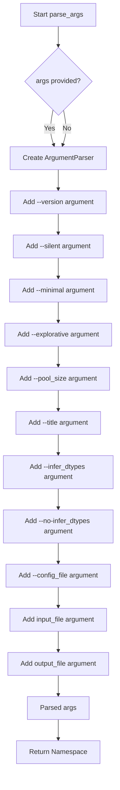
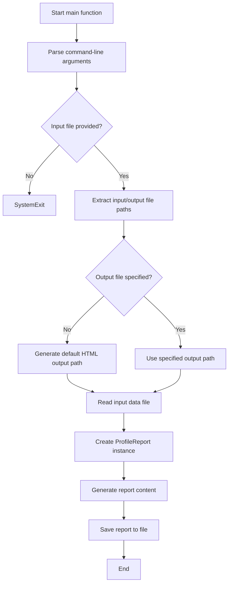

# `console.py`

## `src.ydata_profiling.controller.console.parse_args` · *function*

## Summary:
Parses command-line arguments for the pandas profiling tool to configure report generation and file handling.

## Description:
Creates and configures an argument parser for the profiling tool, defining various command-line options including silent mode, minimal configuration, explorative analysis, CPU pool size, report title, dtype inference settings, configuration file specification, and input/output file paths. This function encapsulates all argument parsing logic to provide a clean interface for command-line interaction with the profiling tool.

## Args:
    args (Optional[List[Any]]): List of command-line arguments to parse. If None, uses sys.argv. Defaults to None.

## Returns:
    argparse.Namespace: Parsed arguments namespace containing all configured options and file paths.

## Raises:
    SystemExit: When --version flag is provided or when required arguments are missing.

## Constraints:
    Preconditions:
        - Input file must be readable
        - Output file path must be writable if specified
        - Configuration file (if specified) must be valid YAML format
    
    Postconditions:
        - All arguments are validated according to their types and constraints
        - Required arguments are present in the returned namespace
        - Default values are properly set for optional arguments

## Side Effects:
    - None directly observable from this function
    - May trigger SystemExit when --version is used or invalid arguments are provided
    - Uses argparse module for argument parsing

## Control Flow:


## Examples:
    # Basic usage with default arguments
    parsed_args = parse_args(['data.csv'])
    
    # With explicit output file
    parsed_args = parse_args(['data.csv', 'report.html'])
    
    # With silent mode enabled
    parsed_args = parse_args(['-s', 'data.csv'])
    
    # With minimal configuration
    parsed_args = parse_args(['-m', '--pool_size', '4', 'data.csv'])
    
    # With custom title
    parsed_args = parse_args(['--title', 'My Custom Report', 'data.csv'])
```

## `src.ydata_profiling.controller.console.main` · *function*

## Summary:
Generates a statistical profiling report for a given data file using command-line arguments to configure the analysis and output location.

## Description:
Serves as the primary console entry point for the ydata-profiling tool, processing command-line arguments to configure report generation and file handling. This function orchestrates the complete workflow from parsing user input to creating and saving the profiling report. It handles file I/O operations, validates input parameters, and manages the creation of HTML reports with appropriate default configurations.

## Args:
    args (Optional[List[Any]]): Command-line arguments to parse. If None, defaults to sys.argv. Defaults to None.

## Returns:
    None: This function does not return any value but performs file I/O operations.

## Raises:
    SystemExit: When --version flag is provided or when required arguments are missing (handled by parse_args).
    FileNotFoundError: When input_file cannot be read.
    ValueError: When input DataFrame is empty or invalid configuration is provided.
    Exception: Various exceptions that may occur during file reading or report generation.

## Constraints:
    Preconditions:
        - Input file must be readable and contain valid data
        - Output directory must be writable if specified
        - Required arguments like input_file must be provided
        - Valid file extensions must be supported for reading
        
    Postconditions:
        - A profiling report is generated and saved to the specified output location
        - Default HTML output filename is created when no output_file is specified
        - All configuration parameters are properly applied to the report generation

## Side Effects:
    - Reads input file from disk using pandas I/O functions
    - Writes output HTML file to disk
    - May trigger SystemExit when --version is used or invalid arguments are provided
    - Uses tqdm progress bar for reporting operation status
    - May open web browser for file download in silent mode (when running in colab environment)

## Control Flow:


## Examples:
    # Basic usage with default arguments
    main(['data.csv'])
    
    # With explicit output file
    main(['data.csv', 'report.html'])
    
    # With silent mode enabled
    main(['-s', 'data.csv'])
    
    # With minimal configuration
    main(['-m', '--pool_size', '4', 'data.csv'])
    
    # With custom title
    main(['--title', 'My Custom Report', 'data.csv'])
```

