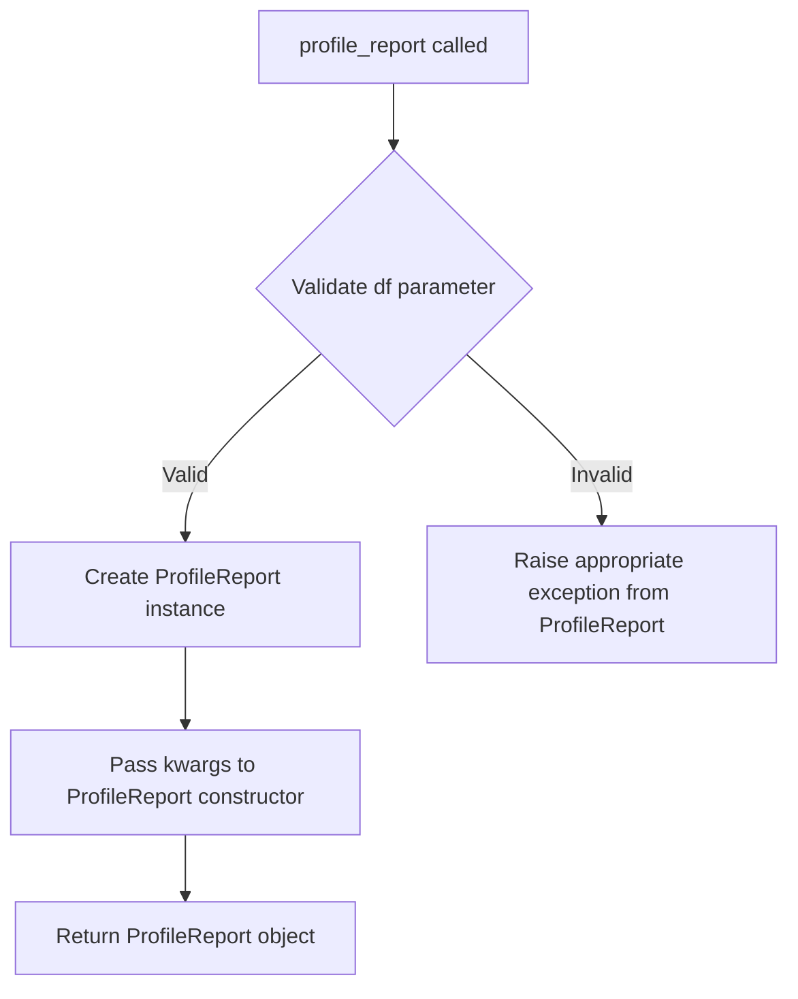

# `pandas_decorator.py`

## `src.ydata_profiling.controller.pandas_decorator.profile_report` · *function*

## Summary:
Creates and returns a ProfileReport object for analyzing a pandas DataFrame.

## Description:
This function serves as a convenience wrapper for creating ProfileReport instances from pandas DataFrames. It encapsulates the instantiation logic for ProfileReport objects, allowing users to quickly generate profiling reports without directly calling the ProfileReport constructor. As part of a pandas decorator pattern, this function provides a clean entry point for data profiling functionality that can be easily integrated into pandas DataFrame workflows.

## Args:
    df (DataFrame): A pandas DataFrame to be profiled
    **kwargs: Additional keyword arguments passed to the ProfileReport constructor for configuration

## Returns:
    ProfileReport: An initialized ProfileReport object ready for analysis

## Raises:
    ValueError: If DataFrame validation fails during ProfileReport initialization (e.g., empty DataFrame, invalid configuration combinations)
    NotImplementedError: If time-series mode is used with unsupported DataFrame types (e.g., Spark DataFrames)

## Constraints:
    Preconditions:
    - Input df must be a valid pandas DataFrame or compatible data structure
    - All kwargs must be valid configuration parameters for ProfileReport
    
    Postconditions:
    - Returns a properly initialized ProfileReport object
    - The returned object maintains a reference to the original DataFrame

## Side Effects:
    None

## Control Flow:


## Examples:
```python
import pandas as pd
from ydata_profiling import profile_report

# Basic usage
df = pd.DataFrame({'A': [1, 2, 3], 'B': [4, 5, 6]})
report = profile_report(df)

# With configuration options
report = profile_report(df, minimal=True, dark_mode=True)

# Can be used in pandas chain operations
result = df.pipe(profile_report, minimal=True)
```

