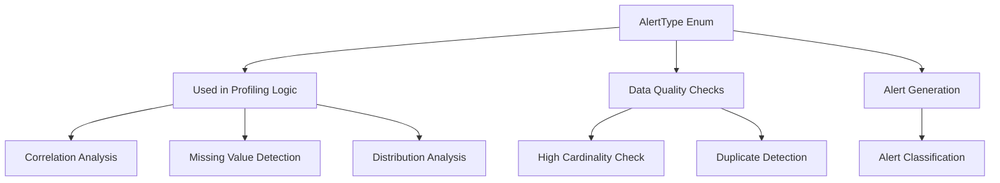
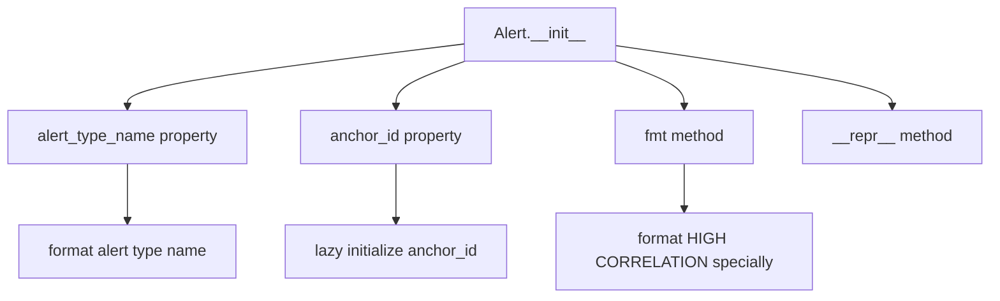
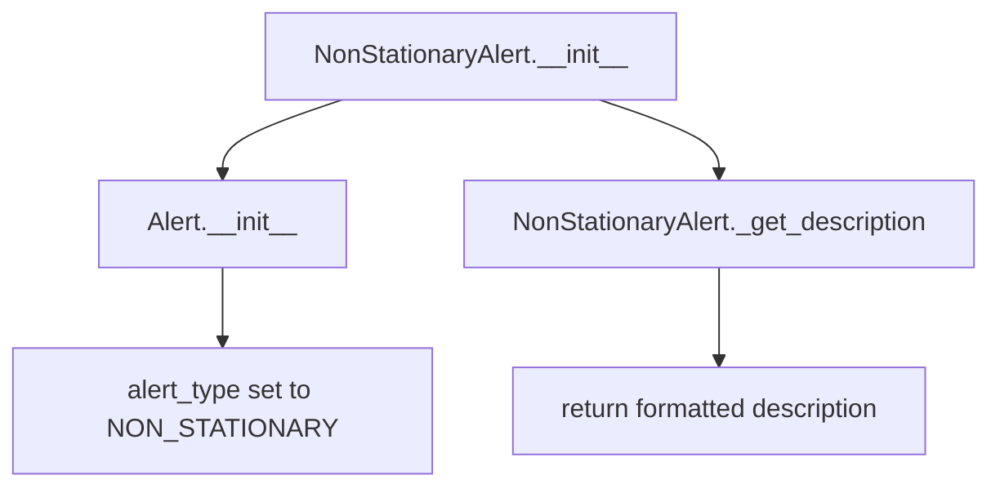
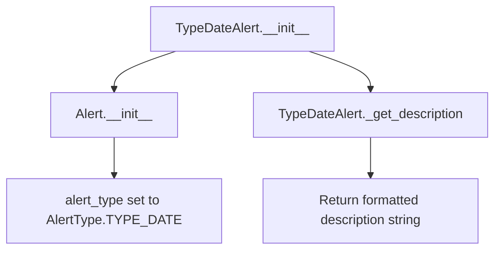
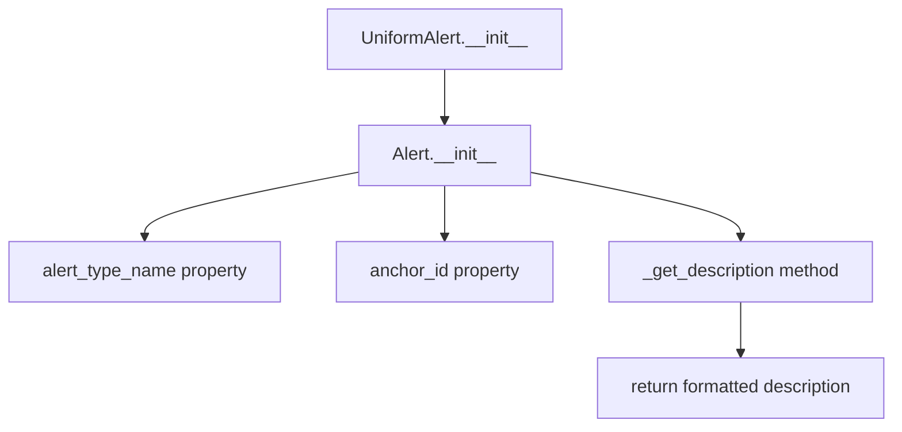
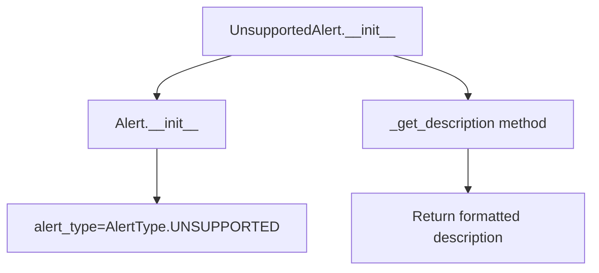
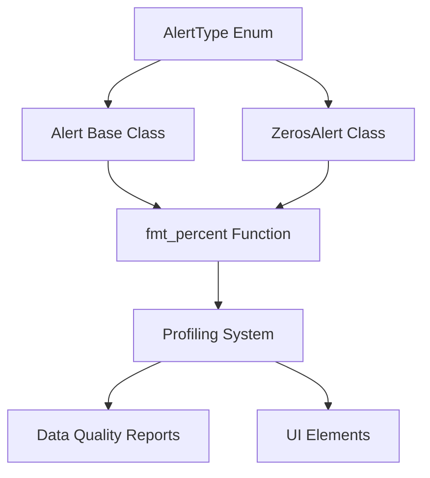
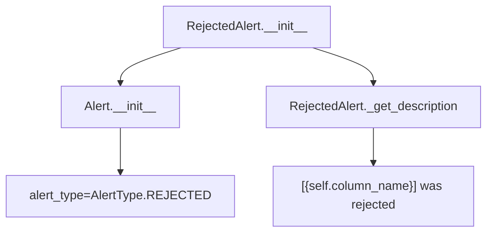

# `alerts.py`

## `src.ydata_profiling.model.alerts.fmt_percent` · *function*

## Summary:
Formats a floating-point value as a percentage string with special handling for near-zero and near-100% values.

## Description:
This function converts a decimal value (typically between 0 and 1) into a percentage string representation. It applies special formatting for edge cases where values are very close to 0% or 100% to improve readability and avoid misleading precision.

## Args:
    value (float): The decimal value to format as a percentage (typically between 0 and 1).
    edge_cases (bool): Whether to apply special formatting for edge cases. Defaults to True.

## Returns:
    str: A formatted percentage string. For edge cases:
        - Values very close to 0 (but greater than 0) return "< 0.1%"
        - Values very close to 1 (but less than 1) return "> 99.9%"
        For normal cases, returns the value multiplied by 100 with 1 decimal place.

## Raises:
    None explicitly raised.

## Constraints:
    Preconditions:
        - The value parameter should be a numeric type convertible to float
        - When edge_cases=True, the function uses rounding to 3 decimal places for comparison
    
    Postconditions:
        - Always returns a string ending with "%"
        - For edge_cases=True, returns either "< 0.1%", "> 99.9%", or a formatted percentage string

## Side Effects:
    None.

## Control Flow:
```mermaid
flowchart TD
    A[Start fmt_percent] --> B{edge_cases is True?}
    B -- No --> E[Return formatted percentage]
    B -- Yes --> C{round(value,3) == 0 AND value > 0?}
    C -- Yes --> D[Return "< 0.1%"]
    C -- No --> F{round(value,3) == 1 AND value < 1?}
    F -- Yes --> G[Return "> 99.9%"]
    F -- No --> E
    E --> H[Return formatted percentage]
```

## Examples:
    >>> fmt_percent(0.0005)
    '< 0.1%'
    >>> fmt_percent(0.9995)
    '> 99.9%'
    >>> fmt_percent(0.5)
    '50.0%'
    >>> fmt_percent(0.0005, edge_cases=False)
    '0.1%'
```

## `src.ydata_profiling.model.alerts.AlertType` · *class*

## Summary:
An enumeration defining various alert types used to categorize data quality issues detected during profiling.

## Description:
The AlertType enum serves as a standardized classification system for different types of data quality alerts that can be generated during automated data profiling. Each enum value represents a specific category of data anomaly or issue that the profiling system may detect, such as constant values, high correlations, missing data, or skewed distributions. This enum provides a consistent way to identify and handle different types of data quality concerns throughout the ydata-profiling system.

## State:
- This is an immutable enum with no instance attributes
- Each enum member is automatically assigned a unique integer value via the `auto()` function
- The enum members represent discrete categories of data quality issues:
  - CONSTANT: Data with all identical values
  - ZEROS: Data containing only zero values
  - HIGH_CORRELATION: Variables with strong linear correlations
  - HIGH_CARDINALITY: Variables with many unique values
  - UNSUPPORTED: Data types not supported by the profiler
  - DUPLICATES: Duplicate rows or values
  - SKEWED: Highly skewed data distributions
  - IMBALANCE: Imbalanced categorical data
  - MISSING: Missing data patterns
  - INFINITE: Infinite or NaN values
  - TYPE_DATE: Date parsing issues
  - UNIQUE: All values are unique
  - CONSTANT_LENGTH: String fields with constant length
  - REJECTED: Data rejected due to validation rules
  - UNIFORM: Uniform distribution patterns
  - NON_STATIONARY: Non-stationary time series data
  - SEASONAL: Seasonal patterns in time series
  - EMPTY: Empty datasets or fields

## Lifecycle:
- Creation: Instantiated automatically when the enum class is loaded; no explicit instantiation required
- Usage: Used as a type-safe identifier for different alert categories throughout the profiling system
- Destruction: Managed automatically by Python's garbage collector

## Method Map:


## Raises:
- No exceptions are raised during enum creation or usage
- The enum is purely a classification mechanism with no operational logic

## Example:
```python
# Using AlertType in code
alert_type = AlertType.HIGH_CORRELATION
if alert_type == AlertType.MISSING:
    print("Missing data detected")
elif alert_type == AlertType.HIGH_CORRELATION:
    print("High correlation detected")

# Enum values can be used as dictionary keys or in comparisons
alert_dict = {
    AlertType.CONSTANT: "All values are identical",
    AlertType.SKEWED: "Data distribution is skewed"
}
```

## `src.ydata_profiling.model.alerts.Alert` · *class*

## Summary:
Represents an alert or warning generated during data profiling, containing metadata about data quality issues.

## Description:
The Alert class encapsulates information about data quality issues detected during profiling. It serves as a container for alert metadata including the alert type, associated column names, values, and fields involved in the alert. Alerts are typically generated by data profiling processes to highlight potential problems such as high correlations, missing values, or data inconsistencies. The alert_type parameter expects an AlertType enum value.

## State:
- fields: Set[str], optional set of field names related to this alert
- alert_type: AlertType, the type of alert being represented (enum)
- values: Dict[str, Any], additional data values associated with the alert
- column_name: str, optional name of the column this alert relates to
- _is_empty: bool, flag indicating if the alert is empty/placeholder
- _anchor_id: str, cached identifier for linking to UI elements (lazy initialized)

## Lifecycle:
- Creation: Instantiate with alert_type and optional metadata parameters
- Usage: Access properties like alert_type_name, anchor_id, and methods like fmt() for display formatting
- Destruction: No explicit cleanup required, relies on Python garbage collection

## Method Map:


## Raises:
- None explicitly raised in __init__, but depends on AlertType enum validity

## Example:
```python
# Create an alert instance
alert = Alert(
    alert_type=AlertType.HIGH_CORRELATION,
    column_name="age",
    values={"fields": ["income", "spending"], "corr": "positive"},
    fields={"income", "spending"}
)

# Access formatted alert name
print(alert.alert_type_name)  # "High Correlation"

# Get HTML-formatted representation
print(alert.fmt())  # '<abbr title="This variable has a high positive correlation with 2 fields: income, spending">HIGH CORRELATION</abbr>'

# Get string representation
print(repr(alert))  # "[HIGH_CORRELATION] alert on column age"
```

### `src.ydata_profiling.model.alerts.Alert.__init__` · *method*

## Summary:
Initializes an Alert object with type, values, column name, fields, and empty status.

## Description:
The Alert constructor creates an alert instance with specified properties. It's responsible for setting up the fundamental attributes that define what kind of alert this is, what data it contains, and metadata about its source and state.

## Args:
    alert_type (AlertType): The type of alert being created, defining its category and behavior
    values (Optional[Dict], optional): Additional data associated with the alert, such as correlation details. Defaults to None.
    column_name (Optional[str], optional): Name of the column this alert relates to. Defaults to None.
    fields (Optional[Set], optional): Set of field names related to this alert. Defaults to None.
    is_empty (bool, optional): Flag indicating if the alert represents an empty state. Defaults to False.

## Returns:
    None: This method initializes instance attributes but does not return a value.

## Raises:
    None: This method does not explicitly raise exceptions.

## State Changes:
    Attributes READ: None
    Attributes WRITTEN: 
    - self.fields: Set of related field names (defaults to empty set if None provided)
    - self.alert_type: The alert type enum value
    - self.values: Dictionary containing alert-specific data (defaults to empty dict if None provided)
    - self.column_name: Name of the column this alert relates to
    - self._is_empty: Boolean flag indicating empty state

## Constraints:
    Preconditions: 
    - alert_type must be a valid AlertType enum value
    - fields should be a set or None
    - values should be a dictionary or None
    
    Postconditions:
    - All instance attributes are initialized with provided values or defaults
    - self.fields is always a set (empty if None was provided)
    - self.values is always a dict (empty if None was provided)

## Side Effects:
    None: This method performs only local attribute assignments and has no external side effects.

### `src.ydata_profiling.model.alerts.Alert.alert_type_name` · *method*

## Summary:
Returns a human-readable title-cased version of the alert type name by converting underscores to spaces and applying title capitalization.

## Description:
This property transforms the internal enum name representation of an alert type into a more readable format suitable for user interfaces and reports. It processes the alert_type.name attribute by replacing underscores with spaces, converting to lowercase, and then applying title capitalization to create a clean, professional display name.

## Args:
    None

## Returns:
    str: A formatted string representing the alert type in title case (e.g., "High Correlation", "Missing Values")

## Raises:
    None

## State Changes:
    Attributes READ: self.alert_type.name
    Attributes WRITTEN: None

## Constraints:
    Preconditions: The Alert instance must be properly initialized with a valid AlertType enum value
    Postconditions: The returned string is always a properly formatted title-cased representation of the alert type

## Side Effects:
    None

### `src.ydata_profiling.model.alerts.Alert.anchor_id` · *method*

## Summary:
Returns a cached hash-based identifier for the alert's column, generating it only once when first accessed.

## Description:
Provides a stable, unique identifier for alerts based on their associated column name. This method implements a lazy caching mechanism where the anchor ID is computed only on first access and subsequently returned from cache. The anchor ID is used for linking or referencing alerts in UI elements or reports.

## Args:
    None

## Returns:
    Optional[str]: A string representation of the hash of the column name, or None if column_name is None. The returned value is cached after first computation.

## Raises:
    None

## State Changes:
    Attributes READ: 
    - self._anchor_id: Internal cached value for the anchor ID
    - self.column_name: Name of the column this alert relates to
    
    Attributes WRITTEN:
    - self._anchor_id: Set to the string representation of the hash of column_name on first access

## Constraints:
    Preconditions:
    - The Alert instance must be properly initialized
    - self.column_name should be a string or None
    
    Postconditions:
    - On first call, self._anchor_id is set to str(hash(self.column_name))
    - Subsequent calls return the cached value in self._anchor_id
    - The returned value is deterministic for the same column_name

## Side Effects:
    None: This method performs only local computations and attribute assignments with no external side effects.

### `src.ydata_profiling.model.alerts.Alert.fmt` · *method*

## Summary:
Formats the alert type name for display, with special HTML formatting for high correlation alerts.

## Description:
Transforms the internal alert type name into a user-friendly display format by replacing underscores with spaces. For HIGH_CORRELATION alerts with available correlation data, it generates an HTML abbr element containing detailed correlation information in the title attribute.

## Args:
    None: This method only operates on the instance attributes of self.

## Returns:
    str: A formatted string representing the alert type name. For HIGH_CORRELATION alerts with correlation data, returns an HTML abbr element with correlation details; otherwise returns a space-separated version of the alert type name.

## Raises:
    KeyError: When processing HIGH_CORRELATION alerts and self.values does not contain the required "fields" or "corr" keys.
    TypeError: When processing HIGH_CORRELATION alerts and self.values["fields"] is not iterable or self.values is not a dictionary.

## State Changes:
    Attributes READ: 
    - self.alert_type.name: The internal name of the alert type enum
    - self.values: Dictionary containing alert-specific data (for HIGH_CORRELATION alerts)
    
    Attributes WRITTEN: None

## Constraints:
    Preconditions:
    - self.alert_type must be a valid AlertType enum value
    - For HIGH_CORRELATION alerts, self.values should be a dictionary containing "fields" and "corr" keys when the method is called
    
    Postconditions:
    - Always returns a string
    - For HIGH_CORRELATION alerts with valid values, returns an HTML abbr element with correlation details
    - For other alerts or when values are missing, returns a space-separated version of the alert type name

## Side Effects:
    None: This method performs only string operations and returns a formatted result without side effects.

### `src.ydata_profiling.model.alerts.Alert._get_description` · *method*

## Summary:
Constructs a formatted string description of the alert including its type and associated column name.

## Description:
Generates a standardized textual representation of the alert by combining the alert type name and column name. This method is primarily used for debugging and logging purposes, as it's invoked by the `__repr__` method to provide a human-readable string representation of Alert instances.

## Args:
    None

## Returns:
    str: A formatted string in the pattern "[ALERT_TYPE] alert on column COLUMN_NAME"

## Raises:
    None

## State Changes:
    Attributes READ: self.alert_type.name, self.column_name
    Attributes WRITTEN: None

## Constraints:
    Preconditions: The Alert instance must be properly initialized with valid alert_type and column_name attributes
    Postconditions: The returned string follows a consistent format for all Alert instances

## Side Effects:
    None

### `src.ydata_profiling.model.alerts.Alert.__repr__` · *method*

## Summary:
Returns the string representation of the alert by invoking the internal description method.

## Description:
This special method implements the Python `__repr__` protocol, providing a string representation of the Alert instance. When an Alert object is evaluated in a context requiring its string representation (such as printing or debugging), this method is automatically called. It delegates the responsibility of generating the descriptive text to the internal `_get_description()` method.

## Args:
    None

## Returns:
    str: The string representation of the alert, as generated by the `_get_description()` method.

## Raises:
    None explicitly raised by this method

## State Changes:
    Attributes READ: self._get_description() method call (no direct attribute access)
    Attributes WRITTEN: None

## Constraints:
    Preconditions: The Alert instance must be properly initialized and the `_get_description()` method must be callable
    Postconditions: The returned value is a string representation of the alert's current state

## Side Effects:
    None

## `src.ydata_profiling.model.alerts.ConstantLengthAlert` · *class*

## Summary:
Represents an alert indicating that a string column has a constant length across all values.

## Description:
The ConstantLengthAlert class is used to signal when a string column in a dataset contains values of uniform length. This type of alert is particularly useful for identifying columns that may contain fixed-width formatted data, encoded identifiers, or other structured string formats where consistency in length indicates a specific data pattern. The alert is generated during data profiling when the system detects that all non-null values in a column share the same character count.

## State:
- alert_type: AlertType.CONSTANT_LENGTH, identifies this as a constant length alert
- values: Optional[Dict], additional data values associated with the alert (passed through from constructor)
- column_name: Optional[str], name of the column triggering the alert (passed through from constructor)
- fields: Set[str], contains {"composition_min_length", "composition_max_length"} - the specific fields being analyzed
- _is_empty: bool, flag indicating if the alert is empty/placeholder (passed through from constructor)

## Lifecycle:
- Creation: Instantiate with optional values, column_name, and is_empty parameters
- Usage: Typically created by data profiling routines when analyzing string column lengths
- Destruction: Managed by Python's garbage collection

## Method Map:
```mermaid
graph TD
    A[ConstantLengthAlert.__init__] --> B[Alert.__init__]
    B --> C[Set alert_type to CONSTANT_LENGTH]
    B --> D[Set fields to {"composition_min_length", "composition_max_length"}]
    A --> E[_get_description method override]
    E --> F[Return formatted description]
```

## Raises:
- None explicitly raised during initialization
- Inherits validation from Alert parent class regarding AlertType enum validity

## Example:
```python
# Create a constant length alert for a column named "id"
alert = ConstantLengthAlert(
    values={"composition_min_length": 10, "composition_max_length": 10},
    column_name="id",
    is_empty=False
)

# Get the alert description
description = alert._get_description()  # "[id] has a constant length"
```

### `src.ydata_profiling.model.alerts.ConstantLengthAlert.__init__` · *method*

## Summary:
Initializes a ConstantLengthAlert instance to detect string fields with uniform length across all values.

## Description:
Creates an alert instance specifically designed to identify when a string column contains values of consistent length. This alert type is particularly useful for detecting data formatting inconsistencies or structured data patterns where all entries should have the same character count.

The method is part of the alert generation system that monitors data quality issues during profiling. It calls the parent Alert constructor with predefined alert type and field specifications appropriate for constant-length string detection.

## Args:
    values (Optional[Dict], default=None): Dictionary containing alert-specific data, typically including length statistics
    column_name (Optional[str], default=None): Name of the column being analyzed for constant length
    is_empty (bool, default=False): Flag indicating whether the column is empty

## Returns:
    None: This method initializes the object's state and does not return a value

## Raises:
    No explicit exceptions are raised by this method

## State Changes:
    Attributes READ: None
    Attributes WRITTEN: 
    - self.fields: Set containing {"composition_min_length", "composition_max_length"}
    - self.alert_type: Set to AlertType.CONSTANT_LENGTH
    - self.values: Set to the provided values parameter or empty dict
    - self.column_name: Set to the provided column_name parameter
    - self._is_empty: Set to the provided is_empty parameter

## Constraints:
    Preconditions:
    - The alert_type parameter must be a valid AlertType enum value
    - Fields parameter must be a set containing the expected field names
    - Values parameter should be a dictionary or None
    
    Postconditions:
    - The alert instance will have its alert_type attribute set to AlertType.CONSTANT_LENGTH
    - The fields attribute will contain exactly {"composition_min_length", "composition_max_length"}

## Side Effects:
    None: This method performs no I/O operations or external service calls

### `src.ydata_profiling.model.alerts.ConstantLengthAlert._get_description` · *method*

## Summary:
Returns a formatted description string indicating that a column has a constant length.

## Description:
This method generates a human-readable description for alerts of type CONSTANT_LENGTH, which are triggered when a string column contains values of uniform length. The method is part of the Alert class hierarchy and provides consistent formatting for alert messages displayed to users.

## Args:
    None

## Returns:
    str: A formatted string in the pattern "[column_name] has a constant length" where column_name is the name of the affected column.

## Raises:
    None

## State Changes:
    Attributes READ: self.column_name
    Attributes WRITTEN: None

## Constraints:
    Preconditions: The method assumes self.column_name is properly initialized and contains a valid column name string.
    Postconditions: The returned string follows a consistent format for all constant length alerts.

## Side Effects:
    None

## `src.ydata_profiling.model.alerts.ConstantAlert` · *class*

## Summary:
Represents an alert indicating that a column contains a constant value throughout all rows.

## Description:
The ConstantAlert class is a specialized alert type that identifies when a data column has identical values across all rows. This alert is typically generated during data profiling to highlight potentially problematic or uninformative columns that don't contribute meaningful variation to the dataset. The alert provides information about the column name and indicates that the column has only one distinct value.

## State:
- Inherits all attributes from Alert base class:
  - alert_type: AlertType.CONSTANT (constant value alert type)
  - values: Dict[str, Any], optional additional data values associated with the alert
  - column_name: str, optional name of the column this alert relates to
  - fields: Set[str], set containing "n_distinct" field reference
  - _is_empty: bool, flag indicating if the alert is empty/placeholder
  - _anchor_id: str, cached identifier for UI linking (lazy initialized)

## Lifecycle:
- Creation: Instantiate with optional values, column_name, and is_empty parameters
- Usage: Access inherited properties like alert_type_name and methods like fmt() for display formatting
- Destruction: Relies on Python garbage collection

## Method Map:
```mermaid
graph TD
    A[ConstantAlert.__init__] --> B[Alert.__init__]
    B --> C[alert_type=AlertType.CONSTANT]
    B --> D[fields={"n_distinct"}]
    A --> E[ConstantAlert._get_description]
    E --> F[return formatted description]
```

## Raises:
- None explicitly raised in __init__, but inherits validation from Alert base class

## Example:
```python
# Create a constant alert for a column named "status"
alert = ConstantAlert(
    column_name="status",
    values={"n_distinct": 1}
)

# Access alert properties
print(alert.alert_type_name)  # "Constant"
print(alert.column_name)      # "status"
print(alert._get_description())  # "[status] has a constant value"
```

### `src.ydata_profiling.model.alerts.ConstantAlert.__init__` · *method*

## Summary:
Initializes a ConstantAlert instance to detect columns with all identical values.

## Description:
Creates a ConstantAlert object that identifies data columns where all values are the same. This alert type is used during data profiling to flag variables that contain constant values, which may indicate data quality issues or uninformative features in machine learning contexts.

## Args:
    values (Optional[Dict], default=None): Dictionary containing alert-specific data, typically including statistical information about the column.
    column_name (Optional[str], default=None): Name of the column that triggered this alert.
    is_empty (bool, default=False): Flag indicating whether the column is empty or contains no data.

## Returns:
    None: This method initializes the object's state but does not return a value.

## Raises:
    No explicit exceptions are raised by this constructor.

## State Changes:
    Attributes READ: None
    Attributes WRITTEN: 
    - self.fields: Set containing field names associated with this alert (always {"n_distinct"})
    - self.alert_type: Set to AlertType.CONSTANT
    - self.values: Set to the provided values parameter or empty dict
    - self.column_name: Set to the provided column_name parameter
    - self._is_empty: Set to the provided is_empty parameter

## Constraints:
    Preconditions:
    - The alert_type parameter must be AlertType.CONSTANT
    - The fields parameter is hardcoded to {"n_distinct"} for this alert type
    - All other parameters are optional and can be None or default values
    
    Postconditions:
    - The object is properly initialized with alert_type set to CONSTNAT
    - The fields attribute is always set to {"n_distinct"}
    - All provided parameters are stored in their respective instance attributes

## Side Effects:
    None: This method performs no I/O operations or external service calls.

### `src.ydata_profiling.model.alerts.ConstantAlert._get_description` · *method*

*No documentation generated.*

## `src.ydata_profiling.model.alerts.DuplicatesAlert` · *class*

## Summary:
Represents an alert for detecting duplicate rows in a dataset during data profiling.

## Description:
The DuplicatesAlert class is used to signal when a dataset contains duplicate rows. It extends the base Alert class to provide specific functionality for duplicate detection alerts. This alert is typically generated during data profiling when duplicates are identified in the dataset, providing information about the number and percentage of duplicate rows found.

## State:
- values: Dict[str, Any], optional dictionary containing duplicate statistics including 'n_duplicates' (number of duplicates) and 'p_duplicates' (percentage of duplicates)
- column_name: str, optional name of the column this alert relates to (though duplicates are typically dataset-wide)
- is_empty: bool, flag indicating if the alert is empty/placeholder (default False)
- fields: Set[str], set containing "n_duplicates" indicating the field related to duplicate counting

## Lifecycle:
- Creation: Instantiate with optional values dict, column_name, and is_empty flag
- Usage: Access alert_type_name property to get formatted alert type name, or call fmt() method for HTML-formatted display
- Destruction: No explicit cleanup required, relies on Python garbage collection

## Method Map:
```mermaid
graph TD
    A[DuplicatesAlert.__init__] --> B[Alert.__init__]
    B --> C[Set alert_type to AlertType.DUPLICATES]
    C --> D[Set fields to {"n_duplicates"}]
    D --> E[super().__init__()]
    A --> F[Overrides _get_description]
    F --> G[_get_description method]
    G --> H[Format duplicate count and percentage]
```

## Raises:
- None explicitly raised in __init__, but depends on parent Alert class validation of parameters

## Example:
```python
# Create a duplicates alert with statistics
alert = DuplicatesAlert(
    values={"n_duplicates": 150, "p_duplicates": 0.05},
    column_name="age"
)

# Get formatted description
description = alert._get_description()  # "Dataset has 150 (5.0%) duplicate rows"

# Access alert type name
print(alert.alert_type_name)  # "Duplicates"

# Get HTML-formatted representation
print(alert.fmt())  # HTML formatted alert
```

### `src.ydata_profiling.model.alerts.DuplicatesAlert.__init__` · *method*

## Summary:
Initializes a duplicate detection alert with specific metadata about duplicate values.

## Description:
Creates a DuplicatesAlert instance that represents a data quality issue indicating the presence of duplicate rows or values in a dataset. This method configures the alert with the appropriate type identifier and field information for duplicate detection.

## Args:
    values (Optional[Dict], optional): Additional data values associated with the duplicate detection. Defaults to None.
    column_name (Optional[str], optional): Name of the column being analyzed for duplicates. Defaults to None.
    is_empty (bool, optional): Flag indicating if the dataset/column is empty. Defaults to False.

## Returns:
    None: This method initializes the object's state but does not return a value.

## Raises:
    No explicit exceptions are raised by this method.

## State Changes:
    Attributes READ: No self attributes are read by this method.
    Attributes WRITTEN: 
    - self.fields: Set to {"n_duplicates"}
    - self.alert_type: Set to AlertType.DUPLICATES
    - self.values: Set to the provided values parameter or empty dict
    - self.column_name: Set to the provided column_name parameter or None
    - self._is_empty: Set to the provided is_empty parameter

## Constraints:
    Preconditions: 
    - The AlertType.DUPLICATES enum value must be available
    - The parent Alert class must be properly initialized
    - All parameters must be of the correct type (values as Dict, column_name as str, is_empty as bool)
    
    Postconditions:
    - The alert instance will have alert_type set to AlertType.DUPLICATES
    - The fields attribute will contain exactly {"n_duplicates"}
    - The values, column_name, and is_empty attributes will be set according to the provided parameters

## Side Effects:
    None: This method performs no I/O operations, external service calls, or mutations to objects outside self.

### `src.ydata_profiling.model.alerts.DuplicatesAlert._get_description` · *method*

## Summary:
Returns a formatted string describing duplicate rows in the dataset, including count and percentage when available.

## Description:
Generates a human-readable description of duplicate row counts in a dataset. This method is part of the DuplicatesAlert class and provides a formatted message indicating the number of duplicate rows found, along with their percentage when statistical values are available. The method is called during alert formatting to provide meaningful information about data duplication issues.

## Args:
    None

## Returns:
    str: A formatted description string. When duplicate statistics are available, returns a string in the format "Dataset has X (Y%) duplicate rows". When no statistics are available, returns "Dataset has duplicated values".

## Raises:
    None

## State Changes:
    Attributes READ: self.values
    Attributes WRITTEN: None

## Constraints:
    Preconditions:
        - The DuplicatesAlert instance must be properly initialized
        - The self.values attribute should be either None or a dictionary containing 'n_duplicates' and 'p_duplicates' keys when not None
        
    Postconditions:
        - Always returns a string describing duplicate rows
        - The returned string follows a consistent format for user-facing messages

## Side Effects:
    None

## `src.ydata_profiling.model.alerts.EmptyAlert` · *class*

## Summary:
Represents an alert indicating that a dataset contains no data rows.

## Description:
The EmptyAlert class is a specialized alert type used to signal when a dataset has zero rows, making it unusable for data profiling analysis. This alert is typically generated during the data validation phase of profiling workflows when datasets are found to be completely empty. The class inherits from the base Alert class and implements a fixed description message indicating the dataset is empty.

## State:
- alert_type: AlertType.EMPTY, identifies this as an empty dataset alert
- values: Optional[Dict], additional data values associated with the alert (default: None)
- column_name: Optional[str], name of the column this alert relates to (default: None)
- fields: Set[str], contains the field "n" indicating numeric count field (inherited from parent)
- is_empty: bool, flag indicating if the alert is empty/placeholder (default: False)

## Lifecycle:
- Creation: Instantiate with optional values, column_name, and is_empty parameters
- Usage: Access alert_type_name property to get formatted alert type name, or call fmt() method for HTML formatting
- Destruction: No explicit cleanup required, relies on Python garbage collection

## Method Map:
```mermaid
graph TD
    A[EmptyAlert.__init__] --> B[Alert.__init__]
    B --> C[alert_type = AlertType.EMPTY]
    B --> D[fields = {"n"}]
    A --> E[_get_description method]
    E --> F["Dataset is empty"]
```

## Raises:
- None explicitly raised in __init__, but depends on parent Alert class initialization

## Example:
```python
# Create an empty dataset alert
empty_alert = EmptyAlert()

# Create an empty dataset alert with additional context
empty_alert_with_context = EmptyAlert(
    values={"n": 0},
    column_name="user_data",
    is_empty=True
)

# Access alert information
print(empty_alert.alert_type_name)  # "EMPTY"
print(empty_alert.fmt())  # "<abbr title="Dataset is empty">EMPTY</abbr>"
print(empty_alert._get_description())  # "Dataset is empty"
```

### `src.ydata_profiling.model.alerts.EmptyAlert.__init__` · *method*

## Summary:
Initializes an EmptyAlert instance to indicate empty datasets or fields during data profiling.

## Description:
The EmptyAlert.__init__ method constructs an alert instance specifically for detecting empty datasets or data fields. It inherits from the base Alert class and configures the alert with the EMPTY alert type, setting up the required fields structure and metadata. This method is part of the data quality alerting system that identifies when datasets or columns contain no data.

## Args:
    values (Optional[Dict], default=None): Dictionary containing additional context about the empty condition, such as counts or metadata
    column_name (Optional[str], default=None): Name of the column that triggered the empty alert, or None for dataset-level alerts
    is_empty (bool, default=False): Boolean flag indicating whether the data is empty, used for conditional alert processing

## Returns:
    None: This method initializes the object state and does not return a value

## Raises:
    No explicit exceptions are raised by this method

## State Changes:
    Attributes READ: None
    Attributes WRITTEN: 
    - self.fields: Set containing field names, initialized to {"n"} representing the count field
    - self.alert_type: Set to AlertType.EMPTY to classify this as an empty data alert
    - self.values: Set to the provided values parameter or empty dict for additional context
    - self.column_name: Set to the provided column_name parameter or None for dataset-level alerts
    - self._is_empty: Set to the provided is_empty parameter for downstream processing

## Constraints:
    Preconditions:
    - The AlertType.EMPTY enum value must be defined and accessible
    - The parent Alert class must be properly initialized
    - All parameters must be of the correct type or None
    
    Postconditions:
    - The alert instance will have alert_type set to AlertType.EMPTY
    - The fields attribute will contain exactly {"n"} (count field identifier)
    - All provided parameters will be stored in their respective instance attributes

## Side Effects:
    None: This method performs only object initialization and has no external side effects

### `src.ydata_profiling.model.alerts.EmptyAlert._get_description` · *method*

## Summary:
Returns a standardized description message indicating that the dataset contains no data.

## Description:
This method provides a human-readable description for empty dataset alerts within the ydata-profiling framework. It is part of the EmptyAlert class that represents alerts triggered when a dataset has zero rows. The method serves as a consistent interface for retrieving alert descriptions across the data profiling system.

This method is called during the alert rendering phase of the data quality analysis pipeline, where alert descriptions are formatted for display to users. The fixed return value ensures consistency in alert messaging throughout the application.

## Args:
    self: The EmptyAlert instance that provides context for the alert.

## Returns:
    str: A fixed string "Dataset is empty" that describes the condition triggering this alert.

## Raises:
    None: This method does not raise any exceptions under normal operation.

## State Changes:
    Attributes READ: None - this method only accesses the instance for context but does not read any instance attributes.
    Attributes WRITTEN: None - this method does not modify any instance attributes.

## Constraints:
    Preconditions: The method assumes it is called on a properly initialized EmptyAlert instance.
    Postconditions: The method always returns the same fixed string "Dataset is empty" regardless of the instance state.

## Side Effects:
    None: This method performs no I/O operations, external service calls, or mutations to objects outside the instance. It is a pure function that only generates a description string.

## `src.ydata_profiling.model.alerts.HighCardinalityAlert` · *class*

*No documentation generated.*

### `src.ydata_profiling.model.alerts.HighCardinalityAlert.__init__` · *method*

## Summary:
Initializes a HighCardinalityAlert instance that reports columns with a high number of distinct values.

## Description:
Configures an alert instance to indicate when a column exhibits high cardinality, meaning it contains many unique values. This alert type specifically tracks the count of distinct values in a column and is used during data profiling to identify potentially problematic features.

## Args:
    values (Optional[Dict], default=None): Dictionary containing alert-specific data, typically including 'n_distinct' key for distinct value count.
    column_name (Optional[str], default=None): Name of the column that triggered this alert.
    is_empty (bool, default=False): Flag indicating whether the column is empty.

## Returns:
    None: This method initializes the object state and does not return a value.

## Raises:
    None explicitly raised: The parent Alert class constructor may raise exceptions if invalid parameters are passed, but these are not documented in this method.

## State Changes:
    Attributes READ: None
    Attributes WRITTEN: 
    - self.fields: Set containing field names tracked by this alert (set to {"n_distinct"})
    - self.alert_type: Set to AlertType.HIGH_CARDINALITY
    - self.values: Set to the provided values parameter or empty dict
    - self.column_name: Set to the provided column_name parameter
    - self._is_empty: Set to the provided is_empty parameter

## Constraints:
    Preconditions: 
    - The alert_type parameter must be a valid AlertType enum value
    - The fields parameter should be a set of field names to track
    - Values should be a dictionary or None
    
    Postconditions:
    - The alert instance will have its alert_type set to HIGH_CARDINALITY
    - The fields attribute will contain exactly {"n_distinct"}
    - All provided parameters will be stored in the appropriate instance attributes

## Side Effects:
    None: This method performs no I/O operations or external service calls. It only initializes object state.

### `src.ydata_profiling.model.alerts.HighCardinalityAlert._get_description` · *method*

## Summary:
Generates a human-readable description of high cardinality alert conditions for a data column.

## Description:
Returns a formatted string describing the cardinality characteristics of a data column. This method is used to create descriptive messages for high cardinality alerts that help users understand the nature of data distribution in columns with many distinct values. The method provides detailed information when statistical values are available, or a general description when they are not.

## Args:
    None

## Returns:
    str: A formatted description string with one of two formats:
        - When `self.values` is not None: "[{column_name}] has {n_distinct} ({p_distinct}%) distinct values"
        - When `self.values` is None: "[{column_name}] has a high cardinality"

## Raises:
    None explicitly raised

## State Changes:
    Attributes READ: 
        - self.values: Dictionary containing cardinality statistics (n_distinct, p_distinct)
        - self.column_name: String name of the column being analyzed

## Constraints:
    Preconditions:
        - The method assumes `self.values` is either None or contains keys 'n_distinct' and 'p_distinct'
        - The `fmt_percent` function is available in the module scope
        - `self.column_name` should be a valid string or None

    Postconditions:
        - Always returns a string describing the column's cardinality
        - The returned string follows a consistent format for alert reporting

## Side Effects:
    None

## Known Callers:
    This method is likely called internally by the Alert base class's `fmt()` method or similar formatting functions when displaying high cardinality alerts in reports or user interfaces. It would be invoked during data profiling report generation when high cardinality conditions are detected.

## Why This Logic Is Its Own Method:
This logic is separated into its own method to enable consistent formatting of high cardinality alert descriptions across different display contexts (console, HTML reports, etc.) while maintaining clean separation of concerns. The method abstracts away the formatting logic from the main alert processing flow, making it easier to modify presentation without affecting core alert functionality.

## `src.ydata_profiling.model.alerts.HighCorrelationAlert` · *class*

*No documentation generated.*

### `src.ydata_profiling.model.alerts.HighCorrelationAlert.__init__` · *method*

## Summary:
Initializes a HighCorrelationAlert instance with correlation-specific metadata and configuration.

## Description:
This constructor creates a high correlation alert object that extends the base Alert class. It sets up the alert with the HIGH_CORRELATION type and initializes the alert's metadata including correlation values, column names, and empty dataset flags. This method delegates to the parent Alert class constructor with specific parameters for high correlation detection.

## Args:
    values (Optional[Dict], default=None): Dictionary containing correlation analysis results with keys 'corr' (correlation type) and 'fields' (related field names)
    column_name (Optional[str], default=None): Name of the column triggering the correlation alert
    is_empty (bool, default=False): Flag indicating whether the dataset is empty
    fields (Optional[Set], default=None): Set of field names related to this correlation alert

## Returns:
    None: This method initializes the object's state but does not return a value

## Raises:
    No explicit exceptions are raised by this method

## State Changes:
    Attributes READ: None
    Attributes WRITTEN: 
    - self.alert_type: Set to AlertType.HIGH_CORRELATION
    - self.values: Set to the provided values parameter or empty dict
    - self.column_name: Set to the provided column_name parameter
    - self.fields: Set to the provided fields parameter or empty set
    - self._is_empty: Set to the provided is_empty parameter

## Constraints:
    Preconditions:
    - The alert_type parameter must be AlertType.HIGH_CORRELATION (implicitly enforced by the method)
    - Values parameter should contain appropriate correlation data if provided
    - Column name should be a valid string identifier if provided
    
    Postconditions:
    - The alert instance will have its alert_type attribute set to HIGH_CORRELATION
    - All provided parameters will be stored as instance attributes
    - The object will be properly initialized for correlation analysis reporting

## Side Effects:
    None: This method performs no I/O operations or external service calls

### `src.ydata_profiling.model.alerts.HighCorrelationAlert._get_description` · *method*

*No documentation generated.*

## `src.ydata_profiling.model.alerts.ImbalanceAlert` · *class*

## Summary:
Represents an alert for detecting imbalanced categorical data distributions in profiling reports.

## Description:
The ImbalanceAlert class is a specialized alert type used to identify when categorical data exhibits significant imbalance in its value distribution. This occurs when certain categories dominate the dataset while others are underrepresented, potentially affecting model performance or statistical analysis. The alert is generated during data profiling when imbalance detection algorithms identify such patterns.

## State:
- values: Dict[str, Any], optional dictionary containing imbalance metrics (e.g., imbalance ratio, category counts)
- column_name: str, optional name of the column that contains imbalanced data
- is_empty: bool, flag indicating if this is a placeholder/empty alert (defaults to False)

## Lifecycle:
- Creation: Instantiate with optional values, column_name, and is_empty parameters
- Usage: Typically created by imbalance detection algorithms during profiling and accessed through the alert system
- Destruction: Managed by Python's garbage collection

## Method Map:
```mermaid
graph TD
    A[ImbalanceAlert.__init__] --> B[Alert.__init__]
    B --> C[Sets alert_type=IMBALANCE]
    C --> D[Sets fields={"imbalance"}]
    A --> E[ImbalanceAlert._get_description]
    E --> F[Formats imbalance alert message]
```

## Raises:
- None explicitly raised in __init__
- Inherits all exceptions from Alert parent class initialization

## Example:
```python
# Create an imbalance alert for a column
alert = ImbalanceAlert(
    values={"imbalance": "85% of values in category A"},
    column_name="product_category"
)

# Get formatted description
description = alert._get_description()
# Returns: "[product_category] is highly imbalanced (85% of values in category A)"

# Create empty alert
empty_alert = ImbalanceAlert(is_empty=True)
description = empty_alert._get_description()
# Returns: "[None] is highly imbalanced"
```

### `src.ydata_profiling.model.alerts.ImbalanceAlert.__init__` · *method*

## Summary:
Initializes an ImbalanceAlert instance with alert type set to IMBALANCE and configures its properties for imbalance detection.

## Description:
This method constructs an ImbalanceAlert object by calling the parent Alert class constructor with specific parameters indicating this is an imbalance detection alert. It sets the alert type to IMBALANCE, configures the fields to track imbalance metrics, and initializes other alert properties like values, column name, and empty status.

The ImbalanceAlert is used during data profiling to identify categorical columns with highly skewed distributions where one or more categories dominate significantly over others. This alert helps detect potential data quality issues that may affect machine learning model performance or statistical analysis validity.

## Args:
    values (Optional[Dict], optional): Dictionary containing imbalance-related statistics or metrics. Defaults to None.
    column_name (Optional[str], optional): Name of the column being analyzed for imbalance. Defaults to None.
    is_empty (bool, optional): Flag indicating if the data being analyzed is empty. Defaults to False.

## Returns:
    None: This method initializes the object state but does not return a value.

## Raises:
    No explicit exceptions are raised by this method.

## State Changes:
    Attributes READ: No self attributes are read in this method.
    Attributes WRITTEN: 
    - self.alert_type: Set to AlertType.IMBALANCE
    - self.values: Set to the provided values parameter
    - self.column_name: Set to the provided column_name parameter
    - self.fields: Set to {"imbalance"}
    - self.is_empty: Set to the provided is_empty parameter

## Constraints:
    Preconditions: 
    - The AlertType.IMBALANCE enum value must be defined and accessible
    - The parent Alert class must be properly initialized with the expected parameters
    - The values parameter should be a dictionary or None
    - The column_name parameter should be a string or None
    
    Postconditions:
    - The object will have alert_type set to AlertType.IMBALANCE
    - The object will have fields set to {"imbalance"}
    - All provided parameters will be stored as instance attributes

## Side Effects:
    None: This method performs only initialization operations and has no external side effects.

### `src.ydata_profiling.model.alerts.ImbalanceAlert._get_description` · *method*

## Summary:
Generates a human-readable description string for an imbalanced data alert, optionally including imbalance statistics.

## Description:
Creates a formatted description indicating that a specific column contains highly imbalanced data. This method is part of the ImbalanceAlert class and is used to provide meaningful textual representation of data imbalance issues detected during profiling. The description includes the column name and, when available, detailed imbalance statistics from the alert's values dictionary.

This method is called during the alert formatting process in the data profiling pipeline to generate user-friendly messages about data quality issues. It's designed to be overridden by subclasses to provide specialized description formats while maintaining consistent alert presentation.

## Args:
    None

## Returns:
    str: A formatted description string in the format "[COLUMN_NAME] is highly imbalanced" or "[COLUMN_NAME] is highly imbalanced (IMBALANCE_VALUE)" when imbalance statistics are available.

## Raises:
    None

## State Changes:
    Attributes READ: self.column_name, self.values
    Attributes WRITTEN: None

## Constraints:
    Preconditions:
        - The ImbalanceAlert instance must be properly initialized with valid column_name and values attributes
        - The self.values dictionary, when present, must contain an 'imbalance' key
    Postconditions:
        - Always returns a string describing the imbalance condition
        - The returned string follows a consistent format for user-facing messages

## Side Effects:
    None

## `src.ydata_profiling.model.alerts.InfiniteAlert` · *class*

## Summary:
Represents an alert for detecting infinite values in data columns during data profiling.

## Description:
The InfiniteAlert class is a specialized alert type that identifies and reports infinite values (positive or negative infinity) found in data columns. It extends the base Alert class to provide specific handling for infinite value detection, including counts and percentages of infinite values. This alert is typically generated during data quality analysis when numerical data contains infinite values that could impact downstream processing or analysis.

## State:
- values: Dict[str, Any], optional dictionary containing statistics about infinite values with keys 'n_infinite' (count) and 'p_infinite' (percentage)
- column_name: str, optional name of the column containing infinite values  
- _is_empty: bool, flag indicating if the alert is empty/placeholder (inherited from Alert)
- fields: Set[str], set containing field names "p_infinite" and "n_infinite" (set in parent Alert.__init__)

## Lifecycle:
- Creation: Instantiate with optional values dictionary, column_name, and is_empty flag
- Usage: Access alert_type_name property to get formatted alert type name, or call fmt() method for HTML-formatted display
- Destruction: Relies on Python garbage collection

## Method Map:
```mermaid
graph TD
    A[InfiniteAlert.__init__] --> B[Alert.__init__]
    B --> C[Set alert_type=AlertType.INFINITE]
    B --> D[Set fields={"p_infinite", "n_infinite"}]
    A --> E[InfiniteAlert._get_description]
    E --> F[Format description with infinite count and percentage]
```

## Raises:
- None explicitly raised in __init__, but depends on parent Alert class validation of parameters

## Example:
```python
# Create an InfiniteAlert with values
alert = InfiniteAlert(
    values={'n_infinite': 5, 'p_infinite': 0.05},
    column_name='salary'
)

# Get formatted description
description = alert._get_description()  # "[salary] has 5 (5.0%) infinite values"

# Create an InfiniteAlert without values
alert2 = InfiniteAlert(column_name='age')
description2 = alert2._get_description()  # "[age] has infinite values"
```

### `src.ydata_profiling.model.alerts.InfiniteAlert.__init__` · *method*

## Summary:
Initializes an InfiniteAlert instance to track infinite or NaN values in a data column.

## Description:
Constructs an InfiniteAlert object that records information about infinite values (positive/negative infinity) and NaN values detected in a data column during profiling. This method sets up the alert with appropriate type identification and field tracking for infinite value statistics.

## Args:
    values (Optional[Dict]): Dictionary containing statistics about infinite values, including 'p_infinite' (percentage) and 'n_infinite' (count). Defaults to None.
    column_name (Optional[str]): Name of the column being analyzed for infinite values. Defaults to None.
    is_empty (bool): Flag indicating if the column is empty. Defaults to False.

## Returns:
    None: This method initializes the object's state but does not return a value.

## Raises:
    No explicit exceptions are raised by this method.

## State Changes:
    Attributes READ: None
    Attributes WRITTEN: 
    - self.fields: Set containing {"p_infinite", "n_infinite"} for tracking infinite value statistics
    - self.alert_type: Set to AlertType.INFINITE
    - self.values: Set to the provided values parameter or empty dict
    - self.column_name: Set to the provided column_name parameter
    - self._is_empty: Set to the provided is_empty parameter

## Constraints:
    Preconditions:
    - The parent Alert class constructor must accept the provided parameters
    - AlertType.INFINITE must be a valid enum value
    - The fields set must contain exactly "p_infinite" and "n_infinite"

    Postconditions:
    - The alert instance will have its alert_type properly set to AlertType.INFINITE
    - The fields attribute will contain exactly the set {"p_infinite", "n_infinite"}
    - All provided parameters will be stored in their respective instance attributes

## Side Effects:
    None: This method performs no I/O operations or external service calls. It only initializes object state.

### `src.ydata_profiling.model.alerts.InfiniteAlert._get_description` · *method*

## Summary:
Generates a human-readable description of infinite values detected in a data column for alert reporting.

## Description:
Returns a formatted string describing the presence of infinite values in a column. This method is part of the Alert system and provides descriptive text for displaying infinite value warnings during data profiling. The description varies based on whether detailed statistical information is available.

When detailed statistics are available (self.values is not None), the description includes both the count and percentage of infinite values. When only basic information is available, it provides a simpler description.

## Args:
    None

## Returns:
    str: A formatted description string in one of two formats:
        - When self.values is not None: "[column_name] has n_infinite (p_infinite%) infinite values"
        - When self.values is None: "[column_name] has infinite values"

## Raises:
    None

## State Changes:
    Attributes READ: 
        - self.values: Dictionary containing statistical information about infinite values ('n_infinite', 'p_infinite')
        - self.column_name: String name of the column being analyzed

## Constraints:
    Preconditions:
        - self.column_name should be a valid string or None
        - When self.values is not None, it must contain keys 'n_infinite' and 'p_infinite'
        - The fmt_percent function should handle the percentage formatting correctly
    
    Postconditions:
        - Always returns a string describing infinite values in the column
        - The returned string follows a consistent format suitable for alert display

## Side Effects:
    None

## `src.ydata_profiling.model.alerts.MissingAlert` · *class*

## Summary:
Represents an alert specifically for missing value detection in data profiling.

## Description:
The MissingAlert class is a specialized alert type that indicates when data columns contain missing values. It extends the base Alert class to provide specific formatting and handling for missing value scenarios. This alert is typically generated during data profiling when columns are detected to have null or missing entries.

## State:
- values: Dict[str, Any], optional dictionary containing missing value statistics with keys "n_missing" (count) and "p_missing" (percentage)
- column_name: str, optional name of the column this alert relates to
- _is_empty: bool, flag indicating if the alert is empty/placeholder (inherited from Alert)
- fields: Set[str], set containing "p_missing" and "n_missing" field names (inherited from Alert)
- alert_type: AlertType, the type of alert being represented (inherited from Alert, set to AlertType.MISSING)

## Lifecycle:
- Creation: Instantiate with optional values dict, column_name, and is_empty flag
- Usage: Access alert_type_name property to get formatted alert type name, or call fmt() method for HTML-formatted display
- Destruction: No explicit cleanup required, relies on Python garbage collection

## Method Map:
```mermaid
graph TD
    A[MissingAlert.__init__] --> B[Alert.__init__]
    B --> C[Set alert_type to MISSING]
    C --> D[Set fields to {"p_missing", "n_missing"}]
    A --> E[MissingAlert._get_description]
    E --> F[Format missing value description]
```

## Raises:
- None explicitly raised in __init__, but depends on parent Alert class validation

## Example:
```python
# Create a missing alert with detailed statistics
alert = MissingAlert(
    values={"n_missing": 15, "p_missing": 0.15},
    column_name="age"
)

# Get formatted description
description = alert._get_description()  # "[age] 15 (15.0%) missing values"

# Create a basic missing alert without statistics
basic_alert = MissingAlert(column_name="income")
desc = basic_alert._get_description()  # "[income] has missing values"
```

### `src.ydata_profiling.model.alerts.MissingAlert.__init__` · *method*

## Summary:
Initializes a MissingAlert instance to represent missing data patterns in a dataset column.

## Description:
Creates a specialized alert object for missing data detection, inheriting from the base Alert class. This constructor configures the alert with the specific type indicating missing data, sets up required fields for missing value analysis, and initializes the alert with provided metadata about the missing data pattern.

## Args:
    values (Optional[Dict], default=None): Dictionary containing detailed information about missing values, such as counts or patterns
    column_name (Optional[str], default=None): Name of the column where missing data was detected
    is_empty (bool, default=False): Flag indicating whether the entire dataset or column is empty

## Returns:
    None: This method initializes the object's state but does not return a value

## Raises:
    No explicit exceptions are raised by this method

## State Changes:
    Attributes READ: None
    Attributes WRITTEN: 
    - self.fields: Set containing {"p_missing", "n_missing"} representing percentage and count of missing values
    - self.alert_type: Set to AlertType.MISSING
    - self.values: Initialized with provided values parameter or empty dict
    - self.column_name: Set to provided column_name parameter
    - self._is_empty: Set to provided is_empty parameter

## Constraints:
    Preconditions:
    - The alert_type parameter in the parent constructor must be AlertType.MISSING
    - Fields parameter must contain the set {"p_missing", "n_missing"}
    - All other parameters are optional and can be None or default values
    
    Postconditions:
    - The alert instance will have alert_type set to AlertType.MISSING
    - The fields attribute will contain exactly {"p_missing", "n_missing"}
    - The values, column_name, and is_empty attributes will be initialized with provided parameters

## Side Effects:
    None: This method performs only object initialization and has no external side effects

### `src.ydata_profiling.model.alerts.MissingAlert._get_description` · *method*

## Summary:
Generates a human-readable description string for missing value alerts, providing detailed statistics when available.

## Description:
Creates a formatted description of missing value conditions in a data column. When detailed statistics are available (self.values is not None), it displays the count and percentage of missing values. Otherwise, it provides a basic description indicating the presence of missing values.

This method is part of the alert generation system that identifies data quality issues during profiling. It's specifically designed for MissingAlert instances and provides a standardized way to represent missing value conditions in user-facing reports.

## Args:
    None explicitly required (uses self)

## Returns:
    str: A formatted description string in one of two formats:
        - When self.values is not None: "[column_name] n_missing (p_missing%) missing values"
        - When self.values is None: "[column_name] has missing values"

## Raises:
    None explicitly raised

## State Changes:
    Attributes READ: self.values, self.column_name
    Attributes WRITTEN: None

## Constraints:
    Preconditions:
        - self.column_name should be a valid string or None
        - When self.values is not None, it should contain 'n_missing' and 'p_missing' keys
        - The fmt_percent function should handle the percentage formatting properly
    
    Postconditions:
        - Always returns a string
        - The returned string follows the specified format pattern

## Side Effects:
    None

## `src.ydata_profiling.model.alerts.NonStationaryAlert` · *class*

## Summary:
Represents an alert indicating that a data column exhibits non-stationary behavior, meaning its statistical properties change over time or across segments.

## Description:
The NonStationaryAlert class is a specialized subclass of Alert designed to signal when a data column fails stationarity tests, which is critical in time series analysis and statistical modeling. Non-stationary data has statistical properties (like mean, variance, autocorrelation) that vary over time, making traditional statistical models potentially unreliable or requiring special handling.

This alert is typically generated during automated data profiling when statistical tests detect significant changes in data patterns across different time periods or segments. The alert provides basic metadata about the problematic column while delegating detailed formatting to the parent Alert class.

## State:
- Inherits all attributes from Alert base class:
  - alert_type: AlertType.NON_STATIONARY (constant, set by constructor)
  - values: Dict[str, Any], optional additional data values associated with the alert (default: None)
  - column_name: str, optional name of the column this alert relates to (default: None)
  - _is_empty: bool, flag indicating if the alert is empty/placeholder (default: False)
  - fields: Set[str], optional set of field names related to this alert
  - _anchor_id: str, cached identifier for UI linking (lazy initialized)

## Lifecycle:
- Creation: Instantiate with optional values, column_name, and is_empty parameters
- Usage: Access inherited properties like alert_type_name, anchor_id, and methods like fmt() for display formatting
- Destruction: Relies on Python garbage collection

## Method Map:


## Raises:
- None explicitly raised in __init__, but inherits validation from Alert base class

## Example:
```python
# Create a non-stationary alert for a time series column
alert = NonStationaryAlert(
    column_name="stock_price",
    values={"test_result": "ADF test failed", "p_value": 0.05},
    is_empty=False
)

# Access alert information
print(alert.alert_type_name)  # "Non Stationary" 
print(alert.column_name)      # "stock_price"
print(alert._get_description())  # "[stock_price] is non stationary"

# The alert can be formatted for display
formatted_alert = alert.fmt()  # HTML formatted representation
```

### `src.ydata_profiling.model.alerts.NonStationaryAlert.__init__` · *method*

## Summary:
Initializes a NonStationaryAlert instance with the NON_STATIONARY alert type, configuring alert metadata for non-stationary data detection.

## Description:
This constructor creates a NonStationaryAlert object that inherits from the Alert base class. It specifically sets the alert type to NON_STATIONARY, which indicates that the data in the associated column exhibits non-stationary characteristics (i.e., statistical properties change over time or across segments). The method delegates initialization to the parent Alert class with the specified parameters.

## Args:
    values (Optional[Dict], optional): Dictionary containing alert-specific data values such as statistical measures or diagnostic information. Defaults to None.
    column_name (Optional[str], optional): Name of the column associated with this non-stationary data alert. Defaults to None.
    is_empty (bool, optional): Flag indicating whether the alert relates to an empty dataset or column. Defaults to False.

## Returns:
    None: This method initializes the object state but does not return a value.

## Raises:
    None: This method does not explicitly raise exceptions, though parent class initialization may raise exceptions if invalid parameters are passed.

## State Changes:
    Attributes READ: None
    Attributes WRITTEN: 
    - self.alert_type: Set to AlertType.NON_STATIONARY (indicating non-stationary data pattern)
    - self.values: Set to the provided values parameter
    - self.column_name: Set to the provided column_name parameter
    - self._is_empty: Set to the provided is_empty parameter
    - self.fields: Initialized via parent class constructor with default empty set

## Constraints:
    Preconditions: 
    - The alert_type parameter must be a valid AlertType enum member (specifically NON_STATIONARY)
    - All parameters should conform to their respective type annotations
    
    Postconditions:
    - The created object will have alert_type set to AlertType.NON_STATIONARY
    - All provided parameters will be stored in the corresponding instance attributes
    - The object will inherit all functionality from the Alert base class

## Side Effects:
    None: This method performs no I/O operations or external service calls. It only initializes object state by calling the parent class constructor.

### `src.ydata_profiling.model.alerts.NonStationaryAlert._get_description` · *method*

## Summary:
Returns a formatted string describing a non-stationary alert for a specific column.

## Description:
This method generates a human-readable description indicating that a particular column contains non-stationary time series data. It is part of the alert generation system that identifies data quality issues during profiling. The method is called during the formatting and display phases of alert processing to provide meaningful descriptions to users.

## Args:
    None

## Returns:
    str: A formatted string in the pattern "[column_name] is non stationary" that describes the non-stationary nature of the data in the specified column.

## Raises:
    None

## State Changes:
    Attributes READ: self.column_name
    Attributes WRITTEN: None

## Constraints:
    Preconditions: 
    - self.column_name must be a valid string (not None or empty)
    - The NonStationaryAlert instance must be properly initialized
    
    Postconditions:
    - The returned string follows a consistent format for all non-stationary alerts
    - The method is idempotent and returns the same result for the same object state

## Side Effects:
    None

## `src.ydata_profiling.model.alerts.SeasonalAlert` · *class*

## Summary:
Represents an alert indicating that a column exhibits seasonal patterns in its data distribution.

## Description:
The SeasonalAlert class is used to signal that a specific column in a dataset demonstrates seasonal characteristics, which may indicate time-series patterns or recurring behaviors. This alert type is particularly useful in data profiling scenarios where temporal data analysis is performed to identify recurring trends or cycles in the data.

This class extends the base Alert functionality by providing a specific implementation for seasonal pattern detection, allowing the profiling system to categorize and report on time-based recurring behaviors in datasets.

## State:
- alert_type: AlertType.SEASONAL, the fixed alert type identifying this as a seasonal pattern alert
- values: Dict[str, Any], optional dictionary containing additional data values related to the seasonal pattern detection
- column_name: str, optional name of the column that exhibits seasonal behavior
- is_empty: bool, flag indicating if this is an empty/placeholder alert instance

## Lifecycle:
- Creation: Instantiate with optional values, column_name, and is_empty parameters
- Usage: Typically created by data profiling processes that detect seasonal patterns in time series data
- Destruction: Relies on Python's garbage collection

## Method Map:
```mermaid
graph TD
    A[SeasonalAlert.__init__] --> B[Alert.__init__]
    B --> C[Set alert_type=AlertType.SEASONAL]
    A --> D[SeasonalAlert._get_description]
    D --> E[Return "[column_name] is seasonal"]
```

## Raises:
- None explicitly raised in __init__
- Inherits any exceptions from Alert.__init__ if invalid parameters are passed

## Example:
```python
# Create a seasonal alert for a column named "sales"
seasonal_alert = SeasonalAlert(
    column_name="sales",
    values={"period": "monthly", "cycle_length": 12}
)

# Get the alert description
description = seasonal_alert._get_description()  # Returns "[sales] is seasonal"

# Access the alert type
print(seasonal_alert.alert_type)  # AlertType.SEASONAL
```

### `src.ydata_profiling.model.alerts.SeasonalAlert.__init__` · *method*

## Summary:
Initializes a SeasonalAlert instance with seasonal pattern detection configuration.

## Description:
Constructs a SeasonalAlert object that represents a data quality issue indicating seasonal patterns in time series data. This method serves as a specialized constructor that sets the alert type to SEASONAL while preserving the standard Alert initialization behavior for other parameters.

## Args:
    values (Optional[Dict], default=None): Dictionary containing seasonal pattern analysis results and metadata
    column_name (Optional[str], default=None): Name of the column being analyzed for seasonal patterns
    is_empty (bool, default=False): Flag indicating whether the dataset or column is empty

## Returns:
    None: This method initializes the object's state but does not return a value

## Raises:
    No explicit exceptions are raised by this method

## State Changes:
    Attributes READ: None
    Attributes WRITTEN: 
    - self.alert_type: Set to AlertType.SEASONAL
    - self.values: Set to the provided values parameter or empty dict
    - self.column_name: Set to the provided column_name parameter
    - self._is_empty: Set to the provided is_empty parameter
    - self.fields: Set to the provided fields parameter or empty set

## Constraints:
    Preconditions:
    - The alert_type parameter is implicitly set to AlertType.SEASONAL by this constructor
    - All other parameters are optional and will default appropriately if not provided
    - The values parameter should be a dictionary containing seasonal analysis data when present
    
    Postconditions:
    - The object is properly initialized as an Alert with SEASONAL type
    - All provided parameters are stored as instance attributes
    - Default values are applied for unspecified optional parameters

## Side Effects:
    None: This method performs no I/O operations or external service calls

### `src.ydata_profiling.model.alerts.SeasonalAlert._get_description` · *method*

## Summary:
Returns a formatted string describing that a column exhibits seasonal patterns.

## Description:
This method generates a human-readable description indicating that the column associated with this alert displays seasonal characteristics. It is used to provide clear, informative messaging about data quality issues identified during profiling.

The method is called during the formatting and display phases of alert processing, specifically when rendering alerts related to seasonal patterns in data. This separation allows for consistent presentation of alert descriptions while keeping the formatting logic centralized in the base Alert class.

## Args:
    None

## Returns:
    str: A formatted string in the pattern "[column_name] is seasonal" where column_name is the name of the column exhibiting seasonal behavior.

## Raises:
    None

## State Changes:
    Attributes READ: self.column_name
    Attributes WRITTEN: None

## Constraints:
    Preconditions: The SeasonalAlert instance must have a valid column_name attribute set during initialization
    Postconditions: The returned string follows a consistent format for all seasonal alerts

## Side Effects:
    None

## `src.ydata_profiling.model.alerts.SkewedAlert` · *class*

## Summary:
Represents an alert indicating that a data column has a highly skewed distribution.

## Description:
The SkewedAlert class is used to signal when a data column exhibits significant skewness in its distribution, which may impact statistical analysis or machine learning model performance. This alert type is part of the data quality monitoring system that identifies potential issues in datasets during automated profiling. The alert is typically generated when statistical analysis detects that a column's data distribution deviates significantly from normal distribution.

## State:
- values: Dict[str, Any], optional dictionary containing skewness statistics (specifically 'skewness' key)
- column_name: str, optional name of the column that is skewed
- is_empty: bool, flag indicating if this is an empty/placeholder alert
- fields: Set[str], set containing "skewness" as the only field name (inherited from Alert)

## Lifecycle:
- Creation: Instantiate with optional values, column_name, and is_empty parameters
- Usage: Access alert_type_name property to get formatted alert type name, or call fmt() method for HTML-formatted display
- Destruction: Managed automatically by Python's garbage collection

## Method Map:
```mermaid
graph TD
    A[SkewedAlert.__init__] --> B[Alert.__init__]
    B --> C[alert_type = AlertType.SKEWED]
    B --> D[fields = {"skewness"}]
    A --> E[SkewedAlert._get_description]
    E --> F[Format skewness message]
```

## Raises:
- None explicitly raised in __init__
- Inherits all exception handling from Alert parent class

## Example:
```python
# Create a skewed alert with skewness value
alert = SkewedAlert(
    values={"skewness": 2.5},
    column_name="income",
    is_empty=False
)

# Get formatted description
description = alert._get_description()  # "[income] is highly skewed(γ1 = 2.5)"

# Create an empty skewed alert
empty_alert = SkewedAlert(is_empty=True)
description = empty_alert._get_description()  # "[None] is highly skewed"
```

### `src.ydata_profiling.model.alerts.SkewedAlert.__init__` · *method*

## Summary:
Initializes a SkewedAlert object to represent data quality issues related to highly skewed distributions.

## Description:
Creates an alert instance specifically for detecting and reporting skewed data distributions. This constructor configures the alert with the SKEWED alert type and establishes the skewness field as the primary indicator for this type of alert. The method delegates to the parent Alert class constructor with appropriate parameters for skewed data detection.

## Args:
    values (Optional[Dict], optional): Dictionary containing skewness measurement data. Defaults to None.
    column_name (Optional[str], optional): Name of the column containing skewed data. Defaults to None.
    is_empty (bool, optional): Flag indicating if the alert relates to empty data. Defaults to False.

## Returns:
    None: This method initializes instance attributes but does not return a value.

## Raises:
    None: This method does not explicitly raise exceptions.

## State Changes:
    Attributes READ: None
    Attributes WRITTEN: 
    - self.fields: Set containing "skewness" (hardcoded)
    - self.alert_type: Set to AlertType.SKEWED
    - self.values: Assigned from the values parameter
    - self.column_name: Assigned from the column_name parameter
    - self._is_empty: Assigned from the is_empty parameter

## Constraints:
    Preconditions: 
    - The alert_type parameter is implicitly set to AlertType.SKEWED
    - values should be a dictionary or None
    - column_name should be a string or None
    - is_empty should be a boolean
    
    Postconditions:
    - All instance attributes are initialized with provided values or defaults
    - self.fields is always set to {"skewness"}
    - self.alert_type is always set to AlertType.SKEWED

## Side Effects:
    None: This method performs only local attribute assignments and has no external side effects.

### `src.ydata_profiling.model.alerts.SkewedAlert._get_description` · *method*

## Summary:
Generates a human-readable description of a highly skewed data distribution alert.

## Description:
Returns a formatted string describing a skewed data alert, including the column name and optionally the skewness value when available. This method is used to create user-friendly descriptions of data quality issues related to skewed distributions in profiling reports.

The method is called during the formatting and display phase of alert processing, providing contextual information about the nature and severity of the skewness detected in the data.

## Args:
    None

## Returns:
    str: A formatted description string in the form "[column_name] is highly skewed" or "[column_name] is highly skewed(γ1 = value)" when skewness data is available.

## Raises:
    None

## State Changes:
    Attributes READ: self.column_name, self.values
    Attributes WRITTEN: None

## Constraints:
    Preconditions:
    - self.column_name should be a valid string or None
    - self.values should be either None or a dictionary containing a 'skewness' key
    
    Postconditions:
    - Returns a properly formatted string describing the skewness alert
    - The returned string always starts with "[column_name] is highly skewed"

## Side Effects:
    None

## `src.ydata_profiling.model.alerts.TypeDateAlert` · *class*

## Summary:
Represents an alert indicating that a column contains only datetime values but is classified as categorical, suggesting a need to convert it to proper datetime type.

## Description:
The TypeDateAlert class is a specialized alert that identifies when a data column contains exclusively datetime values but is currently stored as a categorical type. This situation commonly occurs when datetime data is inadvertently parsed as strings or categorical data. The alert suggests applying `pd.to_datetime()` to properly convert the column to datetime format, which enables more accurate data analysis and visualization.

This alert is typically generated during data profiling when the system detects that all values in a column can be successfully parsed as dates but the column's data type remains categorical. It inherits from the base Alert class and sets its alert_type to AlertType.TYPE_DATE.

## State:
- values: Optional[Dict], additional data values associated with the alert (inherited from Alert)
- column_name: Optional[str], name of the column this alert relates to (inherited from Alert)
- is_empty: bool, flag indicating if the alert is empty/placeholder (inherited from Alert)
- alert_type: AlertType, the type of alert being represented (set to AlertType.TYPE_DATE by constructor)

## Lifecycle:
- Creation: Instantiate with optional values, column_name, and is_empty parameters
- Usage: Access inherited properties like alert_type_name and anchor_id, or call fmt() method for display formatting
- Destruction: No explicit cleanup required, relies on Python garbage collection

## Method Map:


## Raises:
- None explicitly raised in __init__, but depends on parent Alert class validation of parameters

## Example:
```python
# Create a TypeDateAlert instance
alert = TypeDateAlert(
    values={"count": 100, "sample_dates": ["2023-01-01", "2023-01-02"]},
    column_name="date_column"
)

# Access the alert description
description = alert._get_description()
# Returns: "[date_column] only contains datetime values, but is categorical. Consider applying `pd.to_datetime()`"

# Access alert type
print(alert.alert_type)  # AlertType.TYPE_DATE
```

### `src.ydata_profiling.model.alerts.TypeDateAlert.__init__` · *method*

## Summary:
Initializes a TypeDateAlert instance with specific alert type and metadata for datetime column detection issues.

## Description:
Constructs a TypeDateAlert object that indicates a column containing only datetime values but is classified as categorical. This alert helps identify when datetime data should be converted using `pd.to_datetime()`. The alert is triggered when the profiling detects datetime-like data in a categorical column.

## Args:
    values (Optional[Dict], default=None): Additional contextual data about the alert, such as field information or correlation details
    column_name (Optional[str], default=None): Name of the column triggering this alert
    is_empty (bool, default=False): Flag indicating if the column is empty

## Returns:
    None: This method initializes the object state but does not return a value

## Raises:
    None: This method does not explicitly raise exceptions

## State Changes:
    Attributes READ: None
    Attributes WRITTEN: 
    - self.alert_type: Set to AlertType.TYPE_DATE
    - self.values: Set to the provided values parameter
    - self.column_name: Set to the provided column_name parameter
    - self._is_empty: Set to the provided is_empty parameter
    - self.fields: Initialized via parent class constructor

## Constraints:
    Preconditions: 
    - The alert_type parameter must be a valid AlertType enum value
    - Values should be a dictionary or None
    - Column name should be a string or None
    
    Postconditions:
    - The object will have alert_type set to AlertType.TYPE_DATE
    - All provided parameters will be stored as instance attributes

## Side Effects:
    None: This method performs no I/O operations or external service calls

### `src.ydata_profiling.model.alerts.TypeDateAlert._get_description` · *method*

## Summary:
Returns a formatted description string for a datetime type alert indicating a column contains only datetime values but is classified as categorical.

## Description:
This method generates a human-readable description for a TypeDateAlert, which is triggered when a data column contains only datetime values but is incorrectly categorized as a categorical type. The alert suggests applying pandas' `to_datetime()` function to properly convert the column to datetime format.

The method is called during the data profiling process when the system detects inconsistent data type classifications. This alert helps users identify columns that may need type conversion to ensure proper analysis and visualization.

## Args:
    None

## Returns:
    str: A formatted string describing the alert in the format "[column_name] only contains datetime values, but is categorical. Consider applying `pd.to_datetime()`"

## Raises:
    None

## State Changes:
    Attributes READ: self.column_name
    Attributes WRITTEN: None

## Constraints:
    Preconditions: 
    - The method assumes self.column_name is properly initialized in the parent Alert class
    - The alert should only be created when dealing with categorical columns that contain datetime values
    
    Postconditions:
    - The returned string follows a consistent format for all TypeDateAlert instances
    - The string provides actionable guidance to users about correcting data type issues

## Side Effects:
    None

## `src.ydata_profiling.model.alerts.UniformAlert` · *class*

## Summary:
Represents an alert indicating that a column has a uniform distribution of values.

## Description:
The UniformAlert class is a specialized alert type that signals when a data column exhibits a uniform distribution pattern. This occurs when all values in the column appear with approximately equal frequency, suggesting either random data generation or a lack of meaningful variation in the dataset. The alert is typically generated during automated data profiling to highlight columns that may not provide useful discriminatory information for analysis or modeling.

## State:
- Inherits all attributes from Alert base class:
  - alert_type: AlertType.UNIFORM (constant)
  - values: Dict[str, Any], optional additional data values associated with the alert
  - column_name: str, optional name of the column this alert relates to
  - _is_empty: bool, flag indicating if the alert is empty/placeholder
  - fields: Set[str], optional set of field names related to this alert
  - _anchor_id: str, cached identifier for linking to UI elements (lazy initialized)

## Lifecycle:
- Creation: Instantiate with optional values, column_name, and is_empty parameters
- Usage: Access inherited properties like alert_type_name, anchor_id, and methods like fmt() for display formatting
- Destruction: No explicit cleanup required, relies on Python garbage collection

## Method Map:


## Raises:
- None explicitly raised in __init__, but depends on Alert base class validation of AlertType.UNIFORM

## Example:
```python
# Create a uniform distribution alert
alert = UniformAlert(
    column_name="sensor_reading",
    values={"distribution": "uniform", "count": 1000}
)

# Access alert properties
print(alert.alert_type_name)  # "Uniform"
print(alert.column_name)      # "sensor_reading"
print(alert._get_description())  # "[sensor_reading] is uniformly distributed"

# Get HTML-formatted representation
print(alert.fmt())  # '<abbr title="sensor_reading is uniformly distributed">UNIFORM</abbr>'
```

### `src.ydata_profiling.model.alerts.UniformAlert.__init__` · *method*

## Summary:
Initializes a UniformAlert instance that indicates a column has a uniform distribution.

## Description:
Creates a new UniformAlert object that signals when a data column exhibits uniform distribution characteristics. This alert type is used during data profiling to identify columns where all values appear with equal frequency.

## Args:
    values (Optional[Dict]): Dictionary containing statistical values or metadata about the uniform distribution. Defaults to None.
    column_name (Optional[str]): Name of the column being analyzed for uniform distribution. Defaults to None.
    is_empty (bool): Flag indicating if the column is empty. Defaults to False.

## Returns:
    None: This method initializes the object state but does not return a value.

## Raises:
    None: This method does not explicitly raise exceptions.

## State Changes:
    Attributes READ: None
    Attributes WRITTEN: 
    - self.alert_type: Set to AlertType.UNIFORM
    - self.values: Set to the provided values parameter
    - self.column_name: Set to the provided column_name parameter
    - self._is_empty: Set to the provided is_empty parameter
    - self.fields: Inherited from parent class, initialized as empty set or provided fields

## Constraints:
    Preconditions: None
    Postconditions: The UniformAlert instance is properly initialized with the specified parameters and alert type set to UNIFORM.

## Side Effects:
    None: This method performs only object initialization and has no external side effects.

### `src.ydata_profiling.model.alerts.UniformAlert._get_description` · *method*

## Summary:
Returns a formatted string describing that a column has a uniform distribution.

## Description:
Provides a human-readable description indicating that the specified column exhibits a uniform distribution. This method is overridden from the base Alert class to provide a domain-specific description for uniform distribution alerts. It is primarily used in debugging and logging contexts, particularly when the alert's string representation is requested via the `__repr__` method.

## Args:
    None: This method does not accept any arguments beyond the implicit `self`.

## Returns:
    str: A formatted string in the pattern "[COLUMN_NAME] is uniformly distributed" where COLUMN_NAME is the name of the column being analyzed.

## Raises:
    None: This method does not raise any exceptions.

## State Changes:
    Attributes READ: 
    - self.column_name: The name of the column being analyzed for uniform distribution
    
    Attributes WRITTEN: None

## Constraints:
    Preconditions:
    - The UniformAlert instance must be properly initialized with a valid column_name
    - The column_name attribute should not be None or empty for meaningful output
    
    Postconditions:
    - Always returns a string with the format "[COLUMN_NAME] is uniformly distributed"
    - The returned string provides a clear indication of the uniform distribution alert

## Side Effects:
    None: This method performs only string formatting operations and has no side effects.

## `src.ydata_profiling.model.alerts.UniqueAlert` · *class*

## Summary:
Represents an alert indicating that a column contains unique values, inheriting from the base Alert class.

## Description:
The UniqueAlert class is a specialized alert type used during data profiling to indicate when a column contains exclusively unique values. This alert is typically generated when data analysis detects that all values in a column are distinct, which may be significant for data quality assessment or feature engineering purposes. The alert provides metadata about the uniqueness characteristics of the column, including counts and percentages of distinct and unique values.

## State:
- values: Optional[Dict], additional data values associated with the alert (passed through from parent)
- column_name: Optional[str], name of the column this alert relates to (passed through from parent)
- _is_empty: bool, flag indicating if the alert is empty/placeholder (passed through from parent)
- fields: Set[str], contains {"n_distinct", "p_distinct", "n_unique", "p_unique"} - these represent the statistical measures of uniqueness for the column
- alert_type: AlertType.UNIQUE, identifies this alert as a unique values detection

## Lifecycle:
- Creation: Instantiate with optional values dictionary, column name, and is_empty flag
- Usage: Access inherited properties like alert_type_name, anchor_id, and methods like fmt() for display formatting
- Destruction: Relies on Python garbage collection

## Method Map:
```mermaid
graph TD
    A[UniqueAlert.__init__] --> B[Alert.__init__]
    B --> C[alert_type=AlertType.UNIQUE]
    B --> D[fields={"n_distinct", "p_distinct", "n_unique", "p_unique"}]
    A --> E[_get_description method]
    E --> F[return "[{self.column_name}] has unique values"]
```

## Raises:
- None explicitly raised in __init__, but depends on parent Alert class validation of AlertType.UNIQUE

## Example:
```python
# Create a unique alert for a column
alert = UniqueAlert(
    values={"n_distinct": 100, "p_distinct": 1.0, "n_unique": 100, "p_unique": 1.0},
    column_name="user_id"
)

# Access alert properties
print(alert.alert_type_name)  # "Unique"
print(alert.column_name)      # "user_id"
print(alert._get_description())  # "[user_id] has unique values"
```

### `src.ydata_profiling.model.alerts.UniqueAlert.__init__` · *method*

## Summary:
Initializes a UniqueAlert object that flags columns where all values are unique.

## Description:
Creates a UniqueAlert instance to indicate that a column contains exclusively unique values. This alert type is used during data profiling to identify columns where every entry is distinct, which may indicate potential issues like auto-incrementing IDs or improperly normalized data.

## Args:
    values (Optional[Dict], optional): Dictionary containing statistical values about uniqueness such as counts and percentages. Defaults to None.
    column_name (Optional[str], optional): Name of the column being analyzed for uniqueness. Defaults to None.
    is_empty (bool, optional): Flag indicating whether the column or dataset is empty. Defaults to False.

## Returns:
    None: This method initializes instance attributes but does not return a value.

## Raises:
    None: This method does not explicitly raise exceptions.

## State Changes:
    Attributes READ: None
    Attributes WRITTEN: 
    - self.fields: Set containing uniqueness-related field names {"n_distinct", "p_distinct", "n_unique", "p_unique"}
    - self.alert_type: Set to AlertType.UNIQUE
    - self.values: Dictionary containing alert-specific data (defaults to empty dict if None provided)
    - self.column_name: Name of the column this alert relates to
    - self._is_empty: Boolean flag indicating empty state

## Constraints:
    Preconditions: 
    - alert_type must be a valid AlertType enum value (specifically AlertType.UNIQUE)
    - fields should be a set or None
    - values should be a dictionary or None
    
    Postconditions:
    - All instance attributes are initialized with provided values or defaults
    - self.fields is always a set containing the predefined uniqueness fields
    - self.alert_type is always set to AlertType.UNIQUE

## Side Effects:
    None: This method performs only local attribute assignments and has no external side effects.

### `src.ydata_profiling.model.alerts.UniqueAlert._get_description` · *method*

## Summary:
Returns a formatted string describing that a column contains all unique values.

## Description:
This method generates a human-readable description indicating that the column associated with this alert contains exclusively unique values. It is used to provide clear, informative messaging about data quality issues identified during profiling, specifically when all values in a column are distinct.

The method is part of the UniqueAlert class which handles alerts related to columns where every value appears exactly once. This method is called during alert formatting and display operations to provide meaningful descriptions to users.

## Args:
    None

## Returns:
    str: A formatted string in the pattern "[column_name] has unique values" where column_name is the name of the column being analyzed.

## Raises:
    None

## State Changes:
    Attributes READ: self.column_name
    Attributes WRITTEN: None

## Constraints:
    Preconditions: The method assumes self.column_name is properly initialized and contains a valid column name string.
    Postconditions: The returned string follows a consistent format for all unique value alerts.

## Side Effects:
    None

## `src.ydata_profiling.model.alerts.UnsupportedAlert` · *class*

## Summary:
Represents an alert for data columns with unsupported data types that cannot be processed by the profiling system.

## Description:
The UnsupportedAlert class is a specialized alert type used to indicate when a data column contains values of a data type that the profiling system cannot process or analyze effectively. This alert is generated during data profiling when encountering columns with data types that are not supported by the system's analytical capabilities, requiring manual inspection or data cleaning before meaningful analysis can occur.

This class extends the base Alert class and specifically uses the AlertType.UNSUPPORTED enum value to categorize these types of data quality issues. It provides a standardized way to communicate unsupported data types to users through the profiling system's alert mechanism.

## State:
- alert_type: AlertType.UNSUPPORTED, the specific alert type identifying unsupported data types
- values: Dict[str, Any], optional additional data values associated with the unsupported column (default: None)
- column_name: str, optional name of the column that contains unsupported data types (default: None)
- is_empty: bool, flag indicating if this is an empty/placeholder alert (default: False)

## Lifecycle:
- Creation: Instantiate with optional values, column_name, and is_empty parameters
- Usage: Access alert_type_name property to get formatted alert type name, or call fmt() method for HTML-formatted display
- Destruction: Relies on Python garbage collection

## Method Map:


## Raises:
- None explicitly raised in __init__, but depends on parent Alert class initialization which may raise exceptions if invalid parameters are passed

## Example:
```python
# Create an unsupported alert for a column
alert = UnsupportedAlert(
    column_name="special_field",
    values={"data_type": "custom_object", "sample_values": [obj1, obj2]}
)

# Access the formatted alert type name
print(alert.alert_type_name)  # "Unsupported"

# Get the human-readable description
print(alert._get_description())  # "[special_field] is an unsupported type, check if it needs cleaning or further analysis"

# Get HTML-formatted representation
print(alert.fmt())  # '<abbr title="[special_field] is an unsupported type, check if it needs cleaning or further analysis">UNSUPPORTED</abbr>'
```

### `src.ydata_profiling.model.alerts.UnsupportedAlert.__init__` · *method*

## Summary:
Initializes an UnsupportedAlert instance with the alert type set to UNSUPPORTED and configures its properties.

## Description:
This constructor creates an alert instance specifically for reporting unsupported data types in columns. It inherits from the base Alert class and sets the alert type to UNSUPPORTED while passing through other configuration parameters to the parent constructor. This allows the system to categorize and handle unsupported data type warnings consistently with other alert types.

## Args:
    values (Optional[Dict], optional): Additional metadata or values associated with the alert. Defaults to None.
    column_name (Optional[str], optional): Name of the column that triggered the alert. Defaults to None.
    is_empty (bool, optional): Flag indicating if the column is empty. Defaults to False.

## Returns:
    None: This method initializes the object's state but does not return a value.

## Raises:
    None: This method does not explicitly raise exceptions, though the parent class constructor may raise exceptions for invalid parameters.

## State Changes:
    Attributes READ: None
    Attributes WRITTEN: 
    - self.alert_type: Set to AlertType.UNSUPPORTED
    - self.values: Set to the provided values parameter or empty dict
    - self.column_name: Set to the provided column_name parameter
    - self._is_empty: Set to the provided is_empty parameter
    - self.fields: Set to empty set (default value from parent class)

## Constraints:
    Preconditions: 
    - The alert_type parameter must be a valid AlertType enum value
    - All parameters should conform to their respective type annotations
    
    Postconditions:
    - The instance will have alert_type set to AlertType.UNSUPPORTED
    - All provided parameters will be stored as instance attributes
    - The fields attribute will be initialized as an empty set

## Side Effects:
    None: This method performs no I/O operations or external service calls. It only initializes object attributes.

### `src.ydata_profiling.model.alerts.UnsupportedAlert._get_description` · *method*

## Summary:
Returns a human-readable description string for an unsupported data type alert.

## Description:
Generates a formatted description message indicating that a specific column contains data of an unsupported type that requires manual inspection or data cleaning. This method is part of the alert generation system used during data profiling to communicate data quality issues to users.

The method is called during the formatting and display phase of alert processing, providing a user-friendly explanation of why a particular column triggered an unsupported type alert. This method is specifically designed for the `UnsupportedAlert` class which handles data type compatibility issues.

## Args:
    None

## Returns:
    str: A formatted string describing the unsupported column type issue in the format "[column_name] is an unsupported type, check if it needs cleaning or further analysis"

## Raises:
    None

## State Changes:
    Attributes READ: self.column_name
    Attributes WRITTEN: None

## Constraints:
    Preconditions:
    - The `self.column_name` attribute must be properly initialized during object construction
    - The `self` object must be an instance of `UnsupportedAlert` class
    
    Postconditions:
    - The returned string is always formatted consistently with the pattern "[column_name] is an unsupported type, check if it needs cleaning or further analysis"
    - The returned string is suitable for display in user interfaces or log messages

## Side Effects:
    None

## `src.ydata_profiling.model.alerts.ZerosAlert` · *class*

## Summary:
Provides a standardized framework for generating and managing data quality alerts during automated data profiling operations.

## Description:
The alerts module implements a comprehensive system for detecting and reporting data quality issues encountered during profiling. It offers a hierarchical structure where AlertType enum defines various categories of data anomalies, the base Alert class provides common functionality for all alerts, and specialized alert classes like ZerosAlert handle specific issue types. This modular approach enables consistent alert generation and presentation throughout the profiling pipeline.

## Components:
- AlertType (Enum): Enumeration defining all available alert categories for data quality issues
- Alert (Class): Base class for all data quality alerts, providing common metadata and formatting capabilities  
- ZerosAlert (Class): Specialized alert for identifying columns with zero values during profiling
- fmt_percent (Function): Utility function for formatting percentage values with special handling for edge cases

All components are part of the public API and are intended for use by the data profiling system to generate meaningful alerts about data quality issues.

## Dependencies:
- External dependencies: 
  - `enum.Enum` from Python standard library
  - `typing` module for type hints
  - `dateutil.parser` for date parsing (though not directly used in this module)
- Internal module dependencies:
  - `ydata_profiling.config.Settings` for configuration access
  - `ydata_profiling.model.correlations` for correlation checking utilities
- Cross-module dependencies:
  - The module integrates with the broader profiling system through the AlertType enum and Alert base class

## Architecture:


The architecture follows a clear hierarchy where AlertType provides the classification system, Alert serves as the base container for all alerts, ZerosAlert specializes for zero-value detection, and fmt_percent provides utility formatting for alert descriptions. The module integrates with the larger profiling system to generate comprehensive data quality reports.

## Example:
```python
# Importing and using the alerts module
from ydata_profiling.model.alerts import Alert, AlertType, ZerosAlert, fmt_percent

# Create a general alert
alert = Alert(
    alert_type=AlertType.HIGH_CORRELATION,
    column_name="age",
    values={"fields": ["income", "spending"], "corr": "positive"},
    fields={"income", "spending"}
)

# Create a zeros alert
zeros_alert = ZerosAlert(
    values={'n_zeros': 50, 'p_zeros': 0.25},
    column_name='sales_amount'
)

# Format a percentage
percentage = fmt_percent(0.0005)  # Returns "< 0.1%"
```

### `src.ydata_profiling.model.alerts.ZerosAlert.__init__` · *method*

## Summary:
Initializes a ZerosAlert object to represent data quality issues where a column contains predominantly zero values.

## Description:
The ZerosAlert constructor creates an alert instance specifically for detecting columns with significant numbers of zero values. This alert type is used during data profiling to identify potential data quality issues where numeric columns contain mostly or exclusively zero values, which might indicate missing data, default values, or data entry patterns that require attention.

## Args:
    values (Optional[Dict], default=None): Dictionary containing statistical information about zero values, including 'n_zeros' (count) and 'p_zeros' (percentage).
    column_name (Optional[str], default=None): Name of the column being analyzed for zero values.
    is_empty (bool, default=False): Flag indicating whether the dataset or column is empty.

## Returns:
    None: This method initializes the object's state but does not return a value.

## Raises:
    No explicit exceptions are raised by this constructor.

## State Changes:
    Attributes READ: None
    Attributes WRITTEN: 
    - self.alert_type: Set to AlertType.ZEROS
    - self.values: Set to the provided values parameter or empty dict
    - self.column_name: Set to the provided column_name parameter
    - self.fields: Set to {"n_zeros", "p_zeros"}
    - self._is_empty: Set to the provided is_empty parameter

## Constraints:
    Preconditions:
    - The alert_type parameter must be AlertType.ZEROS (automatically enforced)
    - The fields parameter must contain "n_zeros" and "p_zeros" (automatically enforced)
    - Values should contain 'n_zeros' and 'p_zeros' keys when not None
    
    Postconditions:
    - The object will have alert_type set to AlertType.ZEROS
    - The object will have fields set to {"n_zeros", "p_zeros"}
    - The object will have values initialized to either the provided dict or empty dict
    - The object will have column_name set to the provided value or None

## Side Effects:
    None: This method performs no I/O operations, external service calls, or mutations to objects outside self.

### `src.ydata_profiling.model.alerts.ZerosAlert._get_description` · *method*

## Summary:
Generates a human-readable description of zero value counts in a data column.

## Description:
Returns a formatted string describing the number of zero values found in a column, or indicates when a column predominantly contains zeros. This method is part of the ZerosAlert class and provides a user-friendly description of zero-related data quality issues detected during profiling.

## Args:
    None explicitly required (uses self-state)

## Returns:
    str: A formatted description string in one of two formats:
        - When self.values is not None: "[{column_name}] has {n_zeros} ({p_zeros formatted as percentage}) zeros"
        - When self.values is None: "[{column_name}] has predominantly zeros"

## Raises:
    None explicitly raised

## State Changes:
    Attributes READ: self.values, self.column_name
    Attributes WRITTEN: None

## Constraints:
    Preconditions:
        - self.column_name should be a valid string or None
        - When self.values is not None, it should contain keys 'n_zeros' and 'p_zeros'
        - self.values can be None (indicating a different alert condition)
    
    Postconditions:
        - Always returns a string describing zero values in the column
        - The returned string follows a consistent format for reporting purposes

## Side Effects:
    None

## `src.ydata_profiling.model.alerts.RejectedAlert` · *class*

## Summary:
Represents an alert indicating that a column or data item was rejected during data profiling due to quality issues or validation failures.

## Description:
The RejectedAlert class is a specialized subclass of Alert designed to signal when data has been rejected during the profiling process. This typically occurs when data fails validation checks, contains invalid values, or doesn't meet specified quality criteria. The alert provides information about which column was rejected and includes associated metadata about the rejection.

## State:
- Inherits all attributes from Alert parent class including:
  - alert_type: AlertType.REJECTED (constant)
  - values: Dict[str, Any], additional data values associated with the rejection
  - column_name: str, optional name of the column that was rejected
  - _is_empty: bool, flag indicating if the alert is empty/placeholder
  - fields: Set[str], optional set of field names related to this alert
  - _anchor_id: str, cached identifier for UI linking (lazy initialized)

## Lifecycle:
- Creation: Instantiate with optional values, column_name, and is_empty parameters
- Usage: Typically created by data validation processes and accessed through alert collections
- Destruction: Relies on Python garbage collection

## Method Map:


## Raises:
- None explicitly raised in __init__, but depends on parent Alert class validation of parameters

## Example:
```python
# Create a rejected alert for a specific column
rejected_alert = RejectedAlert(
    column_name="email",
    values={"reason": "invalid_format", "count": 5}
)

# Get the alert description
description = rejected_alert._get_description()  # "[email] was rejected"

# Access inherited properties
print(rejected_alert.alert_type_name)  # "Rejected"
```

### `src.ydata_profiling.model.alerts.RejectedAlert.__init__` · *method*

## Summary:
Initializes a RejectedAlert instance with specified values, column name, and empty status.

## Description:
Creates a new RejectedAlert object that inherits from the base Alert class. This alert type indicates that a column was rejected during data profiling, likely due to failing certain validation criteria. The constructor delegates initialization to the parent Alert class with the appropriate alert type constant.

## Args:
    values (Optional[Dict], default=None): Dictionary containing additional metadata about the rejection
    column_name (Optional[str], default=None): Name of the column that was rejected
    is_empty (bool, default=False): Flag indicating if the column is empty

## Returns:
    None: This method initializes the object state but does not return a value

## Raises:
    None explicitly raised: The method delegates to the parent class constructor which may raise exceptions if invalid arguments are passed

## State Changes:
    Attributes READ: None
    Attributes WRITTEN: 
    - self.alert_type: Set to AlertType.REJECTED
    - self.values: Set to the provided values parameter or empty dict
    - self.column_name: Set to the provided column_name parameter
    - self._is_empty: Set to the provided is_empty parameter

## Constraints:
    Preconditions: 
    - The alert_type parameter must be a valid AlertType enum value (specifically REJECTED)
    - All parameters should conform to their type annotations
    
    Postconditions:
    - The created object will have alert_type set to AlertType.REJECTED
    - All provided parameters will be stored as instance attributes

## Side Effects:
    None: This method performs only object initialization and has no external side effects

### `src.ydata_profiling.model.alerts.RejectedAlert._get_description` · *method*

## Summary:
Returns a formatted string describing that a specific column was rejected during data profiling.

## Description:
Generates a human-readable description indicating that a particular column was rejected by the profiling system. This method is part of the RejectedAlert class which is triggered when a column fails validation criteria during the data profiling process. The method provides a consistent format for alert descriptions that helps users quickly identify which columns were rejected and why.

This method is called during the alert formatting phase of the data profiling pipeline when displaying or logging rejection alerts. It's designed to be consistent with other alert description methods in the system, providing clear, actionable information to users about data quality issues.

## Args:
    None explicitly required (uses self-state)

## Returns:
    str: A formatted string in the pattern "[column_name] was rejected" where column_name is the name of the column that failed validation and was subsequently rejected.

## Raises:
    None

## State Changes:
    Attributes READ: self.column_name
    Attributes WRITTEN: None

## Constraints:
    Preconditions:
        - The RejectedAlert instance must be properly initialized with a valid column_name attribute
        - The column_name attribute should not be None or empty for meaningful output
    
    Postconditions:
        - Always returns a string with the format "[column_name] was rejected"
        - The returned string provides clear indication of the rejection condition

## Side Effects:
    None

## Why This Logic Is Its Own Method:
This method is separated from inline logic to maintain consistency with the Alert base class interface and to enable reuse across different alert display contexts. By having a dedicated method, the system can standardize how rejection alerts are described regardless of where they're displayed (console output, HTML reports, log files, etc.). This approach also makes it easier to modify the description format in the future without changing the core alert logic.

## `src.ydata_profiling.model.alerts.check_table_alerts` · *function*

## Summary:
Checks a table dictionary for duplicate row and empty dataset conditions to generate appropriate alerts.

## Description:
This function analyzes a table dictionary structure to identify potential data quality issues that warrant alerts. It specifically checks for duplicate rows and empty datasets, creating corresponding Alert objects when these conditions are met. The function is designed to be part of a larger data profiling workflow where table-level quality issues need to be detected and reported.

The function extracts duplicate information using `table.get("n_duplicates", np.nan)` and passes it to `alert_value()` to determine if the duplicates are significant enough to warrant an alert. It also checks if the total row count (`table["n"]`) equals zero to detect empty datasets.

## Args:
    table (dict): A dictionary containing table metadata including potentially "n_duplicates" and "n" keys. The "n_duplicates" key should contain the number of duplicate rows, and "n" should contain the total row count. The table dictionary must contain at least the "n" key for row count checking.

## Returns:
    List[Alert]: A list of Alert objects representing detected table-level quality issues. The list may be empty if no issues are detected. Currently supports DuplicatesAlert and EmptyAlert types.

## Raises:
    None explicitly raised by this function, though underlying operations may raise exceptions from Alert class construction.

## Constraints:
    Preconditions:
    - The input table dictionary must be a valid dictionary object
    - The table dictionary should contain at least the "n" key for row count checking
    - The "n_duplicates" key is optional but if present, should contain a numeric value or NaN
    
    Postconditions:
    - Always returns a list of Alert objects (possibly empty)
    - Does not modify the input table dictionary
    - Function execution is deterministic for the same input

## Side Effects:
    None.

## Control Flow:
```mermaid
flowchart TD
    A[Start check_table_alerts] --> B{table.get("n_duplicates", np.nan) is not NaN?}
    B -- Yes --> C{alert_value(table.get("n_duplicates", np.nan)) == True?}
    C -- Yes --> D[Create DuplicatesAlert]
    C -- No --> E{table["n"] == 0?}
    E -- Yes --> F[Create EmptyAlert]
    E -- No --> G[Return empty list]
    B -- No --> H{table["n"] == 0?}
    H -- Yes --> I[Create EmptyAlert]
    H -- No --> J[Return empty list]
    D --> K[Add DuplicatesAlert to alerts list]
    F --> L[Add EmptyAlert to alerts list]
    I --> M[Add EmptyAlert to alerts list]
    K --> N[Return alerts list]
    L --> N
    M --> N
```

## Examples:
    >>> # Check table with duplicates that exceed threshold
    >>> table_with_duplicates = {"n_duplicates": 150, "n": 1000}
    >>> alerts = check_table_alerts(table_with_duplicates)
    >>> len(alerts)  # 1 (DuplicatesAlert)
    
    >>> # Check empty table
    >>> empty_table = {"n": 0}
    >>> alerts = check_table_alerts(empty_table)
    >>> len(alerts)  # 1 (EmptyAlert)
    
    >>> # Check normal table with no issues
    >>> normal_table = {"n_duplicates": 0, "n": 100}
    >>> alerts = check_table_alerts(normal_table)
    >>> len(alerts)  # 0 (no alerts)
    
    >>> # Check table with small number of duplicates (below threshold)
    >>> small_duplicates = {"n_duplicates": 1, "n": 1000}
    >>> alerts = check_table_alerts(small_duplicates)
    >>> len(alerts)  # 0 (because alert_value(1) returns False due to threshold)
    
    >>> # Check table with missing n_duplicates key
    >>> table_no_duplicates_key = {"n": 100}
    >>> alerts = check_table_alerts(table_no_duplicates_key)
    >>> len(alerts)  # 0 (no alerts)

## `src.ydata_profiling.model.alerts.numeric_alerts` · *function*

## Summary:
Generates a list of numeric data quality alerts based on statistical summary values and configuration thresholds.

## Description:
The numeric_alerts function evaluates various statistical measures from a data summary against configured thresholds to identify potential data quality issues. It creates specific alert instances for skewness, infinite values, zero values, and uniform distributions. This function serves as a centralized point for numeric data quality assessment during automated profiling, allowing for consistent alert generation based on configurable criteria.

## Args:
    config (Settings): Configuration object containing threshold values for alert generation
    summary (dict): Dictionary containing statistical summary data including skewness, p_infinite, p_zeros, and optionally chi_squared

## Returns:
    List[Alert]: A list of Alert objects representing detected data quality issues. May be empty if no thresholds are exceeded.

## Raises:
    KeyError: If summary dictionary is missing required keys ("skewness", "p_infinite", "p_zeros")
    AttributeError: If config.vars.num attributes are missing or improperly configured

## Constraints:
    Preconditions:
        - config must be a valid Settings object with vars.num attributes containing threshold configurations
        - summary must be a dictionary containing required keys: "skewness", "p_infinite", "p_zeros"
        - summary may optionally contain "chi_squared" key with "pvalue" sub-key for uniform distribution detection
    
    Postconditions:
        - Returns a list of Alert instances (possibly empty)
        - Does not modify the input parameters
        - All returned alerts are instances of Alert subclasses

## Side Effects:
    None

## Control Flow:
```mermaid
flowchart TD
    A[Start numeric_alerts] --> B{skewness_alert(summary["skewness"], config.vars.num.skewness_threshold)?}
    B -- Yes --> C[Create SkewedAlert(summary)]
    B -- No --> D[Skip SkewedAlert]
    C --> E[Add to alerts list]
    D --> E
    E --> F{alert_value(summary["p_infinite"])?}
    F -- Yes --> G[Create InfiniteAlert(summary)]
    F -- No --> H[Skip InfiniteAlert]
    G --> I[Add to alerts list]
    H --> I
    I --> J{alert_value(summary["p_zeros"])?}
    J -- Yes --> K[Create ZerosAlert(summary)]
    J -- No --> L[Skip ZerosAlert]
    K --> M[Add to alerts list]
    L --> M
    M --> N{"chi_squared" in summary AND summary["chi_squared"]["pvalue"] > config.vars.num.chi_squared_threshold?}
    N -- Yes --> O[Create UniformAlert()]
    N -- No --> P[Skip UniformAlert]
    O --> Q[Add to alerts list]
    P --> Q
    Q --> R[Return alerts list]
```

## Examples:
    # Basic usage with minimal summary
    config = Settings()
    summary = {
        "skewness": 3.5,
        "p_infinite": 0.02,
        "p_zeros": 0.005
    }
    alerts = numeric_alerts(config, summary)
    # Returns list with SkewedAlert and InfiniteAlert
    
    # Usage with uniform distribution detection
    config = Settings()
    summary = {
        "skewness": 0.5,
        "p_infinite": 0.001,
        "p_zeros": 0.001,
        "chi_squared": {"pvalue": 0.95}
    }
    alerts = numeric_alerts(config, summary)
    # Returns list with UniformAlert due to high chi-squared p-value

## `src.ydata_profiling.model.alerts.timeseries_alerts` · *function*

## Summary:
Generates time series-specific alerts based on statistical properties of data summary, extending numeric alerts with stationarity and seasonality indicators.

## Description:
The `timeseries_alerts` function creates a list of alerts specifically for time series data analysis. It builds upon the general numeric alerts generated by `numeric_alerts` and adds specialized alerts for common time series issues: non-stationarity and seasonality. This function serves as a bridge between general data quality assessment and time series-specific anomaly detection.

The function is called during the profiling process when analyzing time series data to identify potential issues that could affect time series modeling or forecasting accuracy. It leverages the existing alert infrastructure while applying domain-specific logic to detect temporal patterns.

## Args:
    config (Settings): Configuration object containing profiling settings and threshold values for alert generation
    summary (dict): Dictionary containing statistical summary data for the time series column, including:
        - "stationary" (bool): Indicates whether the time series is stationary (True) or non-stationary (False)
        - "seasonal" (bool): Indicates whether the time series exhibits seasonal patterns (True) or not (False)
        - Other keys required by numeric_alerts function

## Returns:
    List[Alert]: A list of Alert objects representing detected data quality issues specific to time series analysis. May include:
        - Alerts from numeric_alerts (skewness, infinite values, zeros, uniform distribution)
        - NonStationaryAlert (when summary["stationary"] is False)
        - SeasonalAlert (when summary["seasonal"] is True)
        - Empty list if no issues are detected

## Raises:
    KeyError: If summary dictionary is missing required keys ("stationary", "seasonal")
    AttributeError: If config.vars.num attributes are missing or improperly configured

## Constraints:
    Preconditions:
        - config must be a valid Settings object with proper configuration
        - summary must be a dictionary containing "stationary" and "seasonal" boolean keys
        - summary must also contain keys required by numeric_alerts function
        
    Postconditions:
        - Returns a list of Alert instances (possibly empty)
        - Does not modify the input parameters
        - All returned alerts are instances of Alert subclasses

## Side Effects:
    None

## Control Flow:
```mermaid
flowchart TD
    A[Start timeseries_alerts] --> B[Call numeric_alerts(config, summary)]
    B --> C[alerts = numeric_alerts result]
    C --> D{summary["stationary"] is False?}
    D -- Yes --> E[Append NonStationaryAlert()]
    D -- No --> F[Skip NonStationaryAlert]
    E --> G[alerts.append(NonStationaryAlert())]
    G --> H[alerts list updated]
    F --> H
    H --> I{summary["seasonal"] is True?}
    I -- Yes --> J[Append SeasonalAlert()]
    I -- No --> K[Skip SeasonalAlert]
    J --> L[alerts.append(SeasonalAlert())]
    L --> M[alerts list updated]
    K --> M
    M --> N[Return alerts list]
```

## Examples:
    # Basic usage with stationary, non-seasonal data
    config = Settings()
    summary = {
        "stationary": True,
        "seasonal": False,
        "skewness": 0.5,
        "p_infinite": 0.0,
        "p_zeros": 0.0
    }
    alerts = timeseries_alerts(config, summary)
    # Returns list with numeric alerts but no time series specific alerts
    
    # Usage with non-stationary, seasonal data
    config = Settings()
    summary = {
        "stationary": False,
        "seasonal": True,
        "skewness": 3.0,
        "p_infinite": 0.01,
        "p_zeros": 0.0
    }
    alerts = timeseries_alerts(config, summary)
    # Returns list with numeric alerts plus NonStationaryAlert and SeasonalAlert

## `src.ydata_profiling.model.alerts.categorical_alerts` · *function*

## Summary:
Generates a list of categorical data quality alerts based on statistical properties and thresholds defined in the configuration.

## Description:
The `categorical_alerts` function analyzes a categorical variable summary dictionary and generates appropriate alert objects when specific data quality conditions are met. This function serves as a centralized alert generation mechanism for categorical data profiling, checking for common issues such as high cardinality, uniform distributions, date-type confusion, constant-length strings, and class imbalance. The alerts are generated based on thresholds configured in the Settings object, making the function adaptable to different data profiling requirements.

## Args:
    config (Settings): Configuration object containing categorical variable thresholds and settings
    summary (dict): Dictionary containing statistical summary of a categorical variable with the following optional keys:
        - "n_distinct" (int): Number of distinct values in the column
        - "chi_squared" (dict): Dictionary containing chi-squared test results with "pvalue" key (float)
        - "date_warning" (bool): Boolean indicating if column contains only datetime values but is categorical
        - "composition" (dict): Dictionary containing "min_length" and "max_length" keys for string columns (int)
        - "imbalance" (float): Numeric imbalance metric for categorical distributions

## Returns:
    List[Alert]: A list of Alert objects representing detected data quality issues. The list may be empty if no conditions are met.

## Raises:
    None explicitly raised, but may propagate exceptions from underlying Alert class constructors

## Constraints:
    Preconditions:
    - config must be a valid Settings object with properly initialized categorical variable configurations
    - summary must be a dictionary with appropriate keys for the checks to be performed
    
    Postconditions:
    - Returns a list of Alert objects (possibly empty)
    - Does not modify the input parameters

## Side Effects:
    None - This function is pure and does not cause any external state changes or I/O operations

## Control Flow:
```mermaid
flowchart TD
    A[Start categorical_alerts] --> B{summary.n_distinct > threshold?}
    B -- Yes --> C[Add HighCardinalityAlert]
    B -- No --> D[Continue]
    D --> E{chi_squared.pvalue > threshold?}
    E -- Yes --> F[Add UniformAlert]
    E -- No --> G[Continue]
    G --> H{date_warning?}
    H -- Yes --> I[Add TypeDateAlert]
    H -- No --> J[Continue]
    J --> K{composition.min_length == composition.max_length?}
    K -- Yes --> L[Add ConstantLengthAlert]
    K -- No --> M[Continue]
    M --> N{imbalance > threshold?}
    N -- Yes --> O[Add ImbalanceAlert]
    N -- No --> P[Return alerts list]
```

## Examples:
```python
# Basic usage with a categorical summary
config = Settings()
summary = {
    "n_distinct": 1000,
    "chi_squared": {"pvalue": 0.95},
    "date_warning": True,
    "composition": {"min_length": 10, "max_length": 10},
    "imbalance": 0.85
}

alerts = categorical_alerts(config, summary)
# Returns list containing HighCardinalityAlert, UniformAlert, TypeDateAlert, ConstantLengthAlert, and ImbalanceAlert

# Empty result when no conditions are met
empty_summary = {
    "n_distinct": 5,
    "chi_squared": {"pvalue": 0.01},
    "date_warning": False,
    "composition": {"min_length": 5, "max_length": 5},
    "imbalance": 0.1
}

alerts = categorical_alerts(config, empty_summary)
# Returns empty list []
```

## `src.ydata_profiling.model.alerts.boolean_alerts` · *function*

## Summary
Detects and generates alerts for imbalanced boolean data distributions in profiling reports.

## Description
The `boolean_alerts` function analyzes summary statistics to identify when boolean variables exhibit significant imbalance in their value distribution. It creates an `ImbalanceAlert` when the imbalance ratio exceeds the configured threshold, helping users identify potential data quality issues that could affect downstream analysis or modeling.

This function is part of the alert generation system that monitors data characteristics during profiling and provides warnings about potentially problematic data patterns. The logic is separated into its own function to maintain clean responsibility boundaries and enable reuse across different profiling contexts.

## Args
- config (Settings): Configuration object containing profiling settings, specifically `config.vars.bool.imbalance_threshold` for determining imbalance detection sensitivity
- summary (dict): Dictionary containing variable summary statistics, including an "imbalance" key that represents the imbalance ratio

## Returns
- List[Alert]: Empty list if no imbalance is detected, or a list containing a single `ImbalanceAlert` if imbalance exceeds the threshold

## Raises
- None explicitly raised by this function

## Constraints
- Preconditions: 
  - The `summary` dictionary must contain an "imbalance" key with a numeric value
  - The `config` parameter must be a valid Settings object with proper configuration structure
- Postconditions:
  - Always returns a list of Alert objects (empty or populated)
  - Does not modify either input parameter

## Side Effects
- None

## Control Flow
```mermaid
flowchart TD
    A[Start boolean_alerts] --> B{Is "imbalance" in summary?}
    B -- No --> C[Return empty alerts list]
    B -- Yes --> D[Compare summary["imbalance"] > config.vars.bool.imbalance_threshold]
    D -- False --> C
    D -- True --> E[Create ImbalanceAlert]
    E --> F[Add to alerts list]
    F --> G[Return alerts list]
```

## Examples
```python
# Example 1: No imbalance detected
config = Settings()
summary = {"imbalance": 0.3}  # Below threshold of 0.5
alerts = boolean_alerts(config, summary)
# Returns: []

# Example 2: Imbalance detected
config = Settings()
summary = {"imbalance": 0.7}  # Above threshold of 0.5
alerts = boolean_alerts(config, summary)
# Returns: [ImbalanceAlert()]

# Example 3: Missing imbalance key
config = Settings()
summary = {"other_stat": 10}
alerts = boolean_alerts(config, summary)
# Returns: []
```

## `src.ydata_profiling.model.alerts.generic_alerts` · *function*

## Summary:
Generates missing value alerts based on percentage of missing data in a dataset summary.

## Description:
Processes a data summary dictionary to detect missing value conditions and generate appropriate alerts. This function specifically evaluates whether the percentage of missing values exceeds a predefined threshold (0.01) and creates MissingAlert instances when the condition is met. It's part of the data profiling system that identifies data quality issues requiring attention.

## Args:
    summary (dict): A dictionary containing data profiling statistics with a required "p_missing" key representing the percentage of missing values in the dataset.

## Returns:
    List[Alert]: A list of Alert objects representing detected data quality issues. Returns an empty list if no missing value thresholds are exceeded, or a list containing a MissingAlert instance if missing values exceed 0.01.

## Raises:
    None explicitly raised by this function, though underlying dependencies may raise exceptions during processing.

## Constraints:
    Preconditions:
    - The summary dictionary must contain a "p_missing" key with a numeric value
    - The value associated with "p_missing" should be comparable to 0.01 threshold
    
    Postconditions:
    - Always returns a list of Alert objects (empty list if no alerts generated)
    - The returned list contains only Alert instances or subclasses

## Side Effects:
    None.

## Control Flow:
```mermaid
flowchart TD
    A[Start generic_alerts] --> B[Initialize empty alerts list]
    B --> C[Access summary["p_missing"]]
    C --> D{alert_value(p_missing) returns True?}
    D -- Yes --> E[Create MissingAlert()]
    E --> F[Add MissingAlert to alerts list]
    D -- No --> G[Skip alert creation]
    F --> H[Return alerts list]
    G --> H
```

## Examples:
```python
# Basic usage with missing values exceeding threshold
summary = {"p_missing": 0.05}  # 5% missing values
alerts = generic_alerts(summary)
# Returns [MissingAlert()] because 0.05 > 0.01

# Usage with no significant missing values
summary = {"p_missing": 0.005}  # 0.5% missing values
alerts = generic_alerts(summary)
# Returns [] because 0.005 <= 0.01

# Usage with NaN value
summary = {"p_missing": float('nan')}
alerts = generic_alerts(summary)
# Returns [] because alert_value(float('nan')) returns False
```

## `src.ydata_profiling.model.alerts.supported_alerts` · *function*

## Summary:
Determines which alerts to generate based on the distinct value count in a data summary.

## Description:
This function evaluates a data summary dictionary to identify appropriate alerts for data quality issues. It generates two specific alert types: UniqueAlert when all values in a column are distinct, and ConstantAlert when all values in a column are identical. The function is part of the data profiling system's alert generation pipeline, helping users identify columns with special characteristics that may require attention.

## Args:
    summary (dict): A dictionary containing data summary statistics, including keys "n" (total count) and "n_distinct" (distinct value count).

## Returns:
    List[Alert]: A list of Alert objects representing detected data quality issues. May be empty if no alerts apply.

## Raises:
    None explicitly raised by this function.

## Constraints:
    Preconditions:
    - The summary dictionary must contain both "n" and "n_distinct" keys
    - Values for "n" and "n_distinct" should be numeric types
    
    Postconditions:
    - Returns a list of Alert objects (possibly empty)
    - The returned list contains at most two Alert objects (one UniqueAlert and one ConstantAlert)

## Side Effects:
    None.

## Control Flow:
```mermaid
flowchart TD
    A[Start: supported_alerts] --> B{summary["n_distinct"] == summary["n"]?}
    B -->|Yes| C[alerts.append(UniqueAlert())]
    B -->|No| D[Continue]
    D --> E{summary["n_distinct"] == 1?}
    E -->|Yes| F[alerts.append(ConstantAlert(summary))]
    E -->|No| G[Return alerts]
    C --> G
    F --> G
```

## Examples:
    # Example 1: Column with all unique values
    summary = {"n": 100, "n_distinct": 100}
    alerts = supported_alerts(summary)
    # Returns [UniqueAlert()] - indicates all values are unique
    
    # Example 2: Column with constant values
    summary = {"n": 50, "n_distinct": 1}
    alerts = supported_alerts(summary)
    # Returns [ConstantAlert(summary)] - indicates constant values
    
    # Example 3: Column with mixed values
    summary = {"n": 100, "n_distinct": 50}
    alerts = supported_alerts(summary)
    # Returns [] - no alerts generated

## `src.ydata_profiling.model.alerts.unsupported_alerts` · *function*

## Summary:
Returns a list of predefined alert objects indicating unsupported and rejected data conditions that cannot be processed by the profiling system.

## Description:
The `unsupported_alerts` function generates and returns a fixed list of two alert objects: `UnsupportedAlert()` and `RejectedAlert()`. These alerts represent fundamental data quality issues that prevent normal profiling operations - specifically, data columns with unsupported data types and data that has been rejected due to validation failures. This function serves as a factory method for creating these basic alert instances that are used throughout the profiling pipeline to communicate critical data processing limitations to users.

The function is typically called during the alert generation phase of data profiling to ensure that basic unsupported data conditions are always reported, regardless of the specific data characteristics being analyzed. This helps users quickly identify when their data contains fundamental issues that require attention before meaningful profiling can occur.

## Args:
    summary (Dict[str, Any]): A dictionary containing profiling summary data. This parameter is currently unused in the function implementation but is part of the expected interface for consistency with other alert generation functions.

## Returns:
    List[Alert]: A list containing exactly two Alert objects:
        - UnsupportedAlert(): Indicates columns with data types not supported by the profiling system
        - RejectedAlert(): Indicates data that was rejected due to validation failures

## Raises:
    None explicitly raised by this function, though underlying Alert class constructors may raise exceptions if invalid parameters are passed.

## Constraints:
    Preconditions:
        - The function accepts a dictionary parameter but does not utilize its contents
        - The Alert classes (UnsupportedAlert, RejectedAlert) must be properly imported and available
    
    Postconditions:
        - Always returns a list with exactly two Alert objects in the specified order
        - The returned list contains only UnsupportedAlert and RejectedAlert instances

## Side Effects:
    None - This function is pure and has no side effects.

## Control Flow:
```mermaid
flowchart TD
    A[unsupported_alerts called] --> B[Create UnsupportedAlert()]
    B --> C[Create RejectedAlert()]
    C --> D[Return list with both alerts]
```

## Examples:
```python
# Basic usage
alerts = unsupported_alerts({})
for alert in alerts:
    print(f"Alert type: {alert.alert_type_name}")

# Expected output:
# Alert type: Unsupported
# Alert type: Rejected

# Usage in a profiling context
summary = {"dataset_info": {"rows": 1000, "columns": 10}}
alerts = unsupported_alerts(summary)
# Returns list with UnsupportedAlert and RejectedAlert instances
```

## `src.ydata_profiling.model.alerts.check_variable_alerts` · *function*

## Summary:
Generates a comprehensive list of data quality alerts for a given variable based on its type and statistical properties.

## Description:
Processes a variable's descriptive statistics to identify and create appropriate data quality alerts. This function serves as the central orchestrator for alert generation during data profiling, categorizing variables by type and applying type-specific alerting logic. It handles both generic alerts that apply to all variables and type-specific alerts for supported data types.

The function is called during the data profiling pipeline when analyzing individual columns to detect potential data quality issues that may impact downstream analysis or modeling. It separates concerns by delegating to specialized alert generation functions based on variable characteristics.

## Args:
    config (Settings): Configuration object containing profiling thresholds and settings for alert generation
    col (str): Name of the column/variable being analyzed
    description (dict): Dictionary containing statistical summary and metadata about the variable, including:
        - "type" (str): Variable type identifier (e.g., "Categorical", "Numeric", "Unsupported")

## Returns:
    List[Alert]: A list of Alert objects representing detected data quality issues. The list may be empty if no alerts are generated. Each alert will have its column_name and values properties set to the input parameters.

## Raises:
    None explicitly raised by this function, though underlying alert generation functions may raise exceptions during Alert instantiation.

## Constraints:
    Preconditions:
        - config must be a valid Settings object with properly initialized configurations
        - col must be a string representing a valid column name
        - description must be a dictionary containing variable summary statistics
        - description["type"] must be a valid type identifier (e.g., "Categorical", "Numeric", "Unsupported")
        
    Postconditions:
        - Returns a list of Alert objects (possibly empty)
        - All returned alerts have their column_name and values properties set to the input parameters

## Side Effects:
    None - This function is pure and does not cause any external state changes or I/O operations

## Control Flow:
```mermaid
flowchart TD
    A[Start check_variable_alerts] --> B[Initialize empty alerts list]
    B --> C[Call generic_alerts(description)]
    C --> D[alerts += generic_alerts result]
    D --> E{description["type"] == "Unsupported"?}
    E -- Yes --> F[Call unsupported_alerts(description)]
    F --> G[alerts += unsupported_alerts result]
    E -- No --> H[Call supported_alerts(description)]
    H --> I[alerts += supported_alerts result]
    I --> J{description["type"] == "Categorical"?}
    J -- Yes --> K[Call categorical_alerts(config, description)]
    K --> L[alerts += categorical_alerts result]
    J -- No --> M[Continue]
    M --> N{description["type"] == "Numeric"?}
    N -- Yes --> O[Call numeric_alerts(config, description)]
    O --> P[alerts += numeric_alerts result]
    N -- No --> Q[Continue]
    Q --> R{description["type"] == "TimeSeries"?}
    R -- Yes --> S[Call timeseries_alerts(config, description)]
    S --> T[alerts += timeseries_alerts result]
    R -- No --> U[Continue]
    U --> V{description["type"] == "Boolean"?}
    V -- Yes --> W[Call boolean_alerts(config, description)]
    W --> X[alerts += boolean_alerts result]
    V -- No --> Y[Continue]
    Y --> Z[Set column_name and values on all alerts]
    Z --> AA[Return alerts list]
```

## Examples:
```python
# Example 1: Processing a categorical variable with high cardinality
config = Settings()
description = {
    "type": "Categorical",
    "n_distinct": 1000,
    "chi_squared": {"pvalue": 0.95},
    "date_warning": False,
    "composition": {"min_length": 10, "max_length": 10},
    "imbalance": 0.85
}
alerts = check_variable_alerts(config, "category_col", description)
# Returns list containing HighCardinalityAlert, UniformAlert, ConstantLengthAlert, and ImbalanceAlert

# Example 2: Processing an unsupported variable type
config = Settings()
description = {
    "type": "Unsupported"
}
alerts = check_variable_alerts(config, "unsupported_col", description)
# Returns list containing UnsupportedAlert and RejectedAlert

# Example 3: Processing a numeric variable with skewness
config = Settings()
description = {
    "type": "Numeric",
    "skewness": 3.5,
    "p_infinite": 0.02,
    "p_zeros": 0.005
}
alerts = check_variable_alerts(config, "numeric_col", description)
# Returns list with SkewedAlert and InfiniteAlert

# Example 4: Processing a boolean variable with imbalance
config = Settings()
description = {
    "type": "Boolean",
    "imbalance": 0.7
}
alerts = check_variable_alerts(config, "bool_col", description)
# Returns list with ImbalanceAlert since imbalance > threshold
```

## `src.ydata_profiling.model.alerts.check_correlation_alerts` · *function*

## Summary:
Identifies and generates alerts for high correlation relationships between data columns based on configured thresholds.

## Description:
Processes correlation matrices to detect high correlation pairs and creates HighCorrelationAlert instances for columns that exceed configured warning thresholds. This function acts as a bridge between raw correlation analysis results and alert generation, enabling users to identify potentially problematic multicollinearity issues in their datasets.

The function filters correlation analyses based on configuration settings (`warn_high_correlations`) and applies threshold-based detection to identify significant correlations. It consolidates correlated field mappings and generates appropriate alerts for reporting.

## Args:
    config (Settings): Configuration object containing correlation settings including threshold values and warning flags for different correlation types
    correlations (dict): Dictionary mapping correlation type names to their respective correlation matrices (pandas DataFrames)

## Returns:
    List[Alert]: A list of HighCorrelationAlert objects representing columns with significant correlation relationships, or an empty list if no high correlations are detected

## Raises:
    None explicitly raised by this function, though underlying operations may raise exceptions from:
    - perform_check_correlation when processing correlation matrices
    - HighCorrelationAlert construction when validating parameters

## Constraints:
    Preconditions:
    - config.correlations must contain entries for all correlation types present in the correlations dictionary
    - Each correlation matrix in correlations must be a valid pandas DataFrame
    - config.correlations[corr].warn_high_correlations must be a boolean value
    - config.correlations[corr].threshold must be a numeric value
    
    Postconditions:
    - Returns a list of Alert objects (potentially empty)
    - All returned alerts have alert_type of HIGH_CORRELATION
    - Column names in alerts correspond to actual columns in the correlation matrices

## Side Effects:
    None - This function is pure and does not modify external state or perform I/O operations

## Control Flow:
```mermaid
flowchart TD
    A[Start check_correlation_alerts] --> B{config.correlations[corr].warn_high_correlations?}
    B -- Yes --> C[Get threshold from config]
    B -- No --> D[Skip correlation type]
    C --> E[Call perform_check_correlation]
    E --> F{Any correlations found?}
    F -- Yes --> G[Consolidate correlated fields]
    F -- No --> H[Continue to next correlation type]
    G --> I[Create HighCorrelationAlert for each column]
    I --> J[Add alert to results list]
    H --> D
    D --> K{More correlation types?}
    K -- Yes --> B
    K -- No --> L[Return alerts list]
```

## Examples:
```python
# Basic usage with configuration
alerts = check_correlation_alerts(config, {"pearson": correlation_df})
if alerts:
    for alert in alerts:
        print(f"High correlation detected in column: {alert.column_name}")

# Empty result when no correlations exceed threshold
empty_alerts = check_correlation_alerts(config, {"spearman": high_corr_df})
assert len(empty_alerts) == 0
```

## `src.ydata_profiling.model.alerts.get_alerts` · *function*

## Summary:
Collects and aggregates data quality alerts from table-level, variable-level, and correlation analyses into a sorted list.

## Description:
The `get_alerts` function serves as the central aggregation point for all data quality alerts generated during the profiling process. It systematically gathers alerts from three distinct sources: table-level quality issues, individual variable characteristics, and correlation relationships between variables. This function ensures that all detected data quality problems are consolidated into a single, sorted list for unified reporting and analysis.

The function orchestrates the alert generation pipeline by calling specialized check functions for each alert category, then combines and sorts the results. This separation of concerns allows for modular development and maintenance of different alerting mechanisms while providing a unified interface for consuming all alerts.

## Args:
    config (Settings): Configuration object containing profiling thresholds and settings for alert generation, used by variable and correlation alert checks
    table_stats (dict): Dictionary containing table-level metadata including row counts and duplicate information for table-level alert generation
    series_description (dict): Dictionary mapping column names to their descriptive statistics and metadata for variable-level alert generation
    correlations (dict): Dictionary mapping correlation type names to their respective correlation matrices for correlation-level alert generation

## Returns:
    List[Alert]: A sorted list of Alert objects representing all detected data quality issues across table, variable, and correlation domains. The list is sorted by alert type string representation for consistent ordering.

## Raises:
    None explicitly raised by this function, though underlying alert generation functions may raise exceptions during Alert instantiation.

## Constraints:
    Preconditions:
    - config must be a valid Settings object with properly initialized configurations
    - table_stats must be a dictionary containing required metadata keys
    - series_description must be a dictionary mapping column names to variable descriptions
    - correlations must be a dictionary containing correlation matrices
    - All dependent check functions must handle their respective input validation appropriately

    Postconditions:
    - Returns a list of Alert objects (possibly empty)
    - All returned alerts are properly initialized with their respective metadata
    - The returned list is sorted by alert type string representation

## Side Effects:
    None - This function is pure and does not cause any external state changes or I/O operations

## Control Flow:
```mermaid
flowchart TD
    A[Start get_alerts] --> B[Call check_table_alerts(table_stats)]
    B --> C[Initialize alerts list with table alerts]
    C --> D{Iterate through series_description items}
    D --> E[Call check_variable_alerts(config, col, description)]
    E --> F[Append variable alerts to alerts list]
    F --> G[Determine if more items exist?]
    G -- Yes --> D
    G -- No --> H[Call check_correlation_alerts(config, correlations)]
    H --> I[Append correlation alerts to alerts list]
    I --> J[Sort alerts by alert_type string]
    J --> K[Return sorted alerts list]
```

## Examples:
```python
# Basic usage in data profiling pipeline
config = Settings()
table_stats = {"n": 1000, "n_duplicates": 50}
series_description = {
    "age": {"type": "Numeric", "skewness": 2.5},
    "category": {"type": "Categorical", "n_distinct": 100}
}
correlations = {"pearson": correlation_matrix}

alerts = get_alerts(config, table_stats, series_description, correlations)
# Returns sorted list of all alerts from table, variables, and correlations

# Empty result when no issues detected
empty_alerts = get_alerts(config, {"n": 0}, {}, {})
assert len(empty_alerts) == 0
```

## `src.ydata_profiling.model.alerts.alert_value` · *function*

## Summary:
Determines whether a numeric value should trigger an alert based on being non-null and exceeding a threshold of 0.01.

## Description:
This function evaluates whether a given numeric value meets the criteria for triggering an alert in data profiling contexts. It performs two checks: first, that the value is not null/missing (NaN), and second, that the value exceeds the threshold of 0.01. Values that are NaN or less than or equal to 0.01 will return False, indicating no alert should be triggered. This function is commonly used in statistical analysis to identify significant values that warrant attention.

## Args:
    value (float): The numeric value to evaluate for alert conditions. Can be a float, int, or NaN.

## Returns:
    bool: True if the value is not null/NaN and greater than 0.01, False otherwise.

## Raises:
    None explicitly raised.

## Constraints:
    Preconditions:
    - Input value must be a numeric type that can be evaluated by pandas' isna function
    - The function assumes the value is comparable to 0.01
    
    Postconditions:
    - Returns a boolean value (True or False)
    - The function handles NaN values gracefully by returning False
    - The comparison with 0.01 is strict (> rather than >=)

## Side Effects:
    None.

## Control Flow:
```mermaid
flowchart TD
    A[Start alert_value] --> B{Is value NaN?}
    B -- Yes --> C[Return False]
    B -- No --> D{Is value > 0.01?}
    D -- Yes --> E[Return True]
    D -- No --> F[Return False]
```

## Examples:
    >>> alert_value(0.05)
    True
    >>> alert_value(0.005)
    False
    >>> alert_value(float('nan'))
    False
    >>> alert_value(0.01)
    False
    >>> alert_value(1.0)
    True
    >>> alert_value(0)
    False
```

## `src.ydata_profiling.model.alerts.skewness_alert` · *function*

## Summary:
Determines if a numeric value exhibits significant skewness by comparing it against a threshold.

## Description:
This function evaluates whether a skewness measurement indicates a significantly skewed distribution. It is commonly used in statistical profiling to identify potentially problematic data distributions that may require special handling or transformation.

## Args:
    v (float): The skewness value to evaluate (can be NaN)
    threshold (int): The threshold value for determining significant skewness (positive integer)

## Returns:
    bool: True if the value is significantly skewed (either less than -threshold or greater than threshold), False otherwise. Returns False for NaN values.

## Raises:
    None explicitly raised

## Constraints:
    Preconditions:
        - v should be a numeric value compatible with pandas' isna function
        - threshold should be a positive integer
    
    Postconditions:
        - Returns a boolean value indicating skewness status
        - Handles missing/NaN values by returning False
        - Returns True only when |v| > threshold

## Side Effects:
    None

## Control Flow:
```mermaid
flowchart TD
    A[skewness_alert(v, threshold)] --> B{pd.isna(v) == True?}
    B -- Yes --> C[Return False]
    B -- No --> D{v < (-1 * threshold) OR v > threshold?}
    D -- Yes --> E[Return True]
    D -- No --> F[Return False]
```

## Examples:
    # Normal case - value within threshold
    skewness_alert(0.5, 2)  # Returns False
    
    # Skewed case - value exceeds threshold
    skewness_alert(3.0, 2)  # Returns True
    
    # Skewed case - negative value exceeds threshold
    skewness_alert(-2.5, 2)  # Returns True
    
    # Missing value case
    skewness_alert(float('nan'), 2)  # Returns False
    
    # Edge case - exactly at threshold
    skewness_alert(2.0, 2)  # Returns False (not strictly greater than threshold)
```

## `src.ydata_profiling.model.alerts.type_date_alert` · *function*

## Summary:
Determines whether all elements in a pandas Series can be parsed as dates.

## Description:
This function evaluates whether every element in the provided pandas Series can be successfully parsed using the dateutil.parser.parse function. It serves as a validation check for date-type data in data profiling workflows.

The function is typically used in data quality assessment pipelines where identifying date-like columns is important for proper data type inference and analysis. It's part of the alert system that flags potential data type mismatches or inconsistencies.

## Args:
    series (pandas.Series): A pandas Series containing potentially date-like string values to validate

## Returns:
    bool: True if all elements in the series can be parsed as dates, False otherwise

## Raises:
    None explicitly raised - though underlying parsing operations may raise exceptions that are caught internally

## Constraints:
    Preconditions:
    - Input must be a valid pandas Series object
    - Elements in the series should be convertible to strings for parsing
    
    Postconditions:
    - Function returns a boolean value indicating date-parsability of all elements
    - No modifications are made to the input series

## Side Effects:
    None - this function is pure and has no side effects

## Control Flow:
```mermaid
flowchart TD
    A[Start type_date_alert] --> B{Apply parse to series}
    B --> C{ParserError raised?}
    C -->|Yes| D[Return False]
    C -->|No| E[Return True]
```

## Examples:
```python
import pandas as pd
from ydata_profiling.model.alerts import type_date_alert

# Valid date strings
date_series = pd.Series(['2023-01-01', '2023-02-01', '2023-03-01'])
result = type_date_alert(date_series)  # Returns True

# Mixed valid/invalid date strings
mixed_series = pd.Series(['2023-01-01', 'invalid-date', '2023-03-01'])
result = type_date_alert(mixed_series)  # Returns False

# Empty series
empty_series = pd.Series([], dtype=object)
result = type_date_alert(empty_series)  # Returns True (vacuous truth)

# Series with None/NaN values - these cause parsing failures
none_series = pd.Series(['2023-01-01', None, '2023-03-01'])
result = type_date_alert(none_series)  # Returns False due to None parsing failure

# Series with NaN values
nan_series = pd.Series(['2023-01-01', pd.NA, '2023-03-01'])
result = type_date_alert(nan_series)  # Returns False due to pd.NA parsing failure
```

