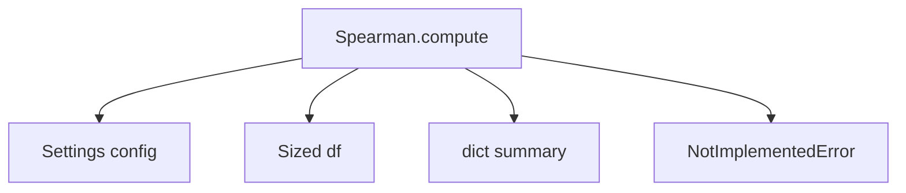
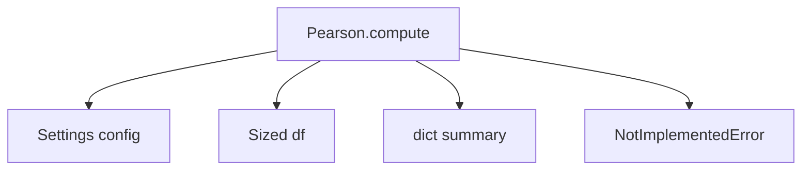

# `correlations.py`

## `src.ydata_profiling.model.correlations.Correlation` · *class*

## Summary:
Base class for implementing correlation analysis algorithms in data profiling.

## Description:
The Correlation class serves as an abstract base class defining the interface for correlation computation methods. It provides a standardized framework for calculating correlation matrices between variables in datasets. This class is designed to be subclassed by specific correlation algorithm implementations such as Pearson, Spearman, or Kendall correlation methods.

The compute method acts as the primary entry point for correlation analysis operations, accepting configuration settings, input data, and summary statistics to produce correlation results. Concrete implementations must override the compute method to provide specific correlation calculation logic.

## State:
- This is a static method class with no instance state
- The compute method accepts configuration parameters but does not store them as instance attributes
- All state management occurs through the parameters passed to the compute method

## Lifecycle:
- Creation: The class itself is not instantiated directly; it's used through its static compute method
- Usage: Called by the data profiling pipeline when correlation analysis is enabled
- Destruction: No special cleanup required as it's a static method class

## Method Map:
```mermaid
graph TD
    A[Data Profiling Pipeline] --> B[Correlation.compute()]
    B --> C{Config Check}
    C -->|Enabled| D[Subclass Implementation]
    C -->|Disabled| E[Return None]
    D --> F[Correlation Matrix]
    F --> G[Return Result]
```

## Raises:
- NotImplementedError: Raised by the base implementation to indicate that subclasses must implement the compute method

## Example:
```python
# This class is not instantiated directly
# Instead, subclasses are used like:
# from ydata_profiling.model.correlations import PearsonCorrelation
# result = PearsonCorrelation.compute(config, dataframe, summary)
```

### `src.ydata_profiling.model.correlations.Correlation.compute` · *method*

## Summary:
Base method for computing correlation matrices between variables in a dataset.

## Description:
The compute method serves as an abstract interface for correlation analysis implementations. This method is intended to be overridden by specific correlation algorithm implementations (Pearson, Spearman, etc.) to calculate correlation coefficients between variables in the provided dataset.

In the context of ydata-profiling, this method is part of a hierarchy of correlation computation classes that handle different correlation calculation methods. When called, it raises NotImplementedError indicating that a specific implementation must be provided by subclasses.

This method is typically invoked during the data profiling pipeline when correlation analysis is enabled and configured through the Settings object.

## Args:
    config (Settings): Configuration object containing correlation settings including method selection, thresholds, and calculation parameters
    df (Sized): Input dataset (typically a pandas DataFrame) containing variables to analyze for correlations
    summary (dict): Dictionary containing summary statistics of the dataset that may be used in correlation calculations

## Returns:
    Optional[Sized]: Returns correlation matrix or table containing correlation coefficients between variables, or None if correlation calculation is disabled or not applicable. Concrete implementations should return appropriate correlation data structures.

## Raises:
    NotImplementedError: Raised by this base implementation to indicate that specific correlation algorithm implementations must override this method

## State Changes:
    Attributes READ: 
    - config.correlations (accesses correlation configuration settings)
    - config.correlation_table (checks if correlation tables should be generated)
    
    Attributes WRITTEN: None (this is a base method that raises NotImplementedError)

## Constraints:
    Preconditions:
    - config must be a valid Settings object with proper correlation configuration
    - df must be a Sized object (typically pandas DataFrame) with compatible data types
    - summary must be a dictionary containing dataset summary statistics
    
    Postconditions:
    - Method raises NotImplementedError in base implementation
    - Concrete implementations must return appropriate correlation data structures

## Side Effects:
    None (this is a base method that doesn't modify external state)

## `src.ydata_profiling.model.correlations.Auto` · *class*

## Summary:
Auto correlation class that automatically selects the most appropriate correlation method based on data characteristics.

## Description:
The Auto class implements an automatic correlation selection mechanism that determines the optimal correlation algorithm (Pearson, Spearman, or Kendall) based on the properties of the input dataset. This class serves as a convenience wrapper that eliminates the need for users to manually choose correlation methods by automatically analyzing the data distribution and selecting the most suitable approach.

The class inherits from Correlation and implements the compute method as a static multimethod, which allows it to handle different data types and configurations appropriately. It is designed to be used within the ydata-profiling data analysis pipeline where automatic correlation selection improves usability and ensures appropriate statistical methods are applied.

## State:
- This is a static method class with no instance state
- The compute method accepts configuration parameters but does not store them as instance attributes
- All state management occurs through the parameters passed to the compute method
- The @multimethod decorator indicates this method can have multiple implementations based on input types

## Lifecycle:
- Creation: The class itself is not instantiated directly; it's used through its static compute method
- Usage: Called by the data profiling pipeline when automatic correlation analysis is enabled
- Destruction: No special cleanup required as it's a static method class

## Method Map:
```mermaid
graph TD
    A[Data Profiling Pipeline] --> B[Auto.compute()]
    B --> C{Input Data Type}
    C -->|Numerical| D[Pearson Correlation]
    C -->|Ordinal| E[Spearman Correlation]
    C -->|Mixed| F[Kendall Correlation]
    D --> G[Return Result]
    E --> G
    F --> G
```

## Raises:
- NotImplementedError: Raised by the base implementation to indicate that specific correlation algorithm implementations must override this method

## Example:
```python
# This class is not instantiated directly
# Instead, it's used through the static compute method:
# result = Auto.compute(config, dataframe, summary)
```

### `src.ydata_profiling.model.correlations.Auto.compute` · *method*

## Summary:
Computes correlation analysis for a given dataset using automatic correlation detection methods.

## Description:
This static method implements the correlation computation logic for the Auto correlation strategy. It overrides the abstract compute method from the parent Correlation class and performs automatic correlation analysis on the provided dataset. The method analyzes the input dataframe using configuration settings and summary statistics to generate correlation metrics.

## Args:
    config (Settings): Configuration settings that control correlation calculation behavior including enable/disable flags, thresholds, and warning levels
    df (Sized): Input dataset containing the data to analyze for correlations, typically a pandas DataFrame or similar sized data structure
    summary (dict): Pre-computed summary statistics about the dataset that may be used to optimize correlation computation

## Returns:
    Optional[Sized]: Correlation matrix or correlation-related data structure if computation is successful, None if correlation analysis is disabled or not applicable

## Raises:
    NotImplementedError: This method is not yet implemented and must be overridden by subclasses

## State Changes:
    Attributes READ: None - this is a static method
    Attributes WRITTEN: None - this is a static method

## Constraints:
    Preconditions: 
    - config must be a valid Settings object with proper correlation configuration
    - df must be a sized object (DataFrame, Series, etc.) with compatible data types
    - summary must be a dictionary containing pre-computed dataset statistics
    
    Postconditions:
    - Method should return either a correlation structure or None based on configuration
    - No modifications to input parameters are made

## Side Effects:
    None - This method is pure and doesn't perform I/O operations or mutate external state

## `src.ydata_profiling.model.correlations.Spearman` · *class*

## Summary:
Static method class for computing Spearman rank correlation coefficients in data profiling.

## Description:
The Spearman class implements the static compute method for calculating Spearman rank correlation coefficients between variables in a dataset. It inherits from the Correlation base class and serves as one of several correlation algorithm implementations in the ydata-profiling library, alongside Pearson, Kendall, and others.

Spearman correlation measures the monotonic relationship between two variables by ranking the data and computing the Pearson correlation coefficient on the ranks. This approach is particularly useful for detecting non-linear relationships and is robust to outliers. Unlike Pearson correlation which measures linear relationships, Spearman correlation can detect relationships that are consistently increasing or decreasing even if not linear.

This class is part of the correlation analysis framework and is intended to be subclassed by concrete implementations. The compute method is called by the data profiling pipeline when Spearman correlation analysis is enabled through the Settings configuration.

## State:
- Inherits from Correlation base class
- No instance attributes defined
- Static compute method with three parameters:
  * config: Settings object containing profiling configuration including correlation settings
  * df: Sized object representing the dataset (typically a pandas DataFrame) 
  * summary: Dictionary containing pre-computed dataset statistics

## Lifecycle:
- Creation: Class instantiation occurs during correlation analysis initialization
- Usage: Static compute method called with configuration, dataframe, and summary dictionary by the profiling system
- Destruction: No special cleanup required

## Method Map:


## Raises:
- NotImplementedError: Always raised by the compute method, indicating this is an abstract implementation that requires concrete subclass implementation

## Example:
```python
# This class is typically used internally by the profiling system
# Actual implementation would be in a concrete class like:
# from ydata_profiling.model.correlations import SpearmanCorrelation
# config = Settings()
# df = pandas.DataFrame({'x': [1, 2, 3], 'y': [2, 4, 6]})
# summary = {'n': 3}
# result = SpearmanCorrelation.compute(config, df, summary)  # Returns correlation matrix

# Typical usage in profiling context:
# When Settings.correlations["spearman"].calculate is True,
# the profiling system will call this compute method
```

### `src.ydata_profiling.model.correlations.Spearman.compute` · *method*

## Summary:
Abstract method for computing Spearman rank correlation coefficients between variables in a dataset.

## Description:
The Spearman.compute method serves as an abstract interface for calculating Spearman rank correlation coefficients between all pairs of numeric variables in the input dataset. As a static method within the Spearman correlation class, it defines the expected signature and behavior for correlation computation implementations. This method is intended to be overridden by concrete implementations in subclasses.

In the ydata-profiling library's correlation analysis pipeline, this method is called when Spearman correlation calculations are enabled in the configuration settings. It follows the standard pattern of accepting configuration parameters, input data, and summary statistics to produce correlation results.

## Args:
    config (Settings): Configuration object containing correlation-specific settings including enable/disable flags, warning thresholds, and calculation parameters
    df (Sized): Input dataset containing variables to correlate, typically a pandas DataFrame or compatible structure with size information
    summary (dict): Summary statistics of the dataset used for correlation computation and validation

## Returns:
    Optional[Sized]: Correlation matrix containing Spearman correlation coefficients between variable pairs, or None if correlation calculation is disabled in configuration

## Raises:
    NotImplementedError: Raised by this base implementation to indicate that subclasses must provide concrete implementation

## State Changes:
    Attributes READ: None - this is a static method that doesn't modify instance state
    Attributes WRITTEN: None - this is a static method that doesn't modify instance state

## Constraints:
    Preconditions: 
    - config must be a valid Settings object with correlation configuration
    - df must be a sized data structure (like pandas DataFrame) with numeric columns
    - summary must contain valid statistical information about the dataset
    
    Postconditions:
    - If correlation calculation is enabled, returns a symmetric correlation matrix
    - If correlation calculation is disabled, returns None
    - The returned matrix has the same dimensions as the number of numeric variables

## Side Effects:
    None - This method performs no I/O operations or external service calls

## `src.ydata_profiling.model.correlations.Pearson` · *class*

## Summary:
Static method class for computing Pearson correlation coefficients in data profiling.

## Description:
The Pearson class implements the static compute method for calculating Pearson product-moment correlation coefficients between variables in a dataset. It inherits from the Correlation base class and serves as one of several correlation algorithm implementations in the ydata-profiling library, alongside Spearman, Kendall, and others.

Pearson correlation measures the linear relationship between two continuous variables, returning a value between -1 and 1 where 1 indicates a perfect positive linear relationship, -1 indicates a perfect negative linear relationship, and 0 indicates no linear relationship. This class provides the interface contract for Pearson correlation computation, with actual implementation provided by concrete subclasses.

The compute method is called by the data profiling pipeline when Pearson correlation analysis is enabled through the Settings configuration.

## State:
- Inherits from Correlation base class
- No instance attributes defined
- Static compute method with three parameters:
  * config: Settings object containing profiling configuration including correlation settings
  * df: Sized object representing the dataset (typically a pandas DataFrame) 
  * summary: Dictionary containing pre-computed dataset statistics

## Lifecycle:
- Creation: Class instantiation occurs during correlation analysis initialization
- Usage: Static compute method called with configuration, dataframe, and summary dictionary by the profiling system
- Destruction: No special cleanup required

## Method Map:


## Raises:
- NotImplementedError: Always raised by the compute method, indicating this is an abstract implementation that requires concrete subclass implementation

## Example:
```python
# This class is typically used internally by the profiling system
# Actual implementation would be in a concrete class like:
# from ydata_profiling.model.correlations import PearsonCorrelation
# config = Settings()
# df = pandas.DataFrame({'x': [1, 2, 3], 'y': [2, 4, 6]})
# summary = {'n': 3}
# result = PearsonCorrelation.compute(config, df, summary)  # Returns correlation matrix
```

### `src.ydata_profiling.model.correlations.Pearson.compute` · *method*

## Summary:
Computes Pearson correlation coefficients between numerical variables in a dataset according to configuration settings.

## Description:
This static method implements the Pearson correlation computation algorithm for automated data profiling. It calculates linear correlation coefficients between pairs of numerical variables in the input dataset. The method serves as the primary interface for Pearson correlation analysis within the ydata-profiling library's correlation framework.

The Pearson correlation coefficient measures the strength and direction of linear relationships between variables, ranging from -1 (perfect negative correlation) to +1 (perfect positive correlation), with 0 indicating no linear correlation. This implementation is part of an extensible correlation analysis system where different correlation algorithms (Pearson, Spearman, Kendall) can be used interchangeably.

This method is called by the data profiling pipeline when correlation analysis is enabled and configured. It's separated from other logic to provide a standardized interface for correlation computations while allowing different algorithms to implement their specific calculation methods.

## Args:
    config (Settings): Configuration object containing correlation-specific settings including enable/disable flags, thresholds, and warning parameters
    df (Sized): Input dataset containing variables to correlate, typically a pandas DataFrame or compatible structure with length and indexing capabilities
    summary (dict): Dictionary containing pre-computed summary statistics about the dataset that may be used in correlation calculations

## Returns:
    Optional[Sized]: Correlation matrix or structured correlation data if calculation is enabled and successful, None if correlation calculation is disabled in configuration

## Raises:
    NotImplementedError: Always raised by this base implementation, requiring subclasses to provide actual correlation computation logic

## State Changes:
    Attributes READ: None - this is a static method that doesn't access instance state
    Attributes WRITTEN: None - this is a static method that doesn't modify instance state

## Constraints:
    Preconditions: 
    - config must be a valid Settings object with proper correlation configuration
    - df must be a Sized object (typically pandas DataFrame) with sufficient data for correlation analysis
    - summary must be a dictionary containing pre-computed statistics
    
    Postconditions:
    - If calculation is disabled in config, returns None
    - If calculation is enabled, subclasses must implement the actual computation logic

## Side Effects:
    None - This method performs no I/O operations or external service calls
    Does not mutate input parameters

## `src.ydata_profiling.model.correlations.Kendall` · *class*

## Summary:
Static method for computing Kendall's rank correlation coefficient in data profiling.

## Description:
The Kendall class provides a static compute method for calculating Kendall's tau rank correlation coefficient, which measures the ordinal association between two variables. This class inherits from Correlation and follows the pattern of implementing correlation computation methods for data profiling analysis. The current implementation raises NotImplementedError, indicating it's likely intended to be overridden by a concrete implementation.

## State:
- Inherits from Correlation base class
- No instance attributes defined
- Static compute method with three parameters:
  * config: Settings object containing profiling configuration
  * df: Sized object representing the dataset
  * summary: Dictionary containing pre-computed dataset statistics

## Lifecycle:
- Creation: Class instantiation occurs during correlation analysis initialization
- Usage: Static compute method called with configuration, dataframe, and summary dictionary
- Destruction: No special cleanup required

## Method Map:


## Raises:
- NotImplementedError: Always raised by the compute method, indicating this is an abstract implementation

## Example:
```python
# This class is typically used internally by the profiling system
# config = Settings()
# df = pandas.DataFrame(...)
# summary = {}
# result = Kendall.compute(config, df, summary)  # Raises NotImplementedError
```

### `src.ydata_profiling.model.correlations.Kendall.compute` · *method*

## Summary:
Computes Kendall's rank correlation coefficient matrix for a given dataset and configuration.

## Description:
This static method implements the Kendall correlation computation algorithm for the ydata-profiling library. As part of the Correlation base class hierarchy, it serves as an abstract interface that must be implemented by concrete correlation algorithm classes. The method calculates rank correlations between variables in a dataset according to the specified configuration parameters.

The compute method is designed to be called by the data profiling pipeline when correlation analysis is enabled. It processes the input DataFrame, configuration settings, and summary statistics to produce a correlation matrix representing the strength and direction of monotonic relationships between variables.

## Args:
    config (Settings): Configuration object containing correlation-specific settings such as calculation enablement, warning thresholds, and binning parameters
    df (Sized): Input dataset (typically a pandas DataFrame) containing the variables to correlate
    summary (dict): Pre-computed summary statistics about the dataset that may be used in correlation calculations

## Returns:
    Optional[Sized]: Correlation matrix computed using Kendall's tau rank correlation coefficient, or None if correlation calculation is disabled in the configuration

## Raises:
    NotImplementedError: Always raised by this base implementation to indicate that subclasses must provide concrete implementations

## State Changes:
    Attributes READ: None - this is a static method that doesn't modify instance state
    Attributes WRITTEN: None - this is a static method that doesn't modify instance state

## Constraints:
    Preconditions:
    - config must be a valid Settings object with proper correlation configuration
    - df must be a Sized object (typically a pandas DataFrame) with compatible data types
    - summary must be a dictionary containing pre-computed dataset statistics
    
    Postconditions:
    - If correlation calculation is disabled in config, returns None
    - If calculation is enabled, returns a correlation matrix of appropriate size and type

## Side Effects:
    None - This method performs no I/O operations or external service calls
    No mutations to input parameters or global state occur

## `src.ydata_profiling.model.correlations.Cramers` · *class*

## Summary:
Abstract base class for Cramér's V correlation computation in data profiling.

## Description:
The Cramers class implements the abstract interface for Cramér's V correlation calculations, which measure associations between categorical variables. As a subclass of Correlation, it provides the static compute method signature required by the data profiling framework for correlation analysis.

This class serves as a template for concrete implementations that will provide the actual Cramér's V calculation logic. The compute method is currently unimplemented and raises NotImplementedError, requiring subclasses to provide the specific implementation.

## State:
- This is a static method class with no instance state
- The compute method signature is: compute(config: Settings, df: Sized, summary: dict) -> Optional[Sized]
- Parameters:
  - config: Settings object containing correlation configuration parameters
  - df: Sized object representing the input dataset (typically a pandas DataFrame)
  - summary: dict containing data summary statistics for the dataset
- Return type: Optional[Sized] - correlation matrix or None if computation is disabled

## Lifecycle:
- Creation: The class is not instantiated directly; it's used through its static compute method
- Usage: Called by the data profiling pipeline when correlation analysis is enabled for categorical data
- Destruction: No special cleanup required as it's a static method class

## Method Map:
```mermaid
graph TD
    A[Data Profiling Pipeline] --> B[Cramers.compute()]
    B --> C{Config Check}
    C -->|Enabled| D[Input Validation]
    D --> E[NotImplementedError]
    C -->|Disabled| F[Return None]
```

## Raises:
- NotImplementedError: Raised by the base implementation to indicate that subclasses must implement the compute method
- DataError: May be raised during correlation computation if input data is invalid or incompatible

## Example:
```python
# This class is not instantiated directly
# It serves as a base for concrete implementations
# Subclasses would implement the actual Cramér's V calculation
# result = Cramers.compute(config, dataframe, summary)
```

### `src.ydata_profiling.model.correlations.Cramers.compute` · *method*

## Summary:
Computes Cramér's V correlation matrix for categorical variables in a dataset.

## Description:
Implements the Cramér's V correlation coefficient calculation, which measures the strength of association between categorical variables. This method computes a correlation matrix where each cell represents the Cramér's V value between two categorical variables, normalized to the range [0, 1]. Values closer to 1 indicate stronger associations, while values near 0 suggest independence.

This method is part of the correlation analysis pipeline and is called during data profiling when categorical variable correlations are computed. It serves as a specialized implementation of the abstract compute method defined in the base Correlation class.

## Args:
    config (Settings): Configuration settings for correlation analysis including calculation flags and thresholds
    df (Sized): Input dataset containing categorical variables for correlation analysis
    summary (dict): Summary statistics of the dataset used for correlation computations

## Returns:
    Optional[Sized]: Correlation matrix containing Cramér's V coefficients between categorical variables, or None if calculation is disabled or not applicable

## Raises:
    NotImplementedError: Always raised by this base implementation indicating that subclasses must override this method

## State Changes:
    Attributes READ: None - this is a static method that doesn't modify instance state
    Attributes WRITTEN: None - this is a static method that doesn't modify instance state

## Constraints:
    Preconditions: 
    - config must be a valid Settings object with proper correlation configuration
    - df must contain categorical variables suitable for Cramér's V calculation
    - summary must contain appropriate statistical information for correlation computation
    
    Postconditions:
    - The returned object maintains the same size/structure as the input data dimensions
    - If calculation is disabled, returns None

## Side Effects:
    None - This method performs no I/O operations or external service calls

## `src.ydata_profiling.model.correlations.PhiK` · *class*

## Summary:
Computes Phi-K correlation coefficients for categorical variables in data profiling.

## Description:
The PhiK class implements the Phi-K correlation coefficient method for measuring associations between categorical variables. Phi-K correlation is a measure of association for nominal categorical data, particularly useful in exploratory data analysis to identify relationships between discrete variables.

This class extends the base Correlation class and implements the static compute method that follows the standard correlation interface. It's designed to be used within the ydata-profiling library's correlation analysis framework, specifically when analyzing relationships between categorical variables in datasets.

The Phi-K correlation coefficient ranges from -1 to 1, where values near 1 indicate strong positive association, values near -1 indicate strong negative association, and values near 0 indicate independence between variables.

## State:
- This is a static method class with no instance state
- All parameters are passed through method calls rather than stored as attributes
- The compute method signature matches the parent Correlation class interface

## Lifecycle:
- Creation: The class is accessed through its static compute method; no instantiation required
- Usage: Called by the data profiling pipeline when Phi-K correlation analysis is enabled via Settings configuration
- Destruction: No special cleanup required as it's a static method class

## Method Map:
```mermaid
graph TD
    A[Data Profiling Pipeline] --> B[PhiK.compute()]
    B --> C{Config Enabled?}
    C -->|Yes| D[Calculate Phi-K Correlation]
    C -->|No| E[Return None]
    D --> F[Contingency Tables]
    F --> G[Phi-K Coefficient Calculation]
    G --> H[Correlation Matrix]
    H --> I[Return Result]
```

## Raises:
- NotImplementedError: Raised by the base implementation indicating that subclasses must implement the compute method

## Example:
```python
from ydata_profiling.config import Settings
from ydata_profiling.model.correlations import PhiK
import pandas as pd

# Create sample categorical data
df = pd.DataFrame({
    'category_a': ['X', 'Y', 'X', 'Z', 'Y'],
    'category_b': ['P', 'Q', 'P', 'R', 'Q'],
    'category_c': ['A', 'B', 'A', 'C', 'B']
})

# Configure settings to enable Phi-K correlation
settings = Settings()
settings.correlations["phi_k"].calculate = True

# Compute Phi-K correlation matrix
correlation_result = PhiK.compute(settings, df, {})

# The result would be a correlation matrix showing associations between categorical variables
# Values closer to 1 or -1 indicate stronger associations
```

### `src.ydata_profiling.model.correlations.PhiK.compute` · *method*

## Summary:
Computes correlation coefficients for categorical variables using the Phi-K method.

## Description:
The PhiK.compute method is a static method that implements correlation calculation for categorical data. As part of the correlation analysis framework in ydata-profiling, this method computes pairwise associations between categorical variables.

This method serves as an abstract interface that must be implemented by concrete subclasses. When called during data profiling, it processes the input dataset and configuration to produce a correlation matrix representing relationships between categorical variables.

## Args:
    config (Settings): Configuration object containing correlation settings such as calculation flags, thresholds, and warning levels
    df (Sized): Input dataset containing the variables to correlate, typically a pandas DataFrame or similar sized data structure
    summary (dict): Pre-computed summary statistics about the dataset that may be used in correlation calculations

## Returns:
    Optional[Sized]: Correlation matrix containing computed coefficients between categorical variables, or None if correlation calculation is disabled in config

## Raises:
    NotImplementedError: Raised by the base implementation to indicate that subclasses must implement the compute method

## State Changes:
    Attributes READ: None - this is a static method that doesn't modify instance state
    Attributes WRITTEN: None - this is a static method that doesn't modify instance state

## Constraints:
    Preconditions:
    - config must be a valid Settings object with proper correlation configuration
    - df must be a sized data structure containing categorical variables
    - summary must be a dictionary with pre-computed statistics
    
    Postconditions:
    - If calculation is enabled, returns a correlation matrix with computed coefficients
    - If calculation is disabled, returns None

## Side Effects:
    None - This method performs no I/O operations or external service calls

## `src.ydata_profiling.model.correlations.warn_correlation` · *function*

## Summary:
Issues a standardized warning message for correlation calculation failures.

## Description:
This function serves as a centralized warning mechanism for correlation-related computation issues within the data profiling system. It formats and issues warnings when correlation calculations encounter problems such as insufficient data, invalid input types, or mathematical errors.

## Args:
    correlation_name (str): The name or identifier of the correlation method or metric that encountered an issue.
    error (str): A descriptive error message explaining the specific problem encountered during correlation calculation.

## Returns:
    None: This function does not return any value but issues a warning via Python's warnings module.

## Raises:
    None: This function does not raise exceptions directly, but may trigger warnings that could be converted to exceptions if warning filters are configured accordingly.

## Constraints:
    Preconditions:
    - Both `correlation_name` and `error` parameters must be provided as strings
    - The Python warnings system must be properly initialized
    
    Postconditions:
    - A formatted warning message is issued to the Python warnings system
    - Function execution completes successfully without raising exceptions

## Side Effects:
    - Issues a warning message to Python's warnings system
    - May cause downstream warning handlers to be triggered
    - No external state mutations or I/O operations

## Control Flow:
```mermaid
flowchart TD
    A[warn_correlation called] --> B{Parameters provided}
    B -->|Yes| C[Format warning message with correlation_name and error]
    C --> D[Call warnings.warn()]
    D --> E[Function exits normally]
    B -->|No| F[Proceed with warning anyway]
    F --> E
```

## Examples:
```python
# Example usage for correlation calculation failure
warn_correlation("pearson", "Insufficient data points for correlation calculation")

# Example usage for data type issues
warn_correlation("spearman", "Data contains non-numeric values")
```

## `src.ydata_profiling.model.correlations.calculate_correlation` · *function*

## Summary:
Dispatches and computes correlation matrices using various correlation methods based on configuration.

## Description:
The calculate_correlation function acts as a factory method that selects and executes the appropriate correlation computation algorithm based on the specified correlation type. It serves as the central entry point for correlation analysis within the ydata-profiling library, routing requests to specialized correlation classes like Pearson, Spearman, Kendall, Cramers, and Phi-K.

This function is called by the data profiling pipeline when correlation analysis is requested, providing a unified interface for different correlation computation methods while handling errors gracefully through a centralized warning mechanism.

## Args:
    config (Settings): Configuration object containing correlation settings and parameters
    df (Sized): Input dataset (typically a pandas DataFrame) containing the variables to correlate
    correlation_name (str): Name of the correlation method to use ('auto', 'pearson', 'spearman', 'kendall', 'cramers', 'phi_k')
    summary (dict): Pre-computed dataset statistics used by correlation algorithms

## Returns:
    Optional[Sized]: Correlation matrix computed by the selected method, or None if computation fails or produces empty results

## Raises:
    None: Exceptions are caught and handled internally through the warn_correlation function

## Constraints:
    Preconditions:
    - config must be a valid Settings object with proper correlation configuration
    - df must be a Sized object (like pandas DataFrame) with compatible data types
    - correlation_name must be one of the supported correlation method names
    - summary must be a dictionary containing pre-computed dataset statistics

    Postconditions:
    - If successful, returns a correlation matrix of appropriate size for the input data
    - If computation fails or produces empty results, returns None
    - No modifications are made to the input parameters

## Side Effects:
    - Issues warnings via Python's warnings module when correlation computation fails
    - No direct I/O operations or external state mutations
    - No changes to the input dataset or configuration objects

## Control Flow:
```mermaid
flowchart TD
    A[calculate_correlation called] --> B{correlation_name valid?}
    B -->|No| C[Return None]
    B -->|Yes| D[Get correlation class from mapping]
    D --> E[Call correlation_class.compute()]
    E --> F{Compute succeeds?}
    F -->|No| G[Call warn_correlation]
    G --> H[Set correlation = None]
    F -->|Yes| I{Result length > 0?}
    I -->|No| J[Set correlation = None]
    I -->|Yes| K[Return correlation]
    H --> K
```

## Examples:
```python
from ydata_profiling.config import Settings
import pandas as pd

# Setup
config = Settings()
df = pd.DataFrame({'x': [1, 2, 3, 4], 'y': [2, 4, 6, 8]})
summary = {'n': 4}

# Calculate Pearson correlation
result = calculate_correlation(config, df, 'pearson', summary)
# Returns correlation matrix or None if failed

# Calculate auto correlation (automatically selects method)
result = calculate_correlation(config, df, 'auto', summary)
# Returns correlation matrix or None if failed
```

## `src.ydata_profiling.model.correlations.perform_check_correlation` · *function*

## Summary:
Identifies and returns columns in a correlation matrix that exhibit strong correlations above a specified threshold.

## Description:
This function analyzes a correlation matrix to find pairs of columns with absolute correlation coefficients exceeding a given threshold. It's commonly used in data profiling to detect multicollinearity among features. The function removes self-correlations (diagonal elements) from consideration and only returns columns that have at least one strongly correlated partner.

## Args:
    correlation_matrix (pandas.DataFrame): A square correlation matrix where rows and columns represent features, and values represent correlation coefficients between -1 and 1.
    threshold (float): Minimum absolute correlation value (between 0 and 1) to consider as "strongly correlated".

## Returns:
    Dict[str, List[str]]: A dictionary mapping each column name to a list of column names that have absolute correlation values greater than or equal to the threshold. Columns with no strong correlations return empty lists.

## Raises:
    None explicitly raised, but may raise exceptions from underlying operations like DataFrame operations or numpy operations if inputs are malformed.

## Constraints:
    Preconditions:
    - correlation_matrix must be a square pandas DataFrame with numeric correlation coefficients between -1 and 1
    - threshold must be a float between 0 and 1
    
    Postconditions:
    - The returned dictionary keys are exactly the column names from correlation_matrix
    - All values in the returned dictionary are lists of column names from correlation_matrix
    - Self-correlations (diagonal elements) are excluded from results

## Side Effects:
    None

## Control Flow:
```mermaid
flowchart TD
    A[Start perform_check_correlation] --> B[Get column names from correlation_matrix]
    B --> C[Create boolean mask for abs(correlation_matrix.values) >= threshold]
    C --> D[Set diagonal elements to False (remove self-correlations)]
    D --> E{Any strong correlations for column i?}
    E -->|Yes| F[Add column i to result with correlated columns]
    E -->|No| G[Skip column i]
    F --> H[Return result dictionary]
    G --> H
```

## Examples:
```python
# Basic usage
import pandas as pd
import numpy as np

# Create sample correlation matrix
corr_matrix = pd.DataFrame({
    'A': [1.0, 0.8, 0.2],
    'B': [0.8, 1.0, 0.1],
    'C': [0.2, 0.1, 1.0]
})

# Find columns with correlations >= 0.7
result = perform_check_correlation(corr_matrix, 0.7)
# Returns: {'A': ['B'], 'B': ['A'], 'C': []}

# Find columns with correlations >= 0.3
result = perform_check_correlation(corr_matrix, 0.3)
# Returns: {'A': ['B', 'C'], 'B': ['A', 'C'], 'C': ['A', 'B']}
```

## `src.ydata_profiling.model.correlations.get_active_correlations` · *function*

## Summary:
Returns a list of correlation method names that are enabled for calculation based on configuration settings.

## Description:
Filters and returns the names of correlation analysis methods that have their `calculate` flag set to True in the configuration. This function serves as a utility to determine which correlation analyses should be performed during the profiling process, allowing selective execution of different correlation computation methods.

The function is extracted into its own component to separate the logic of determining active correlations from the actual correlation computation logic, enforcing a clear responsibility boundary between configuration filtering and computation execution.

## Args:
    config (Settings): Configuration object containing correlation settings. Must have a `correlations` attribute which is a dictionary mapping correlation method names (strings) to objects with a `calculate` boolean attribute.

## Returns:
    List[str]: A list of correlation method names (strings) where the corresponding object has its `calculate` attribute set to True. Returns an empty list if no correlations are enabled or if config.correlations is empty.

## Raises:
    AttributeError: If the config object does not have a `correlations` attribute, or if any item in config.correlations lacks a `calculate` attribute.
    TypeError: If config.correlations is not a dictionary-like object or if config.correlations.keys() does not return an iterable.

## Constraints:
    Preconditions:
    - The config parameter must be a valid Settings object
    - The config.correlations attribute must be a dictionary-like object with string keys
    - Each value in config.correlations must have a `calculate` boolean attribute
    
    Postconditions:
    - The returned list contains only correlation method names where calculate=True
    - The returned list is ordered according to the iteration order of config.correlations.keys()
    - The returned list is never None (returns empty list if no correlations enabled)

## Side Effects:
    None

## Control Flow:
```mermaid
flowchart TD
    A[Start get_active_correlations] --> B{config.correlations.keys()}
    B --> C[Iterate through correlation names]
    C --> D{config.correlations[name].calculate}
    D -->|True| E[Add name to result list]
    D -->|False| F[Skip name]
    E --> G{More names?}
    F --> G
    G -->|Yes| C
    G -->|No| H[Return result list]
```

## Examples:
```python
from ydata_profiling.config import Settings

# Create settings with some correlations enabled
settings = Settings()
# By default, only "auto" correlation is enabled (calculate=True)
active_correlations = get_active_correlations(settings)
# Returns: ['auto']

# Manually enable additional correlations
settings.correlations["spearman"].calculate = True
active_correlations = get_active_correlations(settings)
# Returns: ['auto', 'spearman']

# With no correlations enabled
for corr in settings.correlations.values():
    corr.calculate = False
active_correlations = get_active_correlations(settings)
# Returns: []
```

