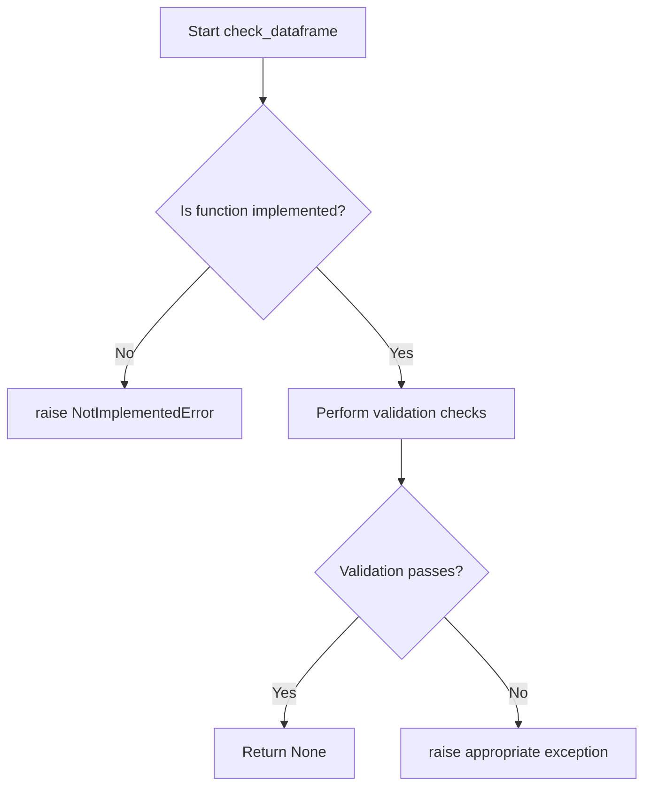
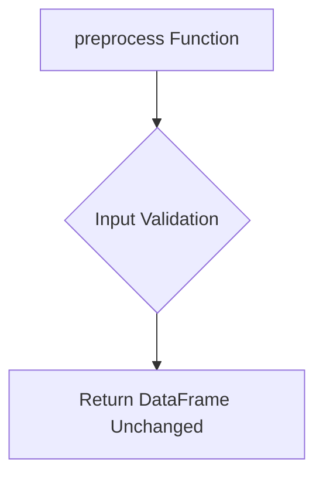

# `dataframe.py`

## `src.ydata_profiling.model.dataframe.check_dataframe` · *function*

## Summary:
Placeholder function for validating dataframe objects before data profiling operations.

## Description:
Serves as a placeholder for dataframe validation logic in the data profiling system. This function is designed to validate that a dataframe object meets the structural and content requirements necessary for statistical analysis and profiling operations.

The function is extracted into its own component to enforce a clear responsibility boundary between dataframe preparation and actual profiling logic, allowing for centralized validation that can be reused across different profiling workflows.

## Args:
    df (Any): The dataframe object to validate. Expected to be a pandas DataFrame or compatible data structure.

## Returns:
    None: This function does not return any value.

## Raises:
    NotImplementedError: When the validation logic has not been implemented yet.

## Constraints:
    Preconditions:
    - Input must be a valid dataframe-like object (pandas DataFrame, etc.)
    - Input must not be None
    
    Postconditions:
    - Function completes without raising validation errors for valid dataframes
    - All structural requirements for profiling are satisfied

## Side Effects:
    None: This function performs validation checks without modifying the input dataframe or external state.

## Control Flow:


## Examples:
```python
# This will raise NotImplementedError since function is not implemented
try:
    check_dataframe(some_dataframe)
except NotImplementedError:
    print("DataFrame validation not yet implemented")
```

## `src.ydata_profiling.model.dataframe.preprocess` · *function*

## Summary:
Processes and prepares a DataFrame for profiling according to configuration settings.

## Description:
This function serves as a preprocessing hook for DataFrame objects within the profiling system. It currently returns the input DataFrame unchanged but is designed to be overridden in subclasses to implement specific preprocessing logic based on configuration settings. The function acts as a placeholder that can be extended to handle data cleaning, transformation, or validation operations before statistical analysis.

## Args:
    config (Settings): Configuration object containing profiling settings and parameters that may influence preprocessing behavior
    df (Any): Input DataFrame to be processed or prepared for profiling

## Returns:
    Any: The processed DataFrame, which currently equals the input DataFrame unchanged

## Raises:
    None: This implementation does not raise any exceptions

## Constraints:
    Preconditions:
        - config parameter must be a valid Settings object
        - df parameter must be a valid DataFrame-like object
    
    Postconditions:
        - The returned object maintains the same structure as the input DataFrame
        - No modifications are made to the input DataFrame in this base implementation

## Side Effects:
    None: This implementation performs no external I/O or state mutations

## Control Flow:


## Examples:
```python
# Basic usage
config = Settings()
df = pd.DataFrame({'A': [1, 2, 3], 'B': [4, 5, 6]})
processed_df = preprocess(config, df)
# processed_df equals df unchanged
```

