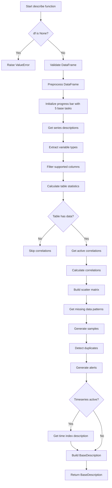

# `describe.py`

## `src.ydata_profiling.model.describe.describe` · *function*

## Summary:
Creates a comprehensive statistical description of a DataFrame by performing various analytical operations including variable type detection, table statistics calculation, correlation analysis, missing data visualization, and data quality alerts generation.

## Description:
The `describe` function serves as the main entry point for generating a complete statistical profile of a dataset. It orchestrates a multi-stage analysis pipeline that processes input data through various specialized components to produce a rich set of descriptive statistics, visualizations, and quality assessments.

This function is extracted into its own component to enforce a clear responsibility boundary between the high-level orchestration of the profiling process and the individual analytical operations. It provides a centralized workflow that coordinates the execution of multiple specialized analysis functions while managing progress tracking and resource cleanup.

## Args:
    config (Settings): Configuration object containing profiling settings and parameters that control the analysis behavior
    df (pd.DataFrame): Input DataFrame to be analyzed and described
    summarizer (BaseSummarizer): Object responsible for summarizing data characteristics using configured summarization methods
    typeset (VisionsTypeset): Set of data type definitions used for variable type detection and classification
    sample (Optional[dict]): Custom sample data to use instead of generating a random sample, defaults to None

## Returns:
    BaseDescription: An object containing all the statistical descriptions, analyses, and metadata generated during the profiling process. The BaseDescription object includes:
    - analysis (BaseAnalysis): Metadata about the analysis run including title and timestamps
    - time_index_analysis (Optional[TimeIndexAnalysis]): Time series index analysis when time series features are enabled
    - table (dict): Comprehensive table statistics including row/column counts, missing value information, and duplicate counts
    - variables (dict): Detailed descriptions for each variable/column including type, statistics, and metadata
    - scatter (dict): Scatter plot matrix data for continuous variable pairs
    - correlations (dict): Correlation matrices for enabled correlation methods
    - missing (dict): Missing data visualization patterns and configurations
    - alerts (list): Sorted list of data quality alerts detected during analysis
    - package (dict): Package version and configuration information for reproducibility
    - sample (list): Sample data points (either random or custom)
    - duplicates (Optional[pd.DataFrame]): Duplicate detection results when enabled

## Raises:
    ValueError: When the input DataFrame is None, indicating a lazy ProfileReport without actual data

## Constraints:
    Preconditions:
    - config must be a valid Settings object with properly initialized configurations
    - df must be a valid pandas DataFrame (or compatible data structure)
    - summarizer must be a valid BaseSummarizer instance
    - typeset must be a valid VisionsTypeset instance
    - sample, when provided, must be a dictionary with valid sample data structure
    
    Postconditions:
    - The returned BaseDescription object contains all analysis results in a structured format
    - All intermediate processing steps are completed successfully
    - Progress bar is properly updated and closed

## Side Effects:
    - Creates a progress bar visualization during execution using tqdm
    - May perform I/O operations for data sampling and visualization generation
    - Updates global state through progress tracking mechanisms
    - Calls external functions that may perform their own side effects

## Control Flow:


## Examples:
```python
from ydata_profiling.config import Settings
from ydata_profiling.model.summarizer import BaseSummarizer
from visions import VisionsTypeset
import pandas as pd

# Basic usage
config = Settings()
df = pd.DataFrame({'A': [1, 2, 3], 'B': [4, 5, 6]})
summarizer = BaseSummarizer()
typeset = VisionsTypeset()

description = describe(config, df, summarizer, typeset)
# Returns a BaseDescription object with full analysis results

# Usage with custom sample
custom_sample = {'data': df.head(5), 'name': 'Top 5 rows'}
description = describe(config, df, summarizer, typeset, sample=custom_sample)
# Uses custom sample instead of generating random sample
```

