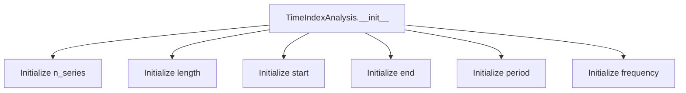
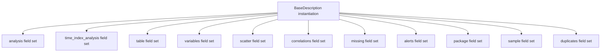

# `description.py`

## `src.ydata_profiling.model.description.BaseAnalysis` · *class*

## Summary:
Represents a base analysis with a title and temporal scope defined by start and end dates.

## Description:
The BaseAnalysis class serves as a foundational abstraction for representing analytical work with a defined temporal scope. It encapsulates a title and a date range (either single or multiple) to represent the time period covered by an analysis. This class is intended to be inherited by more specific analysis types that require temporal metadata.

## State:
- title: str - The descriptive title of the analysis
- date_start: Union[datetime, List[datetime]] - The starting date(s) of the analysis period
- date_end: Union[datetime, List[datetime]] - The ending date(s) of the analysis period

The class maintains consistency between date_start and date_end types - both must either be datetime objects or lists of datetime objects. When date_start and date_end are lists, they must have equal length.

## Lifecycle:
Creation: Instances are created by calling the constructor with a title string and two datetime objects or two lists of datetime objects.
Usage: Typically accessed to retrieve the title, date range information, or calculate duration.
Destruction: No special cleanup required; standard Python garbage collection applies.

## Method Map:
```mermaid
graph TD
    A[BaseAnalysis.__init__] --> B[title, date_start, date_end set]
    B --> C[duration property access]
    C --> D{date_start type}
    D -->|datetime| E[date_end - date_start]
    D -->|list| F[date_end[i] - date_start[i] for i in range(len(date_start))]
```

## Raises:
- ValueError: Raised when date_start and date_end have mismatched types (one is datetime, the other is list) or when date_start and date_end are both lists of unequal length.

## Example:
```python
from datetime import datetime
from ydata_profiling.model.description import BaseAnalysis

# Single date range
start_date = datetime(2023, 1, 1)
end_date = datetime(2023, 12, 31)
analysis = BaseAnalysis("Annual Report", start_date, end_date)
print(analysis.title)  # "Annual Report"
print(analysis.duration)  # timedelta(days=364)

# Multiple date ranges
start_dates = [datetime(2023, 1, 1), datetime(2023, 7, 1)]
end_dates = [datetime(2023, 6, 30), datetime(2023, 12, 31)]
multi_analysis = BaseAnalysis("Half-Year Reports", start_dates, end_dates)
print(multi_analysis.duration)  # [timedelta(days=180), timedelta(days=183)]
```

### `src.ydata_profiling.model.description.BaseAnalysis.__init__` · *method*

## Summary:
Initializes a BaseAnalysis object with a title and date range.

## Description:
The constructor creates a BaseAnalysis instance that represents an analysis with a descriptive title and a temporal scope defined by start and end dates. This base class provides common attributes for various types of data analysis operations that have temporal characteristics.

## Args:
    title (str): A descriptive title for the analysis operation
    date_start (datetime): The starting datetime of the analysis period
    date_end (datetime): The ending datetime of the analysis period

## Returns:
    None: This method initializes the object's state and does not return a value

## Raises:
    None: This method does not explicitly raise exceptions

## State Changes:
    Attributes READ: None
    Attributes WRITTEN: self.title, self.date_start, self.date_end

## Constraints:
    Preconditions: 
    - title must be a string
    - date_start and date_end must be datetime objects
    - date_end should be after or equal to date_start (though this is not validated in the constructor)
    
    Postconditions:
    - The instance will have title, date_start, and date_end attributes set to the provided values
    - These attributes can be accessed via self.title, self.date_start, and self.date_end

## Side Effects:
    None: This method performs no I/O operations or external service calls

### `src.ydata_profiling.model.description.BaseAnalysis.duration` · *method*

## Summary:
Calculates the time duration between start and end date/time points.

## Description:
Computes the difference between date_start and date_end attributes. This method handles two scenarios: when both attributes contain single datetime objects, returning a single timedelta; or when both contain lists of datetime objects, returning a list of timedeltas representing durations between corresponding pairs.

## Args:
    None

## Returns:
    Union[timedelta, List[timedelta]]: A single timedelta when date_start and date_end are datetime objects, or a list of timedeltas when they are lists of datetime objects.

## Raises:
    ValueError: When date_start and date_end are not both datetime objects or both lists of datetime objects.

## State Changes:
    Attributes READ: self.date_start, self.date_end
    Attributes WRITTEN: None

## Constraints:
    Preconditions: 
    - Both self.date_start and self.date_end must be either datetime objects or lists of datetime objects
    - If lists are provided, they must have equal length
    Postconditions:
    - Returns timedelta or list of timedeltas representing the duration between start and end points

## Side Effects:
    None

## `src.ydata_profiling.model.description.TimeIndexAnalysis` · *class*

## Summary:
Data class for storing time index analysis results including series count, temporal bounds, and periodicity information.

## Description:
The TimeIndexAnalysis class serves as a container for metadata extracted during time series analysis. It captures essential characteristics of time-indexed data such as the number of series, temporal span, period duration, and frequency information. This class is typically instantiated by analysis components that process time series data to provide structured summary information.

## State:
- n_series: Union[int, List[int]] - Number of time series or list of series counts. Must be non-negative integers.
- length: Union[int, List[int]] - Length of the time series or list of lengths. Must be non-negative integers.
- start: Any - Start timestamp or datetime object representing the beginning of the time series.
- end: Any - End timestamp or datetime object representing the end of the time series.
- period: Union[float, List[float]] - Time period value or list of period values. Should be positive numeric values.
- frequency: Union[Optional[str], List[Optional[str]]] - Frequency string or list of frequency strings describing the sampling rate, or None if unknown.

## Lifecycle:
- Creation: Instantiate with required parameters n_series, length, start, end, and period. Optional frequency parameter defaults to None.
- Usage: Access attributes directly to retrieve time series metadata. No special method invocation sequence required.
- Destruction: Automatic garbage collection when no references remain.

## Method Map:


## Raises:
- No explicit exceptions raised during initialization.
- Attribute assignment may raise exceptions if invalid types are provided (dependent on usage context).

## Example:
```python
# Create a time index analysis instance
analysis = TimeIndexAnalysis(
    n_series=1,
    length=100,
    start=datetime(2023, 1, 1),
    end=datetime(2023, 12, 31),
    period=1.0,
    frequency="D"
)

# Access the stored information
print(f"Series count: {analysis.n_series}")
print(f"Length: {analysis.length}")
print(f"Period: {analysis.period}")
print(f"Frequency: {analysis.frequency}")
```

### `src.ydata_profiling.model.description.TimeIndexAnalysis.__init__` · *method*

## Summary:
Initializes a TimeIndexAnalysis object with time series metadata including series count, temporal bounds, and periodicity information.

## Description:
The __init__ method constructs a TimeIndexAnalysis instance by setting all provided parameters as instance attributes. This method serves as the primary constructor for creating time index analysis objects that store metadata about time-series data characteristics such as number of series, temporal span, and period information.

## Args:
- n_series (int): Number of time series in the dataset
- length (int): Total length of the time series
- start (Any): Start timestamp or datetime object representing the beginning of the time series
- end (Any): End timestamp or datetime object representing the end of the time series
- period (float): Time period value representing the sampling interval
- frequency (Optional[str]): Frequency string describing the sampling rate, or None if unknown. Defaults to None

## Returns:
- None: This method does not return any value

## Raises:
- No explicit exceptions are raised by this method
- Attribute assignment may raise exceptions if invalid types are provided during attribute assignment

## State Changes:
- Attributes READ: No attributes are read from self
- Attributes WRITTEN: 
  - self.n_series: Set to the provided n_series parameter
  - self.length: Set to the provided length parameter  
  - self.start: Set to the provided start parameter
  - self.end: Set to the provided end parameter
  - self.period: Set to the provided period parameter
  - self.frequency: Set to the provided frequency parameter

## Constraints:
- Preconditions: All parameters must be provided except frequency which defaults to None
- Postconditions: All provided parameters are stored as instance attributes with their exact values

## Side Effects:
- No I/O operations, external service calls, or mutations to objects outside self
- Direct attribute assignment to instance variables only

## `src.ydata_profiling.model.description.BaseDescription` · *class*

## Summary:
BaseDescription is a data class that aggregates and stores various components of data profiling analysis results including metadata, variable statistics, correlations, missing values, alerts, and sample data.

## Description:
The BaseDescription class serves as a container for organizing and storing the comprehensive results of data profiling analyses. It consolidates different aspects of data analysis into a single structured object, making it easier to manage and pass around analysis results throughout the profiling pipeline. This class is designed to hold metadata about the analysis itself, variable-level information, correlation matrices, missing value patterns, alerts, and sample data.

## State:
- analysis: BaseAnalysis - Contains the main analysis metadata including title and temporal scope
- time_index_analysis: Optional[TimeIndexAnalysis] - Stores time series analysis results when applicable, or None if not a time series analysis
- table: Any - Holds general table-level statistics and metadata
- variables: Dict[str, Any] - Maps variable names to their detailed analysis results
- scatter: Any - Stores scatter plot related analysis data
- correlations: Dict[str, Any] - Contains correlation matrix and related correlation analysis results
- missing: Dict[str, Any] - Holds missing value pattern analysis results
- alerts: Any - Stores alert or anomaly detection results
- package: Dict[str, Any] - Contains package/version information or other metadata
- sample: Any - Holds sample data or sampling-related analysis results
- duplicates: Any - Stores duplicate detection and analysis results

## Lifecycle:
Creation: Instances are typically created by analysis pipelines or factory methods that populate each field with relevant analysis results. As this is a dataclass without an explicit __init__, it likely uses dataclass-generated initialization or is populated via assignment after instantiation.
Usage: Once created, the instance is used to store and retrieve various analysis components. Fields are accessed directly to retrieve specific analysis results.
Destruction: Standard Python garbage collection handles cleanup when no references to the instance remain.

## Method Map:


## Raises:
- No explicit exceptions are raised during initialization as this is primarily a data container
- Field assignment may raise exceptions if invalid types are provided (dependent on usage context)

## Example:
```python
# Typical usage would involve creating an instance populated with analysis results
description = BaseDescription(
    analysis=BaseAnalysis("Dataset Analysis", start_date, end_date),
    time_index_analysis=None,
    table=table_stats,
    variables={"column1": var_analysis1, "column2": var_analysis2},
    scatter=scatter_data,
    correlations={"pearson": corr_matrix},
    missing={"pattern": missing_pattern},
    alerts=alerts_data,
    package={"version": "1.0.0"},
    sample=sample_data,
    duplicates=duplicate_info
)

# Accessing specific analysis components
print(description.analysis.title)
print(description.variables["column1"])
```

