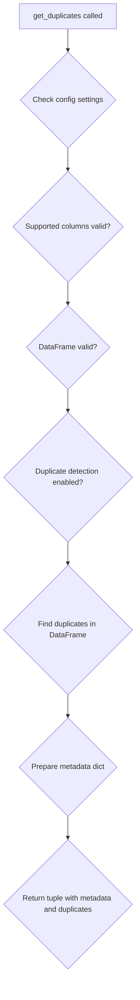

# `duplicates.py`

## `src.ydata_profiling.model.duplicates.get_duplicates` · *function*

## Summary
Detects duplicate rows in a DataFrame and returns metadata about duplicate occurrences along with the duplicate rows themselves.

## Description
The `get_duplicates` function performs duplicate row detection on a given DataFrame using specified columns. It analyzes the data to identify rows that appear more than once according to the configured duplicate detection criteria and returns both statistical information about the duplicates and the actual duplicate rows.

This function is part of the data profiling pipeline and is typically invoked during the profiling process to identify and report on duplicate data entries. The function leverages the configuration settings to determine how many duplicate records to display and what approach to use for detecting duplicates.

## Args
- config (Settings): Configuration object containing duplicate detection settings such as the maximum number of duplicate records to display (`head`) and labeling key (`key`)
- df (T): Input DataFrame containing the data to analyze for duplicates
- supported_columns (Sequence): Sequence of column names to consider when determining duplicate rows

## Returns
- Tuple[Dict[str, Any], Optional[T]]: A tuple containing:
  - Dictionary with metadata about duplicate detection results including counts, statistics, and configuration information
  - DataFrame containing the actual duplicate rows, or None if no duplicates are found or if the configuration prevents their return

## Raises
- NotImplementedError: This function is currently not implemented and raises this exception when called

## Constraints
- Preconditions: 
  - The `config` parameter must be a valid Settings object with proper duplicate configuration
  - The `df` parameter must be a valid DataFrame-like object
  - The `supported_columns` parameter must be a sequence of valid column names present in the DataFrame
- Postconditions:
  - The returned dictionary will contain metadata about duplicate detection results
  - The returned DataFrame (if not None) will contain only rows that are identified as duplicates

## Side Effects
- None: This function does not perform any I/O operations or mutate external state

## Control Flow


## Examples
```python
from ydata_profiling.config import Settings
from ydata_profiling.model.duplicates import get_duplicates

# Configure duplicate detection
config = Settings(duplicates=Duplicates(head=5))

# Assuming df is a pandas DataFrame
try:
    metadata, duplicate_rows = get_duplicates(config, df, ['column1', 'column2'])
    print(f"Found {metadata['count']} duplicate rows")
    if duplicate_rows is not None:
        print(f"Displaying first {len(duplicate_rows)} duplicates")
except NotImplementedError:
    print("Duplicate detection not yet implemented")
```

