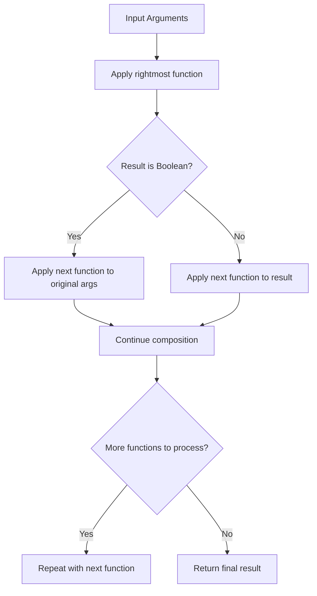
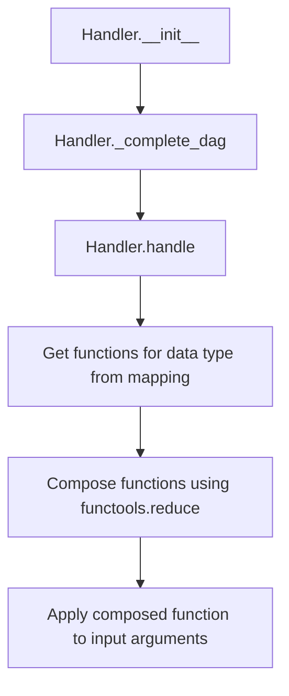
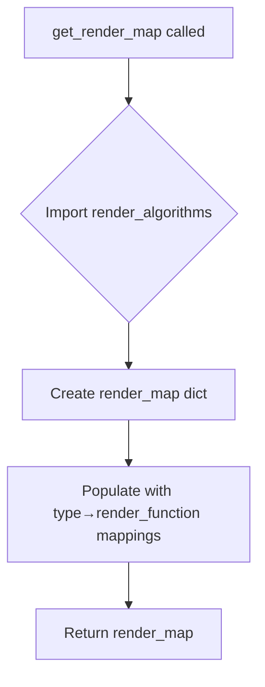

# `handler.py`

## `src.ydata_profiling.model.handler.compose` · *function*

## Summary:
Creates a composed function that applies a sequence of functions from right to left, with conditional execution based on boolean return values.

## Description:
This function implements right-to-left function composition where multiple callable functions are combined into a single function. The composition processes functions from right to left through the provided sequence. When a function in the sequence returns a boolean value, the next function in the composition is applied to the original arguments rather than to the boolean result. This enables conditional execution patterns within function composition.

## Args:
    functions (Sequence[Callable]): A sequence of callable functions to compose together

## Returns:
    Callable: A new function that represents the composition of all input functions

## Raises:
    None explicitly raised

## Constraints:
    Preconditions:
    - All elements in the functions sequence must be callable
    - The sequence should not be empty, though an empty sequence returns identity function
    
    Postconditions:
    - The returned function will apply all provided functions in reverse order (right to left)
    - If a function in the chain returns a boolean, the subsequent function is applied to original arguments
    - If a function in the chain returns a non-boolean value, the subsequent function is applied to that result

## Side Effects:
    None

## Control Flow:


## Examples:
```python
# Basic composition
def add_one(x): return x + 1
def multiply_by_two(x): return x * 2
composed = compose([add_one, multiply_by_two])
result = composed(5)  # Returns 12 (multiply_by_two(add_one(5)))

# Conditional execution with boolean return
def is_positive(x): return x > 0
def square(x): return x * x
composed = compose([is_positive, square])
result = composed(-3)  # Returns False (is_positive(-3) returns False, so square not applied)

# Another conditional example showing the full behavior
def is_even(x): return x % 2 == 0
def double(x): return x * 2
def add_ten(x): return x + 10
composed = compose([is_even, double, add_ten])
result1 = composed(4)  # Returns 18 (is_even(4) returns True, so double(4)=8, then add_ten(8)=18)
result2 = composed(3)  # Returns 13 (is_even(3) returns False, so add_ten(3)=13)
```

## `src.ydata_profiling.model.handler.Handler` · *class*

## Summary:
A type handler that manages function mappings for data type processing through composed function application with automatic DAG completion for type conversions.

## Description:
The Handler class serves as a type-aware processor that maintains mappings of data types to sequences of functions. It leverages a VisionsTypeset to understand type relationships and automatically completes type conversion paths in a directed acyclic graph (DAG) by augmenting function mappings based on type conversion relationships derived from the typeset's base graph.

This enables efficient processing of data by composing appropriate functions based on data type. The handler ensures that type conversion chains are properly established through automatic DAG completion, providing a unified interface for applying processing functions to data through function composition.

## State:
- mapping: Dict[str, List[Callable]] - Maps data type names to lists of processing functions that will be composed together using the compose function
- typeset: VisionsTypeset - Contains type relationships and base graph defining valid type conversion paths
- During initialization, the mapping is augmented to include type conversion paths by extending function lists according to the type hierarchy

## Lifecycle:
- Creation: Instantiate with a mapping dictionary, VisionsTypeset, and optional arguments. The constructor automatically completes the DAG of type relationships by modifying the mapping dictionary.
- Usage: Call handle() method with a data type string and arguments to process data through composed functions
- Destruction: No explicit cleanup required; relies on Python's garbage collection

## Method Map:


## Raises:
- None explicitly raised in the provided implementation
- Runtime errors may occur if functions in mappings fail or if data type is not found in mapping

## Example:
```python
# Create a handler with type mappings
handler = Handler(mapping={"int": [validate_int, convert_to_str]}, typeset=my_typeset)

# Process data of a specific type
result = handler.handle("int", raw_data)
```

### `src.ydata_profiling.model.handler.Handler.__init__` · *method*

## Summary:
Initializes a type handler with function mappings and completes type conversion DAGs for automatic handler propagation.

## Description:
Constructs a Handler instance by storing the provided type-to-function mappings and typeset, then automatically completes the type conversion graph by propagating handler functions through type relationships. This ensures that all type conversion paths have appropriate handler functions available for processing data of various related types.

The initialization process establishes the foundation for type-aware data processing by ensuring that handler functions are properly accumulated throughout the type hierarchy before the handler is ready for use.

## Args:
    mapping (Dict[str, List[Callable]]): Dictionary mapping data type names to lists of callable processing functions that will be composed together for that type
    typeset (VisionsTypeset): Object containing type relationships and base graph defining valid type conversion paths
    *args: Additional positional arguments (passed to parent class constructors if applicable)
    **kwargs: Additional keyword arguments (passed to parent class constructors if applicable)

## Returns:
    None

## Raises:
    None explicitly raised in this method

## State Changes:
    Attributes READ: None
    Attributes WRITTEN: 
    - self.mapping: Stores the provided mapping dictionary
    - self.typeset: Stores the provided typeset object

## Constraints:
    Preconditions:
    - mapping must be a dictionary mapping type names (strings) to lists of callable functions
    - typeset must be a valid VisionsTypeset instance with a proper base_graph
    - All functions in mapping must be callable and compatible with the intended data processing workflow
    
    Postconditions:
    - self.mapping contains the original mapping plus propagated handler functions for type relationships
    - self.typeset is properly stored for use in subsequent operations
    - The handler is ready for use in processing data through the handle() method

## Side Effects:
    - Calls self._complete_dag() which modifies self.mapping in-place by propagating handler functions through type relationships
    - No external I/O or service calls

### `src.ydata_profiling.model.handler.Handler._complete_dag` · *method*

## Summary:
Completes type handler mappings by propagating handlers through type relationships in a directed acyclic graph.

## Description:
This method implements a graph-based propagation algorithm that accumulates type handlers from ancestor types to descendant types. It constructs the line graph of the Visions typeset's base graph and performs a topological sort to determine the correct order of handler propagation. For each edge in the sorted order, it combines the handler lists from the source type with those from the target type.

The method is called during Handler initialization to ensure all type handlers are properly accumulated before the handler is ready for use in processing data types.

## Args:
    None

## Returns:
    None

## Raises:
    None explicitly raised

## State Changes:
    Attributes READ: self.typeset.base_graph, self.mapping
    Attributes WRITTEN: self.mapping (updates values in-place by concatenating handler lists)

## Constraints:
    Preconditions:
    - self.typeset must be a VisionsTypeset instance containing a valid directed graph base_graph
    - self.mapping must be a dictionary mapping type names (as strings) to lists of callable handler functions
    - The base_graph must be a NetworkX DiGraph representing type inheritance/relationship hierarchies
    
    Postconditions:
    - All type entries in self.mapping contain complete handler lists accumulated from their type hierarchy
    - The mapping maintains the correct propagation order established by the topological sort

## Side Effects:
    None

### `src.ydata_profiling.model.handler.Handler.handle` · *method*

## Summary:
Applies a composed sequence of type-specific handlers to input arguments for the specified data type.

## Description:
Processes input arguments through a sequence of registered handler functions associated with the given data type. The method retrieves the appropriate handler functions from the internal mapping, composes them using a right-to-left composition strategy, and executes the composed function with the provided arguments.

This method serves as the primary interface for applying type-specific processing logic to data during profiling operations. It enables dynamic dispatch of handler functions based on data type while supporting conditional execution patterns through the compose function.

## Args:
    dtype (str): The data type identifier for which to retrieve and apply handlers
    *args: Variable length argument list passed to the composed handler functions
    **kwargs: Arbitrary keyword arguments passed to the composed handler functions

## Returns:
    dict: The result of executing the composed handler functions on the input arguments

## Raises:
    None explicitly raised

## State Changes:
    Attributes READ: self.mapping, self.typeset
    Attributes WRITTEN: None directly modified by this method (though indirectly via _complete_dag during initialization)

## Constraints:
    Preconditions:
    - The Handler instance must be properly initialized with a valid mapping and typeset
    - The dtype parameter must correspond to a key in self.mapping (or be a key that will be handled by _complete_dag)
    - All functions in the handler sequence must be callable and compatible with the provided arguments
    
    Postconditions:
    - The returned value is the result of applying all registered handlers for the specified dtype to the input arguments
    - The composition follows right-to-left execution order as implemented by the compose function

## Side Effects:
    None

## `src.ydata_profiling.model.handler.get_render_map` · *function*

## Summary:
Returns a dictionary mapping data type names to their corresponding rendering functions for report generation.

## Description:
This function serves as a factory that creates and returns a mapping between data type identifiers and their associated rendering functions. The returned dictionary is used throughout the profiling system to determine which rendering method should be applied to different data types when generating reports. The function centralizes the association between data types and their visual representation logic, making it easier to manage and extend rendering capabilities.

## Args:
    None

## Returns:
    Dict[str, Callable]: A dictionary where keys are data type names (strings) and values are callable rendering functions. The dictionary contains mappings for the following data types:
    - "Boolean" → render_boolean
    - "Numeric" → render_real  
    - "Complex" → render_complex
    - "Text" → render_text
    - "DateTime" → render_date
    - "Categorical" → render_categorical
    - "URL" → render_url
    - "Path" → render_path
    - "File" → render_file
    - "Image" → render_image
    - "Unsupported" → render_generic
    - "TimeSeries" → render_timeseries

## Raises:
    None

## Constraints:
    Preconditions:
    - The module `ydata_profiling.report.structure.variables` must be importable
    - All referenced render functions must exist in the imported module
    
    Postconditions:
    - The returned dictionary is immutable (though the dict object itself can be modified by the caller)
    - All values in the returned dictionary are callable objects

## Side Effects:
    None

## Control Flow:


## Examples:
```python
# Typical usage in a profiling context
render_map = get_render_map()
render_function = render_map["Numeric"]
# Use render_function to render numeric data
```

