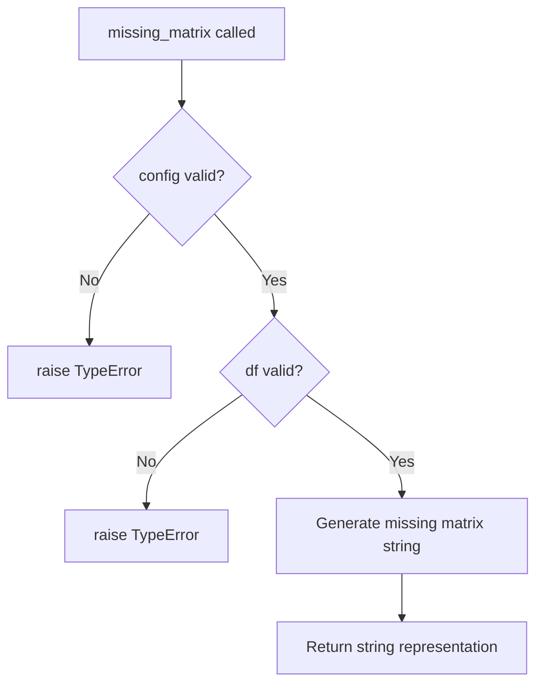
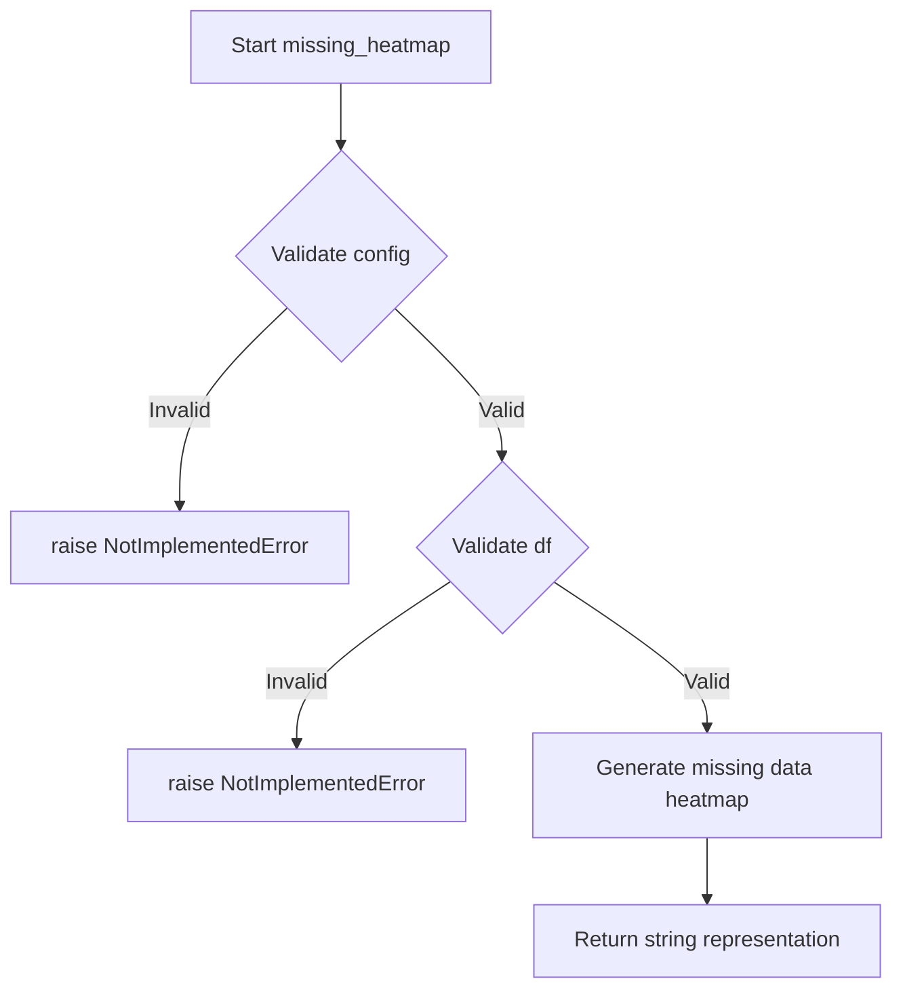
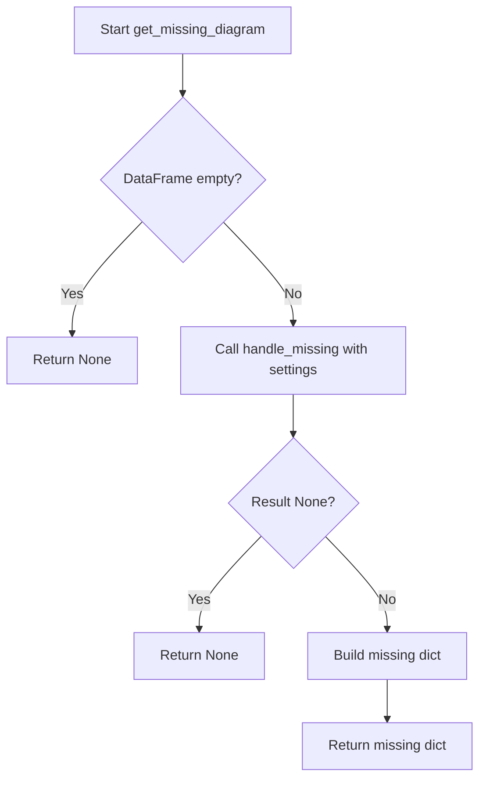

# `missing.py`

## `src.ydata_profiling.model.missing.missing_bar` · *function*

## Summary:
Generates a bar chart visualization representing the distribution of missing values across columns in a DataFrame.

## Description:
Creates a string representation of a bar chart that displays the count or percentage of missing values for each column in the provided DataFrame. This function is part of the missing data visualization suite and is typically invoked when generating profiling reports that include missing value analysis.

The function leverages the configuration settings to determine appropriate visualization parameters and returns a string representation that can be embedded in reports or rendered as visual elements.

## Args:
    config (Settings): Configuration object containing profiling settings, particularly missing data visualization options
    df (Any): Input DataFrame containing the data to analyze for missing values

## Returns:
    str: String representation of the missing data bar chart, typically in a format suitable for HTML rendering or markdown display

## Raises:
    NotImplementedError: Currently always raised as the implementation is not yet completed

## Constraints:
    Preconditions:
    - config must be a valid Settings instance with proper initialization
    - df must be a valid DataFrame-like object that supports basic operations like .isnull() and .sum()
    
    Postconditions:
    - Function should return a properly formatted string representation of a bar chart
    - The returned string should accurately represent missing value distributions

## Side Effects:
    None: This function is designed to be pure and not modify any external state

## Control Flow:
```mermaid
flowchart TD
    A[Start missing_bar] --> B{Config missing_diagrams["bar"]?}
    B -- No --> C[Return empty/placeholder]
    B -- Yes --> D[Calculate missing values per column]
    D --> E[Format data for bar chart]
    E --> F[Generate string representation]
    F --> G[Return string]
```

## Examples:
```python
from ydata_profiling.config import Settings
import pandas as pd

# Create sample data with missing values
df = pd.DataFrame({
    'A': [1, 2, None, 4],
    'B': [None, 2, 3, 4],
    'C': [1, None, None, 4]
})

# Configure settings to enable bar charts
config = Settings(missing_diagrams={"bar": True})

# This would generate a bar chart representation
# result = missing_bar(config, df)
```

## `src.ydata_profiling.model.missing.missing_matrix` · *function*

## Summary:
Placeholder function for generating a string representation of the missing data pattern matrix for a given DataFrame.

## Description:
This function is intended to create a visual representation showing the locations of missing values in the input DataFrame. It serves as a placeholder for the actual implementation that will generate missing data patterns, typically used during data profiling to help users understand the structure and extent of missing information in their datasets.

## Args:
    config (Settings): Configuration settings that control the formatting and display options for the missing matrix.
    df (Any): Input DataFrame containing the data to analyze for missing values. Expected to be a pandas DataFrame or compatible structure.

## Returns:
    str: A string representation of the missing data matrix, typically formatted as HTML or text that can be rendered in reports or dashboards.

## Raises:
    NotImplementedError: This function is currently not implemented and will always raise this exception when called.

## Constraints:
    Preconditions:
    - The config parameter must be a valid Settings object
    - The df parameter must be a valid DataFrame-like object
    
    Postconditions:
    - When properly implemented, the function will return a properly formatted string representation of missing data patterns

## Side Effects:
    None: This function does not perform any I/O operations or modify external state.

## Control Flow:


## Examples:
    # Typical usage in a data profiling context (currently raises NotImplementedError)
    config = Settings()
    df = pd.DataFrame({'A': [1, None, 3], 'B': [None, 2, 3]})
    # matrix_str = missing_matrix(config, df)  # Would return string representation

## `src.ydata_profiling.model.missing.missing_heatmap` · *function*

## Summary:
Generates a heatmap visualization displaying missing data patterns across DataFrame columns.

## Description:
Creates an interactive heatmap representation that visualizes the distribution and patterns of missing values throughout the input DataFrame. This function serves as a key visualization component in data profiling workflows to quickly identify missing data characteristics such as column-wide missingness, systematic missingness patterns, or random missing data distributions.

## Args:
    config (Settings): Configuration object containing display preferences and analysis parameters for the heatmap visualization.
    df (Any): Input DataFrame or data structure containing the dataset to analyze for missing value patterns.

## Returns:
    str: String representation of the heatmap visualization, typically formatted as HTML or another visualization format suitable for reporting.

## Raises:
    NotImplementedError: Currently raised by the stub implementation indicating this function requires implementation.

## Constraints:
    Preconditions:
    - config must be a valid Settings instance with appropriate configuration parameters
    - df must be a valid data structure compatible with data profiling operations
    
    Postconditions:
    - Function should return a valid string representation of a visualization
    - Visualization should accurately reflect missing data patterns in the input data

## Side Effects:
    None directly caused by this function call, though implementation may involve:
    - Temporary data processing for visualization generation
    - Potential caching of intermediate results for performance optimization

## Control Flow:


## Examples:
    # This function is currently a stub and raises NotImplementedError
    # Once implemented, it would be used as:
    config = Settings()
    df = pd.DataFrame({'A': [1, None, 3], 'B': [None, 2, 3]})
    # heatmap_string = missing_heatmap(config, df)  # Would return HTML string

## `src.ydata_profiling.model.missing.get_missing_active` · *function*

## Summary:
Filters and returns active missing data visualization options based on configuration settings and table statistics.

## Description:
This function determines which missing data visualization diagrams should be displayed in a profiling report by evaluating configuration flags and statistical conditions. It takes into account both user-defined configuration settings and data characteristics to selectively enable appropriate missing value visualization options.

The function is designed to be a filtering mechanism that evaluates three visualization types (bar chart, matrix, and heatmap) against:
1. Configuration flags that control which diagrams are enabled/disabled
2. Minimum requirements for data variables with missing values
3. Special conditions for heatmap visualization (which requires a minimum number of variables with some missing and some not missing)

This extraction into a separate function allows for clean separation of concerns between configuration management and visualization filtering logic, making the code more maintainable and testable.

## Args:
    config (Settings): Configuration object containing profiling settings, specifically the `missing_diagrams` dictionary that controls which missing value diagrams to display
    table_stats (dict): Dictionary containing statistical information about the data table, including:
        - "n_vars_with_missing" (int): Number of variables (columns) that have at least one missing value
        - "n_vars_all_missing" (int): Number of variables (columns) that have all values missing

## Returns:
    dict: Filtered dictionary mapping visualization names to their configuration settings, containing only those diagrams that meet both configuration and statistical criteria. Each entry includes:
        - "min_missing" (int): Minimum number of variables with missing values required for this visualization
        - "name" (str): Human-readable name of the visualization
        - "caption" (str): Description of what the visualization shows
        - "function" (callable): Reference to the function that generates the visualization

## Raises:
    None: This function does not explicitly raise exceptions, though underlying function calls might raise NotImplementedError if not implemented.

## Constraints:
    Preconditions:
    - config must be a valid Settings instance with proper initialization
    - table_stats must be a dictionary containing the required keys: "n_vars_with_missing" and "n_vars_all_missing"
    - Both "n_vars_with_missing" and "n_vars_all_missing" must be non-negative integers
    
    Postconditions:
    - The returned dictionary will only contain entries for visualization types that satisfy both configuration and statistical requirements
    - All returned entries will have the same structure with the expected keys: min_missing, name, caption, function

## Side Effects:
    None: This function is designed to be pure and does not perform any I/O operations or modify external state.

## Control Flow:
```mermaid
flowchart TD
    A[get_missing_active called] --> B{config.missing_diagrams["bar"] AND n_vars_with_missing >= 0?}
    B -->|No| C[Exclude "bar" from results]
    B -->|Yes| D[Include "bar" in results]
    C --> E{config.missing_diagrams["matrix"] AND n_vars_with_missing >= 0?}
    E -->|No| F[Exclude "matrix" from results]
    E -->|Yes| G[Include "matrix" in results]
    F --> H{config.missing_diagrams["heatmap"] AND n_vars_with_missing >= 2?}
    H -->|No| I[Exclude "heatmap" from results]
    H -->|Yes| J{n_vars_with_missing - n_vars_all_missing >= 2?}
    J -->|No| K[Exclude "heatmap" from results]
    J -->|Yes| L[Include "heatmap" in results]
    K --> M[Return filtered missing_map]
    L --> M
    G --> M
    D --> M
```

## Examples:
```python
from ydata_profiling.config import Settings

# Example 1: Basic usage with default configuration
config = Settings()
table_stats = {
    "n_vars_with_missing": 5,
    "n_vars_all_missing": 1
}

active_visualizations = get_missing_active(config, table_stats)
# Returns all three visualization types since defaults enable them and conditions are met

# Example 2: Configuration disabling some visualizations
config.disabled = Settings(missing_diagrams={"bar": False, "matrix": True})
table_stats = {
    "n_vars_with_missing": 3,
    "n_vars_all_missing": 0
}

active_visualizations = get_missing_active(config, table_stats)
# Returns only "matrix" since "bar" is disabled and "heatmap" requires at least 2 missing vars

# Example 3: Insufficient missing data for heatmap
config = Settings()
table_stats = {
    "n_vars_with_missing": 1,
    "n_vars_all_missing": 0
}

active_visualizations = get_missing_active(config, table_stats)
# Returns "bar" and "matrix" but excludes "heatmap" due to insufficient missing variables
```

## `src.ydata_profiling.model.missing.handle_missing` · *function*

## Summary:
Decorator that wraps functions to gracefully handle missing data errors by issuing warnings instead of propagating ValueErrors.

## Description:
This function serves as a decorator that wraps another function to catch ValueError exceptions that typically occur when processing missing data. Instead of allowing these exceptions to propagate, it converts them into warnings, allowing the data profiling process to continue while alerting users to potential data quality issues.

The function is designed to be used in data profiling contexts where missing values might cause operations to fail, but the overall analysis should not be interrupted by such failures. The decorator catches ValueError exceptions and issues a formatted warning message indicating the operation name and error details.

## Args:
    name (str): A descriptive name identifying the operation or data component that may encounter missing values
    fn (Callable): The function to be wrapped and protected from ValueError exceptions

## Returns:
    Callable: A decorated version of the input function that catches ValueError exceptions and issues warnings instead

## Raises:
    ValueError: May still raise ValueError if the wrapped function raises a ValueError that isn't caught by this decorator (though this shouldn't happen as the decorator specifically catches and handles ValueError)

## Constraints:
    Preconditions:
    - The input `name` parameter must be a string describing the operation
    - The input `fn` parameter must be callable
    
    Postconditions:
    - The returned function behaves identically to the input function for successful executions
    - When a ValueError occurs, the original function's execution is interrupted and replaced with a warning

## Side Effects:
    - Issues Python warnings via the warnings module when ValueError exceptions occur
    - No other external state mutations or I/O operations

## Control Flow:
```mermaid
flowchart TD
    A[Call decorated function] --> B{Try execution}
    B -- Success --> C[Return result]
    B -- ValueError --> D[Issue warning: "Missing {name}: {error}"]
    D --> E[Return None or default]
```

## Examples:
```python
@handle_missing("column_statistics")
def calculate_column_stats(data):
    # Some operation that might fail on missing data
    return data.mean()

# Usage example:
try:
    result = calculate_column_stats(missing_data)
    # If missing_data contains NaN values that cause ValueError,
    # a warning will be issued instead of raising an exception
except Exception as e:
    # Other exceptions would still propagate normally
    pass
```

## `src.ydata_profiling.model.missing.get_missing_diagram` · *function*

## Summary:
Creates a structured representation of missing data diagnostic information for visualization.

## Description:
Processes a DataFrame to generate missing data diagnostic information that can be used for creating visualizations. This function acts as a wrapper that safely handles missing data scenarios by leveraging the `handle_missing` decorator pattern, ensuring that data profiling operations don't fail due to missing values while still providing informative warnings.

The function is part of the missing data analysis pipeline and prepares data in a standardized format that can be consumed by visualization components. It serves as a bridge between raw data processing and diagnostic visualization generation.

## Args:
    config (Settings): Configuration object containing profiling settings and parameters
    df (pd.DataFrame): Input DataFrame containing the data to analyze for missing values
    settings (Dict[str, Any]): Dictionary containing configuration settings including:
        - "name" (str): Identifier for the missing data diagnostic
        - "function" (Callable): Function to process missing data
        - "caption" (str): Human-readable description for the visualization

## Returns:
    Optional[Dict[str, Any]]: Dictionary containing missing data diagnostic information with keys:
        - "name" (str): Diagnostic identifier
        - "caption" (str): Human-readable description
        - "matrix" (Any): Processed missing data matrix or None if processing fails
    Returns None if the input DataFrame is empty or if the processing function returns None.

## Raises:
    None explicitly raised - all exceptions are handled by the `handle_missing` decorator

## Constraints:
    Preconditions:
    - The input DataFrame must be a valid pandas DataFrame
    - The settings dictionary must contain "name", "function", and "caption" keys
    - The config parameter must be a valid Settings object
    
    Postconditions:
    - Returns either a properly formatted dictionary or None
    - Does not modify the input DataFrame or configuration objects

## Side Effects:
    - Issues Python warnings via the warnings module when ValueError exceptions occur in wrapped functions
    - No direct I/O operations or external state mutations

## Control Flow:


## Examples:
```python
# Basic usage
config = Settings()
df = pd.DataFrame({'A': [1, None, 3], 'B': [None, 2, 3]})
settings = {
    "name": "missing_matrix",
    "function": calculate_missing_matrix,
    "caption": "Missing Data Pattern"
}

result = get_missing_diagram(config, df, settings)
# Returns: {"name": "missing_matrix", "caption": "Missing Data Pattern", "matrix": ...}
```

