# `src.ydata_profiling.model.pandas`

## Tree:
pandas/
├── correlations_pandas.py
├── dataframe_pandas.py
├── describe_boolean_pandas.py
├── describe_categorical_pandas.py
├── describe_counts_pandas.py
├── describe_date_pandas.py
├── describe_file_pandas.py
├── describe_generic_pandas.py
├── describe_image_pandas.py
├── describe_numeric_pandas.py
├── describe_path_pandas.py
├── describe_supported_pandas.py
├── describe_text_pandas.py
├── describe_timeseries_pandas.py
├── describe_url_pandas.py
├── discretize_pandas.py
├── duplicates_pandas.py
├── imbalance_pandas.py
├── missing_pandas.py
├── sample_pandas.py
├── summary_pandas.py
├── table_pandas.py
├── timeseries_index_pandas.py
└── utils_pandas.py

## Role:
Provides pandas-specific implementations for comprehensive data profiling operations.

## Description:
This module implements pandas-specific profiling logic that forms the foundation of data analysis in the ydata-profiling library. It contains specialized functions and classes that leverage pandas' powerful DataFrame and Series operations to perform detailed statistical analysis, data quality assessment, and pattern recognition across various data types.

The module acts as a bridge between the core profiling engine and pandas-specific data manipulation, ensuring optimal performance and compatibility with pandas data structures while maintaining abstraction from the underlying implementation details.

Primary consumers include the main profiling pipeline, which dispatches profiling tasks to appropriate pandas implementations based on data characteristics and analysis requirements.

## Components:
- correlations_pandas.py: Implements correlation calculations and matrix generation for pandas DataFrames
- dataframe_pandas.py: Core DataFrame profiling utilities and metadata extraction
- describe_boolean_pandas.py: Boolean data type analysis and descriptive statistics
- describe_categorical_pandas.py: Categorical data type description and frequency analysis
- describe_counts_pandas.py: Count-based data description and distribution analysis
- describe_date_pandas.py: Date/time data type analysis and temporal pattern recognition
- describe_file_pandas.py: File path data type description and validation
- describe_generic_pandas.py: Generic data type analysis with fallback behaviors
- describe_image_pandas.py: Image data type description and metadata extraction
- describe_numeric_pandas.py: Numeric data type analysis including statistical measures
- describe_path_pandas.py: Path data type description and validation
- describe_supported_pandas.py: Supported data type analysis with type validation
- describe_text_pandas.py: Text/string data type analysis including length distributions
- describe_timeseries_pandas.py: Time series data type analysis and temporal properties
- describe_url_pandas.py: URL data type description and parsing
- discretize_pandas.py: Discretization operations for continuous variables
- duplicates_pandas.py: Duplicate detection and analysis for pandas DataFrames
- imbalance_pandas.py: Class imbalance detection and analysis for classification data
- missing_pandas.py: Missing value analysis and pattern detection for pandas DataFrames
- sample_pandas.py: Sampling operations for pandas DataFrames
- summary_pandas.py: Summary statistics generation for pandas DataFrames
- table_pandas.py: Table-level profiling operations and metadata analysis
- timeseries_index_pandas.py: Time series index operations and temporal alignment
- utils_pandas.py: Utility functions supporting pandas operations

## Public API:
- All components are exposed through the module's public interface
- Each component provides type-specific profiling capabilities through standardized interfaces
- Functions typically accept pandas DataFrame/Series objects and return structured profiling results
- Common patterns: `describe_*` functions for data type analysis, `missing_*` for missing value analysis, `correlations_*` for correlation computations

## Dependencies:
- Internal: Depends on core profiling components and configuration modules for shared interfaces
- External: Heavy reliance on pandas library for DataFrame/Series operations and statistical functions

## Constraints:
- All functions expect pandas DataFrame or Series inputs
- Must be used in environments where pandas is available
- Operations should be thread-safe for concurrent DataFrame processing
- Profiling functions assume standard pandas data types and structures

## Component Interactions:

```mermaid
graph TD
    A[describe_generic_pandas] --> B[describe_numeric_pandas]
    A[describe_generic_pandas] --> C[describe_categorical_pandas]
    A[describe_generic_pandas] --> D[describe_text_pandas]
    A[describe_generic_pandas] --> E[describe_boolean_pandas]
    A[describe_generic_pandas] --> F[describe_date_pandas]
    A[describe_generic_pandas] --> G[describe_timeseries_pandas]
    A[describe_generic_pandas] --> H[describe_file_pandas]
    A[describe_generic_pandas] --> I[describe_image_pandas]
    A[describe_generic_pandas] --> J[describe_url_pandas]
    A[describe_generic_pandas] --> K[describe_path_pandas]
    A[describe_generic_pandas] --> L[describe_counts_pandas]
    A[describe_generic_pandas] --> M[describe_supported_pandas]
    
    N[missing_pandas] --> O[summary_pandas]
    P[duplicates_pandas] --> Q[table_pandas]
    R[imbalance_pandas] --> S[summary_pandas]
    T[correlations_pandas] --> U[summary_pandas]
    
    V[dataframe_pandas] --> W[utils_pandas]
    X[summary_pandas] --> Y[utils_pandas]
    Z[discretize_pandas] --> AA[utils_pandas]
    
    BB[sample_pandas] --> CC[table_pandas]
    DD[timeseries_index_pandas] --> EE[describe_timeseries_pandas]
```

---

## Files

- [`correlations_pandas.py`](pandas/correlations_pandas.md)
- [`dataframe_pandas.py`](pandas/dataframe_pandas.md)
- [`describe_boolean_pandas.py`](pandas/describe_boolean_pandas.md)
- [`describe_categorical_pandas.py`](pandas/describe_categorical_pandas.md)
- [`describe_counts_pandas.py`](pandas/describe_counts_pandas.md)
- [`describe_date_pandas.py`](pandas/describe_date_pandas.md)
- [`describe_file_pandas.py`](pandas/describe_file_pandas.md)
- [`describe_generic_pandas.py`](pandas/describe_generic_pandas.md)
- [`describe_image_pandas.py`](pandas/describe_image_pandas.md)
- [`describe_numeric_pandas.py`](pandas/describe_numeric_pandas.md)
- [`describe_path_pandas.py`](pandas/describe_path_pandas.md)
- [`describe_supported_pandas.py`](pandas/describe_supported_pandas.md)
- [`describe_text_pandas.py`](pandas/describe_text_pandas.md)
- [`describe_timeseries_pandas.py`](pandas/describe_timeseries_pandas.md)
- [`describe_url_pandas.py`](pandas/describe_url_pandas.md)
- [`discretize_pandas.py`](pandas/discretize_pandas.md)
- [`duplicates_pandas.py`](pandas/duplicates_pandas.md)
- [`imbalance_pandas.py`](pandas/imbalance_pandas.md)
- [`missing_pandas.py`](pandas/missing_pandas.md)
- [`sample_pandas.py`](pandas/sample_pandas.md)
- [`summary_pandas.py`](pandas/summary_pandas.md)
- [`table_pandas.py`](pandas/table_pandas.md)
- [`timeseries_index_pandas.py`](pandas/timeseries_index_pandas.md)
- [`utils_pandas.py`](pandas/utils_pandas.md)

