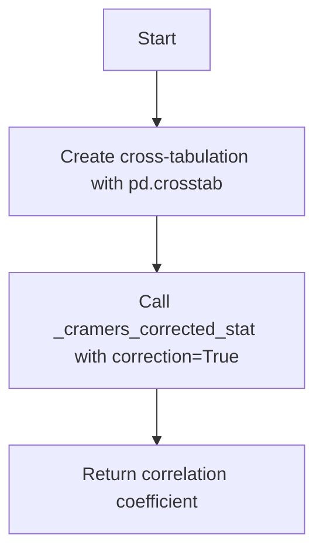
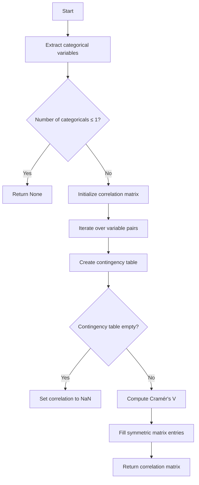
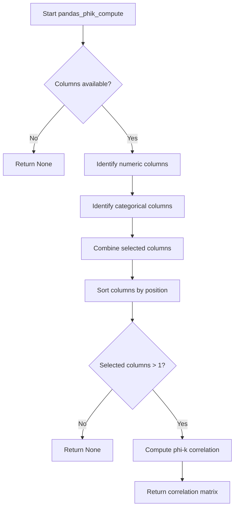
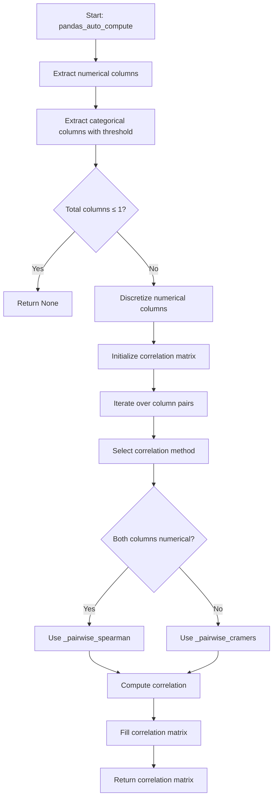

# `correlations_pandas.py`

## `src.ydata_profiling.model.pandas.correlations_pandas.pandas_spearman_compute` · *function*

## Summary:
Computes the Spearman rank correlation matrix for numeric columns in a pandas DataFrame.

## Description:
This function calculates pairwise Spearman rank correlation coefficients between all numeric columns in the input DataFrame. It serves as a standardized interface for Spearman correlation computation within the ydata-profiling data analysis framework, leveraging pandas' optimized `corr()` method with the 'spearman' parameter.

The function is typically called by the profiling system when Spearman correlation analysis is enabled through the Settings configuration. It follows the same architectural pattern as other correlation computation functions in this module, providing a consistent interface for different correlation methods while maintaining compatibility with the broader profiling pipeline.

This logic is extracted into its own function to enforce a clear separation of concerns: encapsulating the specific Spearman correlation computation logic, enabling easy substitution of different correlation methods, and maintaining consistency with the modular design of the correlation analysis system.

## Args:
    config (Settings): Configuration settings for the profiling process (currently unused in implementation)
    df (pd.DataFrame): Input DataFrame containing numeric data for correlation analysis
    summary (dict): Summary statistics dictionary (currently unused in implementation)

## Returns:
    Optional[pd.DataFrame]: A symmetric correlation matrix DataFrame where each cell [i,j] represents the Spearman correlation coefficient between column i and column j. Returns None if the DataFrame contains no numeric columns or if the correlation computation fails.

## Raises:
    None explicitly raised - relies on pandas' internal error handling

## Constraints:
    Preconditions:
    - Input df must be a valid pandas DataFrame
    - DataFrame should contain numeric data for meaningful correlation computation
    
    Postconditions:
    - Returns a symmetric correlation matrix with values between -1 and 1
    - Diagonal elements are always 1.0
    - Non-numeric columns are automatically excluded from computation
    - Returns None when no numeric columns exist in the DataFrame

## Side Effects:
    None - Pure function with no external state mutation or I/O operations

## Control Flow:
```mermaid
flowchart TD
    A[Start pandas_spearman_compute] --> B{Input validation}
    B --> C[Call df.corr(method="spearman")]
    C --> D[Return correlation matrix or None]
    D --> E[End]
```

## Examples:
```python
# Basic usage
import pandas as pd
from ydata_profiling.config import Settings

df = pd.DataFrame({'A': [1, 2, 3], 'B': [4, 5, 6], 'C': [7, 8, 9]})
config = Settings()
summary = {}

result = pandas_spearman_compute(config, df, summary)
print(result)
# Output: correlation matrix showing monotonic relationships between columns

# Edge case with no numeric columns
df_empty = pd.DataFrame({'A': ['x', 'y', 'z'], 'B': ['p', 'q', 'r']})
result = pandas_spearman_compute(config, df_empty, summary)
print(result)
# Output: None
```

## `src.ydata_profiling.model.pandas.correlations_pandas.pandas_pearson_compute` · *function*

## Summary:
Computes the Pearson correlation matrix for a given DataFrame using pandas' built-in correlation method.

## Description:
This function serves as a standardized interface for computing Pearson correlations within the profiling system. It wraps pandas' DataFrame.corr() method with the 'pearson' parameter to calculate pairwise correlation coefficients between numeric columns. The function is designed to be part of a modular correlation computation framework that supports multiple correlation methods, with config and summary parameters providing extensibility for future implementations.

## Args:
    config (Settings): Configuration settings for the profiling process (currently unused in implementation)
    df (pd.DataFrame): Input DataFrame containing numeric data for correlation analysis
    summary (dict): Summary statistics dictionary (currently unused in implementation)

## Returns:
    Optional[pd.DataFrame]: A DataFrame containing the Pearson correlation coefficients between all pairs of numeric columns. Returns None if the DataFrame contains no numeric columns or if the correlation computation fails.

## Raises:
    None explicitly raised - relies on pandas' internal error handling

## Constraints:
    Preconditions:
    - Input df must be a valid pandas DataFrame
    - DataFrame should contain numeric data for meaningful correlation computation
    
    Postconditions:
    - Returns a symmetric correlation matrix with values between -1 and 1
    - Diagonal elements are always 1.0
    - Non-numeric columns are automatically excluded from computation
    - Returns None when no numeric columns exist in the DataFrame

## Side Effects:
    None - Pure function with no external state mutation or I/O operations

## Control Flow:
```mermaid
flowchart TD
    A[Start pandas_pearson_compute] --> B{Input validation}
    B --> C[Call df.corr(method="pearson")]
    C --> D[Return correlation matrix or None]
    D --> E[End]
```

## Examples:
```python
# Basic usage
import pandas as pd
from ydata_profiling.config import Settings

df = pd.DataFrame({'A': [1, 2, 3], 'B': [4, 5, 6], 'C': [7, 8, 9]})
config = Settings()
summary = {}

result = pandas_pearson_compute(config, df, summary)
print(result)
# Output: correlation matrix showing relationships between columns

# Edge case with no numeric columns
df_empty = pd.DataFrame({'A': ['x', 'y', 'z'], 'B': ['p', 'q', 'r']})
result = pandas_pearson_compute(config, df_empty, summary)
print(result)
# Output: None
```

## `src.ydata_profiling.model.pandas.correlations_pandas.pandas_kendall_compute` · *function*

## Summary:
Computes Kendall rank correlation coefficients for a pandas DataFrame using pandas' built-in correlation method.

## Description:
This function calculates Kendall's tau rank correlation coefficient between all pairs of numeric columns in the input DataFrame. It serves as a concrete implementation for Kendall correlation computation within the ydata-profiling data analysis framework, specifically designed to work with pandas DataFrames.

The function is typically called by the profiling system when Kendall correlation analysis is enabled through the Settings configuration. It leverages pandas' optimized `corr()` method with the 'kendall' parameter to efficiently compute the correlation matrix.

## Args:
    config (Settings): Configuration object containing profiling settings, including correlation method configurations
    df (pd.DataFrame): Input DataFrame containing numeric data for correlation analysis
    summary (dict): Pre-computed dataset statistics dictionary, typically used for metadata or additional context

## Returns:
    Optional[pd.DataFrame]: A correlation matrix DataFrame where each cell [i,j] represents the Kendall correlation coefficient between column i and column j. Returns None if no numeric columns exist or correlation computation fails.

## Raises:
    None explicitly raised by this function - relies on pandas' internal error handling

## Constraints:
    Preconditions:
    - Input df must be a valid pandas DataFrame
    - DataFrame should contain numeric data for meaningful correlation computation
    - Config should have appropriate correlation settings enabled
    
    Postconditions:
    - Returns a symmetric correlation matrix with diagonal elements equal to 1.0
    - Matrix dimensions match the number of numeric columns in the input DataFrame
    - All correlation values are between -1.0 and 1.0

## Side Effects:
    None - This function is pure and does not modify input parameters or cause external state changes

## Control Flow:
```mermaid
flowchart TD
    A[Start pandas_kendall_compute] --> B[Validate input parameters]
    B --> C{DataFrame is valid?}
    C -->|No| D[Return None]
    C -->|Yes| E[Call df.corr(method="kendall")]
    E --> F[Return correlation matrix]
```

## Examples:
```python
import pandas as pd
from ydata_profiling.config import Settings

# Create sample data
df = pd.DataFrame({
    'A': [1, 2, 3, 4, 5],
    'B': [2, 4, 6, 8, 10],
    'C': [5, 4, 3, 2, 1]
})

# Configure settings (though not used directly in this function)
config = Settings()

# Compute Kendall correlation matrix
correlation_matrix = pandas_kendall_compute(config, df, {})

print(correlation_matrix)
# Output would show Kendall correlation coefficients between all pairs of columns
```

## `src.ydata_profiling.model.pandas.correlations_pandas._cramers_corrected_stat` · *function*

## Summary:
Computes Cramér's corrected coefficient of association between two categorical variables from a contingency table.

## Description:
This function calculates Cramér's V statistic, a measure of association between two nominal categorical variables. It applies a correction factor to account for table dimensions and sample size, making it suitable for comparing associations across different sized contingency tables. The function handles edge cases such as empty matrices and provides numerical stability through careful handling of division operations.

This function is part of the correlation analysis framework and is specifically used when computing associations between categorical variables using Cramér's V method. It serves as a utility function for the broader correlations_pandas module that implements various correlation measures for pandas DataFrames. The mathematical computation of Cramér's V is extracted into this separate function to enable independent testing, reuse across different correlation methods, and cleaner separation of concerns in the correlation analysis pipeline.

## Args:
    confusion_matrix (pandas.DataFrame): A contingency table (cross-tabulation) of two categorical variables
    correction (bool): Whether to apply Yates' correction for continuity when computing chi-square statistic

## Returns:
    float: Cramér's corrected coefficient of association, ranging from 0 (no association) to 1 (perfect association)

## Raises:
    None explicitly raised, but may raise exceptions from scipy.stats.chi2_contingency() if input is invalid

## Constraints:
    Precondition: confusion_matrix must be a valid pandas DataFrame representing a contingency table
    Precondition: confusion_matrix should contain non-negative integer counts
    Postcondition: Returns a float value between 0 and 1 inclusive

## Side Effects:
    None

## Control Flow:
```mermaid
flowchart TD
    A[Start] --> B{confusion_matrix.empty?}
    B -- Yes --> C[Return 0]
    B -- No --> D[Compute chi2_contingency]
    D --> E[Calculate n, phi2, r, k]
    E --> F[Apply numerical corrections]
    F --> G{rkcorr == 0.0?}
    G -- Yes --> H[Set corr = 1.0]
    G -- No --> I[Calculate corr = sqrt(phi2corr/rkcorr)]
    I --> J[Return corr]
```

## Examples:
    # Basic usage with a 2x2 contingency table
    import pandas as pd
    import numpy as np
    
    # Create a simple contingency table
    matrix = pd.DataFrame({
        'A': [10, 5],
        'B': [3, 12]
    }, index=['X', 'Y'])
    
    result = _cramers_corrected_stat(matrix, correction=False)
    print(result)  # Returns Cramér's V coefficient
    
    # With empty matrix
    empty_matrix = pd.DataFrame()
    result = _cramers_corrected_stat(empty_matrix, correction=True)
    print(result)  # Returns 0

## `src.ydata_profiling.model.pandas.correlations_pandas._pairwise_spearman` · *function*

## Summary:
Computes the Spearman rank correlation coefficient between two pandas Series.

## Description:
This function calculates the Spearman rank correlation between two pandas Series using the built-in pandas correlation method with the spearman method parameter. It's designed to compute pairwise correlations for correlation matrix calculations in statistical analysis.

## Args:
    col_1 (pd.Series): First pandas Series containing numerical data for correlation calculation
    col_2 (pd.Series): Second pandas Series containing numerical data for correlation calculation

## Returns:
    float: Spearman correlation coefficient between -1 and 1, where:
        - 1 indicates perfect positive monotonic relationship
        - 0 indicates no monotonic relationship
        - -1 indicates perfect negative monotonic relationship

## Raises:
    None explicitly raised - relies on pandas Series.corr() method which may raise exceptions for invalid inputs

## Constraints:
    Preconditions:
        - Both input parameters must be pandas Series objects
        - Both Series should contain comparable data types (numerical or convertible to numerical)
        - Series should not be completely empty or contain only NaN values
    
    Postconditions:
        - Returns a float value in the range [-1.0, 1.0]
        - Function execution does not modify the input Series

## Side Effects:
    None - This function is pure and has no side effects

## Control Flow:
```mermaid
flowchart TD
    A[Input: col_1, col_2] --> B{Validate inputs}
    B -->|Valid| C[Call col_1.corr(col_2, method="spearman")]
    C --> D[Return correlation coefficient]
    B -->|Invalid| E[Raise pandas exception]
```

## Examples:
```python
import pandas as pd
import numpy as np

# Basic usage
series1 = pd.Series([1, 2, 3, 4, 5])
series2 = pd.Series([2, 4, 6, 8, 10])
correlation = _pairwise_spearman(series1, series2)
# Returns 1.0 (perfect positive correlation)

# Negative correlation
series3 = pd.Series([1, 2, 3, 4, 5])
series4 = pd.Series([5, 4, 3, 2, 1])
correlation = _pairwise_spearman(series3, series4)
# Returns -1.0 (perfect negative correlation)

# No correlation
series5 = pd.Series([1, 2, 3, 4, 5])
series6 = pd.Series([1, 3, 2, 5, 4])
correlation = _pairwise_spearman(series5, series6)
# Returns approximately 0.0 (no correlation)
```

## `src.ydata_profiling.model.pandas.correlations_pandas._pairwise_cramers` · *function*

## Summary:
Computes the Cramér's V correlation coefficient between two categorical pandas Series for correlation analysis.

## Description:
Calculates Cramér's corrected coefficient of association, a measure of association between two nominal categorical variables. This private helper function creates a cross-tabulation of the input Series using `pd.crosstab()` and computes the correlation coefficient using the Cramér's V formula with Yates' correction applied.

This function is part of the correlations_pandas module and is used internally by the profiling framework to compute pairwise Cramér's V correlations for categorical data. It serves as a specialized utility for computing association measures between variable pairs in the correlation analysis pipeline.

## Args:
    col_1 (pandas.Series): First categorical pandas Series
    col_2 (pandas.Series): Second categorical pandas Series

## Returns:
    float: Cramér's corrected coefficient of association, ranging from 0 (no association) to 1 (perfect association). Returns 0 for empty or invalid inputs.

## Raises:
    None explicitly raised, but may propagate exceptions from underlying statistical computations in _cramers_corrected_stat or pd.crosstab

## Constraints:
    Precondition: Both input Series must contain categorical data
    Precondition: Input Series should not be empty
    Postcondition: Returns a float value between 0 and 1 inclusive

## Side Effects:
    None

## Control Flow:


## Examples:
    # Basic usage
    import pandas as pd
    
    series1 = pd.Series(['A', 'B', 'A', 'C'])
    series2 = pd.Series(['X', 'Y', 'X', 'Z'])
    
    correlation = _pairwise_cramers(series1, series2)
    print(correlation)  # Returns Cramér's V coefficient between the series

## `src.ydata_profiling.model.pandas.correlations_pandas.pandas_cramers_compute` · *function*

## Summary
Computes Cramér's V correlation matrix for categorical variables that meet the distinct value threshold criteria.

## Description
This function calculates pairwise Cramér's V correlation coefficients between categorical variables in a DataFrame. It filters categorical variables based on the maximum number of distinct values allowed by the configuration, then constructs a symmetric correlation matrix using Cramér's V statistic, which measures the strength of association between two nominal categorical variables.

The function is part of the pandas correlation analysis pipeline and specifically handles categorical variable correlations using Cramér's V method. It's designed to work with the ydata-profiling framework's configuration system and follows the pattern of returning None when insufficient categorical variables exist for meaningful correlation analysis.

Known callers within the codebase:
- Called by correlation analysis pipelines when Cramér's V correlation is enabled in the configuration
- Typically invoked during the profiling process when computing categorical variable relationships
- Triggered as part of the broader correlation computation workflow in the pandas profiling module

This logic is extracted into its own function to enforce a clear separation of concerns: filtering categorical variables by distinct value thresholds, constructing the correlation matrix structure, and computing pairwise correlations using the specialized Cramér's V algorithm. This modular approach enables easier testing, reuse, and maintenance of the correlation computation logic.

## Args
- config (Settings): Configuration object containing profiling settings, specifically the categorical_maximum_correlation_distinct threshold
- df (pd.DataFrame): Input DataFrame containing the data to analyze  
- summary (dict): Dictionary mapping column names to variable metadata dictionaries containing "type" and "n_distinct" keys

## Returns
- Optional[pd.DataFrame]: A symmetric correlation matrix (DataFrame) where rows and columns represent categorical variables, and values represent Cramér's V coefficients between pairs of variables. Returns None when fewer than 2 categorical variables meet the distinct value criteria.

## Raises
- None explicitly raised by this function, but may propagate exceptions from underlying operations like pandas crosstab or scipy statistics functions

## Constraints
- Precondition: config must contain a valid categorical_maximum_correlation_distinct attribute
- Precondition: df must be a valid pandas DataFrame
- Precondition: summary must be a dictionary with proper variable metadata structure where each value contains "type" and "n_distinct" keys
- Postcondition: If return value is not None, the returned DataFrame will be square with diagonal values of 1.0
- Postcondition: All off-diagonal values will be between 0.0 and 1.0 inclusive, or NaN for empty contingency tables

## Side Effects
- None

## Control Flow


## Examples
```python
import pandas as pd
from ydata_profiling.config import Settings

# Sample data with categorical variables
df = pd.DataFrame({
    'category_a': ['X', 'Y', 'X', 'Z', 'Y'],
    'category_b': ['P', 'Q', 'P', 'R', 'Q'],
    'category_c': ['A', 'B', 'A', 'C', 'B']
})

# Summary metadata with required structure
summary = {
    'category_a': {'type': 'Categorical', 'n_distinct': 3},
    'category_b': {'type': 'Categorical', 'n_distinct': 3},
    'category_c': {'type': 'Categorical', 'n_distinct': 3}
}

# Configuration with default threshold
config = Settings()

# Compute correlations
correlation_matrix = pandas_cramers_compute(config, df, summary)
print(correlation_matrix)
# Returns a 3x3 DataFrame with Cramér's V coefficients

# With insufficient categorical variables
summary_single = {
    'category_a': {'type': 'Categorical', 'n_distinct': 2}
}
result = pandas_cramers_compute(config, df, summary_single)
print(result)
# Returns None because only 1 categorical variable meets criteria
```

## `src.ydata_profiling.model.pandas.correlations_pandas.pandas_phik_compute` · *function*

## Summary:
Computes the phi-k correlation matrix for a subset of numerical and categorical columns in a DataFrame.

## Description:
This function calculates the phi-k correlation coefficients between columns in a DataFrame, specifically designed for mixed-type data including both numerical and categorical variables. It filters columns based on data type and distinct value counts before computing correlations using the phik library.

The function serves as a specialized correlation computation method that handles the preprocessing of column selection and manages the phik correlation calculation while suppressing warnings.

## Args:
    config (Settings): Configuration object containing settings such as categorical_maximum_correlation_distinct which determines the maximum number of distinct values for categorical columns to be considered in correlation analysis.
    df (pd.DataFrame): Input DataFrame containing the data for correlation analysis.
    summary (dict): Dictionary containing metadata about each column in the DataFrame, including column type and number of distinct values.

## Returns:
    Optional[pd.DataFrame]: A correlation matrix as a DataFrame if at least two columns meet the selection criteria, otherwise None.

## Raises:
    None explicitly raised, though phik_matrix may raise exceptions under certain conditions.

## Constraints:
    Preconditions:
    - The config parameter must contain a valid categorical_maximum_correlation_distinct setting
    - The df parameter must be a valid pandas DataFrame
    - The summary parameter must be a dictionary with proper column metadata
    
    Postconditions:
    - If returned DataFrame exists, it contains correlation coefficients between selected columns
    - If returned None, no suitable columns were found for correlation analysis

## Side Effects:
    - Suppresses warnings from the phik library during correlation computation
    - Imports phik.phik_matrix dynamically within the function scope

## Control Flow:


## Examples:
```python
# Basic usage
config = Settings()
df = pd.DataFrame({'A': [1, 2, 3], 'B': ['x', 'y', 'z'], 'C': [4.0, 5.0, 6.0]})
summary = {
    'A': {'type': 'Numeric', 'n_distinct': 3},
    'B': {'type': 'Categorical', 'n_distinct': 2},
    'C': {'type': 'Numeric', 'n_distinct': 3}
}
result = pandas_phik_compute(config, df, summary)
# Returns correlation matrix or None if insufficient columns
```

## `src.ydata_profiling.model.pandas.correlations_pandas.pandas_auto_compute` · *function*

## Summary:
Computes an automatic correlation matrix for mixed-type columns (numerical and categorical) in a pandas DataFrame.

## Description:
This function automatically determines appropriate correlation methods for mixed data types and computes pairwise correlations between numerical and categorical columns. It identifies numerical columns with more than one distinct value and categorical columns with a reasonable number of distinct values (based on configuration), then applies either Spearman correlation for numerical pairs or Cramér's V correlation for categorical pairs. The function handles discretization of numerical columns when computing correlations with categorical variables.

## Args:
    config (Settings): Configuration object containing correlation settings including categorical maximum distinct values and auto-correlation bin settings
    df (pd.DataFrame): Input pandas DataFrame containing the data to analyze
    summary (dict): Dictionary containing column summaries with type and distinct count information

## Returns:
    Optional[pd.DataFrame]: Correlation matrix as a pandas DataFrame with correlation coefficients, or None if insufficient columns for correlation analysis

## Raises:
    None explicitly raised - relies on underlying correlation computation functions which may raise exceptions for invalid inputs

## Constraints:
    Preconditions:
        - config must contain valid correlation configuration settings
        - df must be a valid pandas DataFrame
        - summary must be a dictionary with proper column metadata
        
    Postconditions:
        - Returns None if fewer than 2 columns qualify for correlation analysis
        - Returns a symmetric correlation matrix with ones on the diagonal when successful
        - All returned correlation values are between -1 and 1 (for numerical) or 0 and 1 (for categorical)

## Side Effects:
    None - This function is pure and has no side effects

## Control Flow:


## Examples:
```python
import pandas as pd
from ydata_profiling.config import Settings

# Create sample data
df = pd.DataFrame({
    'numeric1': [1, 2, 3, 4, 5],
    'numeric2': [2, 4, 6, 8, 10],
    'categorical': ['A', 'B', 'A', 'C', 'B']
})

# Configure settings
config = Settings()
config.categorical_maximum_correlation_distinct = 10
config.correlations["auto"].n_bins = 5

# Compute correlations
correlation_matrix = pandas_auto_compute(config, df, {
    'numeric1': {'type': 'Numeric', 'n_distinct': 5},
    'numeric2': {'type': 'Numeric', 'n_distinct': 5},
    'categorical': {'type': 'Categorical', 'n_distinct': 3}
})

print(correlation_matrix)
```

