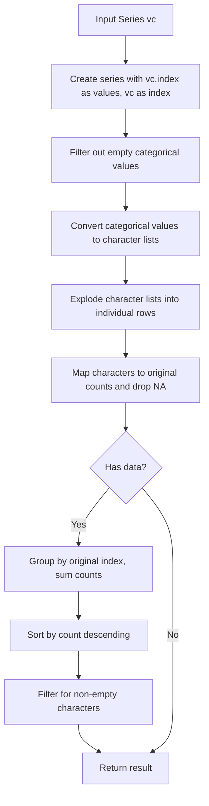
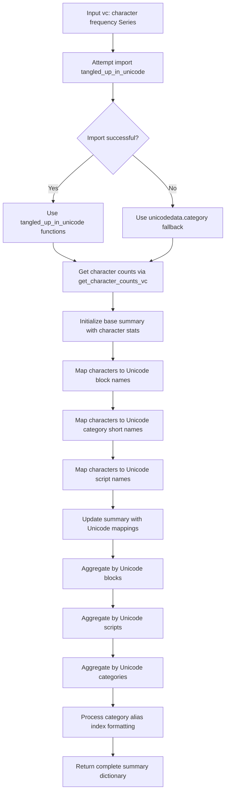
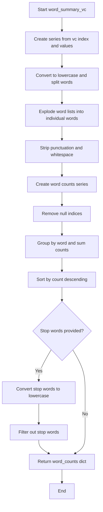
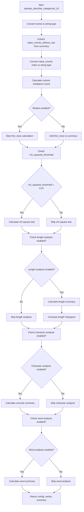

# `describe_categorical_pandas.py`

## `src.ydata_profiling.model.pandas.describe_categorical_pandas.get_character_counts_vc` · *function*

## Summary:
Computes character frequency counts from categorical data by extracting individual characters from series values.

## Description:
Processes a pandas Series containing categorical values and returns a Series with character frequencies. This function extracts individual characters from each categorical value and counts their occurrences, primarily used for character-level analysis in data profiling.

## Args:
    vc (pd.Series): Input pandas Series where the index represents categorical values and values represent their counts/frequencies

## Returns:
    pd.Series: Series containing character frequencies sorted in descending order by count, with empty characters filtered out

## Raises:
    None explicitly raised

## Constraints:
    Preconditions:
    - Input series should contain categorical data with proper index values representing categories
    - The values of the input series represent counts/frequencies of each category
    
    Postconditions:
    - Output series contains only non-empty characters
    - Characters are sorted by frequency in descending order
    - All returned characters have length > 0

## Side Effects:
    None

## Control Flow:


## Examples:
```python
import pandas as pd

# Example usage
vc = pd.Series([10, 5, 3], index=['hello', 'world', 'test'])
result = get_character_counts_vc(vc)
# Returns character frequency counts for characters in 'hello', 'world', 'test'
```

## `src.ydata_profiling.model.pandas.describe_categorical_pandas.get_character_counts` · *function*

## Summary:
Computes character frequency counts across all strings in a pandas categorical series.

## Description:
This function takes a pandas Series containing string data and computes the frequency count of each character that appears across all strings in the series. It concatenates all string elements using the pandas str.cat() method (with default parameters) and then creates a Counter object to track character occurrences. This function is typically used in categorical data profiling to analyze character distributions.

## Args:
    series (pd.Series): A pandas Series containing string data elements to analyze for character frequencies. The series may contain null values which are handled appropriately.

## Returns:
    Counter: A collections.Counter object mapping each character to its total count across all strings in the series. Empty series or series with only null values will return an empty Counter.

## Raises:
    None explicitly raised in the function implementation.

## Constraints:
    Preconditions:
    - Input series should contain string data or data that can be converted to strings
    - The function assumes all elements in the series are compatible with pandas str.cat() method
    
    Postconditions:
    - Returns a Counter object with character frequencies
    - Empty series will return an empty Counter
    - Null values in the series are handled gracefully by str.cat()

## Side Effects:
    None

## Control Flow:
```mermaid
flowchart TD
    A[Input pd.Series] --> B{Series contains strings?}
    B -->|Yes| C[series.str.cat()]
    B -->|No| D[Convert to strings]
    C --> E[Counter(series.str.cat())]
    D --> E
    E --> F[Return Counter]
```

## Examples:
```python
import pandas as pd
from collections import Counter
from src.ydata_profiling.model.pandas.describe_categorical_pandas import get_character_counts

# Example 1: Basic usage with string data
series = pd.Series(['hello', 'world', 'hello'])
result = get_character_counts(series)
# Returns Counter({'l': 4, 'o': 2, 'h': 2, 'e': 2, 'w': 1, 'r': 1, 'd': 1})

# Example 2: Empty series
empty_series = pd.Series([], dtype='object')
result = get_character_counts(empty_series)
# Returns Counter()

# Example 3: Series with null values
series_with_nulls = pd.Series(['test', None, 'data'])
result = get_character_counts(series_with_nulls)
# Returns Counter({'t': 4, 'e': 1, 's': 1, 'd': 1, 'a': 1, 'i': 1})
```

## `src.ydata_profiling.model.pandas.describe_categorical_pandas.counter_to_series` · *function*

## Summary
Converts a Counter object into a pandas Series with counts as values and items as index labels.

## Description
Transforms a collections.Counter instance into a pandas Series where each unique item from the counter becomes an index label and its corresponding count becomes the value. This utility function provides a standardized way to convert counter data structures into pandas Series format for further analysis and visualization.

## Args
    counter (Counter): A collections.Counter object containing key-value pairs where keys are items and values are their counts.

## Returns
    pd.Series: A pandas Series with:
        - Values representing the counts from the counter
        - Index labels representing the items from the counter
        - dtype=object when the counter is empty
        - Sorted by frequency in descending order (most common items first)

## Raises
    None explicitly raised

## Constraints
    Preconditions:
        - Input must be a collections.Counter object
        - Counter can be empty or contain items
    
    Postconditions:
        - Returns a pandas Series with proper index-value mapping
        - Empty counter results in empty Series with dtype=object
        - Non-empty counter results in Series sorted by frequency (descending)

## Side Effects
    None

## Control Flow
```mermaid
flowchart TD
    A[Start: counter_to_series] --> B{Is counter empty?}
    B -- Yes --> C[Return empty Series]
    B -- No --> D[Get most_common() tuples]
    D --> E[Unpack items and counts]
    E --> F[Create Series with counts as values, items as index]
    F --> G[Return Series]
```

## Examples
```python
from collections import Counter
import pandas as pd

# Example 1: Non-empty counter
counter = Counter(['a', 'b', 'c', 'a', 'b', 'a'])
result = counter_to_series(counter)
# Returns: pd.Series([3, 2, 1], index=['a', 'b', 'c'])

# Example 2: Empty counter
empty_counter = Counter()
result = counter_to_series(empty_counter)
# Returns: pd.Series([], dtype=object)
```

## `src.ydata_profiling.model.pandas.describe_categorical_pandas.unicode_summary_vc` · *function*

## Summary
Analyzes Unicode character distribution in categorical data and computes detailed statistics including character frequencies, block classifications, script classifications, and category classifications.

## Description
Processes a pandas Series containing character frequency counts and generates comprehensive Unicode analysis statistics. This function extracts detailed Unicode metadata for each character (block, script, category) and aggregates counts by these Unicode properties to provide insights into character distribution patterns in categorical data.

The function handles Unicode character classification using either the `tangled_up_in_unicode` library or falls back to Python's built-in `unicodedata` module. It creates hierarchical aggregations of character counts by Unicode blocks, scripts, and categories, making it useful for understanding text composition in data profiling scenarios.

## Args
    vc (pd.Series): Input pandas Series where index represents characters and values represent their frequency counts in the dataset

## Returns
    dict: Dictionary containing comprehensive Unicode character analysis with the following keys:
        - "n_characters_distinct": Total number of distinct characters (int)
        - "n_characters": Total count of all characters (int)
        - "character_counts": Original character frequency series (pd.Series)
        - "category_alias_values": Mapping from characters to their Unicode category short names (dict)
        - "block_alias_values": Mapping from characters to their Unicode block abbreviations (dict)
        - "category_alias_counts": Count of characters grouped by Unicode category (pd.Series)
        - "n_category": Number of distinct Unicode categories (int)
        - "category_alias_char_counts": Character counts grouped by Unicode category (dict of pd.Series)
        - "block_alias_counts": Count of characters grouped by Unicode block (pd.Series)
        - "n_block_alias": Number of distinct Unicode blocks (int)
        - "block_alias_char_counts": Character counts grouped by Unicode block (dict of pd.Series)
        - "script_counts": Count of characters grouped by Unicode script (pd.Series)
        - "n_scripts": Number of distinct Unicode scripts (int)
        - "script_char_counts": Character counts grouped by Unicode script (dict of pd.Series)

## Raises
    None explicitly raised

## Constraints
    Preconditions:
    - Input series must be a pandas Series with character indices and numeric frequency values
    - The series should contain valid Unicode characters as indices
    - All values in the series should be non-negative integers representing character counts
    
    Postconditions:
    - Returns a dictionary with consistent structure regardless of input size
    - All aggregated counters are converted to pandas Series using counter_to_series
    - Category aliases have underscores replaced with spaces in index names when present

## Side Effects
    None

## Control Flow


## Examples
```python
import pandas as pd
from ydata_profiling.model.pandas.describe_categorical_pandas import unicode_summary_vc

# Example usage with sample character frequencies
char_freq = pd.Series([10, 5, 3, 2], index=['a', 'b', 'c', 'd'])
result = unicode_summary_vc(char_freq)

# Result contains detailed Unicode analysis including:
# - Character frequencies
# - Block classifications (e.g., Basic Latin, Latin-1 Supplement)
# - Script classifications (e.g., Latin, Cyrillic)
# - Category classifications (e.g., Letter, Mark, Number)
```

## `src.ydata_profiling.model.pandas.describe_categorical_pandas.word_summary_vc` · *function*

## Summary:
Processes a pandas Series of word counts to extract and summarize individual word frequencies while optionally filtering stop words.

## Description:
This function transforms a pandas Series containing word counts into a structured dictionary of individual word frequencies. It extracts words from the index of the input series, normalizes them to lowercase, splits on whitespace, strips punctuation and whitespace, and aggregates word counts. The resulting word counts can be filtered to exclude common stop words.

The function is designed to be used in categorical data profiling workflows where text data needs to be analyzed at the word level. It's extracted as a separate function to encapsulate the complex text processing and aggregation logic, making the main profiling pipeline cleaner and more modular.

## Args:
    vc (pd.Series): A pandas Series where the index contains words and values represent their counts.
    stop_words (List[str], optional): A list of stop words to exclude from the results. Defaults to an empty list.

## Returns:
    dict: A dictionary containing the key "word_counts" with a pandas Series of word frequencies sorted in descending order. Returns an empty dictionary if no words remain after processing or stop word filtering.

## Raises:
    None explicitly raised in the function body.

## Constraints:
    Preconditions:
    - Input vc must be a pandas Series
    - Index of vc should contain word-like strings
    - stop_words should be a list of strings
    
    Postconditions:
    - Output dictionary contains either an empty dict or a dict with "word_counts" key
    - Word counts are sorted in descending order
    - All words in output are normalized to lowercase
    - Stop words are excluded from the result when provided

## Side Effects:
    None

## Control Flow:


## Examples:
```python
# Basic usage with word counts
import pandas as pd
vc = pd.Series([5, 3, 2], index=['apple', 'banana', 'cherry'])
result = word_summary_vc(vc)
# Returns {'word_counts': pd.Series([5, 3, 2], index=['apple', 'banana', 'cherry'])}

# Usage with stop words
stop_words = ['the', 'and', 'or']
vc = pd.Series([10, 5, 3], index=['the', 'quick', 'brown'])
result = word_summary_vc(vc, stop_words)
# Returns {'word_counts': pd.Series([10, 5, 3], index=['quick', 'brown'])} 
# (assuming 'the' is filtered out)
```

## `src.ydata_profiling.model.pandas.describe_categorical_pandas.length_summary_vc` · *function*

## Summary:
Calculates comprehensive length statistics for categorical data values, including maximum, mean, median, minimum lengths, and a histogram of length distributions.

## Description:
This function processes a pandas Series containing categorical values as the index and their occurrence counts as values. It computes various statistical measures of the character lengths of these categorical values, which is useful for profiling text-based categorical data. The function extracts the length of each unique categorical value and aggregates the counts by length to provide insights into the distribution of string lengths within the categorical dataset.

The function is typically called during categorical data profiling operations when detailed length analysis is required for text columns or categorical features. It's particularly useful for understanding text data characteristics such as field width variability in databases or text processing requirements.

## Args:
    vc (pd.Series): A pandas Series where the index contains categorical values (typically strings) and the values represent their respective counts/frequencies. The index should be hashable and convertible to strings.

## Returns:
    dict: A dictionary containing:
        - "max_length" (int): The maximum length among all categorical values
        - "mean_length" (float): The weighted average length of all categorical values  
        - "median_length" (int): The weighted median length of all categorical values
        - "min_length" (int): The minimum length among all categorical values
        - "length_histogram" (pd.Series): A pandas Series indexed by length values with counts representing how many categorical values have that length

## Raises:
    None explicitly raised, but may raise exceptions from underlying pandas/numpy operations if input is malformed or contains non-string index values.

## Constraints:
    Preconditions:
        - Input must be a pandas Series with hashable index values
        - Index values should be convertible to strings (for .str.len() operation)
        - Values should be numeric (representing counts/frequencies)
        - Index values should be comparable (for sorting operations)
    
    Postconditions:
        - Returns a dictionary with exactly 5 keys as specified
        - All returned length values are integers except mean_length which is float
        - length_histogram is a pandas Series with integer index and values

## Side Effects:
    None

## Control Flow:
```mermaid
flowchart TD
    A[Input vc Series] --> B[Create series with vc.index as values and vc as index]
    B --> C[Calculate length of each categorical value using str.len()]
    C --> D[Create length_counts series mapping lengths to their total counts]
    D --> E[Group by length and sum counts (handle duplicates)]
    E --> F[Sort by count descending]
    F --> G[Calculate max_length from length index]
    G --> H[Calculate mean_length using weighted average]
    H --> I[Calculate median_length using weighted_median function]
    I --> J[Calculate min_length from length index]
    J --> K[Assemble summary dictionary]
    K --> L[Return summary]
```

## Examples:
```python
import pandas as pd
import numpy as np

# Example with categorical data
vc = pd.Series([10, 5, 3], index=['cat', 'dog', 'elephant'])
result = length_summary_vc(vc)
print(result)
# Output: {'max_length': 8, 'mean_length': 4.75, 'median_length': 3, 'min_length': 3, 'length_histogram': ...}

# Example with mixed length strings
vc = pd.Series([100, 50, 25], index=['a', 'bb', 'ccc'])
result = length_summary_vc(vc)
print(result)
# Output: {'max_length': 3, 'mean_length': 2.0, 'median_length': 2, 'min_length': 1, 'length_histogram': ...}

# Example showing the histogram structure
vc = pd.Series([5, 3, 2], index=['x', 'yy', 'zzz'])
result = length_summary_vc(vc)
print(result['length_histogram'])
# Output: 1    5  # one character strings, count 5
#         2    3  # two character strings, count 3  
#         3    2  # three character strings, count 2
#         dtype: int64
```

## `src.ydata_profiling.model.pandas.describe_categorical_pandas.pandas_describe_categorical_1d` · *function*

## Summary:
Processes categorical data series to compute descriptive statistics and profile information based on configuration settings.

## Description:
This function performs comprehensive analysis of categorical data by computing various statistical measures and profile characteristics. It converts the input series to string representation, calculates imbalance scores, and conditionally computes additional statistics based on configuration flags for redaction, chi-squared tests, length analysis, character analysis, and word analysis.

The function is designed to be part of a larger categorical data profiling pipeline where different aspects of categorical data are analyzed based on user-defined configuration options. It serves as a central coordination point that orchestrates various analysis operations while maintaining the integrity of the input data and configuration.

## Args:
    config (Settings): Configuration object containing various profiling settings including categorical analysis options (redact, length, characters, words) and numerical thresholds (chi_squared_threshold).
    series (pd.Series): Input pandas Series containing categorical data that needs to be analyzed.
    summary (dict): Dictionary containing pre-computed summary statistics including "value_counts_without_nan" which is used for various calculations.

## Returns:
    Tuple[Settings, pd.Series, dict]: Returns a tuple containing the (modified) configuration, the (potentially modified) series, and the updated summary dictionary with computed statistics.

## Raises:
    None explicitly raised in the function body, though underlying helper functions may raise exceptions from pandas/numpy operations.

## Constraints:
    Preconditions:
        - config must be a valid Settings object with properly initialized vars.cat and vars.num attributes
        - series must be a valid pandas Series
        - summary must contain "value_counts_without_nan" key with a valid pandas Series
        - value_counts_without_nan index should be hashable and convertible to strings
        
    Postconditions:
        - The series is converted to string type
        - The summary dictionary is updated with computed statistics based on configuration flags
        - The returned summary contains at least the "imbalance" key
        - All returned values maintain their original types

## Side Effects:
    - Modifies the summary dictionary in-place by adding new keys
    - May add "first_rows" to summary when redact is False
    - May add "chi_squared" to summary when chi_squared_threshold > 0.0
    - May add various keys to summary based on categorical analysis configuration flags
    - Converts series to string type (in-place modification of series reference)

## Control Flow:


## Examples:
```python
import pandas as pd
from ydata_profiling.config import Settings

# Create sample categorical data
data = pd.Series(['cat', 'dog', 'cat', 'bird', 'dog', 'cat'])
config = Settings()

# Initialize summary with value_counts_without_nan
summary = {"value_counts_without_nan": data.value_counts()}

# Call the function
config, processed_series, updated_summary = pandas_describe_categorical_1d(config, data, summary)

# The updated_summary now contains additional computed statistics
print(updated_summary.keys())
# Output includes: 'imbalance', 'first_rows', and potentially others based on config
```

