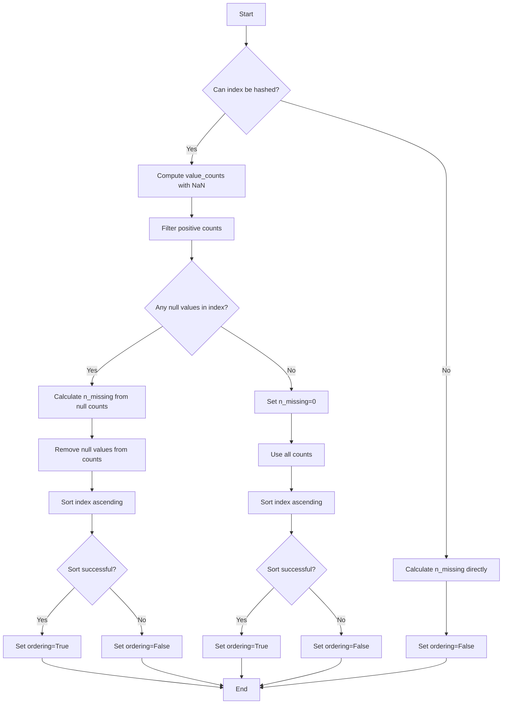

# `describe_counts_pandas.py`

## `src.ydata_profiling.model.pandas.describe_counts_pandas.pandas_describe_counts` · *function*

## Summary:
Processes a pandas Series to compute value counts, missing value statistics, and ordering information for profiling purposes.

## Description:
This function analyzes a pandas Series to determine if its index is hashable, computes value counts including NaN values, identifies missing values, and checks if the index can be sorted. The results are stored in the summary dictionary for further analysis in data profiling workflows. This logic is extracted into a separate function to encapsulate the complex value counting and missing data handling logic, making the main profiling pipeline cleaner and more modular.

## Args:
    config (Settings): Configuration settings for the profiling process
    series (pd.Series): The pandas Series to analyze
    summary (dict): Dictionary to store computed statistics and metadata

## Returns:
    Tuple[Settings, pd.Series, dict]: The unchanged config, series, and updated summary dictionary containing computed statistics

## Raises:
    None explicitly raised - uses broad exception handling for hashability check

## Constraints:
    Preconditions:
        - config must be a valid Settings object
        - series must be a pandas Series
        - summary must be a mutable dictionary
    Postconditions:
        - summary dictionary will contain keys: 'hashable', 'value_counts_without_nan', 'value_counts_index_sorted', 'ordering', 'n_missing'
        - The returned tuple contains the original arguments unchanged

## Side Effects:
    - Modifies the summary dictionary by adding computed statistics
    - No external I/O operations or state mutations beyond updating the summary

## Control Flow:

## Examples:
    # Basic usage
    config = Settings()
    series = pd.Series([1, 2, 2, None, 3])
    summary = {}
    result_config, result_series, result_summary = pandas_describe_counts(config, series, summary)
    
    # Result summary will contain:
    # {'hashable': True, 'value_counts_without_nan': Series, 'value_counts_index_sorted': Series, 'ordering': True, 'n_missing': 1}

