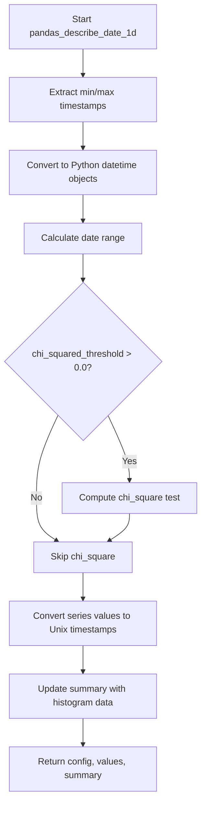

# `describe_date_pandas.py`

## `src.ydata_profiling.model.pandas.describe_date_pandas.pandas_describe_date_1d` · *function*

## Summary:
Computes descriptive statistics for a pandas date/time series, including min/max values, range, and optional statistical tests.

## Description:
This function processes a pandas Series containing date/time data to compute various descriptive statistics. It extracts the minimum and maximum timestamps, calculates the date range, converts timestamp values to Unix timestamps, and optionally performs statistical analysis including chi-square testing and histogram computation. The function is designed to be part of a larger profiling pipeline for date/time data analysis.

## Args:
    config (Settings): Configuration object containing settings for statistical analysis
    series (pd.Series): Pandas Series containing date/time data
    summary (dict): Dictionary to be updated with computed statistics

## Returns:
    Tuple[Settings, np.ndarray, dict]: A tuple containing the configuration object, processed values (as numpy array of Unix timestamps), and the updated summary dictionary

## Raises:
    None explicitly raised in the function body

## Constraints:
    Preconditions:
    - The series parameter must contain valid pandas Timestamp data
    - The config parameter must be a valid Settings object
    - The summary parameter must be a mutable dictionary
    
    Postconditions:
    - The summary dictionary will contain 'min', 'max', and 'range' keys
    - If chi_squared_threshold > 0.0, the summary will contain 'chi_squared' key
    - The summary will contain histogram-related keys from histogram_compute
    - The returned values will be numpy array of Unix timestamps (int64 divided by 10^9)

## Side Effects:
    - Modifies the summary dictionary in-place by updating it with computed statistics
    - Calls external functions (chi_square, histogram_compute) which may have their own side effects

## Control Flow:


## Examples:
```python
# Basic usage
config = Settings()
series = pd.Series([pd.Timestamp('2020-01-01'), pd.Timestamp('2020-12-31')])
summary = {}
config, values, summary = pandas_describe_date_1d(config, series, summary)

# With chi-square enabled
config.vars.num.chi_squared_threshold = 0.5
config, values, summary = pandas_describe_date_1d(config, series, summary)
```

