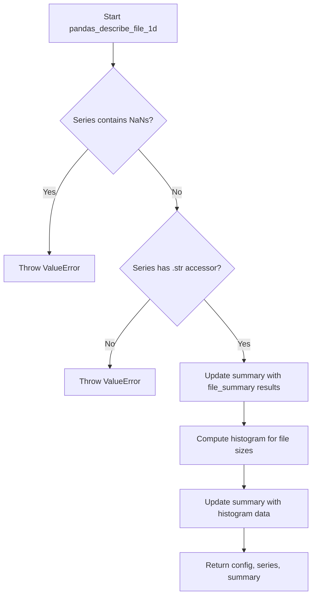

# `describe_file_pandas.py`

## `src.ydata_profiling.model.pandas.describe_file_pandas.file_summary` · *function*

## Summary:
Extracts comprehensive file metadata including size and timestamp information from a Series of file paths.

## Description:
Processes a pandas Series containing file paths and returns a dictionary with detailed file statistics including file size and timestamps for creation, access, and modification times. This function is designed to be used in data profiling workflows where file metadata needs to be analyzed alongside other data characteristics.

## Args:
    series (pd.Series): A pandas Series containing file paths as strings

## Returns:
    dict: A dictionary containing four keys:
        - "file_size": A pandas Series with file sizes in bytes
        - "file_created_time": A pandas Series with creation timestamps as formatted strings
        - "file_accessed_time": A pandas Series with last access timestamps as formatted strings  
        - "file_modified_time": A pandas Series with last modification timestamps as formatted strings

## Raises:
    FileNotFoundError: When a file path in the input series does not exist
    PermissionError: When access to a file path is denied
    OSError: When there are OS-related errors accessing file metadata

## Constraints:
    Preconditions:
        - Input series must contain valid file paths as strings
        - Files must be accessible for metadata extraction
    Postconditions:
        - All returned timestamps are formatted as "%Y-%m-%d %H:%M:%S"
        - Returned dictionary always contains exactly four keys

## Side Effects:
    - Accesses the filesystem to retrieve file metadata via os.stat()
    - May trigger file system I/O operations for each file in the input series

## Control Flow:
```mermaid
flowchart TD
    A[Start file_summary] --> B{Input series valid?}
    B -->|No| C[Throw TypeError]
    B -->|Yes| D[Process each file path]
    D --> E[Call os.stat() on each path]
    E --> F[Extract st_size, st_ctime, st_atime, st_mtime]
    F --> G[Convert timestamps to strings]
    G --> H[Build summary dictionary]
    H --> I[Return summary]
```

## Examples:
```python
import pandas as pd
from src.ydata_profiling.model.pandas.describe_file_pandas import file_summary

# Basic usage
file_paths = pd.Series(['/path/to/file1.txt', '/path/to/file2.csv'])
result = file_summary(file_paths)
print(result['file_size'])  # Series with file sizes
print(result['file_created_time'])  # Series with formatted creation times
```

## `src.ydata_profiling.model.pandas.describe_file_pandas.pandas_describe_file_1d` · *function*

## Summary:
Processes a pandas Series of file paths to extract file metadata and compute file size distribution statistics.

## Description:
This function serves as a specialized data processing step in the profiling workflow that extracts comprehensive file metadata from a Series of file paths and computes statistical distributions for file sizes. It validates input data integrity and integrates file statistics into a larger profiling summary dictionary.

The function is designed to be part of a pipeline where file path data is processed to extract meaningful metadata and statistical properties for data profiling purposes. It specifically handles file size analysis and histogram computation.

## Args:
    config (Settings): Configuration object containing plotting and analysis settings
    series (pd.Series): A pandas Series containing file paths as strings
    summary (dict): Dictionary to be updated with file metadata and statistics

## Returns:
    Tuple[Settings, pd.Series, dict]: Returns the unchanged config, series, and the updated summary dictionary containing file metadata and histogram data

## Raises:
    ValueError: When the input series contains NaN values or lacks a string accessor (.str)
    
## Constraints:
    Preconditions:
        - Input series must not contain any NaN values
        - Input series must have a string accessor (.str) available
        - Input series should contain valid file paths
    Postconditions:
        - The summary dictionary is updated with file metadata including file sizes and timestamps
        - The summary dictionary is updated with histogram data for file sizes
        - The returned tuple maintains the original config and series unchanged

## Side Effects:
    - Accesses the filesystem to retrieve file metadata via os.stat() through the file_summary function
    - May trigger file system I/O operations for each file in the input series
    - Updates the provided summary dictionary in-place

## Control Flow:


## Examples:
```python
import pandas as pd
from ydata_profiling.config import Settings
from src.ydata_profiling.model.pandas.describe_file_pandas import pandas_describe_file_1d

# Create sample file paths
file_paths = pd.Series(['/path/to/file1.txt', '/path/to/file2.csv'])

# Initialize configuration and summary
config = Settings()
summary = {}

# Process file paths
try:
    config, series, summary = pandas_describe_file_1d(config, file_paths, summary)
    print("File metadata:", summary.get('file_size'))
    print("Histogram data:", summary.get('histogram_file_size'))
except ValueError as e:
    print(f"Error processing files: {e}")
```

