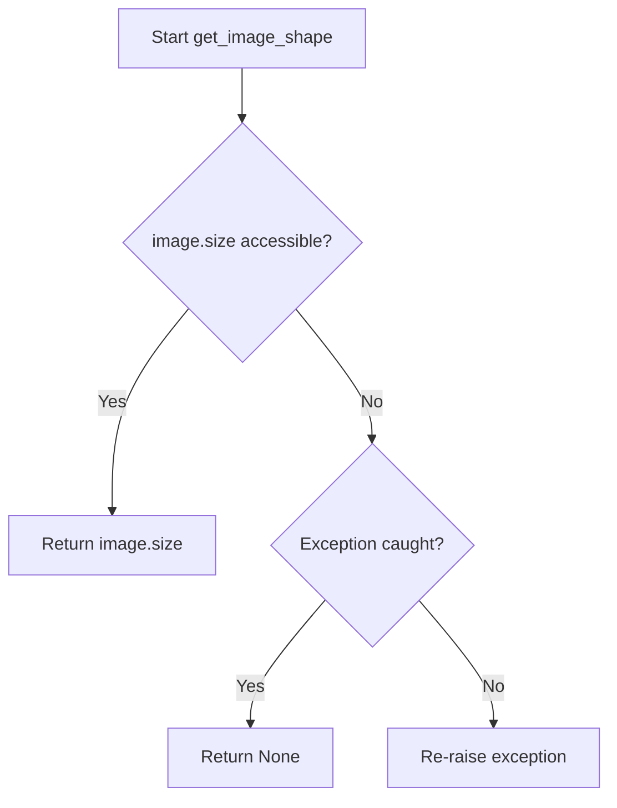
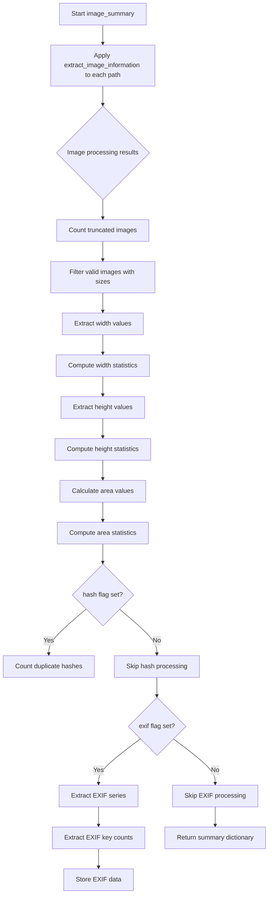

# `describe_image_pandas.py`

## `src.ydata_profiling.model.pandas.describe_image_pandas.open_image` · *function*

## Summary:
Attempts to safely open an image file using PIL, returning the image object or None if the operation fails.

## Description:
This function provides a safe wrapper around PIL's Image.open() method to handle common image loading errors gracefully. It is designed to prevent crashes when attempting to process invalid or corrupted image files during data profiling operations.

## Args:
    path (Path): A pathlib.Path object pointing to the image file to be opened.

## Returns:
    Optional[Image.Image]: Returns a PIL Image object if the image is successfully opened, or None if the file is invalid, corrupted, or cannot be processed due to OSError or AttributeError.

## Raises:
    This function does not raise exceptions directly, but handles OSError and AttributeError internally.

## Constraints:
    Preconditions:
    - The path parameter must be a valid pathlib.Path object
    - The file at the specified path must be readable
    
    Postconditions:
    - The function always returns either a PIL Image object or None
    - No exceptions are propagated from this function

## Side Effects:
    - May perform file I/O operations when accessing the image file
    - No external state mutations or service calls

## Control Flow:
```mermaid
flowchart TD
    A[Start open_image] --> B{Try Image.open(path)}
    B -->|Success| C[Return Image object]
    B -->|OSError/AttributeError| D[Return None]
    C --> E[End]
    D --> E
```

## Examples:
```python
from pathlib import Path
from PIL import Image

# Valid image file
image_path = Path("example.jpg")
img = open_image(image_path)
if img is not None:
    print(f"Image size: {img.size}")
else:
    print("Failed to load image")

# Invalid file or corrupted image
bad_path = Path("nonexistent.png")
result = open_image(bad_path)
assert result is None
```

## `src.ydata_profiling.model.pandas.describe_image_pandas.is_image_truncated` · *function*

## Summary:
Determines whether a PIL Image object is truncated or corrupted by attempting to load it.

## Description:
This function attempts to load a PIL Image object to detect if it is truncated, corrupted, or improperly formatted. It's used in image validation pipelines to identify problematic images that cannot be properly processed. The function is typically called during image profiling operations to filter out invalid image data before performing detailed analysis.

## Args:
    image (PIL.Image): A PIL Image object to validate for truncation

## Returns:
    bool: True if the image cannot be loaded due to truncation or corruption, False if loading succeeds

## Raises:
    None explicitly raised, but may internally raise OSError or AttributeError during image loading

## Constraints:
    Preconditions:
    - The input must be a valid PIL Image object
    - The image object should be in a state where it can attempt loading
    
    Postconditions:
    - The function returns a boolean indicating truncation status
    - No modifications are made to the original image object
    - The image object remains unchanged after the function call

## Side Effects:
    None

## Control Flow:
```mermaid
flowchart TD
    A[Start is_image_truncated] --> B{Attempt image.load()}
    B --> C{OSError or AttributeError raised?}
    C -->|Yes| D[Return True]
    C -->|No| E[Return False]
```

## Examples:
    # Validate an image for truncation
    from PIL import Image
    img = Image.open('potentially_truncated_image.jpg')
    if is_image_truncated(img):
        print("Image is truncated or corrupted")
    else:
        print("Image is valid and loadable")

## `src.ydata_profiling.model.pandas.describe_image_pandas.get_image_shape` · *function*

## Summary:
Extracts the width and height dimensions from an image object, returning None if the operation fails.

## Description:
Retrieves the size attribute from a PIL Image object to obtain its dimensions. This function provides safe access to image dimensions by catching common exceptions that may occur when accessing image metadata.

## Args:
    image (PIL.Image): A PIL Image object from which to extract dimensions

## Returns:
    Optional[Tuple[int, int]]: A tuple containing (width, height) if successful, or None if the image object is invalid or inaccessible

## Raises:
    This function does not raise exceptions directly, but catches and handles:
    - OSError: When the image file cannot be accessed or read properly
    - AttributeError: When the image object doesn't have a size attribute

## Constraints:
    Preconditions:
    - The input must be a valid PIL Image object
    - The image object should be properly initialized and not corrupted
    
    Postconditions:
    - Returns either a tuple of two integers representing image dimensions or None
    - Does not modify the input image object

## Side Effects:
    None

## Control Flow:


## Examples:
```python
# Valid usage
from PIL import Image
img = Image.open("example.jpg")
dimensions = get_image_shape(img)
if dimensions:
    width, height = dimensions
    print(f"Image size: {width}x{height}")

# Error handling
try:
    bad_img = Image.new('RGB', (100, 100))  # Create a dummy image
    result = get_image_shape(bad_img)
    print(result)  # Will return (100, 100)
except Exception:
    print("Unexpected error occurred")
```

## `src.ydata_profiling.model.pandas.describe_image_pandas.hash_image` · *function*

## Summary:
Computes a perceptual hash of an image for duplicate detection and similarity analysis.

## Description:
This function applies the perceptual hash algorithm (phash) to an image to generate a unique identifier that can be used to detect visually similar images. The function is designed to handle potential errors during hash computation gracefully by returning None when the image processing fails.

## Args:
    image (PIL.Image): A PIL Image object to compute the perceptual hash for

## Returns:
    Optional[str]: String representation of the perceptual hash if successful, None if the image processing fails due to OSError or AttributeError

## Raises:
    None explicitly raised - handles OSError and AttributeError internally

## Constraints:
    Preconditions:
    - Input must be a valid PIL Image object
    - Image data must be readable and valid
    
    Postconditions:
    - Returns either a string hash or None
    - Does not modify the input image object

## Side Effects:
    None - Pure function with no external state mutation

## Control Flow:
```mermaid
flowchart TD
    A[Start hash_image] --> B{imagehash.phash success?}
    B -->|Yes| C[Return str(phash)]
    B -->|No| D{OSError or AttributeError?}
    D -->|Yes| E[Return None]
    D -->|No| F[Raise exception]
```

## Examples:
    # Successful hash computation
    from PIL import Image
    img = Image.open('sample.jpg')
    hash_value = hash_image(img)  # Returns string like "1ff0000000000000"
    
    # Failed hash computation
    bad_img = Image.new('RGB', (100, 100))  # Invalid image data
    hash_value = hash_image(bad_img)  # Returns None

## `src.ydata_profiling.model.pandas.describe_image_pandas.decode_byte_exif` · *function*

## Summary:
Converts EXIF data from bytes to string format, ensuring consistent string representation.

## Description:
Normalizes EXIF metadata values that may be stored as either string or bytes format into a consistent string representation. This utility function handles the common case where EXIF data from image files might be returned in different formats depending on how it was encoded or extracted.

## Args:
    exif_val (Union[str, bytes]): EXIF metadata value that can be either a string or bytes object

## Returns:
    str: String representation of the EXIF metadata value

## Raises:
    UnicodeDecodeError: When bytes cannot be decoded to a valid UTF-8 string

## Constraints:
    Precondition: Input must be either str or bytes type
    Postcondition: Return value is always a string object

## Side Effects:
    None

## Control Flow:
```mermaid
flowchart TD
    A[Input: exif_val] --> B{isinstance(exif_val, str)?}
    B -->|Yes| C[Return exif_val]
    B -->|No| D[exif_val.decode()]
    C --> E[Output: str]
    D --> E
```

## Examples:
    # String input returns unchanged
    result = decode_byte_exif("Camera Model XYZ")
    # Returns: "Camera Model XYZ"
    
    # Bytes input gets decoded
    result = decode_byte_exif(b"Camera Model XYZ")
    # Returns: "Camera Model XYZ"

## `src.ydata_profiling.model.pandas.describe_image_pandas.extract_exif` · *function*

## Summary:
Extracts and normalizes EXIF metadata from an image object into a standardized dictionary format.

## Description:
Retrieves EXIF metadata from a PIL Image object and converts it into a dictionary with human-readable tag names. The function safely handles various error conditions and normalizes byte-encoded EXIF values to strings using a dedicated decoder function.

This function is extracted into its own component to encapsulate the complexity of EXIF data processing, providing a clean interface for image metadata extraction while handling potential errors gracefully. It separates concerns from higher-level image analysis functions that may need to process the extracted EXIF data.

## Args:
    image (PIL.Image): A PIL Image object from which to extract EXIF metadata

## Returns:
    dict: A dictionary mapping EXIF tag names to their corresponding values. Returns an empty dictionary if no EXIF data is available or if an error occurs during extraction.

## Raises:
    None: Exceptions are caught and handled internally, returning an empty dictionary

## Constraints:
    Precondition: The input must be a valid PIL Image object
    Postcondition: The returned dictionary contains only keys that exist in ExifTags.TAGS and values that are properly decoded strings

## Side Effects:
    None: This function performs no I/O operations or external state mutations

## Control Flow:
```mermaid
flowchart TD
    A[Start: extract_exif(image)] --> B{image._getexif() succeeds?}
    B -->|Yes| C{exif_data is not None?}
    C -->|Yes| D[Process EXIF data with TAGS mapping]
    D --> E[Apply decode_byte_exif to values]
    E --> F[Return processed dictionary]
    C -->|No| G[Return empty dict]
    B -->|No| H[Return empty dict]
```

## Examples:
    # Extract EXIF from a valid image
    from PIL import Image
    img = Image.open('photo.jpg')
    exif_data = extract_exif(img)
    # Returns: {'Make': 'Canon', 'Model': 'EOS 5D', ...} or {} if no EXIF
    
    # Handle image without EXIF data
    img_no_exif = Image.new('RGB', (100, 100))
    exif_data = extract_exif(img_no_exif)
    # Returns: {}
```

## `src.ydata_profiling.model.pandas.describe_image_pandas.path_is_image` · *function*

## Summary:
Determines whether a given file path corresponds to an image file by examining its magic bytes.

## Description:
Checks if a file path points to a valid image file by using Python's standard `imghdr` module to detect the file's format. This function is used to filter or validate image file paths in data profiling operations, particularly when analyzing image datasets within pandas DataFrames.

The function extracts the file format information using `imghdr.what()` which examines the file's magic bytes to determine if it matches a recognized image format. This approach is more reliable than relying solely on file extensions for image identification.

Known callers within the codebase:
- Used internally by image processing pipelines in the ydata-profiling library when validating image file paths
- Likely called during image data type detection and analysis phases

This logic is extracted into its own function rather than being inlined because:
- It provides a reusable utility for image validation across different parts of the profiling system
- It encapsulates the complexity of image format detection behind a simple boolean interface
- It allows for consistent image validation behavior throughout the codebase
- It makes testing and mocking easier by providing a clear, isolated function boundary

## Args:
    p (Path): A pathlib.Path object representing the file path to check

## Returns:
    bool: True if the path points to a valid image file, False otherwise

## Raises:
    None: This function does not explicitly raise exceptions, though underlying filesystem operations may raise IOError or similar exceptions when accessing the file.

## Constraints:
    Preconditions:
    - The Path object must be a valid path to an existing file (though the function may work with non-existent paths)
    - The file must be readable by the current process
    
    Postconditions:
    - The function returns a boolean value indicating image status
    - No side effects occur beyond potential file system access

## Side Effects:
    - May perform file system I/O when accessing the file to determine its format
    - No external state mutations or service calls

## Control Flow:
```mermaid
flowchart TD
    A[Start path_is_image] --> B{imghdr.what(p) is not None?}
    B -->|Yes| C[Return True]
    B -->|No| D[Return False]
```

## Examples:
```python
from pathlib import Path

# Check if a file is an image
image_path = Path("photo.jpg")
is_image = path_is_image(image_path)  # Returns True for valid image

non_image_path = Path("document.pdf")
is_image = path_is_image(non_image_path)  # Returns False

# Typical usage in image processing pipeline
valid_images = [p for p in file_paths if path_is_image(p)]
```

## `src.ydata_profiling.model.pandas.describe_image_pandas.count_duplicate_hashes` · *function*

## Summary:
Counts the total number of duplicate image hash occurrences in a collection of image descriptions.

## Description:
This function analyzes a collection of image descriptions to determine how many duplicate hash values exist. It extracts all valid hash values from the input collection, counts their occurrences, and returns the total number of duplicate instances. This is useful for identifying redundant images in a dataset.

## Args:
    image_descriptions (list): A list of dictionaries containing image description data, where each entry may contain a "hash" key with an image hash value.

## Returns:
    int: The total count of duplicate hash occurrences. For example, if a hash appears 3 times, it contributes 2 duplicates to the total count.

## Raises:
    None explicitly raised by this function.

## Constraints:
    Preconditions:
    - The input must be a list-like object that supports iteration
    - Each entry in the list should support dictionary-style access (supporting keys like "hash")
    - Entries that don't contain a "hash" key are ignored
    
    Postconditions:
    - Returns a non-negative integer representing duplicate count
    - The result is always less than or equal to the total number of image entries

## Side Effects:
    None.

## Control Flow:
```mermaid
flowchart TD
    A[Start count_duplicate_hashes] --> B{image_descriptions}
    B --> C[Iterate through entries]
    C --> D{Entry has "hash" key?}
    D -->|Yes| E[Extract hash value]
    D -->|No| F[Skip entry]
    E --> G[Create pandas Series from hashes]
    G --> H[Calculate value_counts()]
    H --> I[Return counts.sum() - len(counts)]
    I --> J[End]
```

## Examples:
    # Basic usage with duplicates
    image_descs = [
        {"hash": "abc123", "size": "100x100"},
        {"hash": "def456", "size": "200x200"}, 
        {"hash": "abc123", "size": "150x150"}
    ]
    duplicates = count_duplicate_hashes(image_descs)  # Returns 2 (one duplicate of "abc123")

## `src.ydata_profiling.model.pandas.describe_image_pandas.extract_exif_series` · *function*

## Summary:
Extracts and aggregates EXIF metadata from a collection of images into value-count series for statistical analysis.

## Description:
Processes a list of EXIF metadata dictionaries from images and generates aggregated statistics showing the frequency distribution of EXIF keys and their corresponding values. This function enables comprehensive analysis of common EXIF attributes and their variations across a dataset of images.

## Args:
    image_exifs (list): A list of dictionaries containing EXIF metadata from individual images. Each dictionary maps EXIF tag names (strings) to their values (various types).

## Returns:
    dict: A dictionary where keys are EXIF tag names and values are pandas Series objects containing value counts for each unique value of that EXIF tag. Additionally includes an 'exif_keys' key mapping to a dictionary of EXIF key frequencies. All Series objects are created using pandas Series.value_counts() method.

## Raises:
    None explicitly raised in the function body.

## Constraints:
    Preconditions:
    - Input must be a list of dictionaries
    - Each dictionary should contain EXIF metadata key-value pairs where keys are strings
    
    Postconditions:
    - Output dictionary contains at least one key ('exif_keys') plus keys for each unique EXIF tag found in the input
    - All returned values are either pandas Series objects or dictionaries representing value counts
    - Empty input list returns a dictionary with only the 'exif_keys' key

## Side Effects:
    None.

## Control Flow:
```mermaid
flowchart TD
    A[Start extract_exif_series] --> B{image_exifs is empty?}
    B -- Yes --> C[Return empty dict]
    B -- No --> D[Initialize exif_keys and exif_values]
    D --> E[For each image_exif in image_exifs]
    E --> F[Extend exif_keys with image_exif keys]
    F --> G[For each exif_key, exif_val in image_exif]
    G --> H{exif_key not in exif_values?}
    H -- Yes --> I[Initialize exif_values[exif_key] as empty list]
    H -- No --> J[Append exif_val to exif_values[exif_key]]
    J --> K[End inner loop]
    K --> L[End outer loop]
    L --> M[Create series['exif_keys'] from exif_keys value counts]
    M --> N[For each k,v in exif_values]
    N --> O[series[k] = pd.Series(v).value_counts()]
    O --> P[Return series]
```

## Examples:
    # Basic usage with sample EXIF data
    exif_data = [
        {'Make': 'Canon', 'Model': 'EOS 5D', 'ExposureTime': '1/125'},
        {'Make': 'Canon', 'Model': 'EOS 7D', 'ExposureTime': '1/250'},
        {'Make': 'Nikon', 'Model': 'D750', 'ExposureTime': '1/125'}
    ]
    result = extract_exif_series(exif_data)
    # Returns dictionary with value counts for each EXIF attribute
    # Result structure:
    # {
    #   'exif_keys': {'Make': 3, 'Model': 3, 'ExposureTime': 3},
    #   'Make': <pandas.Series>,
    #   'Model': <pandas.Series>,
    #   'ExposureTime': <pandas.Series>
    # }

## `src.ydata_profiling.model.pandas.describe_image_pandas.extract_image_information` · *function*

## Summary:
Extracts key metadata and properties from an image file, including opening status, truncation detection, dimensions, EXIF data, and perceptual hash.

## Description:
This function serves as a centralized entry point for gathering essential image information from a file path. It safely opens an image, validates its integrity, and collects various metadata properties based on optional flags. The function is designed to handle potentially corrupted or invalid image files gracefully by returning a structured dictionary with status indicators rather than crashing.

The logic is extracted into its own function to provide a clean abstraction layer for image metadata collection, separating concerns from higher-level image analysis operations that may need to process the extracted information differently. This approach allows for modular testing and reuse of image validation and metadata extraction capabilities.

## Args:
    path (Path): A pathlib.Path object pointing to the image file to be analyzed
    exif (bool): Flag indicating whether to extract EXIF metadata from the image (default: False)
    hash (bool): Flag indicating whether to compute a perceptual hash of the image (default: False)

## Returns:
    dict: A dictionary containing image information with the following possible keys:
        - "opened" (bool): Indicates whether the image was successfully opened
        - "truncated" (bool): Indicates whether the image is truncated/corrupted (only present if opened=True)
        - "size" (tuple): Image dimensions as (width, height) in pixels (only present if opened=True and not truncated)
        - "exif" (dict): EXIF metadata dictionary (only present if exif=True and image is valid)
        - "hash" (str): Perceptual hash of the image (only present if hash=True and image is valid)

## Raises:
    None: This function handles all exceptions internally and returns appropriate status indicators

## Constraints:
    Preconditions:
    - The path parameter must be a valid pathlib.Path object
    - The file at the specified path must be readable
    
    Postconditions:
    - Always returns a dictionary with at least the "opened" key
    - If image opening fails, only "opened": False is returned
    - If image is opened but truncated, "opened": True and "truncated": True are returned
    - If image is valid, "opened": True, "truncated": False, and "size" are present

## Side Effects:
    - Performs file I/O operations when accessing the image file
    - No external state mutations or service calls

## Control Flow:
```mermaid
flowchart TD
    A[Start extract_image_information] --> B[Call open_image(path)]
    B --> C{image is not None?}
    C -->|No| D[Set information["opened"] = False]
    C -->|Yes| E[Set information["opened"] = True]
    E --> F[Call is_image_truncated(image)]
    F --> G{information["truncated"] = True?}
    G -->|Yes| H[Skip size, exif, hash extraction]
    G -->|No| I[Set information["size"] = image.size]
    I --> J{exif flag set?}
    J -->|Yes| K[Call extract_exif(image)]
    K --> L[Set information["exif"] = extracted_data]
    J -->|No| M[Skip EXIF extraction]
    M --> N{hash flag set?}
    N -->|Yes| O[Call hash_image(image)]
    O --> P[Set information["hash"] = hash_value]
    N -->|No| Q[Skip hash extraction]
    Q --> R[Return information]
    H --> R
```

## Examples:
    # Basic usage - extract basic image info
    from pathlib import Path
    info = extract_image_information(Path("sample.jpg"))
    # Returns: {"opened": True, "truncated": False, "size": (1920, 1080)}

    # With EXIF extraction
    info = extract_image_information(Path("photo.jpg"), exif=True)
    # Returns: {"opened": True, "truncated": False, "size": (1920, 1080), "exif": {...}}

    # With hash computation
    info = extract_image_information(Path("image.png"), hash=True)
    # Returns: {"opened": True, "truncated": False, "size": (800, 600), "hash": "1ff0000000000000"}

    # Handling invalid image
    info = extract_image_information(Path("corrupted.jpg"))
    # Returns: {"opened": False}

    # Handling truncated image
    info = extract_image_information(Path("truncated.jpg"))
    # Returns: {"opened": True, "truncated": True}
```

## `src.ydata_profiling.model.pandas.describe_image_pandas.image_summary` · *function*

## Summary:
Computes comprehensive statistical summaries of image properties from a pandas Series of image file paths, including dimensions, areas, and optionally EXIF metadata and perceptual hash duplicates.

## Description:
Processes a pandas Series containing file paths to image files and generates detailed statistical summaries of their properties. This function orchestrates the extraction of image metadata, computes aggregate statistics for dimensions and areas, and optionally analyzes EXIF data and perceptual hash duplicates. The function is designed to handle potentially corrupted or invalid image files gracefully while providing robust statistical analysis of valid images in the dataset.

The logic is extracted into its own function to provide a clean abstraction layer for image summary computation, separating the concerns of image data processing from the higher-level profiling operations that consume these summaries. This modular approach enables efficient reuse and testing of image analysis capabilities.

## Args:
    series (pd.Series): A pandas Series containing file paths (as strings or Path objects) to image files to be analyzed
    exif (bool): Flag indicating whether to extract and analyze EXIF metadata from images (default: False)
    hash (bool): Flag indicating whether to compute and count perceptual hash duplicates among images (default: False)

## Returns:
    dict: A dictionary containing comprehensive image statistics with the following keys:
        - "n_truncated" (int): Count of images that were detected as truncated/corrupted
        - "image_dimensions" (pd.Series): Series of image dimensions (width, height) tuples for valid images
        - "max_width" (float): Maximum image width among valid images
        - "mean_width" (float): Mean image width among valid images  
        - "median_width" (float): Median image width among valid images
        - "min_width" (float): Minimum image width among valid images
        - "max_height" (float): Maximum image height among valid images
        - "mean_height" (float): Mean image height among valid images
        - "median_height" (float): Median image height among valid images
        - "min_height" (float): Minimum image height among valid images
        - "max_area" (float): Maximum image area among valid images
        - "mean_area" (float): Mean image area among valid images
        - "median_area" (float): Median image area among valid images
        - "min_area" (float): Minimum image area among valid images
        - "n_duplicate_hash" (int): Count of duplicate perceptual hashes (only present when hash=True)
        - "exif_keys_counts" (dict): Frequency distribution of EXIF keys across images (only present when exif=True)
        - "exif_data" (dict): Aggregated EXIF metadata statistics (only present when exif=True)

## Raises:
    None: This function handles all potential errors internally through the underlying helper functions

## Constraints:
    Preconditions:
    - The series parameter must be a valid pandas Series
    - Each element in the series should be a valid file path that can be processed by the image processing pipeline
    - The file paths must be readable and point to valid image files or be handled gracefully
    
    Postconditions:
    - Always returns a dictionary with at least "n_truncated" and "image_dimensions" keys
    - Statistical summaries are computed only for valid, non-truncated images
    - When exif=True, returns additional EXIF-related statistics in "exif_keys_counts" and "exif_data"
    - When hash=True, returns duplicate hash counting statistics in "n_duplicate_hash"

## Side Effects:
    - Performs file I/O operations when accessing image files referenced in the series
    - No external state mutations or service calls

## Control Flow:


## Examples:
    # Basic usage - compute dimension statistics
    import pandas as pd
    from pathlib import Path
    
    image_paths = pd.Series([Path("img1.jpg"), Path("img2.png"), Path("img3.gif")])
    summary = image_summary(image_paths)
    # Returns: {
    #     "n_truncated": 0,
    #     "image_dimensions": pd.Series([(1920, 1080), (800, 600), (1024, 768)]),
    #     "max_width": 1920, "mean_width": 1248.0, "median_width": 1024,
    #     "min_width": 800, "max_height": 1080, "mean_height": 752.0,
    #     "median_height": 768, "min_height": 600, "max_area": 2073600,
    #     "mean_area": 921600.0, "median_area": 786432, "min_area": 480000
    # }

    # With EXIF analysis - includes metadata statistics
    summary = image_summary(image_paths, exif=True)
    # Returns additional EXIF statistics including:
    # "exif_keys_counts": {"Make": 3, "Model": 3, "ExposureTime": 3},
    # "exif_data": { ... additional EXIF value counts ... }

    # With hash analysis - identifies duplicate images
    summary = image_summary(image_paths, hash=True)
    # Returns additional duplicate hash counting:
    # "n_duplicate_hash": 2  # indicates 2 duplicate perceptual hashes found

## `src.ydata_profiling.model.pandas.describe_image_pandas.pandas_describe_image_1d` · *function*

## Summary:
Processes a pandas Series of image file paths to compute and update statistical summaries of image properties.

## Description:
Validates image data in a pandas Series and computes comprehensive statistical summaries of image characteristics including dimensions, areas, and optionally EXIF metadata. This function serves as a data validation and processing step in the image profiling pipeline, ensuring input integrity before performing detailed image analysis.

The logic is extracted into its own function to provide a clean abstraction layer for image summary computation, separating data validation from the higher-level profiling operations that consume these summaries. This modular approach enables efficient reuse and testing of image analysis capabilities within the profiling framework.

## Args:
    config (Settings): Configuration object containing profiling settings, specifically `config.vars.image.exif` flag for EXIF metadata processing
    series (pd.Series): A pandas Series containing file paths (as strings or Path objects) to image files to be analyzed
    summary (dict): Dictionary to be updated with computed image statistics

## Returns:
    Tuple[Settings, pd.Series, dict]: The unchanged input parameters (config, series, and updated summary) in a tuple format

## Raises:
    ValueError: If the series contains NaN values or lacks a string accessor (.str)

## Constraints:
    Preconditions:
    - The series parameter must not contain any NaN values
    - The series parameter must have a string accessor (.str) available
    - The series elements must be valid file paths that can be processed by the image processing pipeline
    
    Postconditions:
    - The summary dictionary is updated with image statistics from image_summary function
    - All input parameters are returned unchanged

## Side Effects:
    - Performs file I/O operations when accessing image files referenced in the series (through image_summary)
    - Updates the summary dictionary in-place

## Control Flow:
```mermaid
flowchart TD
    A[Start pandas_describe_image_1d] --> B{Series has NaNs?}
    B -->|Yes| C[Raise ValueError]
    B -->|No| D{Series has str accessor?}
    D -->|No| E[Raise ValueError]
    D -->|Yes| F[Call image_summary with series and config.vars.image.exif]
    F --> G[Update summary with image_summary results]
    G --> H[Return (config, series, summary)]
```

## Examples:
    # Basic usage in image profiling pipeline
    import pandas as pd
    from ydata_profiling.config import Settings
    
    config = Settings()
    image_series = pd.Series(["image1.jpg", "image2.png", "image3.gif"])
    summary = {}
    
    # Process image data and update summary
    config, series, summary = pandas_describe_image_1d(config, image_series, summary)
    
    # Summary now contains image statistics like dimensions, areas, etc.
    print(summary.keys())  # Shows keys like 'max_width', 'mean_height', etc.
```

