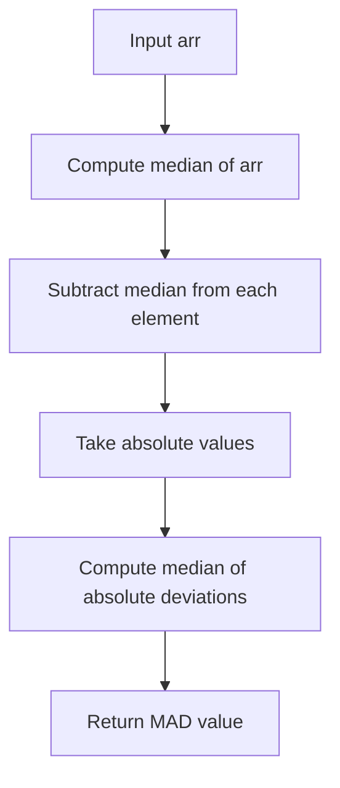
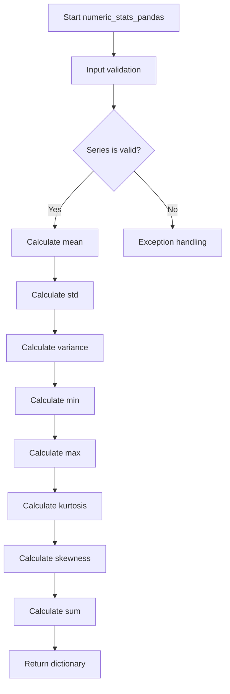
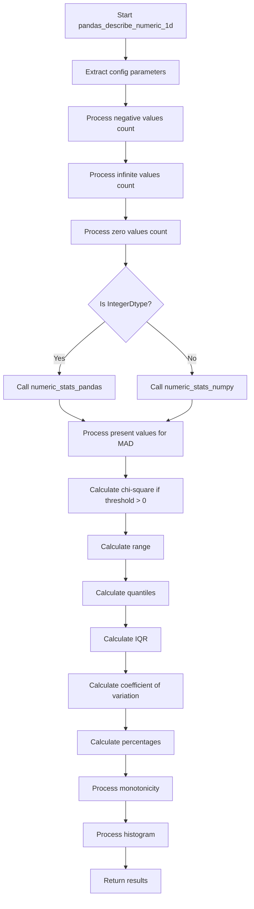

# `describe_numeric_pandas.py`

## `src.ydata_profiling.model.pandas.describe_numeric_pandas.mad` · *function*

## Summary:
Computes the Median Absolute Deviation (MAD) of a numeric array, providing a robust measure of statistical dispersion.

## Description:
This function calculates the Median Absolute Deviation, which measures the spread of a dataset by computing the median of absolute deviations from the dataset's median. It serves as a robust alternative to standard deviation that is less sensitive to outliers.

## Args:
    arr (np.ndarray): Input array of numeric values for which to compute the MAD

## Returns:
    np.ndarray: The computed Median Absolute Deviation as a scalar value (note: this is a 0-dimensional numpy array)

## Raises:
    None explicitly raised

## Constraints:
    Preconditions:
    - Input array must be a valid numpy array containing numeric values
    - Array should not be empty (though numpy handles empty arrays gracefully)
    
    Postconditions:
    - Returns a single numeric value representing the MAD
    - Output type matches the input array's dtype

## Side Effects:
    None

## Control Flow:


## Examples:
    >>> import numpy as np
    >>> data = np.array([1, 2, 3, 4, 5])
    >>> mad_value = mad(data)
    >>> print(mad_value)
    1.0
    
    >>> data_with_outliers = np.array([1, 2, 3, 4, 100])
    >>> mad_value = mad(data_with_outliers)
    >>> print(mad_value)
    1.0
```

## `src.ydata_profiling.model.pandas.describe_numeric_pandas.numeric_stats_pandas` · *function*

## Summary:
Calculates and returns a comprehensive set of descriptive statistics for a pandas numeric Series.

## Description:
This function computes fundamental statistical measures for a given numeric pandas Series. It serves as a core utility in the data profiling pipeline, providing essential numerical summaries that help characterize the distribution and properties of numeric data. The function is typically invoked during automated data profiling to generate quick statistical overviews of individual numeric columns.

The extraction of this logic into a separate function promotes code reuse and maintains clean separation of concerns, allowing the broader profiling system to focus on higher-level data analysis while delegating specific statistical computations to this dedicated utility.

## Args:
    series (pd.Series): A pandas Series containing numeric data for which statistics are to be calculated.

## Returns:
    Dict[str, Any]: A dictionary containing the following statistical measures:
        - "mean": Arithmetic mean of the series values
        - "std": Standard deviation of the series values  
        - "variance": Variance of the series values
        - "min": Minimum value in the series
        - "max": Maximum value in the series
        - "kurtosis": Kurtosis measure indicating the "tailedness" of the distribution
        - "skewness": Skewness measure indicating the asymmetry of the distribution
        - "sum": Sum of all values in the series

## Raises:
    None explicitly raised by this function, though underlying pandas methods may raise exceptions for invalid operations.

## Constraints:
    Preconditions:
        - Input must be a valid pandas Series object
        - Series should contain numeric data for meaningful statistical calculations
    
    Postconditions:
        - Returns a dictionary with exactly 8 keys as specified
        - All returned values are numeric (float or int) or NaN for undefined statistics

## Side Effects:
    None - This function is pure and does not modify external state or perform I/O operations.

## Control Flow:


## Examples:
```python
import pandas as pd
import numpy as np

# Basic usage
series = pd.Series([1, 2, 3, 4, 5])
stats = numeric_stats_pandas(series)
print(stats['mean'])  # Output: 3.0
print(stats['std'])   # Output: 1.4142135623730951

# With NaN values
series_with_nan = pd.Series([1, 2, np.nan, 4, 5])
stats = numeric_stats_pandas(series_with_nan)
print(stats['mean'])  # Output: 3.0 (ignores NaN)
```

## `src.ydata_profiling.model.pandas.describe_numeric_pandas.numeric_stats_numpy` · *function*

## Summary:
Computes comprehensive numeric statistics for a pandas Series using numpy operations, including mean, standard deviation, variance, min, max, kurtosis, skewness, and sum.

## Description:
This function calculates various statistical measures for numeric data represented as a pandas Series. It leverages numpy operations for efficient computation while utilizing value counts from the series description for weighted calculations. The function is designed to work with pre-processed numeric data and provides a standardized set of statistical metrics commonly used in data profiling.

## Args:
    present_values (np.ndarray): Array containing the actual numeric values from the series, excluding NaN values
    series (pd.Series): The original pandas Series object containing the numeric data
    series_description (Dict[str, Any]): Dictionary containing metadata about the series, specifically including "value_counts_without_nan" key with value counts data

## Returns:
    Dict[str, Any]: Dictionary containing computed statistical measures with keys:
        - "mean": Weighted average calculated using index values and their counts
        - "std": Standard deviation with sample correction (ddof=1)
        - "variance": Variance with sample correction (ddof=1)
        - "min": Minimum value from index values
        - "max": Maximum value from index values
        - "kurtosis": Kurtosis measure calculated using pandas Series.kurt() method
        - "skewness": Skewness measure calculated using pandas Series.skew() method
        - "sum": Dot product of index values and their counts

## Raises:
    None explicitly raised in the function body

## Constraints:
    Preconditions:
        - present_values must be a numpy array of numeric values
        - series must be a valid pandas Series object
        - series_description must contain a "value_counts_without_nan" key with appropriate data
        - Index values in value_counts_without_nan must be compatible with numpy operations
    
    Postconditions:
        - Returns a dictionary with exactly the specified statistical keys
        - All returned values are numeric types representing the respective statistical measures

## Side Effects:
    None

## Control Flow:
```mermaid
flowchart TD
    A[Start numeric_stats_numpy] --> B{Get value_counts_without_nan from series_description}
    B --> C[Extract index_values from value_counts.index.values]
    C --> D[Calculate mean using np.average(index_values, weights=vc.values)]
    D --> E[Calculate std using np.std(present_values, ddof=1)]
    E --> F[Calculate variance using np.var(present_values, ddof=1)]
    F --> G[Calculate min using np.min(index_values)]
    G --> H[Calculate max using np.max(index_values)]
    H --> I[Calculate kurtosis using series.kurt()]
    I --> J[Calculate skewness using series.skew()]
    J --> K[Calculate sum using np.dot(index_values, vc.values)]
    K --> L[Return dictionary with all statistics]
```

## Examples:
```python
# Basic usage
import numpy as np
import pandas as pd

# Sample data
values = np.array([1, 2, 2, 3, 3, 3])
series = pd.Series(values)
series_desc = {"value_counts_without_nan": pd.Series([1, 2, 3], index=[1, 2, 3])}

# Compute statistics
stats = numeric_stats_numpy(values, series, series_desc)
print(stats)
# Output: {'mean': 2.333..., 'std': 0.816..., 'variance': 0.666..., ...}
```

## `src.ydata_profiling.model.pandas.describe_numeric_pandas.pandas_describe_numeric_1d` · *function*

## Summary:
Computes comprehensive descriptive statistics and properties for a numeric pandas Series, including central tendency, dispersion, shape, and monotonicity measures.

## Description:
Processes a numeric pandas Series to calculate a rich set of statistical measures and data characteristics. This function serves as a core component in data profiling pipelines, aggregating various numerical properties including basic statistics, distributional measures, special value counts (negative, infinite, zero), and monotonicity indicators. The function handles both regular numeric types and pandas IntegerDtype specially, applying appropriate computational methods for each case.

The extraction of this logic into a dedicated function enables clean separation of concerns in the profiling system, allowing higher-level components to focus on data organization while delegating detailed statistical computation to this specialized utility.

## Args:
    config (Settings): Configuration object containing profiling settings, particularly numeric variable configurations like chi-squared threshold and quantiles
    series (pd.Series): Input pandas Series containing numeric data to be analyzed
    summary (dict): Dictionary containing pre-computed summary statistics including value_counts_without_nan and other metadata

## Returns:
    Tuple[Settings, pd.Series, dict]: A tuple containing the unchanged config, the original series, and an updated summary dictionary with comprehensive statistical measures. The summary dictionary includes:
        - Basic statistics: mean, std, variance, min, max, kurtosis, skewness, sum
        - Special value counts: n_negative, p_negative, n_infinite, n_zeros, p_zeros, p_infinite
        - Distribution measures: range, iqr, cv (coefficient of variation)
        - Quantile values: specified percentiles from config.vars.num.quantiles
        - Monotonicity indicators: monotonic_increase, monotonic_decrease, monotonic_increase_strict, monotonic_decrease_strict, monotonic
        - Additional measures: mad (median absolute deviation), chi_squared (if threshold > 0)
        - Histogram data: computed histogram bins and counts

## Raises:
    None explicitly raised by this function, though underlying operations may raise exceptions from pandas/numpy operations

## Constraints:
    Preconditions:
        - config must be a valid Settings object with numeric variable configuration
        - series must be a valid pandas Series with numeric data
        - summary must contain "value_counts_without_nan" key with appropriate data structure
        - summary must contain "n" key representing total count of values
        - summary must contain "n_distinct" key representing unique value count
    
    Postconditions:
        - Returns a tuple with unchanged config and original series
        - Summary dictionary contains all computed statistical measures
        - All computed statistics are properly formatted and numerically valid

## Side Effects:
    None - This function is pure and does not modify external state or perform I/O operations

## Control Flow:


## Examples:
```python
import pandas as pd
import numpy as np
from ydata_profiling.config import Settings

# Create test data
series = pd.Series([1, 2, 3, 4, 5, -1, 0, np.inf, -np.inf])
summary = {
    "value_counts_without_nan": pd.Series([1, 2, 3, 4, 5, -1, 0], index=[1, 2, 3, 4, 5, -1, 0]),
    "n": 9,
    "n_distinct": 7
}

# Configure settings
config = Settings()

# Process the series
updated_config, processed_series, stats = pandas_describe_numeric_1d(config, series, summary)

# Access computed statistics
print(f"Mean: {stats['mean']}")
print(f"Standard deviation: {stats['std']}")
print(f"Number of negative values: {stats['n_negative']}")
print(f"Number of infinite values: {stats['n_infinite']}")
print(f"Monotonicity: {stats['monotonic']}")
print(f"Histogram data: {stats.get('histogram', 'Not computed')}")
```

