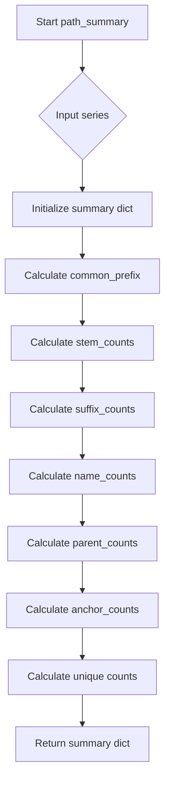
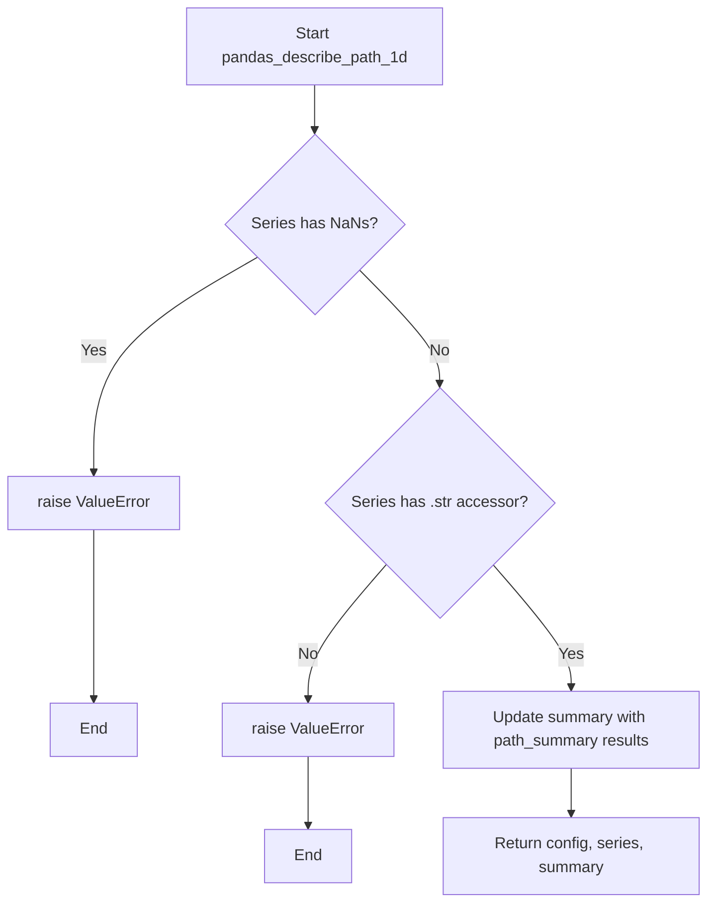

# `describe_path_pandas.py`

## `src.ydata_profiling.model.pandas.describe_path_pandas.path_summary` · *function*

## Summary:
Analyzes a pandas Series of file paths and computes descriptive statistics about their components and structure.

## Description:
This function processes a pandas Series containing file paths and extracts various statistical measures about the paths' structure. It computes counts for different path components (stems, suffixes, names, parents, anchors) and provides summary statistics about the uniqueness of these components. The function is designed to help understand common patterns and variations in file path collections.

## Args:
    series (pd.Series): A pandas Series containing file path strings to analyze

## Returns:
    dict: A dictionary containing the following keys:
        - "common_prefix" (str): The longest common prefix among all paths, or "No common prefix" if none exists
        - "stem_counts" (pd.Series): Count of each unique stem (filename without extension) 
        - "suffix_counts" (pd.Series): Count of each unique suffix (file extension including the dot)
        - "name_counts" (pd.Series): Count of each unique basename (filename with extension)
        - "parent_counts" (pd.Series): Count of each unique parent directory path
        - "anchor_counts" (pd.Series): Count of each unique drive/anchor (e.g., "C:" on Windows)
        - "n_stem_unique" (int): Number of unique stems
        - "n_suffix_unique" (int): Number of unique suffixes
        - "n_name_unique" (int): Number of unique basenames
        - "n_parent_unique" (int): Number of unique parent directories
        - "n_anchor_unique" (int): Number of unique anchors/drives

## Raises:
    None explicitly raised - however, underlying os.path operations may raise exceptions for malformed paths

## Constraints:
    Preconditions:
        - Input series should contain string values representing file paths
        - All values in the series should be valid path strings that can be processed by os.path functions
    
    Postconditions:
        - Returns a dictionary with exactly 11 keys as described above
        - All count series will be empty or contain counts for path components
        - The "common_prefix" field will either be a string or "No common prefix"

## Side Effects:
    None - This function is pure and doesn't perform any I/O or mutate external state

## Control Flow:


## Examples:
```python
import pandas as pd
from src.ydata_profiling.model.pandas.describe_path_pandas import path_summary

# Example with various file paths
paths = pd.Series([
    "/home/user/documents/file1.txt",
    "/home/user/documents/file2.txt", 
    "/home/user/pictures/photo.jpg",
    "/home/user/videos/movie.mp4"
])

result = path_summary(paths)
print(result["common_prefix"])  # "/home/user/"
print(result["n_stem_unique"])  # 3 (file1, file2, photo, movie)
print(result["n_suffix_unique"])  # 2 (.txt, .jpg, .mp4)
```

## `src.ydata_profiling.model.pandas.describe_path_pandas.pandas_describe_path_1d` · *function*

## Summary:
Processes a pandas Series of file paths and updates a summary dictionary with descriptive statistics about path structure and components.

## Description:
This function validates that a pandas Series contains valid file path strings and computes descriptive statistics about their structural components. It serves as a pandas-specific implementation for analyzing file path data within the profiling framework. The function ensures the input series meets requirements before processing and integrates the computed path statistics into a provided summary dictionary.

## Args:
    config (Settings): Configuration settings object for the profiling process
    series (pd.Series): A pandas Series containing file path strings to analyze
    summary (dict): Dictionary to be updated with path descriptive statistics

## Returns:
    Tuple[Settings, pd.Series, dict]: A tuple containing the unchanged config, the original series, and the updated summary dictionary

## Raises:
    ValueError: If the series contains NaN values or does not have a string accessor (.str)

## Constraints:
    Preconditions:
        - The series must not contain any NaN values
        - The series must be a pandas Series with string elements that support the .str accessor
        - The summary parameter must be a mutable dictionary object
    
    Postconditions:
        - The summary dictionary will be updated with path analysis results from path_summary()
        - The returned tuple maintains the original config and series unchanged

## Side Effects:
    None - This function is pure and doesn't perform any I/O or mutate external state beyond updating the summary dictionary

## Control Flow:


## Examples:
```python
import pandas as pd
from ydata_profiling.config import Settings
from src.ydata_profiling.model.pandas.describe_path_pandas import pandas_describe_path_1d

# Create sample file paths
paths = pd.Series([
    "/home/user/documents/file1.txt",
    "/home/user/documents/file2.txt", 
    "/home/user/pictures/photo.jpg"
])

# Initialize config and summary
config = Settings()
summary = {}

# Process the paths
updated_config, updated_series, updated_summary = pandas_describe_path_1d(config, paths, summary)

# The summary now contains path analysis results
print(f"Common prefix: {updated_summary.get('common_prefix', 'Not found')}")
print(f"Unique stems: {updated_summary.get('n_stem_unique', 0)}")
```

