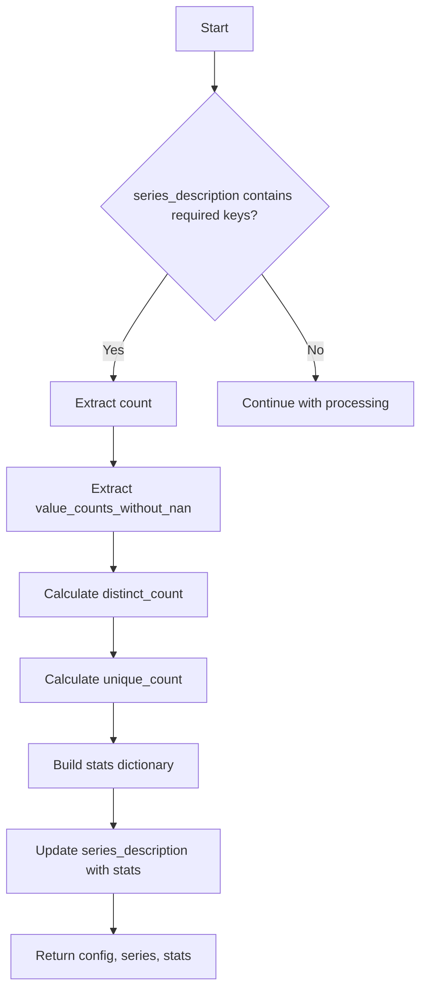

# `describe_supported_pandas.py`

## `src.ydata_profiling.model.pandas.describe_supported_pandas.pandas_describe_supported` · *function*

## Summary:
Calculates descriptive statistics for a pandas Series including distinct and unique value counts for data profiling purposes.

## Description:
Processes a pandas Series to compute various statistical measures such as distinct value counts, unique value counts, and their proportions. This function is part of the pandas backend implementation for data profiling operations and is typically called as part of the data summarization pipeline.

The function extracts key information from the series description dictionary, computes additional statistics about the distribution of values in the series, and merges these statistics back into the description. This logic is separated into its own function to provide a clean interface for pandas-specific statistical calculations while maintaining consistency with the broader profiling framework.

## Args:
    config (Settings): Configuration settings for the profiling process
    series (pd.Series): The pandas Series to analyze
    series_description (dict): Dictionary containing pre-computed series statistics including 'count' and 'value_counts_without_nan'

## Returns:
    Tuple[Settings, pd.Series, dict]: A tuple containing the original config, series, and the updated series_description dictionary with additional statistical measures

## Raises:
    None explicitly raised in the function body

## Constraints:
    Preconditions:
    - The series_description dictionary must contain 'count' and 'value_counts_without_nan' keys
    - The 'count' value should be a numeric value representing total observations
    - The 'value_counts_without_nan' should be a pandas Series or similar structure with value counts
    
    Postconditions:
    - The returned stats dictionary will contain at minimum the keys: 'n_distinct', 'p_distinct', 'is_unique', 'n_unique', 'p_unique'
    - The stats dictionary will be merged with the original series_description

## Side Effects:
    None

## Control Flow:


## Examples:
    # Typical usage in profiling pipeline
    config = Settings()
    series = pd.Series([1, 2, 2, 3, 3, 3])
    series_description = {
        "count": 6,
        "value_counts_without_nan": pd.Series([1, 2, 3], index=[1, 2, 3])
    }
    
    result_config, result_series, result_stats = pandas_describe_supported(config, series, series_description)
    # result_stats will contain additional keys like 'n_distinct', 'p_distinct', etc.
```

