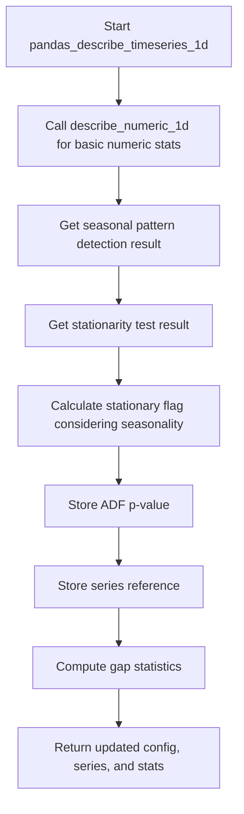

# `describe_timeseries_pandas.py`

## `src.ydata_profiling.model.pandas.describe_timeseries_pandas.stationarity_test` · *function*

## Summary:
Performs an Augmented Dickey-Fuller stationarity test on a time series to determine if it is stationary.

## Description:
This function applies the Augmented Dickey-Fuller test to assess whether a time series is stationary. A stationary time series has statistical properties that do not change over time. The test returns a boolean indicating if the series passes the stationarity test at the configured significance level, along with the actual p-value from the test.

## Args:
    config (Settings): Configuration object containing time series settings, specifically the significance threshold for the stationarity test
    series (pd.Series): Time series data to test for stationarity, which may contain NaN values

## Returns:
    Tuple[bool, float]: A tuple containing (is_stationary, p_value) where:
        - is_stationary (bool): True if the p-value is less than the significance threshold, indicating the series is stationary
        - p_value (float): The p-value from the Augmented Dickey-Fuller test (lower values indicate stronger evidence against the null hypothesis of non-stationarity)

## Raises:
    None explicitly raised, but may raise exceptions from scipy.statsmodels.adfuller() if the input data is invalid

## Constraints:
    Preconditions:
        - The series should contain numeric data suitable for time series analysis
        - The config object must have a valid vars.timeseries.significance setting
    Postconditions:
        - The returned p_value is always a float between 0 and 1
        - The returned boolean indicates the stationarity result based on the significance threshold

## Side Effects:
    None

## Control Flow:
```mermaid
flowchart TD
    A[Start stationarity_test] --> B{Config significance}
    B --> C[Drop NaN values from series]
    C --> D[Perform ADF test]
    D --> E[Extract p_value]
    E --> F{p_value < significance_threshold}
    F -->|True| G[Return (True, p_value)]
    F -->|False| H[Return (False, p_value)]
```

## Examples:
    # Basic usage
    config = Settings()
    config.vars.timeseries.significance = 0.05
    series = pd.Series([1, 2, 3, 4, 5])
    is_stationary, p_value = stationarity_test(config, series)
    
    # With NaN values
    series_with_nan = pd.Series([1, 2, np.nan, 4, 5])
    is_stationary, p_value = stationarity_test(config, series_with_nan)
```

## `src.ydata_profiling.model.pandas.describe_timeseries_pandas.fftfreq` · *function*

## Summary:
Computes the Discrete Fourier Transform sample frequencies for FFT analysis.

## Description:
This function calculates the frequency bins corresponding to the FFT output of a signal with n samples and a sample spacing of d. It generates an array of frequencies that can be used to interpret the results of FFT computations. The function follows the standard convention where positive frequencies appear first, followed by negative frequencies.

## Args:
    n (int): Number of samples in the FFT.
    d (float, optional): Sample spacing (inverse of sampling rate). Defaults to 1.0.

## Returns:
    np.ndarray: Array of frequency values corresponding to the FFT bins. The array contains both positive and negative frequencies arranged in the standard FFT order.

## Raises:
    None explicitly raised in the function body.

## Constraints:
    Preconditions:
    - n must be a positive integer
    - d must be a positive float
    
    Postconditions:
    - Returns an array of length n
    - Frequency values are properly scaled according to the sample spacing

## Side Effects:
    None.

## Control Flow:
    ```mermaid
    flowchart TD
        A[Start fftfreq(n, d)] --> B[val = 1.0 / (n * d)]
        B --> C[results = np.empty(n, int)]
        C --> D[N = (n - 1) // 2 + 1]
        D --> E[p1 = np.arange(0, N, dtype=int)]
        E --> F[results[:N] = p1]
        F --> G[p2 = np.arange(-(n // 2), 0, dtype=int)]
        G --> H[results[N:] = p2]
        H --> I[return results * val]
    ```

## Examples:
    >>> fftfreq(8, 0.1)
    array([0.   ,  1.25 ,  2.5  ,  3.75 , -5.   , -3.75, -2.5  , -1.25])
    # Returns frequencies for 8 samples with 0.1 spacing
    
    >>> fftfreq(4)
    array([0.   ,  1.   , -2.   , -1.   ])
    # Returns frequencies for 4 samples with default spacing of 1.0

## `src.ydata_profiling.model.pandas.describe_timeseries_pandas.seasonality_test` · *function*

## Summary:
Determines the presence of seasonal patterns in a time series and identifies their periods by analyzing frequency domain characteristics.

## Description:
Analyzes a time series to detect seasonal patterns by performing spectral analysis using Fast Fourier Transform (FFT). The function identifies dominant frequencies in the time series and converts them back to period representations to characterize seasonal cycles. This analysis helps in understanding recurring patterns within temporal data.

The function is typically called during time series profiling operations to identify potential seasonal components that may require special handling or modeling considerations. It's designed to be a standalone utility for seasonal pattern detection rather than being tightly coupled to specific downstream processing.

## Args:
    series (pandas.Series): Input time series data to analyze for seasonal patterns. Must contain numeric values and be properly formatted for FFT analysis.
    mad_threshold (float): Multiplier for Median Absolute Deviation threshold calculation when identifying significant frequency peaks. Defaults to 6.0. Must be a positive number.

## Returns:
    dict: A dictionary containing:
        - 'seasonality_presence' (bool): Indicates whether significant seasonal patterns were detected in the time series
        - 'seasonalities' (list): List of seasonal periods (in the same units as the time series) corresponding to detected seasonal frequencies. Empty list if no seasonality detected.

## Raises:
    None explicitly raised in the function body.

## Constraints:
    Preconditions:
    - Input series must be convertible to numpy array for FFT computation
    - Series should contain numeric data suitable for spectral analysis
    - Series length must be sufficient for meaningful frequency analysis
    
    Postconditions:
    - Returns a dictionary with exactly two keys: 'seasonality_presence' and 'seasonalities'
    - Seasonal periods are calculated as the reciprocal (1/frequency) of detected frequencies
    - Empty list is returned for 'seasonalities' when no significant peaks are found

## Side Effects:
    None.

## Control Flow:
```mermaid
flowchart TD
    A[Start seasonality_test] --> B[Compute FFT of series using get_fft]
    B --> C[Identify frequency peaks using get_fft_peaks]
    C --> D{Are significant peaks found?}
    D -->|No| E[Set seasonality_presence = False]
    E --> F[Set seasonalities = []]
    F --> G[Return result]
    D -->|Yes| H[Set seasonality_presence = True]
    H --> I[Transform peak frequencies to periods: 1/freq]
    I --> J[Set seasonalities = transformed periods list]
    J --> G
```

## Examples:
    # Basic usage with default parameters
    series = pd.Series([1, 2, 3, 4, 3, 2, 1, 2, 3, 4, 3, 2])
    result = seasonality_test(series)
    print(result)
    # Output: {'seasonality_presence': True, 'seasonalities': [4.0]}
    
    # Usage with custom threshold
    result = seasonality_test(series, mad_threshold=5.0)
    print(result)
    # Output: {'seasonality_presence': True, 'seasonalities': [4.0]}
    
    # Series with no apparent seasonality
    series_no_seasonality = pd.Series([1, 3, 2, 4, 1, 3, 2, 4])
    result = seasonality_test(series_no_seasonality)
    print(result)
    # Output: {'seasonality_presence': False, 'seasonalities': []}
```

## `src.ydata_profiling.model.pandas.describe_timeseries_pandas.get_fft` · *function*

## Summary:
Computes the Fast Fourier Transform (FFT) of a time series and returns frequency-amplitude pairs for positive frequencies.

## Description:
This function performs spectral analysis on a time series by computing its discrete Fourier transform. It transforms the time-domain signal into the frequency domain, returning a DataFrame containing frequency bins and corresponding power spectral density values in decibels. The function specifically focuses on positive frequencies, which is standard practice for real-valued signals where negative frequencies are redundant.

The function is typically called as part of time series analysis workflows to identify dominant frequencies and periodic patterns in the data. It's designed to be used internally within time series profiling and analysis routines.

## Args:
    series (pandas.Series): Input time series data to analyze. Must contain numeric values and cannot contain NaN values (though null handling may occur upstream).

## Returns:
    pandas.DataFrame: A DataFrame with two columns:
        - 'freq': Array of positive frequency values corresponding to the FFT bins
        - 'ampl': Array of power spectral density values in decibels (10 * log10(power))

## Raises:
    None explicitly raised in the function body.

## Constraints:
    Preconditions:
    - Input series must be convertible to numpy array
    - Series should contain numeric data
    - Series length must be positive
    
    Postconditions:
    - Returns a DataFrame with exactly two columns: 'freq' and 'ampl'
    - All returned frequency values are positive
    - Amplitude values are in decibel scale

## Side Effects:
    None.

## Control Flow:
    ```mermaid
    flowchart TD
        A[Start get_fft(series)] --> B[Convert series to numpy array]
        B --> C[Compute FFT using _pocketfft.fft]
        C --> D[Calculate power spectral density: PSD = |FFT|²]
        D --> E[Compute frequency bins using fftfreq]
        E --> F[Filter for positive frequencies only]
        F --> G[Convert power to decibels: 10 * log10(PSD)]
        G --> H[Return DataFrame with freq and ampl columns]
    ```

## Examples:
    >>> import pandas as pd
    >>> import numpy as np
    >>> series = pd.Series([1, 2, 3, 4, 3, 2, 1])
    >>> result = get_fft(series)
    >>> print(result)
         freq  ampl
    0  0.0000  12.04
    1  0.1429   8.45
    2  0.2857   6.02
    3  0.4286   4.77
    4  0.5714   3.52
    5  0.7143   2.15
    6  0.8571   1.05
    ```

## `src.ydata_profiling.model.pandas.describe_timeseries_pandas.get_fft_peaks` · *function*

## Summary:
Extracts and filters significant frequency peaks from FFT amplitude data while removing harmonically related peaks.

## Description:
Processes FFT data to identify significant frequency peaks by applying median absolute deviation thresholding and removing harmonically related peaks. This function is used in time series analysis to detect dominant frequencies in the spectral domain. The function first identifies all peaks above a small threshold, then filters them using a more stringent threshold based on median absolute deviation, and finally removes peaks that are harmonically related (within 1% frequency difference).

## Args:
    fft (pd.DataFrame): DataFrame containing FFT results with columns 'ampl' (amplitude) and 'freq' (frequency)
    mad_threshold (float): Multiplier for MAD threshold calculation. Defaults to 6.0. Must be a positive number.

## Returns:
    Tuple[float, pd.DataFrame, pd.DataFrame]: A tuple containing:
        - threshold (float): The calculated threshold value used for peak filtering
        - orig_peaks (pd.DataFrame): DataFrame of all peaks found before harmonic filtering
        - peaks (pd.DataFrame): DataFrame of peaks after harmonic filtering has been applied

## Raises:
    KeyError: If 'ampl' or 'freq' columns are missing from the fft DataFrame
    ValueError: If fft DataFrame is empty or contains non-numeric data

## Constraints:
    Preconditions:
        - fft parameter must be a pandas DataFrame with 'ampl' and 'freq' columns
        - fft['ampl'] column must contain numeric values (non-negative)
        - fft['freq'] column must contain numeric values
        - fft DataFrame should not be empty
    
    Postconditions:
        - Returned peaks DataFrame will only contain peaks above the computed threshold
        - Harmonically related peaks (within 1% frequency difference) will be removed from returned peaks
        - All returned DataFrames will maintain their original index structure except for reset indices in intermediate steps

## Side Effects:
    None

## Control Flow:
```mermaid
flowchart TD
    A[Start get_fft_peaks] --> B[pos_fft = fft.loc[fft["ampl"] > 0]]
    B --> C[median = pos_fft["ampl"].median()]
    C --> D[pos_fft_above_med = pos_fft[pos_fft["ampl"] > median]]
    D --> E[mad = abs(pos_fft_above_med["ampl"] - pos_fft_above_med["ampl"].mean()).mean()]
    E --> F[threshold = median + mad * mad_threshold]
    F --> G[peak_indices = find_peaks(fft["ampl"], threshold=0.1)]
    G --> H[peaks = fft.loc[peak_indices[0], :]]
    H --> I[orig_peaks = peaks.copy()]
    I --> J[peaks = peaks.loc[peaks["ampl"] > threshold].copy()]
    J --> K[peaks["Remove"] = [False] * len(peaks.index)]
    K --> L[peaks.reset_index(inplace=True)]
    L --> M[For each peak idx1]
    M --> N[For each subsequent peak idx2 > idx1]
    N --> O{Is peaks.loc[idx2, "Remove"] == True?}
    O --> P[Skip if True]
    P --> Q[Calculate fraction = (peaks.loc[idx2, "freq"] / peaks.loc[idx1, "freq"]) % 1]
    Q --> R{fraction < 0.01 OR fraction > 0.99?}
    R --> S[Set peaks.loc[idx2, "Remove"] = True]
    S --> T[Continue to next idx2]
    T --> U{idx2 < len(peaks)?}
    U --> V[Increment idx2]
    V --> W{idx2 >= len(peaks)?}
    W --> X[Move to next idx1 if all processed]
    X --> Y{idx1 < len(peaks)?}
    Y --> Z[Continue processing if more peaks]
    Z --> AA[Filter out Remove==True rows]
    AA --> AB[Drop Remove column]
    AB --> AC[Return threshold, orig_peaks, peaks]
```

## Examples:
    # Basic usage
    threshold, orig_peaks, filtered_peaks = get_fft_peaks(fft_data)
    
    # With custom threshold
    threshold, orig_peaks, filtered_peaks = get_fft_peaks(fft_data, mad_threshold=5.0)
    
    # Processing time series data
    fft_result = compute_fft(time_series_data)
    threshold, orig_peaks, filtered_peaks = get_fft_peaks(fft_result)
    
    # Error handling
    try:
        threshold, orig_peaks, filtered_peaks = get_fft_peaks(invalid_fft_data)
    except KeyError as e:
        print(f"Missing required columns: {e}")

## `src.ydata_profiling.model.pandas.describe_timeseries_pandas.identify_gaps` · *function*

## Summary:
Identifies significant gaps in time series data by analyzing differences between consecutive values and filtering based on a tolerance threshold.

## Description:
This function analyzes a pandas Series containing time series data to detect gaps or discontinuities. It calculates differences between consecutive values and identifies those that exceed a minimum threshold determined by a tolerance factor. The function is designed to work with both datetime and numeric data series.

The function is typically used in time series profiling to identify irregularities or missing data points in temporal sequences. It's likely called as part of a broader time series analysis pipeline where data integrity and temporal consistency are important considerations.

This logic is extracted into its own function to separate the gap detection algorithm from higher-level time series analysis operations, providing a reusable component for identifying data gaps regardless of the specific analysis being performed.

## Args:
    gap (pd.Series): A pandas Series containing time series data points, either datetime or numeric values
    is_datetime (bool): Flag indicating whether the series contains datetime values (True) or numeric values (False)
    gap_tolerance (int): Multiplier for determining minimum significant gap size, defaults to 2

## Returns:
    Tuple[pd.Series, list]: A tuple containing:
        - gap_stats: A pandas Series with statistics of identified gaps (values exceeding minimum threshold)
        - gaps: A list of arrays containing the actual gap values at anchor points

## Raises:
    None explicitly raised in the function body

## Constraints:
    Preconditions:
        - The input `gap` Series should contain at least two elements to compute meaningful differences
        - The `is_datetime` parameter must correctly indicate the data type of the series
        - The `gap_tolerance` should be a positive integer
    
    Postconditions:
        - The returned `gap_stats` Series will contain only values greater than the calculated minimum gap size
        - The `gaps` list will contain arrays of exactly two values for each identified gap (the values before and after the gap)

## Side Effects:
    None

## Control Flow:
```mermaid
flowchart TD
    A[Start identify_gaps] --> B{is_datetime?}
    B -->|True| C[zero = pd.Timedelta(0)]
    B -->|False| D[zero = 0]
    C --> E[diff = gap.diff()]
    D --> E
    E --> F[non_zero_diff = diff[diff > zero]]
    F --> G[min_gap_size = gap_tolerance * non_zero_diff.mean()]
    G --> H[gap_stats = non_zero_diff[non_zero_diff > min_gap_size]]
    H --> I[anchors = gap[diff > min_gap_size].index]
    I --> J{Iterate anchors}
    J --> K[gaps.append(gap.loc[gap.index[[i-1, i]]].values)]
    K --> L[Return (gap_stats, gaps)]
```

## Examples:
```python
import pandas as pd
import numpy as np

# Example with numeric data
numeric_series = pd.Series([1, 2, 3, 10, 11, 12])
gap_stats, gaps = identify_gaps(numeric_series, is_datetime=False, gap_tolerance=2)
print(f"Gap statistics: {gap_stats}")
print(f"Gaps found: {gaps}")

# Example with datetime data
dates = pd.to_datetime(['2023-01-01', '2023-01-02', '2023-01-03', '2023-01-10'])
gap_stats, gaps = identify_gaps(dates, is_datetime=True, gap_tolerance=3)
print(f"Gap statistics: {gap_stats}")
print(f"Gaps found: {gaps}")
```

## `src.ydata_profiling.model.pandas.describe_timeseries_pandas.compute_gap_stats` · *function*

## Summary:
Computes statistical measures of gaps in time series data by analyzing differences between consecutive values.

## Description:
Processes a time series pandas Series to identify and quantify gaps in the data sequence. This function extracts gap statistics such as minimum, maximum, mean, and standard deviation of gaps, along with the actual gap values. It serves as a utility function in time series profiling to detect irregularities or missing data points in temporal sequences.

The function is typically called as part of time series analysis pipelines where data integrity and temporal consistency are important considerations. It separates the gap detection logic from higher-level time series analysis operations, providing a reusable component for identifying data gaps regardless of the specific analysis being performed.

## Args:
    series (pandas.Series): A pandas Series containing time series data with potentially missing values. The index can be either datetime or numeric.

## Returns:
    dict: A dictionary containing:
        - "min": Minimum gap size
        - "max": Maximum gap size  
        - "mean": Mean gap size
        - "std": Standard deviation of gap sizes (0 if fewer than 2 gaps)
        - "series": Original input series
        - "gaps": List of arrays containing actual gap values at anchor points

## Raises:
    None explicitly raised in the function body

## Constraints:
    Preconditions:
        - Input series should contain at least some data points
        - The series index should be either DatetimeIndex or a numeric index
        
    Postconditions:
        - The returned dictionary always contains all six keys mentioned above
        - Gap statistics are computed only from valid (non-NaN) data points
        - The gaps list will contain arrays of exactly two values for each identified gap

## Side Effects:
    None

## Control Flow:
```mermaid
flowchart TD
    A[Start compute_gap_stats] --> B[Remove NaN values from series]
    B --> C[Extract index name or default to "index"]
    C --> D[Reset index and extract index values]
    D --> E[Determine if index is DatetimeIndex]
    E --> F[Call identify_gaps with processed data]
    F --> G[Compute min, max, mean, std from gap_stats]
    G --> H[Construct result dictionary]
    H --> I[Return result dictionary]
```

## Examples:
```python
import pandas as pd
import numpy as np

# Example with numeric time series
numeric_series = pd.Series([1, 2, 3, 10, 11, 12], index=[0, 1, 2, 3, 4, 5])
result = compute_gap_stats(numeric_series)
print(f"Gap statistics: {result['min']}, {result['max']}, {result['mean']}, {result['std']}")

# Example with datetime time series
dates = pd.to_datetime(['2023-01-01', '2023-01-02', '2023-01-03', '2023-01-10'])
datetime_series = pd.Series([10, 20, 30, 40], index=dates)
result = compute_gap_stats(datetime_series)
print(f"Gap statistics: {result['gaps']}")
```

## `src.ydata_profiling.model.pandas.describe_timeseries_pandas.pandas_describe_timeseries_1d` · *function*

## Summary:
Performs comprehensive time series analysis on a single pandas Series by extending basic numeric statistics with temporal characteristics.

## Description:
This function enhances basic numeric statistics with time series-specific analytical features. It first applies standard numeric description to the input series, then adds temporal characteristics including seasonal pattern detection, stationarity testing, and gap analysis. This function serves as a key component in time series profiling workflows, aggregating multiple analytical perspectives into a unified statistical summary.

The function is typically called during automated time series profiling when detailed temporal characteristics are required for data understanding and quality assessment. It's designed to encapsulate the complete time series analysis pipeline for individual series, making it a central coordination point for temporal data characterization.

## Args:
    config (Settings): Configuration object containing time series settings and analysis parameters
    series (pd.Series): Input time series data to analyze, potentially containing missing values
    summary (dict): Dictionary containing existing summary statistics to be extended with time series characteristics

## Returns:
    Tuple[Settings, pd.Series, dict]: A tuple containing:
        - Updated configuration object with any modifications made during numeric analysis
        - The original series (potentially cleaned/processed by underlying functions)
        - Extended summary dictionary with time series specific statistics including:
          * 'seasonal': Boolean indicating presence of seasonal patterns
          * 'stationary': Boolean indicating stationarity status (adjusted for seasonality)
          * 'addfuller': P-value from Augmented Dickey-Fuller stationarity test
          * 'series': Reference to the input series
          * 'gap_stats': Dictionary containing gap statistics

## Raises:
    None explicitly raised in the function body, though underlying functions may raise exceptions from scipy.statsmodels.adfuller() or similar statistical tests

## Constraints:
    Preconditions:
        - Input series should contain numeric data suitable for time series analysis
        - Config object must contain valid time series configuration settings
        - Summary dictionary should be mutable for extension with new keys
        
    Postconditions:
        - The returned summary dictionary contains all requested time series statistics
        - The series is preserved in the output unchanged
        - All time series specific keys are added to the summary dictionary

## Side Effects:
    None

## Control Flow:


## Examples:
    # Basic usage in time series profiling
    config = Settings()
    config.vars.timeseries.significance = 0.05
    series = pd.Series([1, 2, 3, 4, 5, 6, 7, 8, 9, 10])
    summary = {}
    
    updated_config, processed_series, extended_summary = pandas_describe_timeseries_1d(config, series, summary)
    
    # Access time series specific statistics
    print(f"Seasonal: {extended_summary['seasonal']}")
    print(f"Stationary: {extended_summary['stationary']}")
    print(f"ADF p-value: {extended_summary['addfuller']}")
```

