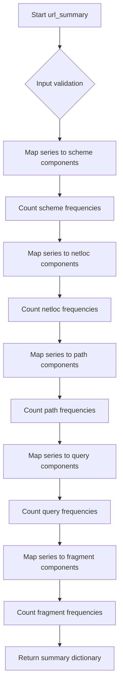
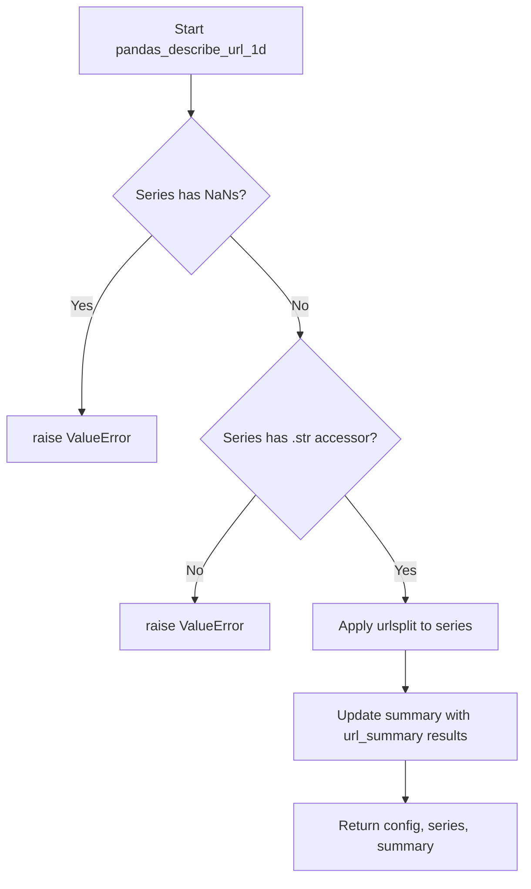

# `describe_url_pandas.py`

## `src.ydata_profiling.model.pandas.describe_url_pandas.url_summary` · *function*

## Summary:
Extracts and counts URL component distributions from a pandas Series of parsed URL objects.

## Description:
Processes a pandas Series containing parsed URL objects and computes frequency counts for each structural component (scheme, network location, path, query, and fragment) of the URLs. This function is used in data profiling to analyze URL structure distributions.

## Args:
    series (pd.Series): A pandas Series containing parsed URL objects with scheme, netloc, path, query, and fragment attributes.

## Returns:
    dict: A dictionary containing five keys with pandas Series values representing counts of unique URL components:
        - "scheme_counts": Count of unique URL schemes (e.g., 'http', 'https')
        - "netloc_counts": Count of unique network locations (domain names)
        - "path_counts": Count of unique paths
        - "query_counts": Count of unique query parameters
        - "fragment_counts": Count of unique fragments

## Raises:
    AttributeError: If any element in the series does not have scheme, netloc, path, query, or fragment attributes.

## Constraints:
    Preconditions:
        - Input series must contain URL objects that have scheme, netloc, path, query, and fragment attributes
        - Each element in the series should be a parsed URL object (like those returned by urlsplit)
    
    Postconditions:
        - Returns a dictionary with exactly five keys
        - All returned Series objects will have integer counts as values

## Side Effects:
    None

## Control Flow:


## Examples:
```python
import pandas as pd
from urllib.parse import urlsplit

# Basic usage with parsed URLs
parsed_urls = [urlsplit('http://example.com/path?a=1'), urlsplit('https://test.org/page?b=2')]
urls_series = pd.Series(parsed_urls)
result = url_summary(urls_series)
print(result['scheme_counts'])  # Shows count of 'http' vs 'https'
```

## `src.ydata_profiling.model.pandas.describe_url_pandas.pandas_describe_url_1d` · *function*

## Summary:
Processes a pandas Series of URLs to extract and summarize URL component distributions.

## Description:
Parses URLs in a pandas Series and computes frequency distributions for URL structural components (scheme, network location, path, query, and fragment). This function serves as a pandas-specific implementation for URL analysis within data profiling workflows.

## Args:
    config (Settings): Configuration settings for the profiling process
    series (pd.Series): A pandas Series containing URL strings to be analyzed
    summary (dict): Dictionary to be updated with URL component distribution statistics

## Returns:
    Tuple[Settings, pd.Series, dict]: A tuple containing the unchanged config, the series with parsed URL objects, and the updated summary dictionary

## Raises:
    ValueError: If the series contains NaN values or does not have a string accessor (.str)

## Constraints:
    Preconditions:
        - Input series must not contain any NaN values
        - Input series must have a string accessor (.str attribute)
        - Input series should contain valid URL strings that can be parsed by urlsplit
    
    Postconditions:
        - The series will contain parsed URL objects (from urlsplit) instead of raw strings
        - The summary dictionary will be updated with URL component distribution counts

## Side Effects:
    None

## Control Flow:


## Examples:
```python
import pandas as pd
from ydata_profiling.config import Settings
from urllib.parse import urlsplit

# Create sample URL data
urls = pd.Series(['http://example.com/path?a=1', 'https://test.org/page?b=2'])
config = Settings()
summary = {}

# Process URLs
config, processed_series, summary = pandas_describe_url_1d(config, urls, summary)

# The series now contains parsed URL objects
print(processed_series.iloc[0])  # urlsplit result for first URL

# The summary contains component distribution counts
print(summary.keys())  # Will show scheme_counts, netloc_counts, etc.
```

