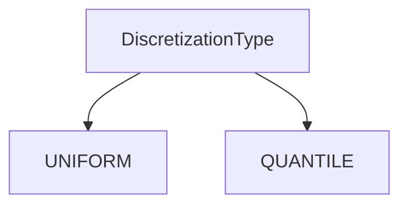
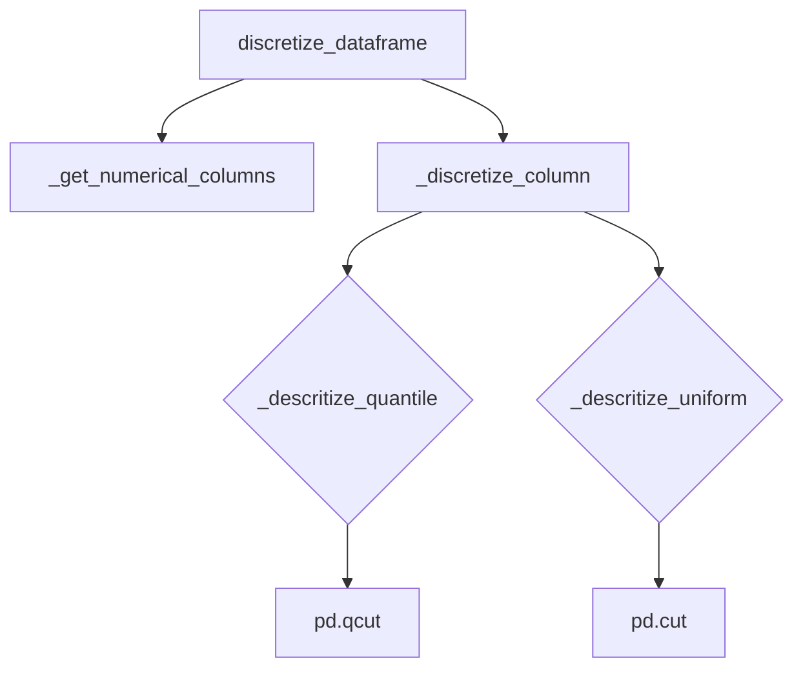

# `discretize_pandas.py`

## `src.ydata_profiling.model.pandas.discretize_pandas.DiscretizationType` · *class*

## Summary:
Enumeration representing different discretization methods for data binning.

## Description:
DiscretizationType is an enumeration that defines the available methods for discretizing continuous numerical data into bins. This enum is used throughout the profiling system to specify how numeric columns should be binned for analysis and visualization purposes.

## State:
- UNIFORM: Represents uniform binning method, where bins have equal width intervals
- QUANTILE: Represents quantile-based binning method, where bins contain approximately equal numbers of observations

## Lifecycle:
- Creation: Instances are created automatically when accessing enum members (UNIFORM or QUANTILE)
- Usage: Used as a parameter in functions and methods that require discretization method specification
- Destruction: Managed automatically by Python's garbage collector

## Method Map:


## Raises:
- No exceptions are raised during initialization as this is an enum class

## Example:
```python
from src.ydata_profiling.model.pandas.discretize_pandas import DiscretizationType

# Using the enum values
method1 = DiscretizationType.UNIFORM
method2 = DiscretizationType.QUANTILE

# Checking values
print(method1.value)  # Output: "uniform"
print(method2.value)  # Output: "quantile"
```

## `src.ydata_profiling.model.pandas.discretize_pandas.Discretizer` · *class*

## Summary:
A class that discretizes numerical columns in pandas DataFrames using either quantile or uniform binning methods.

## Description:
The Discretizer class transforms continuous numerical data into discrete bins, which is useful for data preprocessing and analysis. It provides two discretization strategies: quantile-based binning (where each bin contains approximately the same number of observations) and uniform binning (where bins have equal width ranges). This class is typically used in data profiling and preprocessing pipelines to convert continuous variables into categorical ones for easier analysis.

## State:
- discretization_type: DiscretizationType enum value indicating the discretization method (expected to be QUANTILE or UNIFORM)
- n_bins: int, number of bins to create (default: 10, must be > 0)
- reset_index: bool, whether to reset the DataFrame index after discretization (default: False)

## Lifecycle:
- Creation: Instantiate with a DiscretizationType method, optionally specifying n_bins and reset_index
- Usage: Call discretize_dataframe() with a pandas DataFrame to process numerical columns
- Destruction: No special cleanup required; standard Python garbage collection applies

## Method Map:


## Raises:
- TypeError: If the input dataframe is not a pandas DataFrame
- ValueError: If n_bins is less than or equal to 0
- KeyError: If DiscretizationType enum values are not recognized

## Example:
```python
from src.ydata_profiling.model.pandas.discretize_pandas import Discretizer

# Create discretizer with quantile-based binning
discretizer = Discretizer(DiscretizationType.QUANTILE, n_bins=5, reset_index=True)
result_df = discretizer.discretize_dataframe(df)
```

### `src.ydata_profiling.model.pandas.discretize_pandas.Discretizer.__init__` · *method*

## Summary:
Initializes a Discretizer instance with discretization configuration parameters.

## Description:
Configures the discretizer with the specified discretization method, number of bins, and index reset preference. This method establishes the core parameters that control how numerical data will be transformed into discrete bins during subsequent discretization operations.

## Args:
    method (DiscretizationType): The discretization strategy to use, either QUANTILE or UNIFORM binning
    n_bins (int): Number of bins to create for discretization, defaults to 10
    reset_index (bool): Whether to reset the DataFrame index after discretization, defaults to False

## Returns:
    None: This method initializes instance attributes and does not return a value

## Raises:
    None: This method does not explicitly raise exceptions

## State Changes:
    Attributes READ: No attributes are read from self
    Attributes WRITTEN: 
    - self.discretization_type: Set to the provided method parameter
    - self.n_bins: Set to the provided n_bins parameter
    - self.reset_index: Set to the provided reset_index parameter

## Constraints:
    Preconditions:
    - The method parameter must be a valid DiscretizationType enum value
    - The n_bins parameter must be a positive integer (> 0)
    - The reset_index parameter must be a boolean value
    
    Postconditions:
    - All instance attributes are properly initialized with provided values
    - The Discretizer object is ready for use with discretize_dataframe()

## Side Effects:
    None: This method performs no I/O operations or external service calls

### `src.ydata_profiling.model.pandas.discretize_pandas.Discretizer.discretize_dataframe` · *method*

## Summary:
Discretizes numerical columns in a DataFrame by converting continuous values into discrete bins while preserving the original column order and index structure.

## Description:
Processes a pandas DataFrame by discretizing all numerical columns into discrete bins using the configured discretization method (quantile or uniform). This method creates a copy of the input DataFrame, applies discretization to numerical columns only, and maintains the original column ordering. The resulting DataFrame can optionally have its index reset based on the instance configuration.

This method is the main entry point for the discretization functionality and orchestrates the discretization process by:
1. Creating a copy of the input DataFrame to avoid modifying the original
2. Identifying numerical columns using the helper method
3. Applying column-specific discretization to each numerical column
4. Preserving column order and applying optional index reset

## Args:
    dataframe (pd.DataFrame): The input pandas DataFrame containing data to be discretized

## Returns:
    pd.DataFrame: A new DataFrame with numerical columns discretized into bins, maintaining the original column order and index structure

## Raises:
    None: This method does not explicitly raise exceptions, though underlying pandas operations may raise exceptions for invalid inputs

## State Changes:
    Attributes READ: 
    - self.reset_index: Determines whether to reset the DataFrame index
    - self.discretization_type: Controls the discretization method (quantile vs uniform)
    - self.n_bins: Specifies the number of bins for discretization
    
    Attributes WRITTEN: None

## Constraints:
    Preconditions:
    - Input dataframe must be a valid pandas DataFrame instance
    - The Discretizer instance must be properly initialized with valid configuration parameters
    
    Postconditions:
    - Output DataFrame has the same shape as input but with numerical columns discretized
    - Column order is preserved from the input DataFrame
    - Index handling follows the reset_index configuration

## Side Effects:
    None: This method performs no I/O operations or external service calls. It only processes the DataFrame in-memory and returns a new DataFrame instance.

### `src.ydata_profiling.model.pandas.discretize_pandas.Discretizer._discretize_column` · *method*

## Summary:
Routes column discretization to appropriate quantile or uniform binning method based on configured discretization type.

## Description:
This method serves as a dispatcher for column discretization operations, selecting the appropriate discretization strategy (quantile-based or uniform-width) based on the discretization_type attribute. It is called internally by the discretize_dataframe method when processing numerical columns in a DataFrame. The method provides a clean abstraction that separates the decision logic from the specific discretization implementations.

## Args:
    column (pd.Series): A pandas Series containing numerical data to be discretized into bins.

## Returns:
    pd.Series: A pandas Series of integer bin assignments representing the discretized version of the input column.

## Raises:
    None explicitly raised, but may propagate exceptions from underlying discretization methods (_descritize_quantile or _descritize_uniform).

## State Changes:
    Attributes READ: self.discretization_type, self.n_bins
    Attributes WRITTEN: None

## Constraints:
    Preconditions:
    - Input column must be a pandas Series with numerical data
    - self.discretization_type must be a valid DiscretizationType enum value (QUANTILE or UNIFORM)
    - self.n_bins must be a positive integer
    
    Postconditions:
    - Output Series will have the same length as input Series
    - Output values will be integers representing bin assignments
    - Method does not modify the original input Series

## Side Effects:
    None - This method is pure and doesn't cause any I/O operations or external service calls.

### `src.ydata_profiling.model.pandas.discretize_pandas.Discretizer._descritize_quantile` · *method*

## Summary:
Converts a numerical pandas Series into quantile-based discrete bins using pandas qcut function.

## Description:
This method performs quantile-based discretization on a numerical column by dividing the data into equally-sized bins based on quantiles. It's used internally by the Discretizer class when the discretization type is set to QUANTILE. The method leverages pandas' qcut function to create discrete bin assignments for each value in the input series.

## Args:
    column (pd.Series): A pandas Series containing numerical data to be discretized into quantile bins.

## Returns:
    pd.Series: A pandas Series of integers representing the bin assignment for each value in the input column. Values are assigned based on quantile-based binning where each bin contains approximately the same number of observations.

## Raises:
    None explicitly raised, but may raise exceptions from pandas qcut function under certain conditions (e.g., invalid parameters).

## State Changes:
    Attributes READ: self.n_bins
    Attributes WRITTEN: None

## Constraints:
    Preconditions: 
    - Input column must be a pandas Series with numerical data
    - self.n_bins must be a positive integer specifying the number of quantile bins to create
    - Column should not contain all identical values if n_bins > 1
    
    Postconditions:
    - Output Series will have the same length as input Series
    - Output values will be integers in the range [0, n_bins-1]
    - Missing values in input will remain as missing in output

## Side Effects:
    None - This method is pure and doesn't cause any I/O operations or external service calls.

### `src.ydata_profiling.model.pandas.discretize_pandas.Discretizer._descritize_uniform` · *method*

## Summary:
Converts a continuous numerical column into discrete bins using uniform width binning.

## Description:
This method discretizes a pandas Series into uniformly sized bins based on the number of bins specified during object initialization. It's used internally by the discretizer when the discretization type is set to UNIFORM. Each value is assigned to a bin based on its value range, with all bins having equal width.

## Args:
    column (pd.Series): A pandas Series containing numerical data to be discretized.

## Returns:
    np.ndarray: A numpy array containing integer bin indices representing which bin each value falls into. Values are in the range [0, n_bins).

## Raises:
    None explicitly raised, but may raise exceptions from underlying pandas operations.

## State Changes:
    Attributes READ: self.n_bins
    Attributes WRITTEN: None

## Constraints:
    Preconditions: 
    - The input column must be a pandas Series with numerical data
    - self.n_bins must be a positive integer
    Postconditions:
    - The returned array contains integer values indicating bin assignments
    - Bin indices are in the range [0, self.n_bins)

## Side Effects:
    None

### `src.ydata_profiling.model.pandas.discretize_pandas.Discretizer._get_numerical_columns` · *method*

## Summary:
Returns a list of column names from a DataFrame that contain numerical data types.

## Description:
This method filters a pandas DataFrame to identify and return the names of columns that contain numerical data types. It is used internally by the Discretizer class to determine which columns should undergo discretization operations. The method leverages pandas' built-in `select_dtypes` functionality with `include=np.number` to accurately identify numerical columns regardless of their specific numeric type (int, float, etc.).

## Args:
    dataframe (pd.DataFrame): The input DataFrame from which to extract numerical column names.

## Returns:
    List[str]: A list of column names (as strings) that contain numerical data types. Returns an empty list if no numerical columns are present.

## Raises:
    None: This method does not explicitly raise exceptions, though pandas operations may raise exceptions under unusual circumstances.

## State Changes:
    Attributes READ: None
    Attributes WRITTEN: None

## Constraints:
    Preconditions: The input dataframe parameter must be a valid pandas DataFrame instance.
    Postconditions: The returned list contains only column names that correspond to numerical data types in the input DataFrame.

## Side Effects:
    None: This method performs no I/O operations or external service calls. It only processes the input DataFrame and returns a list of column names.

