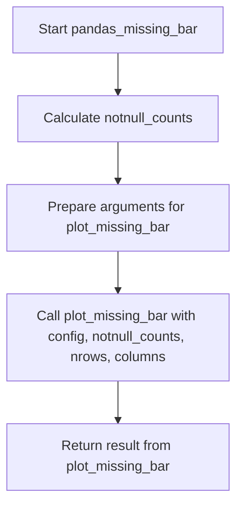
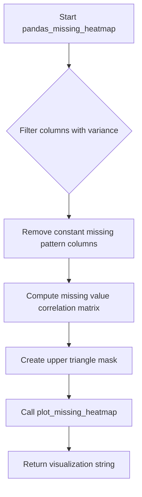

# `missing_pandas.py`

## `src.ydata_profiling.model.pandas.missing_pandas.pandas_missing_bar` · *function*

## Summary:
Generates a bar chart visualization representing the count of non-missing values for each column in a DataFrame.

## Description:
Creates a string representation of a bar chart that displays the number of non-missing (non-null) values for each column in the provided DataFrame. This function serves as a pandas-specific implementation within the missing data visualization pipeline, converting raw DataFrame statistics into a visual representation suitable for profiling reports.

The function is typically called during data profiling workflows when missing value analysis is enabled, specifically when bar chart visualizations are configured to be displayed. It acts as an adapter between the pandas DataFrame data structure and the visualization layer.

## Args:
    config (Settings): Configuration object containing profiling settings, particularly missing data visualization options and styling preferences
    df (pd.DataFrame): Input DataFrame containing the data to analyze for missing value distributions

## Returns:
    str: String representation of the missing data bar chart, typically in HTML or SVG format suitable for embedding in reports

## Raises:
    None explicitly raised by this function, though underlying visualization functions may raise exceptions related to invalid configurations or plotting issues

## Constraints:
    Preconditions:
    - config must be a valid Settings instance with proper initialization
    - df must be a valid pandas DataFrame with appropriate structure
    - df should not be empty (though technically works with empty DataFrames)
    
    Postconditions:
    - Function returns a properly formatted string representation of a bar chart
    - The returned string should accurately represent non-missing value distributions

## Side Effects:
    - Creates matplotlib figures internally for visualization generation
    - May close matplotlib figures after processing
    - Uses global matplotlib state for figure management

## Control Flow:


## Examples:
```python
from ydata_profiling.config import Settings
import pandas as pd

# Create sample data with missing values
df = pd.DataFrame({
    'A': [1, 2, None, 4],
    'B': [None, 2, 3, 4],
    'C': [1, None, None, 4]
})

# Configure settings to enable missing value analysis
config = Settings()

# Generate missing value bar chart
chart_string = pandas_missing_bar(config, df)
# Result is a string representation of the bar chart visualization
```

## `src.ydata_profiling.model.pandas.missing_pandas.pandas_missing_matrix` · *function*

## Summary:
Generates a string representation of the missing data pattern matrix visualization for a given pandas DataFrame.

## Description:
Creates a visual representation showing the locations of missing values in the input DataFrame. This function serves as a bridge between the pandas DataFrame data model and the visualization layer, preparing the necessary data structures for rendering missing value patterns.

The function extracts column names, identifies non-null values, and passes this information to the underlying plotting function to generate a missing data matrix visualization. This visualization helps users understand the structure and extent of missing information in their datasets.

Known callers within the codebase:
- Called during the missing data profiling phase when generating reports
- Invoked by the main profiling pipeline when missing value matrix diagrams are configured to be displayed
- Triggered when the configuration specifies that missing matrix visualizations should be included in the output

This logic is extracted into its own function rather than being inlined because:
- It encapsulates the specific data preparation logic needed for missing value matrix visualization
- It provides a clean separation between data model handling (pandas DataFrame) and visualization logic
- It allows for consistent processing of missing data patterns across different profiling contexts
- It enables easier testing and maintenance of the missing data visualization pipeline

## Args:
    config (Settings): Configuration settings that control the formatting and display options for the missing matrix visualization
    df (pd.DataFrame): Input pandas DataFrame containing the data to analyze for missing values

## Returns:
    str: A string representation of the missing data matrix visualization, typically formatted as HTML or image data that can be embedded in reports or dashboards

## Raises:
    None: This function does not explicitly raise exceptions, though underlying functions may raise exceptions related to invalid configurations or data issues

## Constraints:
    Preconditions:
    - The config parameter must be a valid Settings object
    - The df parameter must be a valid pandas DataFrame
    - The DataFrame should not be None

    Postconditions:
    - The returned string will contain a properly formatted visualization of missing data patterns
    - The visualization will accurately reflect the missing value locations in the input DataFrame

## Side Effects:
    None: This function does not perform any I/O operations or modify external state directly. However, it may indirectly cause matplotlib figure creation and disposal during the visualization process.

## Control Flow:
```mermaid
flowchart TD
    A[pandas_missing_matrix called] --> B{config valid?}
    B -->|No| C[Propagate invalid config]
    B -->|Yes| D{df valid?}
    D -->|No| E[Propagate invalid df]
    D -->|Yes| F[Extract df.columns to list]
    F --> G[Get df.notnull().values]
    G --> H[Call plot_missing_matrix]
    H --> I[Return visualization string]
```

## Examples:
```python
import pandas as pd
from ydata_profiling.config import Settings
from ydata_profiling.model.pandas.missing_pandas import pandas_missing_matrix

# Create sample DataFrame with missing values
df = pd.DataFrame({
    'A': [1, 2, None, 4],
    'B': [None, 2, 3, 4],
    'C': [1, None, None, 4]
})

# Configure settings
config = Settings()

# Generate missing matrix visualization
matrix_visualization = pandas_missing_matrix(config, df)
print(matrix_visualization)  # Returns HTML or image string representation
```

## `src.ydata_profiling.model.pandas.missing_pandas.pandas_missing_heatmap` · *function*

## Summary:
Generates a heatmap visualization showing correlations between missing data patterns across DataFrame columns.

## Description:
Creates a correlation heatmap that displays relationships between missing value patterns in different columns of a DataFrame. This visualization helps identify systematic missingness patterns, such as when certain columns tend to be missing together, which can indicate underlying data collection issues or logical relationships between variables.

The function filters out columns with no variation in missing values (constant missing patterns) before computing correlations to ensure meaningful visualizations. It produces a triangular masked heatmap where the diagonal represents self-correlations (always 1.0) and off-diagonal elements show pairwise correlations between missing data patterns.

## Args:
    config (Settings): Configuration object containing display preferences and analysis parameters for the heatmap visualization.
    df (pd.DataFrame): Input DataFrame containing the dataset to analyze for missing value patterns.

## Returns:
    str: String representation of the heatmap visualization, typically formatted as HTML or another visualization format suitable for reporting.

## Raises:
    None explicitly raised by this function, though underlying visualization functions may raise exceptions related to plotting or configuration issues.

## Constraints:
    Preconditions:
    - config must be a valid Settings instance with appropriate configuration parameters
    - df must be a valid pandas DataFrame
    - df should contain numeric or boolean data for proper correlation computation
    
    Postconditions:
    - Function returns a valid string representation of a visualization
    - The returned visualization accurately reflects missing data correlation patterns in the input DataFrame

## Side Effects:
    - Creates matplotlib figures and plots
    - May modify global matplotlib state (figure settings, axes properties)
    - Generates temporary visualization files if html.inline is False

## Control Flow:


## Examples:
    # Basic usage
    config = Settings()
    df = pd.DataFrame({
        'A': [1, None, 3, None],
        'B': [None, 2, None, 4],
        'C': [1, 2, 3, 4]
    })
    heatmap_html = pandas_missing_heatmap(config, df)
    
    # The resulting heatmap will show correlations between missing patterns
    # of columns A and B, while excluding column C (which has no missing values)
```

