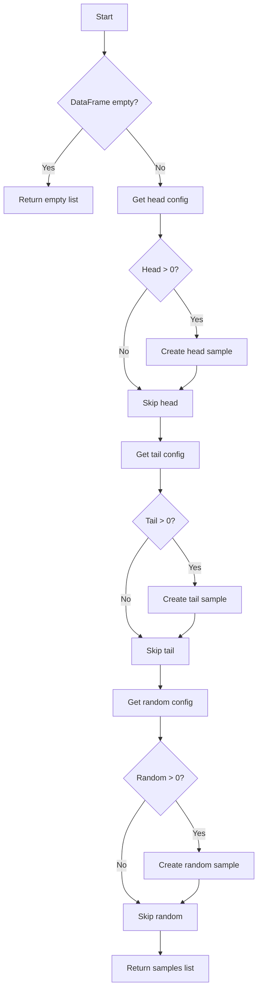

# `sample_pandas.py`

## `src.ydata_profiling.model.pandas.sample_pandas.pandas_get_sample` · *function*

## Summary:
Creates and returns a list of sample data views (head, tail, and random) from a pandas DataFrame based on configuration settings.

## Description:
This function extracts sample views from a pandas DataFrame according to the sampling configuration specified in the Settings object. It generates three types of samples: first rows (head), last rows (tail), and random rows, only when their respective configuration values are greater than zero. The function is designed to be part of the pandas-specific data profiling workflow and provides a standardized way to retrieve sample data for reporting purposes.

## Args:
    config (Settings): Configuration object containing sampling parameters (head, tail, random counts)
    df (pd.DataFrame): Input pandas DataFrame to sample from

## Returns:
    List[Sample]: A list of Sample objects containing the requested samples. Each Sample contains:
        - id: String identifier ("head", "tail", or "random")
        - data: DataFrame slice containing the sample data
        - name: Human-readable name for the sample type

## Raises:
    None explicitly raised - but may raise pandas DataFrame errors if underlying operations fail

## Constraints:
    Preconditions:
        - config must be a valid Settings object with properly initialized samples configuration
        - df must be a valid pandas DataFrame (can be empty)
    
    Postconditions:
        - Returns an empty list if the input DataFrame is empty
        - Returns a list with 0-3 Sample objects depending on configuration settings
        - All returned Sample objects have valid data and metadata

## Side Effects:
    None - This function is pure and doesn't modify external state or perform I/O operations

## Control Flow:


## Examples:
```python
# Basic usage with default configuration
config = Settings()
df = pd.DataFrame({'A': [1, 2, 3, 4, 5], 'B': [6, 7, 8, 9, 10]})
samples = pandas_get_sample(config, df)
# Returns list with head, tail, and random samples if configured

# Usage with custom sampling configuration
config = Settings(samples=Samples(head=2, tail=1, random=3))
df = pd.DataFrame({'X': range(100)})
samples = pandas_get_sample(config, df)
# Returns list with 2 head rows, 1 tail row, and 3 random rows
```

