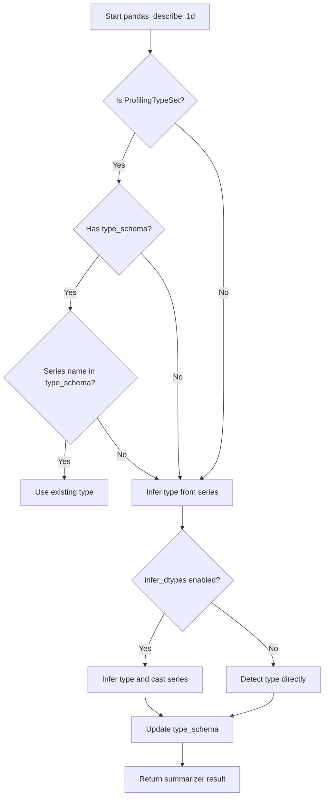
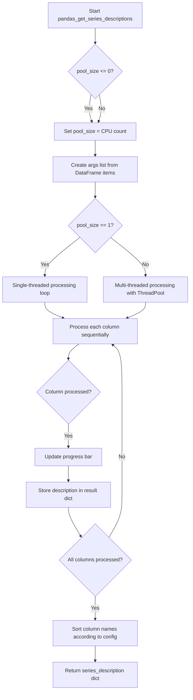

# `summary_pandas.py`

## `src.ydata_profiling.model.pandas.summary_pandas.pandas_describe_1d` · *function*

## Summary:
Processes a pandas Series for descriptive statistics by determining its data type and generating a statistical summary.

## Description:
This function serves as the core processing unit for 1-dimensional data profiling in the pandas-based profiling system. It determines the appropriate data type for a given pandas Series using the Visions type system, applies necessary type casting based on configuration settings, and delegates the actual statistical summarization to a provided summarizer instance. The function acts as a bridge between type inference and statistical analysis in the profiling pipeline.

## Args:
    config (Settings): Configuration object containing profiling settings including type inference preferences
    series (pd.Series): The pandas Series to be profiled and summarized
    summarizer (BaseSummarizer): Instance of a summarizer class responsible for generating statistical summaries
    typeset (VisionsTypeset): Type set instance used for type detection and inference operations

## Returns:
    dict: A dictionary containing the statistical summary of the input series, generated by the summarizer based on the determined data type

## Raises:
    None explicitly raised in the function body

## Constraints:
    Preconditions:
    - The series parameter must be a valid pandas Series object
    - The config parameter must be a properly initialized Settings object
    - The summarizer parameter must be a valid BaseSummarizer instance
    - The typeset parameter must be a valid VisionsTypeset instance
    
    Postconditions:
    - The typeset.type_schema dictionary will be updated with the inferred/detected type for the series name
    - The returned dictionary contains the statistical summary for the series

## Side Effects:
    - Modifies the typeset.type_schema dictionary by storing the detected type for the series name
    - May perform type casting operations on the input series when infer_dtypes is enabled

## Control Flow:


## Examples:
    # Basic usage with minimal setup
    config = Settings()
    series = pd.Series([1, 2, 3, 4, 5])
    summarizer = BaseSummarizer()
    typeset = VisionsTypeset()
    
    result = pandas_describe_1d(config, series, summarizer, typeset)
    print(result)  # Dictionary containing statistical summary

## `src.ydata_profiling.model.pandas.summary_pandas.pandas_get_series_descriptions` · *function*

## Summary:
Processes each column of a pandas DataFrame to generate descriptive statistics using parallel execution for performance optimization.

## Description:
This function iterates through all columns in a pandas DataFrame and generates comprehensive descriptive statistics for each column. It supports both single-threaded and multi-threaded execution modes based on the configured pool size, enabling efficient processing of large datasets. The function integrates with tqdm for progress tracking and ensures consistent column ordering in the output based on configuration settings.

The function extracts the core logic of column-wise data description generation into a separate function to enable reuse across different profiling contexts and to provide clear separation between data iteration and statistical computation.

## Args:
    config (Settings): Configuration object containing profiling settings including pool_size for parallel execution
    df (pd.DataFrame): Input pandas DataFrame containing the data to be described
    summarizer (BaseSummarizer): Summarizer instance responsible for generating statistical summaries  
    typeset (VisionsTypeset): Type set used for determining appropriate data types and analysis methods
    pbar (tqdm): Progress bar instance for tracking processing progress

## Returns:
    dict: A dictionary mapping column names to their respective descriptive statistics dictionaries, sorted according to configuration settings

## Raises:
    ValueError: When an invalid sort parameter is provided to the sorting function

## Constraints:
    Preconditions:
    - config must be a valid Settings instance with proper configuration
    - df must be a valid pandas DataFrame
    - summarizer must be a valid BaseSummarizer instance
    - typeset must be a valid VisionsTypeset instance
    - pbar must be a valid tqdm progress bar instance
    
    Postconditions:
    - All columns in the input DataFrame are processed and described
    - The returned dictionary keys match exactly with the DataFrame column names
    - The dictionary is sorted according to the config.sort setting

## Side Effects:
    - Updates the progress bar state through pbar.set_postfix_str() and pbar.update()
    - May create multiple threads/processes based on pool_size configuration
    - Calls describe_1d function internally for each column (which may have its own side effects)

## Control Flow:


## Examples:
```python
from ydata_profiling.config import Settings
from ydata_profiling.model.summarizer import BaseSummarizer
from visions import VisionsTypeset
from tqdm import tqdm
import pandas as pd

# Create test data
df = pd.DataFrame({
    'A': [1, 2, 3, 4, 5],
    'B': ['x', 'y', 'z', 'x', 'y'],
    'C': [1.1, 2.2, 3.3, 4.4, 5.5]
})

# Setup configuration
config = Settings(pool_size=2)
summarizer = BaseSummarizer()
typeset = VisionsTypeset()
pbar = tqdm(total=len(df.columns))

# Generate series descriptions
descriptions = pandas_get_series_descriptions(config, df, summarizer, typeset, pbar)
print(descriptions)
```

