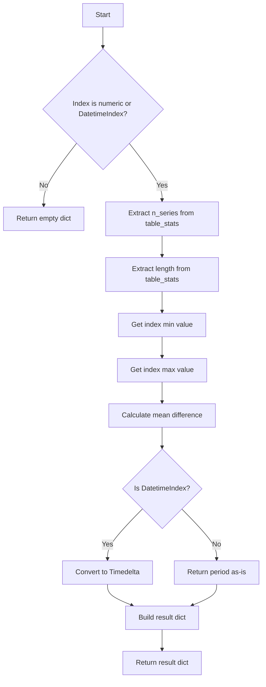

# `timeseries_index_pandas.py`

## `src.ydata_profiling.model.pandas.timeseries_index_pandas.pandas_get_time_index_description` · *function*

## Summary:
Extracts descriptive statistics about a time series index from a pandas DataFrame.

## Description:
This function analyzes the index of a pandas DataFrame to compute key statistics for time series data. It validates that the index is either numeric or datetime-based before extracting descriptive metrics. This implementation is specific to pandas DataFrames and provides metadata about the temporal characteristics of the dataset.

## Args:
    config (Settings): Configuration settings for the profiling process
    df (pd.DataFrame): Input DataFrame whose index will be analyzed for time series properties
    table_stats (dict): Dictionary containing table-level statistics including type information

## Returns:
    dict: A dictionary containing time series index statistics with keys:
        - "n_series": Number of time series in the dataset (from table_stats)
        - "length": Total number of observations (from table_stats)
        - "start": Minimum value in the index
        - "end": Maximum value in the index
        - "period": Average difference between consecutive index values

## Raises:
    None explicitly raised - returns empty dict for invalid index types

## Constraints:
    Preconditions:
        - df must be a pandas DataFrame
        - table_stats must be a dictionary containing "types" and "n" keys
    Postconditions:
        - Returns empty dict if index is neither numeric nor DatetimeIndex
        - Returns dict with statistics if index is valid time series index type

## Side Effects:
    None

## Control Flow:


## Examples:
    # Valid numeric index
    result = pandas_get_time_index_description(config, df_with_numeric_index, {"types": {"TimeSeries": 1}, "n": 100})
    # Returns: {"n_series": 1, "length": 100, "start": 0, "end": 99, "period": 1.0}

    # Valid datetime index
    result = pandas_get_time_index_description(config, df_with_datetime_index, {"types": {"TimeSeries": 1}, "n": 50})
    # Returns: {"n_series": 1, "length": 50, "start": datetime_start, "end": datetime_end, "period": timedelta_period}
```

