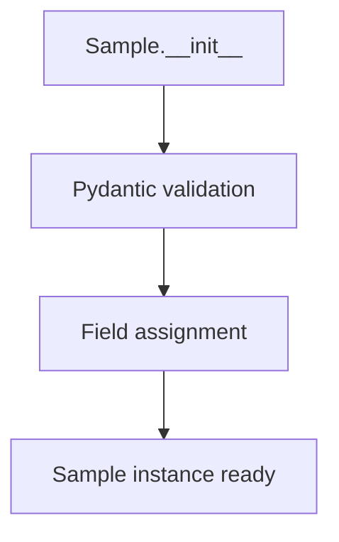

# `sample.py`

## `src.ydata_profiling.model.sample.Sample` · *class*

## Summary:
Represents a data sample with identifying metadata and associated data payload.

## Description:
The Sample class serves as a container for data samples within the profiling system, storing both metadata (ID, name, caption) and the actual data payload. It's designed to be a generic container that can hold various types of data while maintaining consistent identification and descriptive metadata.

This class is typically used to represent individual samples or subsets of data being analyzed during profiling operations. It provides a standardized way to store and reference data samples with associated metadata.

## State:
- id: str - Unique identifier for the sample
- data: T - Generic data payload associated with the sample (type T defined elsewhere)
- name: str - Human-readable name for the sample
- caption: Optional[str] = None - Optional descriptive caption for the sample

The class maintains Pydantic validation for all fields, ensuring type safety and data integrity.

## Lifecycle:
- Creation: Instantiate with id, data, and name parameters; caption is optional
- Usage: Access fields directly or use Pydantic methods for serialization/validation
- Destruction: Managed automatically by Python's garbage collection

## Method Map:


## Raises:
- ValidationError: Raised by Pydantic during initialization if field validation fails
- TypeError: Raised if incompatible types are provided for fields

## Example:
```python
# Create a sample instance
sample = Sample(
    id="sample_001",
    data=[1, 2, 3, 4, 5],
    name="Test Sample"
)

# Access fields
print(sample.id)      # "sample_001"
print(sample.name)    # "Test Sample"
print(sample.data)    # [1, 2, 3, 4, 5]

# With caption
sample_with_caption = Sample(
    id="sample_002",
    data={"key": "value"},
    name="Data Dictionary",
    caption="Sample dictionary data"
)
```

## `src.ydata_profiling.model.sample.get_sample` · *function*

## Summary:
Placeholder function for creating data samples from input data based on configuration settings.

## Description:
A stub implementation for generating sample representations of input data structures for profiling analysis. This function is intended to extract representative samples from datasets according to specified configuration parameters, returning them as Sample objects that contain both the data payload and identifying metadata.

Currently raises NotImplementedError as the implementation is incomplete. The function is designed to be a factory method for creating data samples that can be used throughout the profiling pipeline, abstracting the complexity of sampling logic.

Known callers within the codebase:
- Likely called by profiling report generators when creating sample sections
- Called during report construction phases when data samples are needed for display

This logic is extracted into its own function rather than being inlined because it encapsulates sampling business logic, separates concerns between data processing and report generation, and allows for consistent sample creation patterns across different profiling contexts.

## Args:
    config (Settings): Configuration object containing sampling parameters such as sample size limits, random seeds, and sampling strategies
    df (T): Input data structure (typically pandas DataFrame) to sample from. The generic type T represents a type variable that should be defined in the module scope

## Returns:
    List[Sample]: A list of Sample objects containing sampled data with metadata. This return type is specified in the function signature but the implementation is not yet provided.

## Raises:
    NotImplementedError: Raised by the current implementation indicating that the function is not yet implemented

## Constraints:
    Preconditions:
        - config must be a valid Settings object with proper sampling configuration
        - df must be a valid data structure that can be processed for sampling
    Postconditions:
        - When implemented, will return a list of properly validated Sample objects

## Side Effects:
    None: This function currently raises NotImplementedError and has no side effects

## Control Flow:
```mermaid
flowchart TD
    A[get_sample called] --> B{Implementation complete?}
    B -->|No| C[raise NotImplementedError]
    B -->|Yes| D[Process config and df]
    D --> E[Create Sample instances]
    E --> F[Return List[Sample]]
```

## Examples:
```python
# This will raise NotImplementedError
config = Settings()
df = pd.DataFrame({'col1': [1, 2, 3], 'col2': ['a', 'b', 'c']})
try:
    samples = get_sample(config, df)
except NotImplementedError:
    print("Function implementation pending")
```

## `src.ydata_profiling.model.sample.get_custom_sample` · *function*

## Summary:
Creates a single custom sample object from a dictionary specification with optional name and caption fields.

## Description:
Transforms a dictionary representation of a sample into a properly structured Sample object with required fields. This function ensures that custom sample dictionaries always have the necessary metadata fields (name and caption) by providing default values when they are missing.

The function extracts data from the input dictionary and wraps it in a Sample object with a fixed ID of "custom". This allows for consistent handling of custom samples throughout the profiling system while preserving the original data and optional descriptive metadata.

## Args:
    sample (dict): Dictionary containing sample data with required "data" key and optional "name" and "caption" keys

## Returns:
    List[Sample]: A list containing exactly one Sample object with the specified data and metadata

## Raises:
    KeyError: If the input sample dictionary does not contain a "data" key
    ValidationError: If the Sample constructor validation fails due to invalid field types

## Constraints:
    Preconditions:
        - Input sample dictionary must contain a "data" key
        - All other keys in the sample dictionary are ignored
    Postconditions:
        - Returned list contains exactly one Sample object
        - Sample object has id="custom"
        - Sample object has data equal to sample["data"]
        - Sample object has name=None if not provided in input
        - Sample object has caption=None if not provided in input

## Side Effects:
    None

## Control Flow:
```mermaid
flowchart TD
    A[Start get_custom_sample] --> B{Is "name" in sample?}
    B -- No --> C[Set sample["name"] = None]
    B -- Yes --> D[Skip]
    C --> E[Set sample["caption"] = None]
    D --> E
    E --> F{Is "caption" in sample?}
    F -- No --> G[Set sample["caption"] = None]
    F -- Yes --> H[Skip]
    G --> I[Create Sample object]
    H --> I
    I --> J[Return list with Sample]
```

## Examples:
```python
# Basic usage with minimal data
sample_dict = {"data": [1, 2, 3, 4, 5]}
samples = get_custom_sample(sample_dict)
# Returns: [Sample(id="custom", data=[1, 2, 3, 4, 5], name=None, caption=None)]

# Usage with full metadata
sample_dict = {
    "data": {"key": "value"}, 
    "name": "Test Sample", 
    "caption": "A test sample for demonstration"
}
samples = get_custom_sample(sample_dict)
# Returns: [Sample(id="custom", data={"key": "value"}, name="Test Sample", caption="A test sample for demonstration")]
```

