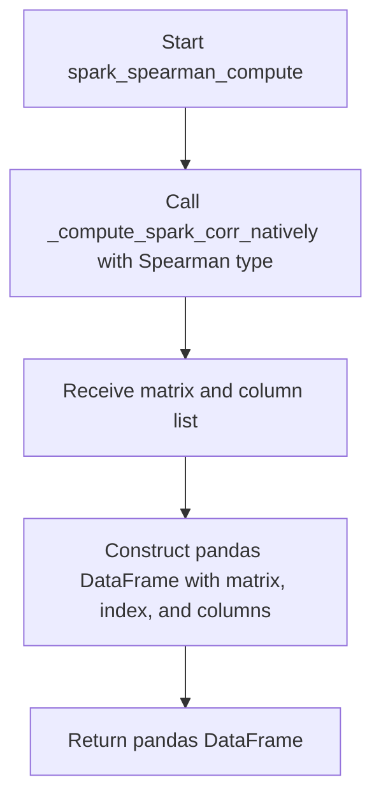
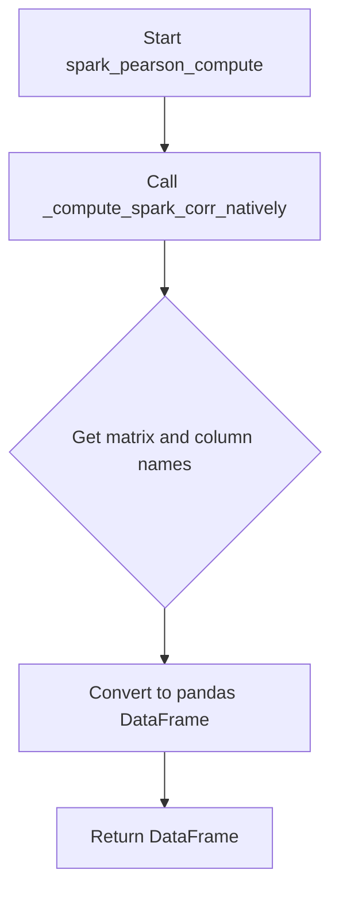
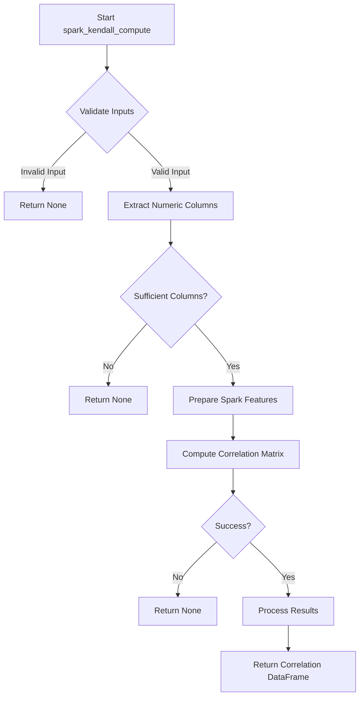
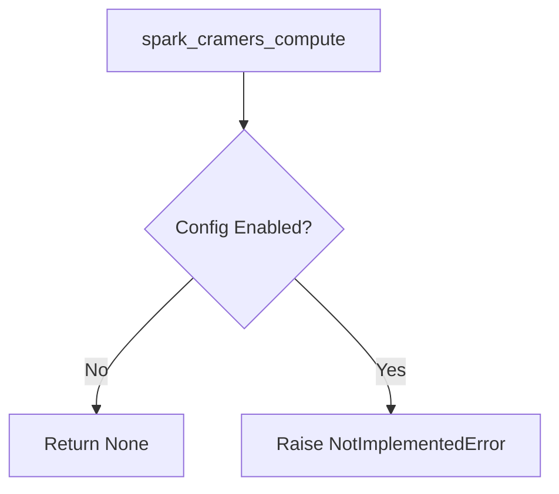
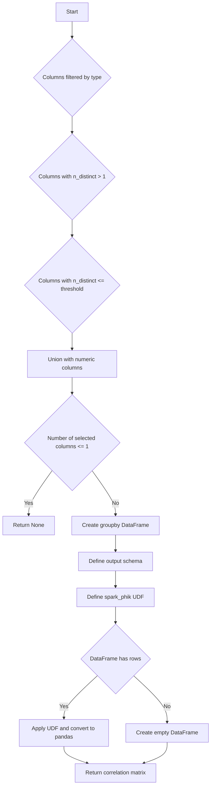

# `correlations_spark.py`

## `src.ydata_profiling.model.spark.correlations_spark.spark_spearman_compute` · *function*

## Summary:
Computes the Spearman rank correlation matrix for numeric columns in a Spark DataFrame and returns it as a pandas DataFrame.

## Description:
This function calculates Spearman rank correlation coefficients between numeric columns in a Spark DataFrame. It serves as a specialized correlation computation method within the ydata-profiling library's Spark-based analytics framework. The function delegates the actual computation to `_compute_spark_corr_natively` with the appropriate correlation type parameter.

## Args:
    config (Settings): Configuration settings for the profiling process
    df (DataFrame): Input Spark DataFrame containing the data for correlation computation
    summary (dict): Dictionary mapping column names to their metadata including type information

## Returns:
    Optional[pd.DataFrame]: A pandas DataFrame representing the Spearman correlation matrix where rows and columns correspond to numeric columns from the input DataFrame. Returns None if no numeric columns are present.

## Raises:
    None explicitly raised in the function body

## Constraints:
    Preconditions:
        - config must be a valid Settings object
        - df must be a valid Spark DataFrame
        - summary must be a dictionary mapping column names to their metadata
    
    Postconditions:
        - The returned DataFrame has equal dimensions (n x n) where n is the number of numeric columns
        - Row and column labels of the DataFrame match the numeric column names from the input
        - All correlation values are between -1 and 1

## Side Effects:
    None

## Control Flow:


## `src.ydata_profiling.model.spark.correlations_spark.spark_pearson_compute` · *function*

## Summary:
Computes the Pearson correlation matrix for numeric columns in a Spark DataFrame and returns it as a pandas DataFrame.

## Description:
This function calculates Pearson correlation coefficients between numeric columns in a Spark DataFrame. It serves as a specialized wrapper around the native Spark correlation computation functionality, specifically configured for Pearson correlation analysis. The function extracts numeric columns from the input DataFrame, computes their correlation matrix using Spark's built-in capabilities, and converts the result into a standard pandas DataFrame format for further processing.

The function is typically invoked by the data profiling pipeline when Pearson correlation analysis is enabled in the configuration settings. It leverages the underlying `_compute_spark_corr_natively` utility function to perform the actual Spark-based correlation computation.

## Args:
    config (Settings): Configuration object containing profiling settings, including correlation configuration
    df (DataFrame): Input Spark DataFrame containing the data for correlation computation
    summary (dict): Dictionary mapping column names to their metadata including type information

## Returns:
    Optional[pd.DataFrame]: A pandas DataFrame representing the Pearson correlation matrix where rows and columns correspond to numeric columns from the input DataFrame. Returns None if no numeric columns are present or if correlation computation is disabled in the configuration.

## Raises:
    None explicitly raised in the function body

## Constraints:
    Preconditions:
        - config must be a valid Settings object with proper correlation configuration
        - df must be a valid Spark DataFrame
        - summary must be a dictionary mapping column names to their metadata
        
    Postconditions:
        - The returned DataFrame has equal dimensions (n x n) where n is the number of numeric columns
        - Row and column labels of the returned DataFrame match the numeric column names from the input
        - All correlation values in the matrix are between -1 and 1

## Side Effects:
    None

## Control Flow:


## Examples:
```python
# Basic usage in a profiling context
from ydata_profiling.config import Settings
from pyspark.sql import SparkSession

# Initialize Spark session
spark = SparkSession.builder.appName("CorrelationExample").getOrCreate()

# Sample data
data = [(1.0, 2.0, 3.0), (4.0, 5.0, 6.0), (7.0, 8.0, 9.0)]
columns = ["A", "B", "C"]
df = spark.createDataFrame(data, columns)

# Configuration with Pearson correlation enabled
config = Settings()
config.correlations["pearson"].calculate = True

# Compute Pearson correlation matrix
correlation_df = spark_pearson_compute(config, df, {
    "A": {"type": "Numeric"},
    "B": {"type": "Numeric"},
    "C": {"type": "Numeric"}
})

# Result will be a pandas DataFrame with correlation coefficients
print(correlation_df)
```

## `src.ydata_profiling.model.spark.correlations_spark._compute_spark_corr_natively` · *function*

## Summary:
Computes correlation matrix for numeric columns in a Spark DataFrame using native Spark correlation methods.

## Description:
This function extracts numeric columns from a Spark DataFrame and computes their correlation matrix using Spark's built-in correlation computation capabilities. It serves as a backend utility for computing various types of correlations (Pearson, Spearman, etc.) in distributed Spark environments. The function is typically called by higher-level correlation computation functions in the profiling system.

## Args:
    df (DataFrame): Input Spark DataFrame containing the data for correlation computation
    summary (dict): Dictionary mapping column names to their metadata including type information
    corr_type (str): Type of correlation to compute (e.g., 'pearson', 'spearman')

## Returns:
    tuple: A tuple containing:
        - matrix: The computed correlation matrix as a 2D array-like structure
        - interval_columns (list): List of column names that were used in the computation (numeric columns only)

## Raises:
    None explicitly raised in the function body

## Constraints:
    Preconditions:
        - df must be a valid Spark DataFrame
        - summary must be a dictionary mapping column names to their metadata
        - corr_type must be a valid correlation method supported by Spark's Correlation.corr()
    
    Postconditions:
        - Only numeric columns from the input DataFrame are considered for correlation computation
        - The returned matrix dimensions match the number of numeric columns
        - The interval_columns list contains exactly the numeric columns used in computation

## Side Effects:
    None

## Control Flow:
```mermaid
flowchart TD
    A[Start _compute_spark_corr_natively] --> B{Extract column types from summary}
    B --> C[Filter numeric columns]
    C --> D[Select numeric columns from DataFrame]
    D --> E[Define vector_col name]
    E --> F[Prepare assembler arguments]
    F --> G{Spark version >= 2.4.0?}
    G -->|Yes| H[Add handleInvalid=skip to assembler args]
    G -->|No| I[Skip handleInvalid configuration]
    I --> J[Create VectorAssembler]
    J --> K[Transform DataFrame with VectorAssembler]
    K --> L[Select vector column]
    L --> M[Compute correlation matrix via Correlation.corr()]
    M --> N[Extract matrix toArray()]
    N --> O[Return (matrix, interval_columns)]
```

## Examples:
    # Basic usage for Pearson correlation
    correlation_matrix, columns_used = _compute_spark_corr_natively(
        spark_df, 
        {"col1": {"type": "Numeric"}, "col2": {"type": "Numeric"}}, 
        "pearson"
    )

## `src.ydata_profiling.model.spark.correlations_spark.spark_kendall_compute` · *function*

## Summary:
Computes Kendall's rank correlation coefficients for Spark DataFrames (not yet implemented).

## Description:
This function is intended to compute Kendall's rank correlation coefficients for PySpark DataFrames using Spark's MLlib statistical functions. It would serve as a specialized correlation method within the ydata-profiling framework for distributed computing environments. The function accepts configuration settings, a Spark DataFrame, and summary statistics to generate a correlation matrix.

## Args:
    config (Settings): Configuration object containing profiling settings that control correlation computation behavior including significance thresholds, minimum sample sizes, and correlation method preferences.
    df (DataFrame): PySpark DataFrame containing numeric data for which correlation coefficients will be computed. The DataFrame should contain at least two numeric columns suitable for rank correlation analysis.
    summary (dict): Dictionary containing pre-computed summary statistics about the DataFrame that can be used to optimize the correlation computation process, such as column metadata, data types, or statistical properties.

## Returns:
    Optional[pd.DataFrame]: A pandas DataFrame containing the Kendall correlation matrix when successfully computed, or None when computation cannot be performed due to insufficient data, unsupported data types, or configuration constraints. The correlation matrix has correlation coefficients ranging from -1.0 (perfect negative correlation) to 1.0 (perfect positive correlation), with diagonal elements equal to 1.0.

## Raises:
    NotImplementedError: This function currently raises NotImplementedError as it is not yet implemented. A complete implementation would raise exceptions related to data validation issues, unsupported data types, or computational errors during correlation matrix generation.

## Constraints:
    Preconditions:
    - The input DataFrame must be a valid PySpark DataFrame
    - The config parameter must be a properly initialized Settings object
    - Summary dictionary should contain relevant metadata for optimization
    - The DataFrame should contain at least two numeric columns for meaningful correlation computation
    
    Postconditions:
    - If successful, returns a symmetric correlation matrix with proper column/index labeling
    - If computation fails, returns None without raising exceptions (in current implementation)

## Side Effects:
    None: This function does not perform any I/O operations or mutate external state. It operates purely on the input DataFrame and configuration parameters.

## Control Flow:


## Examples:
    # Basic usage with a Spark DataFrame
    config = Settings()
    spark_df = spark.createDataFrame(data, schema)
    summary_stats = {"columns": ["col1", "col2", "col3"]}
    result = spark_kendall_compute(config, spark_df, summary_stats)
    
    # Handle potential None return
    if result is not None:
        print("Correlation matrix computed successfully")
        print(result)
    else:
        print("Failed to compute correlation matrix")

## `src.ydata_profiling.model.spark.correlations_spark.spark_cramers_compute` · *function*

## Summary:
Computes Cramér's V correlation coefficients for categorical variables in Spark DataFrames.

## Description:
This function is intended to calculate Cramér's V correlation coefficients between categorical variables in a Spark DataFrame. Cramér's V is a measure of association between two nominal categorical variables, ranging from 0 (no association) to 1 (perfect association). It is derived from the chi-squared test statistic and is particularly useful for identifying relationships between discrete variables in large-scale distributed datasets.

The function follows the same pattern as other Spark correlation computations in this module (spark_pearson_compute, spark_spearman_compute) and is designed to be part of the data profiling pipeline when Cramér's V correlation analysis is enabled for categorical data in Spark environments. Currently, it raises NotImplementedError as the implementation is pending.

## Args:
    config (Settings): Configuration object containing correlation settings and parameters
    df (DataFrame): Spark DataFrame containing the dataset for correlation analysis
    summary (dict): Dictionary containing data summary statistics for the dataset, including column types and metadata

## Returns:
    Optional[pandas.DataFrame]: A pandas DataFrame representing the Cramér's V correlation matrix where rows and columns correspond to categorical variables. Each cell contains the Cramér's V coefficient between the respective pair of variables. Returns None if correlation computation is disabled in the configuration.

## Raises:
    NotImplementedError: Always raised by the current implementation, indicating that this function is a placeholder for future implementation.

## Constraints:
    Preconditions:
    - The input DataFrame should contain categorical variables suitable for Cramér's V computation
    - The summary dictionary should contain column type information for proper variable filtering
    - Configuration should enable Cramér's V correlation analysis
    
    Postconditions:
    - Function execution should not modify the input DataFrame or configuration
    - If enabled, the returned DataFrame should have symmetric dimensions matching the number of categorical variables

## Side Effects:
    None: This function does not perform any I/O operations or mutate external state.

## Control Flow:


## Examples:
```python
# Basic usage in data profiling context
from ydata_profiling.config import Settings
from ydata_profiling.model.spark.correlations_spark import spark_cramers_compute
from pyspark.sql import SparkSession

# Initialize Spark session
spark = SparkSession.builder.appName("CorrelationAnalysis").getOrCreate()

# Sample categorical data
df = spark.createDataFrame([
    ("A", "X", 1),
    ("B", "Y", 2),
    ("A", "X", 3),
    ("B", "Z", 4)
], ["cat1", "cat2", "num"])

# Configuration
config = Settings()
config.correlations["cramers"].calculate = True

# This would compute Cramér's V correlation matrix
# result = spark_cramers_compute(config, df, summary_dict)
# Returns pandas DataFrame with correlation coefficients

# Note: Currently raises NotImplementedError
```

## `src.ydata_profiling.model.spark.correlations_spark.spark_phi_k_compute` · *function*

## Summary:
Computes phi-k correlation matrix for categorical and numerical columns in a Spark DataFrame using the phik library.

## Description:
This function calculates phi-k correlations between categorical and numerical variables in a Spark DataFrame. It filters columns based on their data type and distinct value counts, then applies the phik correlation algorithm to compute pairwise correlations. The result is returned as a pandas DataFrame representing the correlation matrix.

## Args:
    config (Settings): Configuration object containing categorical maximum correlation distinct threshold
    df (DataFrame): Input Spark DataFrame containing the data
    summary (dict): Dictionary containing column metadata including type and distinct count information

## Returns:
    Optional[pd.DataFrame]: Correlation matrix as pandas DataFrame if sufficient columns exist, None otherwise

## Raises:
    None explicitly raised

## Constraints:
    Preconditions:
    - Input DataFrame must be a valid Spark DataFrame
    - Summary dictionary must contain column metadata with 'type' and 'n_distinct' keys
    - Config must contain 'categorical_maximum_correlation_distinct' attribute
    
    Postconditions:
    - Returns None if fewer than 2 columns meet selection criteria
    - Returns correlation matrix with same row and column names if successful

## Side Effects:
    None

## Control Flow:


## Examples:
```python
# Basic usage
config = Settings()
df = spark.createDataFrame(data, schema)
summary = {"col1": {"type": "Categorical", "n_distinct": 5}, "col2": {"type": "Numeric", "n_distinct": 10}}
result = spark_phi_k_compute(config, df, summary)
if result is not None:
    print(result)
else:
    print("Not enough columns for correlation analysis")
```

