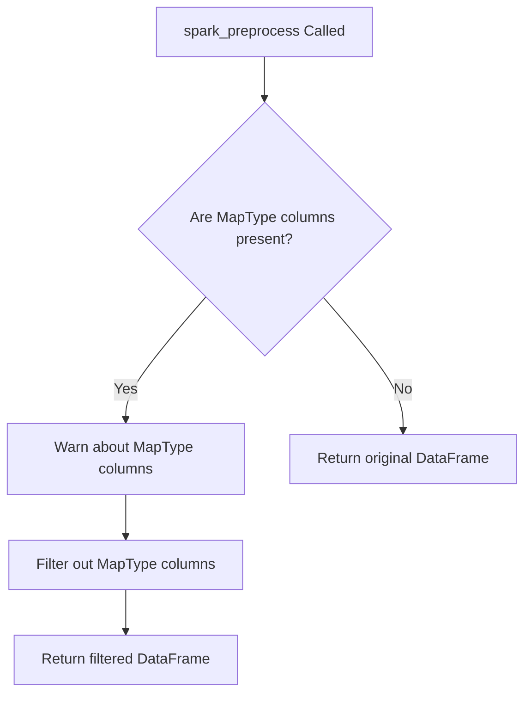

# `dataframe_spark.py`

## `src.ydata_profiling.model.spark.dataframe_spark.spark_check_dataframe` · *function*

## Summary:
Validates that the input is a PySpark DataFrame and issues a warning if it is not.

## Description:
This function serves as a type checker specifically for PySpark DataFrames within the ydata-profiling framework. It ensures that the input parameter conforms to the expected PySpark DataFrame type (pyspark.sql.DataFrame) before proceeding with Spark-specific profiling operations. The function is extracted into its own component to enforce a clear responsibility boundary between input validation and actual profiling logic, allowing for centralized validation that can be reused across different Spark profiling workflows.

This function is typically called as part of the Spark DataFrame preprocessing pipeline before profiling operations begin, ensuring that downstream operations receive the correct data type.

## Args:
    df (DataFrame): The dataframe object to validate. Expected to be a PySpark DataFrame (pyspark.sql.DataFrame).

## Returns:
    None: This function does not return any value.

## Raises:
    None: This function does not raise exceptions directly. Instead, it issues a warning via Python's warnings module when the input is not a PySpark DataFrame.

## Constraints:
    Preconditions:
    - Input must be a valid PySpark DataFrame object (pyspark.sql.DataFrame)
    - Input must not be None
    
    Postconditions:
    - Function completes without raising validation errors for valid PySpark DataFrames
    - If input is not a PySpark DataFrame, a warning is issued but execution continues

## Side Effects:
    - Issues a warning message via Python's warnings module when input is not a PySpark DataFrame
    - No external state mutations or I/O operations

## Control Flow:
```mermaid
flowchart TD
    A[spark_check_dataframe] --> B{Is df instance of DataFrame?}
    B -- No --> C[Issue warning: "df is not of type pyspark.sql.dataframe.DataFrame"]
    B -- Yes --> D[Return None]
```

## Examples:
```python
from pyspark.sql import SparkSession
from ydata_profiling.model.spark.dataframe_spark import spark_check_dataframe

# Valid usage - will not issue warning
spark = SparkSession.builder.appName("test").getOrCreate()
df = spark.createDataFrame([(1, "a"), (2, "b")], ["id", "value"])
spark_check_dataframe(df)  # No warning issued

# Invalid usage - will issue warning
spark_check_dataframe("not_a_dataframe")  # Warning issued
```

## `src.ydata_profiling.model.spark.dataframe_spark.spark_preprocess` · *function*

## Summary:
Filters out columns with MapType data from Spark DataFrames to ensure compatibility with profiling operations.

## Description:
Processes Spark DataFrames by identifying and removing columns that contain MapType data, which are incompatible with standard profiling operations. This function extracts the filtering logic to maintain clean separation between data preparation and profiling workflows, ensuring that only compatible data types are processed for statistical analysis.

The function is specifically designed for Spark DataFrames and handles the common case where MapType columns need to be excluded from profiling due to their complex nested structure that cannot be easily analyzed. The configuration parameter is accepted but not currently utilized in the implementation.

## Args:
    config (Settings): Configuration object containing profiling settings (currently unused in implementation)
    df (DataFrame): Input Spark DataFrame to be processed and filtered

## Returns:
    DataFrame: A new Spark DataFrame with MapType columns removed, or the original DataFrame if no MapType columns are present

## Raises:
    None: This function does not explicitly raise exceptions

## Constraints:
    Preconditions:
    - config must be a valid Settings object
    - df must be a valid Spark DataFrame
    
    Postconditions:
    - Returned DataFrame contains only columns with non-MapType data
    - Original DataFrame is not modified (immutable operation)
    - All MapType columns are excluded from the result

## Side Effects:
    - Issues a warning via Python's warnings module when MapType columns are detected and removed (warning message appears to be malformed/incomplete in source code)
    - No external I/O operations or state mutations

## Control Flow:


## Examples:
```python
from pyspark.sql import SparkSession
from ydata_profiling.config import Settings

# Create Spark session and DataFrame
spark = SparkSession.builder.appName("test").getOrCreate()
df = spark.createDataFrame([(1, {"a": 1}), (2, {"b": 2})], ["id", "map_col"])

# Apply preprocessing
config = Settings()
processed_df = spark_preprocess(config, df)
# Result contains only the 'id' column, map_col is removed
```

