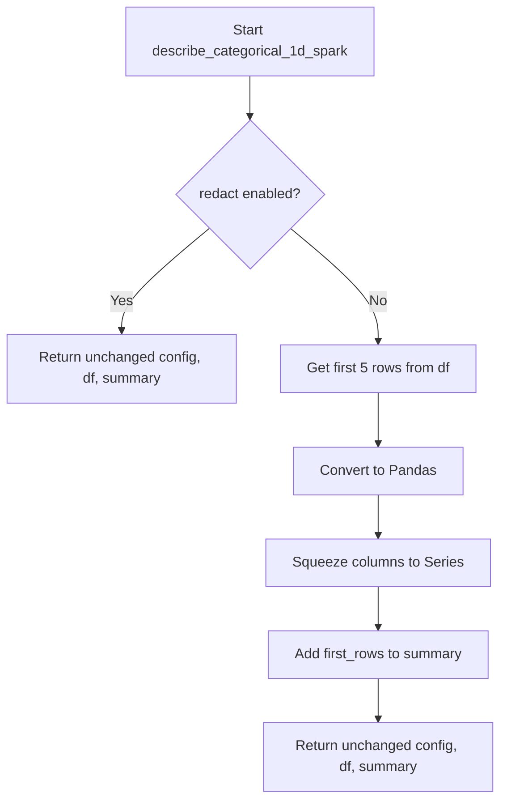

# `describe_categorical_spark.py`

## `src.ydata_profiling.model.spark.describe_categorical_spark.describe_categorical_1d_spark` · *function*

## Summary:
Handles Spark DataFrame categorical variable description with redaction support and first-row sampling.

## Description:
Processes categorical data in Spark DataFrames by applying redaction logic and optionally collecting first rows for display. This function is part of the Spark-specific profiling pipeline and serves as a bridge between the general categorical description algorithm and Spark-specific data handling.

The function checks the redact configuration setting and, if redaction is disabled, extracts the first five rows from the DataFrame and converts them to Pandas format for inclusion in the summary statistics. This approach allows for efficient handling of large Spark datasets while providing sample data for inspection when needed.

Known callers within the codebase:
- Called from Spark profiling pipelines when processing categorical variables
- Typically invoked during the categorical variable analysis phase of data profiling
- Triggered when the profiling system needs to collect sample data for categorical variables

This logic is extracted into its own function to enforce a clear separation between configuration handling, Spark-specific data operations, and the general categorical analysis logic. It encapsulates the Spark-specific concerns (DataFrame operations, conversion to Pandas) while maintaining compatibility with the general profiling framework.

## Args:
    config (Settings): Configuration object containing profiling settings including categorical redaction preferences
    df (DataFrame): PySpark DataFrame containing the categorical data to process
    summary (dict): Dictionary containing summary statistics for the variable being analyzed

## Returns:
    Tuple[Settings, DataFrame, dict]: A tuple containing the unchanged config, df, and summary parameters

## Raises:
    None explicitly raised by this function

## Constraints:
    Preconditions:
    - config parameter must be a valid Settings object with proper nested configuration structure
    - df parameter must be a valid PySpark DataFrame
    - summary parameter must be a mutable dictionary object
    
    Postconditions:
    - The returned tuple maintains the same reference to all input parameters
    - If redaction is disabled, the summary dictionary will contain a "first_rows" key with sample data
    - The DataFrame remains unchanged and unmodified

## Side Effects:
    - When redaction is disabled, performs a DataFrame operation (limit(5)) followed by toPandas() conversion
    - May cause memory pressure when converting large DataFrames to Pandas format
    - No external state mutations or I/O operations beyond Spark operations

## Control Flow:


## Examples:
```python
from pyspark.sql import SparkSession
from ydata_profiling.config import Settings

# Initialize Spark session and create test DataFrame
spark = SparkSession.builder.appName("Test").getOrCreate()
df = spark.createDataFrame([(1, "A"), (2, "B"), (3, "C")], ["id", "category"])

# Configure settings with redaction disabled
config = Settings(vars=Settings().vars.update({"cat": {"redact": False}}))

# Call the function
summary = {}
result_config, result_df, result_summary = describe_categorical_1d_spark(config, df, summary)

# The summary will contain first_rows data when redaction is disabled
print(result_summary.get("first_rows"))  # Shows first 5 rows as pandas Series

# With redaction enabled, no first_rows would be added to summary
config_redacted = Settings(vars=Settings().vars.update({"cat": {"redact": True}}))
result_config2, result_df2, result_summary2 = describe_categorical_1d_spark(config_redacted, df, {})
print(result_summary2.get("first_rows"))  # None or not present
```

