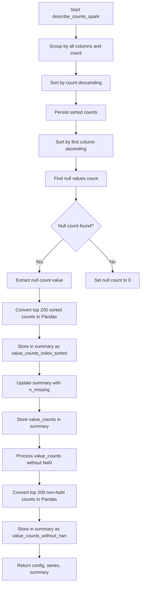

# `describe_counts_spark.py`

## `src.ydata_profiling.model.spark.describe_counts_spark.describe_counts_spark` · *function*

## Summary:
Computes value counts and missing value statistics for Spark DataFrames and stores them in the summary dictionary.

## Description:
This function processes a Spark DataFrame to calculate value counts for all columns, sorts them by frequency, and computes missing value counts. It transforms the results into Pandas-compatible formats for downstream processing while persisting intermediate Spark DataFrames for performance optimization. The computed statistics are stored in the provided summary dictionary for use in profiling reports. This function is part of the Spark-specific profiling pipeline and is typically called during the descriptive statistics computation phase.

## Args:
    config (Settings): Configuration settings for the profiling process
    series (DataFrame): Input Spark DataFrame containing the data to analyze
    summary (dict): Dictionary to store computed statistics including value counts and missing value counts

## Returns:
    Tuple[Settings, DataFrame, dict]: Returns a tuple containing the unchanged config, series, and updated summary dictionary. The summary dictionary is modified in-place to include:
    - 'n_missing': integer count of missing/null values
    - 'value_counts': persisted Spark DataFrame with value counts
    - 'value_counts_index_sorted': Pandas Series with top 200 values sorted by index
    - 'value_counts_without_nan': Pandas Series with top 200 non-null value counts

## Raises:
    None explicitly raised

## Constraints:
    Preconditions:
        - The series parameter must be a valid Spark DataFrame
        - The summary parameter must be a mutable dictionary
        - The DataFrame should have at least one column
    
    Postconditions:
        - The summary dictionary will contain keys: 'n_missing', 'value_counts', 'value_counts_index_sorted', and 'value_counts_without_nan'
        - The returned tuple maintains the original config and series unchanged
        - All computed value counts are persisted in Spark for performance
        - The function limits results to top 200 entries for memory efficiency

## Side Effects:
    - Persists Spark DataFrames in memory using `.persist()` for performance optimization
    - Converts Spark DataFrames to Pandas DataFrames via `.toPandas()` calls for compatibility
    - Modifies the input summary dictionary in-place by adding new key-value pairs
    - May cause memory pressure due to persistence of large DataFrames and conversion to Pandas

## Control Flow:

## Examples:
    # Basic usage
    config = Settings()
    spark_df = spark.createDataFrame([(1, "A"), (2, "B"), (1, "A")], ["id", "category"])
    summary = {}
    result_config, result_series, result_summary = describe_counts_spark(config, spark_df, summary)
    
    # Access computed statistics
    print(result_summary["n_missing"])  # Number of missing values
    print(result_summary["value_counts"])  # Spark DataFrame with value counts
    print(result_summary["value_counts_index_sorted"])  # Pandas Series with sorted counts

