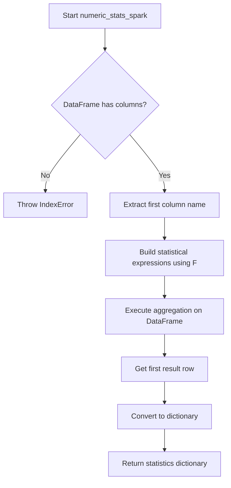

# `describe_numeric_spark.py`

## `src.ydata_profiling.model.spark.describe_numeric_spark.numeric_stats_spark` · *function*

## Summary:
Computes comprehensive descriptive statistics for a single numeric column in a Spark DataFrame.

## Description:
This function calculates fundamental statistical measures for a numeric column within a Spark DataFrame. It serves as a core component in the data profiling pipeline for Spark environments, extracting essential numerical characteristics such as central tendency, dispersion, and distribution shape metrics. The function uses PySpark's built-in statistical functions through the `F` alias for `pyspark.sql.functions`.

## Args:
    df (DataFrame): A PySpark DataFrame containing exactly one numeric column to analyze
    summary (dict): A dictionary containing summary configuration or metadata (currently unused in implementation)

## Returns:
    dict: A dictionary containing computed statistics with keys: 'mean', 'std', 'variance', 'min', 'max', 'kurtosis', 'skewness', 'sum'

## Raises:
    IndexError: When the DataFrame contains no columns
    Exception: When the DataFrame column contains non-numeric data that prevents statistical computation

## Constraints:
    Preconditions:
        - Input DataFrame must contain exactly one column
        - The single column must contain numeric data compatible with PySpark statistical functions
    Postconditions:
        - Returns a dictionary with all requested statistical measures
        - All returned values are numeric (float or int)

## Side Effects:
    None

## Control Flow:


## Examples:
```python
# Basic usage
from pyspark.sql import SparkSession
from pyspark.sql.functions import col
import pyspark.sql.functions as F

spark = SparkSession.builder.appName("test").getOrCreate()
df = spark.createDataFrame([(1,), (2,), (3,)], ["value"])
result = numeric_stats_spark(df, {})
print(result)  # {'mean': 2.0, 'std': 1.0, 'variance': 1.0, ...}
```

## `src.ydata_profiling.model.spark.describe_numeric_spark.describe_numeric_1d_spark` · *function*

## Summary:
Computes comprehensive descriptive statistics and derived metrics for a single numeric column in a Spark DataFrame.

## Description:
Processes a Spark DataFrame containing numeric data to calculate fundamental statistical measures, quantiles, and additional derived metrics. This function serves as a core component in the data profiling pipeline for Spark environments, aggregating both basic and advanced statistical properties of numeric data distributions. The function integrates with existing summary dictionaries and updates them with computed statistics while handling special cases like infinite values, zeros, and negative numbers.

## Args:
    config (Settings): Configuration object containing profiling settings, particularly numeric variable configurations and plot parameters
    df (DataFrame): A PySpark DataFrame containing exactly one numeric column to analyze
    summary (dict): Dictionary containing existing summary data and metadata that gets updated with computed statistics

## Returns:
    Tuple[Settings, DataFrame, dict]: Returns the unchanged config, df, and the updated summary dictionary containing all computed statistics

## Raises:
    None explicitly raised by this function - exceptions may occur from underlying PySpark operations

## Constraints:
    Preconditions:
        - Input DataFrame must contain exactly one column
        - The single column must contain numeric data compatible with PySpark statistical functions
        - Summary dictionary must be properly initialized with required keys like 'n', 'value_counts', 'value_counts_without_nan', 'n_distinct'
    Postconditions:
        - Summary dictionary is updated with comprehensive statistical measures
        - All returned values are numeric (float or int)
        - The function handles edge cases like infinite values, zeros, and negative numbers appropriately

## Side Effects:
    - Modifies the input summary dictionary in-place by adding new key-value pairs
    - Performs Spark DataFrame operations including filtering, aggregation, and approximate quantile calculations
    - May trigger Spark job execution for statistical computations

## Control Flow:
```mermaid
flowchart TD
    A[Start describe_numeric_1d_spark] --> B[Compute base statistics via numeric_stats_spark]
    B --> C[Update summary with basic stats (min, max, mean, std, variance, skewness, kurtosis, sum)]
    C --> D[Calculate infinite values count]
    D --> E[Calculate zero values count]
    E --> F[Calculate negative values count]
    F --> G[Compute quantiles using approxQuantile]
    G --> H[Calculate median and MAD]
    H --> I[Compute derived percentages (p_negative, p_zeros, p_infinite)]
    I --> J[Calculate additional metrics (range, iqr, cv)]
    J --> K[Set monotonic flag to 0]
    K --> L[Filter out infinity values from histogram data]
    L --> M[Compute histogram using histogram_compute]
    M --> N[Return updated config, df, and summary]
```

## Examples:
```python
# Basic usage in a profiling pipeline
from ydata_profiling.config import Settings
from pyspark.sql import SparkSession
from pyspark.sql.functions import col

spark = SparkSession.builder.appName("profiling").getOrCreate()
config = Settings()

# Create sample DataFrame
df = spark.createDataFrame([(1.0,), (2.0,), (3.0,), (4.0,), (5.0,)], ["numeric_col"])

# Initialize summary dictionary
summary = {
    "n": 5,
    "value_counts": value_counts_df,
    "value_counts_without_nan": value_counts_without_nan_series,
    "n_distinct": 5
}

# Compute statistics
updated_config, updated_df, updated_summary = describe_numeric_1d_spark(config, df, summary)

# Access computed statistics
print(f"Mean: {updated_summary['mean']}")
print(f"Standard Deviation: {updated_summary['std']}")
print(f"Median: {updated_summary['50%']}")
print(f"Skewness: {updated_summary['skewness']}")
```

