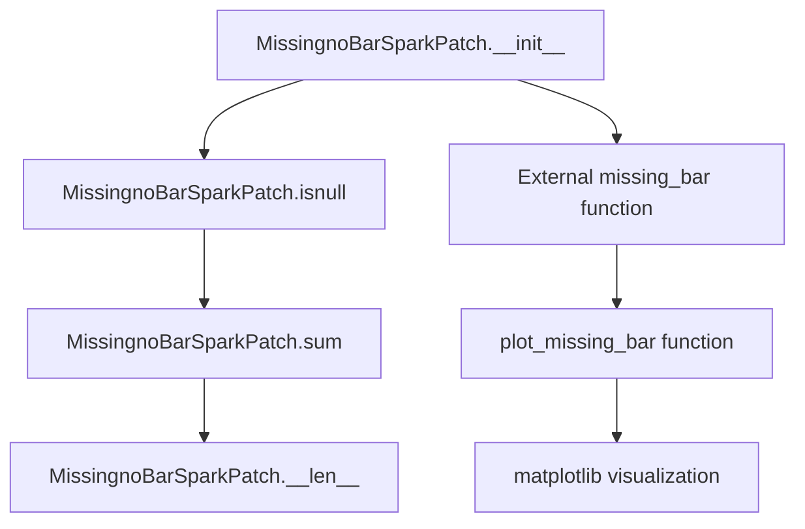
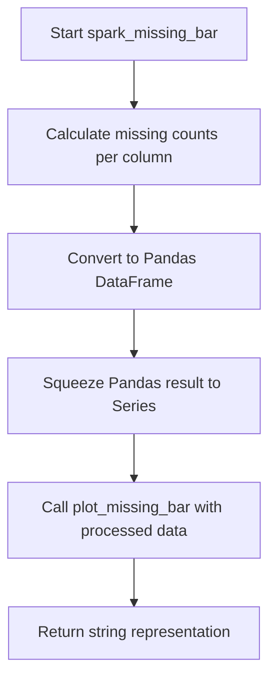
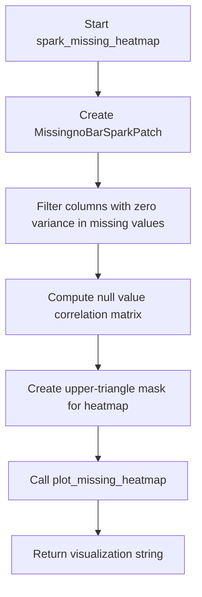

# `missing_spark.py`

## `src.ydata_profiling.model.spark.missing_spark.MissingnoBarSparkPatch` · *class*

## Summary:
A patch class that adapts PySpark DataFrames to work with missing data visualization functions designed for pandas DataFrames.

## Description:
The MissingnoBarSparkPatch class acts as an adapter that bridges the gap between PySpark DataFrames and the missing data visualization pipeline that was originally built for pandas DataFrames. This class is specifically designed to enable Spark-based data profiling to generate missing value bar charts without requiring fundamental changes to the existing visualization logic.

The patch works by implementing methods that mimic the expected interface of pandas missing data operations, allowing Spark DataFrames to be processed by the same visualization functions used for pandas data. This enables users working with large datasets in Spark to benefit from the same missing data analysis features available in traditional pandas workflows.

## State:
- df: DataFrame - The underlying PySpark DataFrame being wrapped. Required parameter during initialization.
- columns: List[str] - Column names to analyze for missing values. Optional parameter, defaults to None.
- original_df_size: int - The original size of the DataFrame for length operations. Optional parameter, defaults to None.

## Lifecycle:
- Creation: Instantiate with a PySpark DataFrame and optional column list and original size. The class is designed to be used as a drop-in replacement for pandas objects in missing data visualization contexts.
- Usage: The class methods are typically called internally by the missing data visualization pipeline when processing Spark DataFrames. The `isnull()` method returns self to enable method chaining, while `sum()` returns the underlying DataFrame for further processing. The `__len__()` method provides size information for compatibility.
- Destruction: No explicit cleanup required as the class holds references to existing DataFrame objects and doesn't manage external resources.

## Method Map:


## Raises:
- None explicitly raised by the class methods. However, the underlying DataFrame operations may raise exceptions if invalid data is provided during initialization or method execution.

## Example:
```python
from pyspark.sql import DataFrame
from src.ydata_profiling.model.spark.missing_spark import MissingnoBarSparkPatch

# Assuming spark_df is a valid PySpark DataFrame
patch = MissingnoBarSparkPatch(spark_df, columns=['col1', 'col2'], original_df_size=1000)

# These methods would be called internally by the missing data pipeline
result = patch.isnull()  # Returns self to enable chaining
dataframe_result = patch.sum()  # Returns the underlying PySpark DataFrame
length = len(patch)  # Returns 1000
```

### `src.ydata_profiling.model.spark.missing_spark.MissingnoBarSparkPatch.__init__` · *method*

## Summary:
Initializes a MissingnoBarSparkPatch instance with Spark DataFrame and configuration parameters.

## Description:
This constructor method sets up the instance with the required Spark DataFrame and optional configuration parameters for missing data visualization. It serves as the entry point for configuring the patch with the necessary data and metadata for processing missing value patterns.

## Args:
    df (DataFrame): The Spark DataFrame containing the data to analyze for missing values.
    columns (List[str], optional): Specific column names to analyze for missing values. Defaults to None, which analyzes all columns.
    original_df_size (int, optional): The original size of the DataFrame before any filtering or transformations. Defaults to None.

## Returns:
    None: This method initializes instance attributes and does not return a value.

## Raises:
    None: This method does not explicitly raise exceptions.

## State Changes:
    Attributes READ: None
    Attributes WRITTEN: 
    - self.df: Stores the Spark DataFrame reference
    - self.columns: Stores the column selection for analysis
    - self.original_df_size: Stores the original DataFrame size for calculations

## Constraints:
    Preconditions:
    - The `df` parameter must be a valid PySpark DataFrame
    - If `columns` is provided, it must be a list of strings representing valid column names in the DataFrame
    - If `original_df_size` is provided, it must be a positive integer

    Postconditions:
    - All instance attributes are properly initialized with the provided values
    - The instance is ready for subsequent missing data analysis operations

## Side Effects:
    None: This method performs only attribute assignment and has no external side effects.

### `src.ydata_profiling.model.spark.missing_spark.MissingnoBarSparkPatch.isnull` · *method*

## Summary:
Returns the current object instance, indicating this method is likely a placeholder for Spark DataFrame null value checking.

## Description:
This method currently implements a passthrough behavior that returns the current object instance (`self`) rather than performing actual null value detection. It is part of the MissingnoBarSparkPatch class in the Spark missing data profiling module, which specializes in missing data visualization for Apache Spark DataFrames.

The method name `isnull` suggests it should implement functionality equivalent to Spark DataFrame's null checking operations, but the current implementation is incomplete. This likely represents a placeholder or stub that should be overridden with proper Spark-specific logic to detect and handle null values in the DataFrame context. The method signature indicates it should return a boolean-like result indicating null positions, but instead returns the object itself.

## Args:
    None: This method takes no arguments beyond the implicit `self` parameter.

## Returns:
    Any: Returns the current object instance unchanged, maintaining reference to the calling object.

## Raises:
    None: This method does not explicitly raise any exceptions.

## State Changes:
    Attributes READ: None - This method does not read any instance attributes.
    Attributes WRITTEN: None - This method does not modify any instance attributes.

## Constraints:
    Preconditions:
    - The object must be properly initialized as an instance of MissingnoBarSparkPatch
    - The method should only be called on objects that support the Spark DataFrame interface
    
    Postconditions:
    - The method returns the same object instance without modification
    - No state changes occur to the object's attributes

## Side Effects:
    None: This method performs no I/O operations, external service calls, or mutations to objects outside the current instance.

### `src.ydata_profiling.model.spark.missing_spark.MissingnoBarSparkPatch.sum` · *method*

## Summary:
Returns the underlying PySpark DataFrame instance stored in the patch object.

## Description:
This method serves as a patch implementation for the `.sum()` operation in Spark environments. It provides access to the raw DataFrame that the patch object wraps, enabling downstream operations to work with PySpark's distributed computing capabilities rather than pandas' in-memory operations.

## Args:
    None

## Returns:
    DataFrame: The PySpark DataFrame instance stored in self.df

## Raises:
    None

## State Changes:
    Attributes READ: self.df
    Attributes WRITTEN: None

## Constraints:
    Preconditions: The patch object must have been initialized with a valid PySpark DataFrame
    Postconditions: The returned DataFrame maintains the same schema and data as originally provided

## Side Effects:
    None

### `src.ydata_profiling.model.spark.missing_spark.MissingnoBarSparkPatch.__len__` · *method*

## Summary:
Returns the original DataFrame size for compatibility with sequence-length operations.

## Description:
Implements the Python `__len__` special method to allow the MissingnoBarSparkPatch object to be used in contexts where `len()` is called. This method provides compatibility with existing code that expects sequence-like behavior from missing data visualization objects.

This method is typically called during missing data visualization processing when the system needs to determine the size of the underlying dataset for plotting or statistical calculations.

## Args:
    None

## Returns:
    Optional[int]: The original DataFrame size stored in self.original_df_size, or None if not set.

## Raises:
    None

## State Changes:
    Attributes READ: self.original_df_size
    Attributes WRITTEN: None

## Constraints:
    Preconditions:
    - The object must be initialized with a valid original_df_size value
    - The self.original_df_size attribute must be set before calling this method
    
    Postconditions:
    - The method returns the stored original_df_size value without modification
    - The object's state remains unchanged

## Side Effects:
    None: This method performs no I/O operations or external service calls.

## `src.ydata_profiling.model.spark.missing_spark.spark_missing_bar` · *function*

## Summary:
Generates a bar chart visualization representing the distribution of missing values across columns in a PySpark DataFrame.

## Description:
Creates a string representation of a bar chart that displays the count of missing values for each column in the provided PySpark DataFrame. This function is part of the Spark-specific missing data visualization suite and is designed to handle PySpark DataFrames by converting them to Pandas format for processing before generating the visualization.

The function calculates missing value counts for each column using PySpark's aggregation functions, converts the result to Pandas for compatibility with the plotting utilities, and then generates a bar chart visualization using the standard plotting infrastructure.

## Args:
    config (Settings): Configuration object containing profiling settings, particularly missing data visualization options
    df (DataFrame): Input PySpark DataFrame containing the data to analyze for missing values

## Returns:
    str: String representation of the missing data bar chart, typically in a format suitable for HTML rendering or markdown display

## Raises:
    None explicitly raised by this function, though underlying operations may raise exceptions from PySpark or matplotlib

## Constraints:
    Preconditions:
    - config must be a valid Settings instance with proper initialization
    - df must be a valid PySpark DataFrame with columns that support null checking operations
    
    Postconditions:
    - Function returns a properly formatted string representation of a bar chart
    - The returned string should accurately represent missing value distributions for the DataFrame

## Side Effects:
    - Converts PySpark DataFrame to Pandas DataFrame internally
    - Calls matplotlib plotting functions which may produce graphical output
    - May cause temporary memory usage spikes during DataFrame conversion

## Control Flow:


## Examples:
```python
from ydata_profiling.config import Settings
from pyspark.sql import SparkSession

# Initialize Spark session
spark = SparkSession.builder.appName("MissingDataAnalysis").getOrCreate()

# Create sample PySpark DataFrame with missing values
data = [(1, None, 3), (None, 2, 3), (1, 2, None)]
columns = ["A", "B", "C"]
df = spark.createDataFrame(data, columns)

# Configure settings to enable missing data visualization
config = Settings()

# Generate missing data bar chart
chart_string = spark_missing_bar(config, df)
```

## `src.ydata_profiling.model.spark.missing_spark.spark_missing_matrix` · *function*

*No documentation generated.*

## `src.ydata_profiling.model.spark.missing_spark.spark_missing_heatmap` · *function*

## Summary:
Generates a heatmap visualization showing correlations between missing value patterns across DataFrame columns for PySpark DataFrames.

## Description:
Creates a correlation heatmap that displays relationships between missing data patterns in different columns of a PySpark DataFrame. This function processes missing value information through a Spark-compatible patch mechanism to enable visualization of missing data correlations that would normally be computed on pandas DataFrames.

The function filters out columns with zero variance in missing values (constant missing patterns) and computes pairwise correlations between missing value patterns to identify potential systematic missingness relationships. This visualization helps data analysts understand whether missing values occur together across columns, which can indicate systematic data collection issues or data quality problems.

## Args:
    config (Settings): Configuration object containing display preferences and analysis parameters for the heatmap visualization.
    df (DataFrame): PySpark DataFrame containing the dataset to analyze for missing value patterns.

## Returns:
    str: String representation of the missing data heatmap visualization, typically formatted as HTML or another visualization format suitable for reporting.

## Raises:
    None explicitly raised by this function. However, underlying operations may raise exceptions from:
    - PySpark DataFrame operations
    - MissingnoBarSparkPatch initialization
    - Correlation matrix computation
    - Plotting operations

## Constraints:
    Preconditions:
    - config must be a valid Settings instance with appropriate configuration parameters
    - df must be a valid PySpark DataFrame with columns to analyze
    - df must have sufficient data for correlation calculations
    
    Postconditions:
    - Function returns a valid string representation of a visualization
    - All missing value computations are performed on Spark DataFrames
    - Visualization reflects correlations between missing data patterns

## Side Effects:
    - Creates matplotlib figure and axes for visualization
    - May modify global matplotlib state through subplot adjustments
    - Generates temporary data structures for correlation calculations

## Control Flow:


## Examples:
```python
from ydata_profiling.config import Settings
from pyspark.sql import DataFrame

# Assuming spark_df is a valid PySpark DataFrame
config = Settings()

# Generate missing data heatmap
heatmap_html = spark_missing_heatmap(config, spark_df)

# The result can be embedded in reports or displayed in Jupyter notebooks
print(heatmap_html)
```

