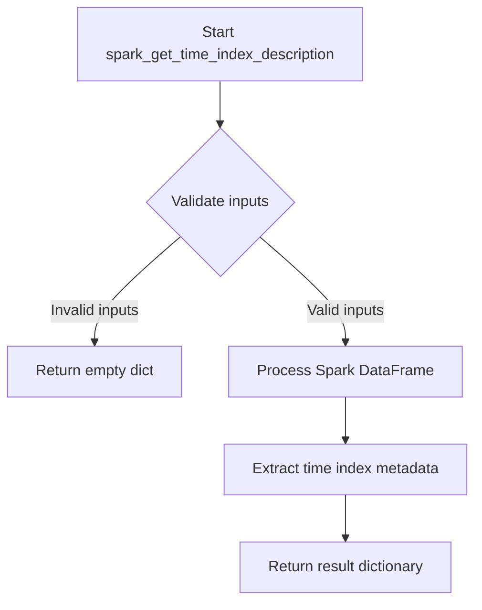

# `timeseries_index_spark.py`

## `src.ydata_profiling.model.spark.timeseries_index_spark.spark_get_time_index_description` · *function*

## Summary:
Provides a Spark DataFrame-specific implementation for extracting time index descriptive information for data profiling.

## Description:
This function serves as a Spark-specific adapter for time index analysis within the data profiling framework. It is designed to process Spark DataFrames and extract temporal characteristics that would normally be analyzed by the base implementation in `get_time_index_description`. The function maintains the same interface as its non-Spark counterpart but implements the logic using Spark operations.

This extraction enables modular architecture where time index analysis can be implemented separately for different data backends (Spark, Pandas, etc.) while maintaining a consistent interface for the profiling system.

## Args:
    config (Settings): Configuration settings that control profiling behavior and thresholds
    df (DataFrame): Spark DataFrame containing data to analyze for time index characteristics
    table_stats (dict): Dictionary of existing table statistics to support time index analysis

## Returns:
    dict: Placeholder return value (currently empty dictionary) that should contain time index descriptive metadata when properly implemented

## Raises:
    None explicitly documented - implementation-dependent exceptions may occur

## Constraints:
    Preconditions:
        - config must be a valid Settings object with appropriate profiling configurations
        - df must be a valid Spark DataFrame with proper schema
        - table_stats must be a dictionary containing existing table metadata
    
    Postconditions:
        - Function returns a dictionary structure compatible with time index analysis
        - Input parameters remain unmodified

## Side Effects:
    None - Function is intended to be stateless and not modify external state

## Control Flow:

## Examples:
    # Basic usage pattern
    config = Settings()
    spark_df = spark.createDataFrame([(1, '2023-01-01'), (2, '2023-01-02')], ['id', 'date'])
    table_stats = {'nrows': 2, 'ncols': 2}
    
    result = spark_get_time_index_description(config, spark_df, table_stats)
    # Returns empty dict in current implementation

