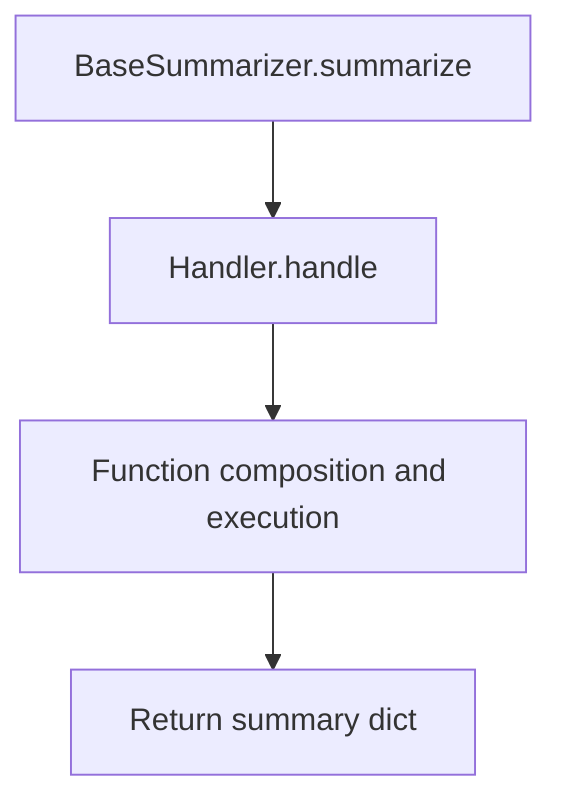
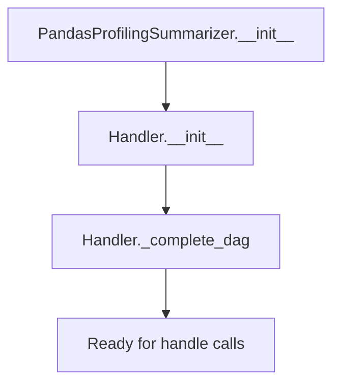
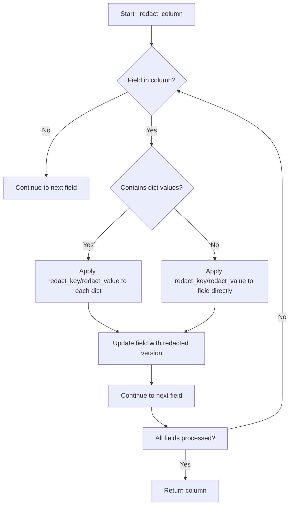

# `summarizer.py`

## `src.ydata_profiling.model.summarizer.BaseSummarizer` · *class*

## Summary:
BaseSummarizer is a data summarizer that generates statistical summaries for pandas Series using type-specific processing functions.

## Description:
The BaseSummarizer class inherits from Handler and provides a method to generate descriptive summaries for pandas Series data. It uses the Handler's type-dispatching mechanism to select appropriate summarization functions based on the data type of the input series. The class serves as a bridge between the type detection system and the actual summarization algorithms.

This class is typically used within data profiling systems where different data types require different summarization approaches. It's designed to be part of a larger framework that handles type detection and function composition.

## State:
- Inherits all state from Handler parent class including:
  - mapping: Dict[str, List[Callable]] - Maps data type names to lists of processing functions
  - typeset: VisionsTypeset - Contains type relationships and base graph defining valid type conversion paths
- No additional instance attributes beyond those inherited from Handler

## Lifecycle:
- Creation: Instantiate with default constructor (inherits from Handler)
- Usage: Call summarize() method with Settings configuration, pandas Series, and data type (Type[VisionsBaseType])
- Destruction: Relies on Python's garbage collection

## Method Map:


## Raises:
- Inherited from Handler class: May raise runtime errors if functions in mappings fail or if data type is not found in mapping
- No explicit exceptions defined in the summarize method itself

## Example:
```python
# Create a summarizer instance
summarizer = BaseSummarizer()

# Summarize a numeric series
config = Settings()
series = pd.Series([1, 2, 3, 4, 5])
summary = summarizer.summarize(config, series, float)
```

### `src.ydata_profiling.model.summarizer.BaseSummarizer.summarize` · *method*

## Summary:
Returns a type-specific summary dictionary for a pandas Series by delegating to the handler's processing pipeline.

## Description:
Processes a pandas Series with the specified data type through the type handler's composed function pipeline and returns the resulting summary dictionary. This method serves as a convenience wrapper that leverages the Handler class's type-aware processing capabilities to generate appropriate statistical summaries for different data types.

The method is typically called during the profiling pipeline when individual column summaries need to be generated. It integrates with the broader type handling system that automatically manages type conversion paths and function composition.

## Args:
    config (Settings): Configuration object containing profiling settings and options
    series (pd.Series): The pandas Series to summarize
    dtype (Type[VisionsBaseType]): The Visions data type class identifying the series' data type

## Returns:
    dict: A dictionary containing the type-specific summary statistics and metadata for the series

## Raises:
    None explicitly raised by this method, though underlying handler operations may raise exceptions

## State Changes:
    Attributes READ: self.mapping, self.typeset (via inheritance from Handler)
    Attributes WRITTEN: None

## Constraints:
    Preconditions:
    - The BaseSummarizer instance must be properly initialized with a valid Handler configuration
    - The dtype parameter must correspond to a supported data type in the handler's mapping
    - The series parameter must be a valid pandas Series object
    
    Postconditions:
    - Returns a dictionary containing the processed summary for the given data type
    - The returned summary follows the expected format for profiling reports

## Side Effects:
    None

## `src.ydata_profiling.model.summarizer.PandasProfilingSummarizer` · *class*

## Summary:
PandasProfilingSummarizer is a specialized data summarizer that maps pandas data types to their respective statistical summary algorithms for automated data profiling.

## Description:
The PandasProfilingSummarizer class extends BaseSummarizer to provide type-specific summary functions for pandas data profiling. It establishes a comprehensive mapping between data type categories and their corresponding summary algorithms, enabling efficient statistical analysis of different data types within a pandas DataFrame context.

This class serves as a critical component in automated data profiling systems, where different data types (numeric, categorical, datetime, text, etc.) require distinct statistical treatments. It leverages the Handler base class's type-dispatching capabilities to route data through appropriate summary functions based on detected data types, making it an integral part of the profiling pipeline.

The class is specifically designed for use in ydata-profiling's pandas data analysis framework, where it helps generate comprehensive statistical summaries for individual columns based on their inferred data types. It provides the mapping configuration that allows the profiling system to know which summary functions to apply to which data types.

## State:
- Inherits all state from Handler parent class including:
  - mapping: Dict[str, List[Callable]] - Maps data type names to lists of processing functions
  - typeset: VisionsTypeset - Contains type relationships and base graph defining valid type conversion paths
- No additional instance attributes beyond those inherited from Handler
- The mapping is initialized with specific summary functions for 11 data type categories:
  - "Unsupported": [describe_counts, describe_generic, describe_supported]
  - "Numeric": [describe_numeric_1d]
  - "DateTime": [describe_date_1d]
  - "Text": [describe_text_1d]
  - "Categorical": [describe_categorical_1d]
  - "Boolean": [describe_boolean_1d]
  - "URL": [describe_url_1d]
  - "Path": [describe_path_1d]
  - "File": [describe_file_1d]
  - "Image": [describe_image_1d]
  - "TimeSeries": [describe_timeseries_1d]

## Lifecycle:
- Creation: Instantiate with a VisionsTypeset object; the constructor initializes the summary mapping for various data types by calling the parent Handler constructor
- Usage: Called internally by profiling frameworks when summarizing individual columns of a pandas DataFrame through the inherited handle() method
- Destruction: Relies on Python's garbage collection

## Method Map:


## Raises:
- Inherits all exceptions from Handler parent class
- May raise runtime errors if summary functions in mappings fail or if data types are not found in mapping
- No explicit exceptions defined in the constructor itself

## Example:
```python
# Create a summarizer instance with a typeset
from visions import VisionsTypeset
typeset = VisionsTypeset(...)  # Visions typeset instance
summarizer = PandasProfilingSummarizer(typeset)

# The summarizer is typically used internally by profiling systems
# to summarize individual pandas Series based on their detected types
# The actual summarization happens through the inherited handle() method:
# result = summarizer.handle(data_type_name, config, series, summary)
```

### `src.ydata_profiling.model.summarizer.PandasProfilingSummarizer.__init__` · *method*

## Summary:
Initializes a PandasProfilingSummarizer with type-specific summary function mappings for automated data profiling.

## Description:
Configures the summarizer with a comprehensive mapping of data type categories to their respective statistical summary algorithms. This constructor sets up the foundational type-dispatching mechanism that enables the profiler to apply appropriate summary functions based on detected data types. The method establishes the relationship between data types and their processing functions through the Handler parent class, which handles automatic DAG completion for type conversions.

This method is called during object instantiation and prepares the summarizer for processing individual data columns through the inherited handle() method. It creates a structured mapping that allows the profiling system to efficiently apply type-appropriate statistical summaries to different data categories.

The summary_map defines 11 data type categories with their corresponding summary functions:
- Unsupported: [describe_counts, describe_generic, describe_supported]
- Numeric: [describe_numeric_1d]
- DateTime: [describe_date_1d]
- Text: [describe_text_1d]
- Categorical: [describe_categorical_1d]
- Boolean: [describe_boolean_1d]
- URL: [describe_url_1d]
- Path: [describe_path_1d]
- File: [describe_file_1d]
- Image: [describe_image_1d]
- TimeSeries: [describe_timeseries_1d]

## Args:
    typeset (VisionsTypeset): A typeset object containing type relationships and base graph defining valid type conversion paths. This is required for the Handler parent class to establish type conversion relationships and complete the DAG.
    *args: Additional positional arguments passed to the parent Handler.__init__ method
    **kwargs: Additional keyword arguments passed to the parent Handler.__init__ method

## Returns:
    None: This method initializes the object's state but does not return a value.

## Raises:
    None explicitly raised by this method. Exceptions may occur during usage through the inherited handle() method if summary functions fail or if data types are not found in the mapping.

## State Changes:
    Attributes READ: None
    Attributes WRITTEN: 
    - self.mapping: Dictionary mapping data type names to lists of processing functions
    - self.typeset: Stores the provided VisionsTypeset for type relationship management

## Constraints:
    Preconditions:
    - The typeset parameter must be a valid VisionsTypeset instance
    - All summary functions in the mapping must be callable and compatible with the Handler's expected interface
    - The Handler parent class must accept the provided *args and **kwargs
    
    Postconditions:
    - The object's mapping attribute contains the complete set of type-specific summary functions
    - The typeset is properly stored for use in type conversion path completion
    - The Handler parent class's initialization process completes successfully

## Side Effects:
    None: This method performs no I/O operations or external service calls. It only initializes internal state and calls the parent class constructor.

## `src.ydata_profiling.model.summarizer.format_summary` · *function*

## Summary:
Converts a profiling summary object into a serializable dictionary format by recursively processing nested data structures and converting non-serializable types to basic Python types.

## Description:
The `format_summary` function serves as a utility for preparing profiling summary data for serialization or further processing. It handles the conversion of `BaseDescription` objects (which may contain complex nested structures) into plain Python dictionaries that can be easily serialized to JSON or other formats. The function recursively processes nested data structures, converting pandas Series to dictionaries, numpy arrays to lists, and maintaining other basic types unchanged.

This function was extracted to separate the concerns of data processing from data serialization/formatting, allowing the core analysis logic to work with rich data structures while ensuring the final output is properly formatted for downstream consumers like web interfaces or file exporters.

## Args:
    summary (Union[BaseDescription, dict]): Either a BaseDescription object containing profiling results or a dictionary of profiling results that needs to be formatted for serialization.

## Returns:
    dict: A dictionary representation of the summary with all non-serializable types converted to basic Python types (dict, list, str, int, float, bool, None).

## Raises:
    No explicit exceptions are raised by this function, though underlying operations like `asdict()` or `.to_dict()` may raise exceptions if the input data is malformed.

## Constraints:
    Preconditions:
    - The input `summary` must be either a `BaseDescription` instance or a dictionary
    - All nested structures within the summary should be compatible with the conversion logic
    
    Postconditions:
    - The returned dictionary contains only basic Python types suitable for JSON serialization
    - All pandas Series are converted to dictionaries
    - All numpy arrays in tuples are converted to lists with "counts" and "bin_edges" keys
    - All nested dictionaries are recursively processed

## Side Effects:
    None - This function is pure and does not modify the input data or cause any external state changes.

## Control Flow:
```mermaid
flowchart TD
    A[Start format_summary] --> B{Input is BaseDescription?}
    B -- Yes --> C[Convert to dict using asdict()]
    B -- No --> C
    C --> D[Process each key-value pair]
    D --> E{Value is dict?}
    E -- Yes --> F[Recursively process dict values]
    E -- No --> G{Value is pd.Series?}
    G -- Yes --> H[Convert Series to dict]
    G -- No --> I{Value is tuple of 2 np.arrays?}
    I -- Yes --> J[Convert to counts/bin_edges dict]
    I -- No --> K[Return value unchanged]
    F --> L[Return processed dict]
    H --> L
    J --> L
    K --> L
    L --> M[Return formatted summary]
```

## Examples:
```python
# Example 1: Converting BaseDescription to serializable dict
from ydata_profiling.model import BaseDescription
from ydata_profiling.model.summarizer import format_summary

# Assuming we have a BaseDescription object
formatted_summary = format_summary(base_description_instance)

# Example 2: Processing existing dictionary
sample_dict = {
    "variable_stats": {"count": 100, "mean": 5.5},
    "series_data": pd.Series([1, 2, 3, 4]),
    "histogram": (np.array([1, 2, 3]), np.array([0, 1, 2, 3]))
}
formatted_dict = format_summary(sample_dict)
```

## `src.ydata_profiling.model.summarizer._redact_column` · *function*

## Summary:
Redacts sensitive information from column summary dictionaries by replacing specific fields with anonymized versions.

## Description:
Processes a column summary dictionary and redacts sensitive data from predefined fields to protect privacy. This function is used to sanitize column metadata before reporting or sharing profiling results. The redaction process replaces actual values with generic placeholders while preserving the structure of the data.

## Args:
    column (Dict[str, Any]): A dictionary containing column summary information that may contain sensitive data fields to be redacted.

## Returns:
    Dict[str, Any]: The same column dictionary with sensitive fields redacted in-place. All redacted fields maintain their structural integrity but contain anonymized data.

## Raises:
    None explicitly raised.

## Constraints:
    Preconditions:
    - The input column dictionary should be properly formatted with expected fields
    - Fields to be redacted should be present in the dictionary for redaction to occur
    
    Postconditions:
    - Sensitive fields identified by keys_to_redact and values_to_redact are replaced with redacted versions
    - The returned dictionary is the same object as the input (in-place modification)
    - All structural elements of the column dictionary are preserved

## Side Effects:
    None.

## Control Flow:


## Examples:
    Example usage in a data profiling context:
    ```python
    # Before redaction
    column_summary = {
        "first_rows": {"row1": "sensitive_data", "row2": "more_sensitive"},
        "value_counts_without_nan": {"A": 10, "B": 5},
        "block_alias_char_counts": {"alias1": {"char1": 1, "char2": 2}}
    }
    
    # After redaction
    redacted_column = _redact_column(column_summary)
    # Result contains redacted versions of first_rows, value_counts_without_nan,
    # and block_alias_char_counts with anonymized keys/values
    ```

## `src.ydata_profiling.model.summarizer.redact_summary` · *function*

## Summary:
Redacts sensitive information from categorical and text variable summaries based on configuration settings.

## Description:
Processes a summary dictionary to redact sensitive data from categorical and text variables when the corresponding redaction flags are enabled in the configuration. This function selectively applies redaction to preserve privacy while maintaining the structural integrity of the summary data.

The function iterates through all variables in the summary and applies redaction to those that match the specified types (Categorical or Text) and have the redact flag enabled in the configuration. This logic is extracted into its own function to provide a clear separation between the summary processing logic and the privacy-redaction concerns.

## Args:
    summary (dict): A dictionary containing variable summaries with a "variables" key mapping to column summaries
    config (Settings): Configuration object containing profiling settings, specifically the vars.cat.redact and vars.text.redact flags

## Returns:
    dict: The same summary dictionary with potentially redacted column data. Returns the input summary unchanged if no redaction conditions are met.

## Raises:
    None explicitly raised.

## Constraints:
    Preconditions:
    - The summary dictionary must contain a "variables" key with a dictionary of column summaries
    - Each column summary in summary["variables"] must have a "type" key indicating the variable type
    - The config parameter must be a valid Settings object with properly initialized configuration

    Postconditions:
    - Column summaries matching the redaction criteria are modified in-place
    - The returned dictionary is the same object as the input summary
    - All non-matching columns remain unchanged

## Side Effects:
    None.

## Control Flow:
```mermaid
flowchart TD
    A[Start redact_summary] --> B[Iterate through summary['variables']]
    B --> C{config.vars.cat.redact AND col['type'] == 'Categorical'?}
    C -- Yes --> D[Apply _redact_column to col]
    C -- No --> E{config.vars.text.redact AND col['type'] == 'Text'?}
    E -- Yes --> F[Apply _redact_column to col]
    E -- No --> G[Continue to next column]
    D --> G
    F --> G
    G --> H[All columns processed?]
    H -- No --> B
    H -- Yes --> I[Return summary]
```

## Examples:
    Basic usage with redaction enabled:
    ```python
    from ydata_profiling.config import Settings
    
    # Configure redaction for categorical and text variables
    config = Settings()
    config.vars.cat.redact = True
    config.vars.text.redact = True
    
    # Process summary with categorical and text variables
    summary = {
        "variables": {
            "category_col": {"type": "Categorical", "first_rows": {"row1": "sensitive"}},
            "text_col": {"type": "Text", "first_rows": {"row1": "sensitive"}}
        }
    }
    
    redacted_summary = redact_summary(summary, config)
    # Both columns will have their sensitive data redacted
    ```

