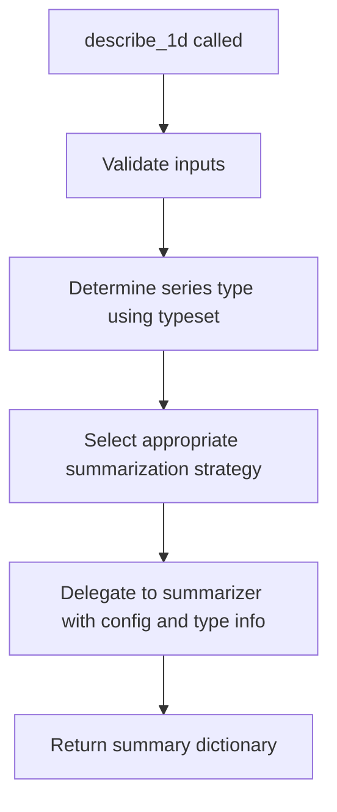
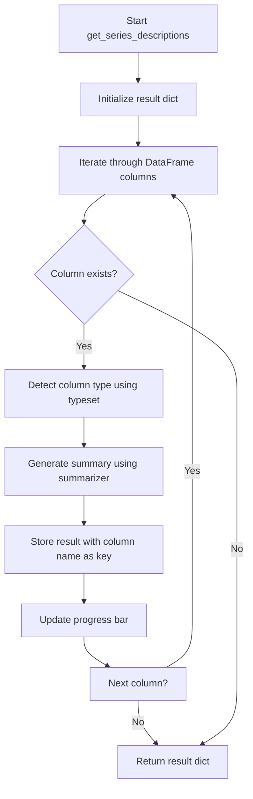

# `summary.py`

## `src.ydata_profiling.model.summary.describe_1d` · *function*

## Summary:
Generates a statistical summary dictionary for a single-dimensional data series using configured summarization strategies and type detection (currently raises NotImplementedError).

## Description:
The describe_1d function is intended to serve as the core entry point for generating descriptive statistics and metadata for individual data series within a profiling workflow. It orchestrates the process of analyzing a single pandas Series by leveraging type detection, configuration-driven summarization strategies, and appropriate statistical computations based on the detected data type.

This function is typically called during the univariate analysis phase of data profiling, where each column/variable in a dataset needs to be analyzed independently. The function delegates the actual summarization work to the BaseSummarizer while providing the necessary context through configuration, type information, and the data series itself.

The extraction of this logic into a dedicated function enables clean separation between the orchestration layer and the implementation layer, allowing for easier testing, extension, and maintenance of the profiling pipeline.

## Args:
    config (Settings): Configuration object containing profiling settings such as parallel processing options, report formatting preferences, and feature-specific controls
    series (Any): A pandas Series or equivalent data structure containing the 1-dimensional data to be summarized
    summarizer (BaseSummarizer): An instance of BaseSummarizer that provides type-specific summarization functions for different data types
    typeset (VisionsTypeset): Type detection system that provides type relationships and helps identify the appropriate data type for the series

## Returns:
    dict: A comprehensive dictionary containing statistical summaries, metadata, and type-specific information about the input series. The dictionary typically includes keys such as:
        - Basic statistics (count, mean, std, min, max, etc.)
        - Data type information
        - Missing value counts and percentages
        - Unique value counts
        - Frequency distributions for categorical data
        - Other type-specific metrics

## Raises:
    NotImplementedError: This function is not yet implemented and raises this exception when called

## Constraints:
    Preconditions:
        - config must be a valid Settings instance with properly initialized configuration values
        - series must be a valid pandas Series or compatible data structure
        - summarizer must be a properly initialized BaseSummarizer instance
        - typeset must be a valid VisionsTypeset instance with proper type relationships defined
    
    Postconditions:
        - The returned dictionary will contain standardized keys for consistent processing by downstream components
        - All statistical computations will respect the configuration settings provided in the config parameter

## Side Effects:
    None: This function is designed to be stateless and does not modify external state or perform I/O operations

## Control Flow:


## Examples:
```python
from ydata_profiling.config import Settings
from ydata_profiling.model.summarizer import BaseSummarizer
from visions import VisionsTypeset
import pandas as pd

# Create test data
series = pd.Series([1, 2, 3, 4, 5])
config = Settings()
summarizer = BaseSummarizer()
typeset = VisionsTypeset()

# Generate summary (currently raises NotImplementedError)
try:
    result = describe_1d(config, series, summarizer, typeset)
    print(result)
except NotImplementedError:
    print("Function not yet implemented")
```

## `src.ydata_profiling.model.summary.get_series_descriptions` · *function*

## Summary:
Placeholder function for generating descriptive statistics and type information for each series in a DataFrame using type-aware summarization.

## Description:
This function is intended to process each column in the input DataFrame to create detailed descriptions containing statistical summaries, type information, and metadata. It serves as a key component in the data profiling pipeline where individual series need to be analyzed independently.

The function orchestrates the profiling of individual series by leveraging the provided summarizer, type detection system, and configuration settings. It is designed to iterate through DataFrame columns, detect types using the typeset, and generate summaries using the summarizer while updating progress tracking.

Due to its current implementation status, this function raises NotImplementedError and requires completion before use.

## Args:
    config (Settings): Configuration object containing profiling settings and preferences
    df (Any): Input pandas DataFrame containing the data to be profiled
    summarizer (BaseSummarizer): Summarizer instance capable of generating statistics for different data types
    typeset (VisionsTypeset): Type detection system that identifies data types for each series
    pbar (tqdm): Progress bar instance for tracking processing progress

## Returns:
    dict: Dictionary mapping series/column names to their descriptive statistics and metadata. Each entry contains type information, summary statistics, and other relevant profiling data for the corresponding series. The exact structure of each value depends on the implementation of the summarizer and type detection system.

## Raises:
    NotImplementedError: Currently raised by this function as it is not yet implemented

## Constraints:
    Preconditions:
    - config must be a valid Settings instance with proper configuration
    - df must be a valid pandas DataFrame or compatible data structure
    - summarizer must be a properly initialized BaseSummarizer instance
    - typeset must be a valid VisionsTypeset instance with appropriate type mappings
    - pbar must be a valid tqdm progress bar instance
    
    Postconditions:
    - When implemented, returns a dictionary with keys matching DataFrame column names
    - When implemented, each dictionary value contains complete descriptive information for the corresponding series

## Side Effects:
    - Updates the progress bar state during processing (when implemented)
    - May perform type detection operations on DataFrame columns (when implemented)
    - Invokes summarizer functions that may have their own side effects (when implemented)

## Control Flow:


## Examples:
```python
from ydata_profiling.config import Settings
from ydata_profiling.model.summarizer import BaseSummarizer
from visions import VisionsTypeset
from tqdm import tqdm
import pandas as pd

# Setup
config = Settings()
df = pd.DataFrame({'A': [1, 2, 3], 'B': ['x', 'y', 'z']})
summarizer = BaseSummarizer()
typeset = VisionsTypeset()
pbar = tqdm(total=len(df.columns))

# This will raise NotImplementedError currently
try:
    descriptions = get_series_descriptions(config, df, summarizer, typeset, pbar)
except NotImplementedError:
    print("Function not yet implemented")
```

