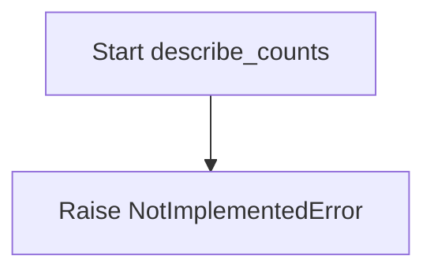
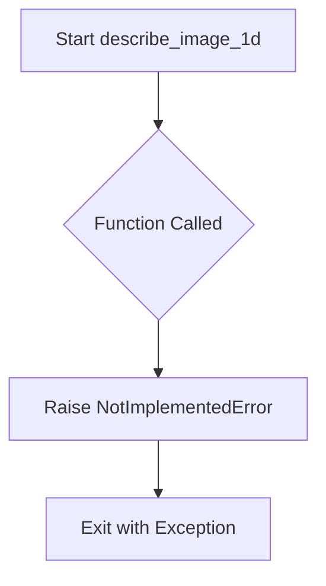
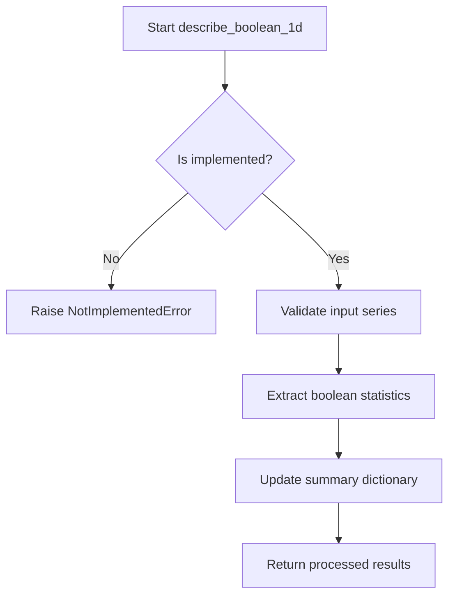

# `summary_algorithms.py`

## `src.ydata_profiling.model.summary_algorithms.func_nullable_series_contains` · *function*

## Summary:
Decorator that preprocesses pandas Series by removing NaN values before applying a statistical function, returning False if the series becomes empty after cleaning.

## Description:
This decorator wraps statistical functions that operate on pandas Series to handle nullable data gracefully. When a Series contains NaN values, they are removed before processing. If the resulting Series is empty after NaN removal, the decorator returns False immediately without calling the wrapped function. This prevents errors in statistical computations on empty datasets while maintaining the original function's interface.

The decorator is primarily used in data profiling contexts where statistical measures need to be computed on potentially incomplete data, ensuring robust handling of missing values without requiring each individual function to implement NaN-checking logic.

## Args:
    fn (Callable): The statistical function to be wrapped. Expected to accept (config: Settings, series: pd.Series, state: dict, *args, **kwargs) and return a boolean value.

## Returns:
    Callable: A decorated version of the input function that handles Series with NaN values appropriately.

## Raises:
    None explicitly raised by this decorator. Any exceptions are propagated from the wrapped function `fn`.

## Constraints:
    Preconditions:
    - Input `fn` must be callable
    - The wrapped function must accept arguments in the form (config: Settings, series: pd.Series, state: dict, *args, **kwargs)
    - The wrapped function must return a boolean value
    
    Postconditions:
    - If input series has no NaN values, the wrapped function is called with the original series
    - If input series has NaN values but becomes non-empty after dropna(), the wrapped function is called with the cleaned series
    - If input series has NaN values and becomes empty after dropna(), False is returned immediately

## Side Effects:
    None - This decorator is pure and doesn't cause any external state mutations or I/O operations.

## Control Flow:
```mermaid
flowchart TD
    A[func_nullable_series_contains called] --> B{series.hasnans?}
    B -- Yes --> C[series.dropna()]
    C --> D{series.empty?}
    D -- Yes --> E[return False]
    D -- No --> F[call fn(config, series, state, *args, **kwargs)]
    B -- No --> G[call fn(config, series, state, *args, **kwargs)]
    E --> H[Return False]
    F --> H
    G --> H
```

## Examples:
```python
# Example usage in a profiling context
@func_nullable_series_contains
def test_normal_distribution(config: Settings, series: pd.Series, state: dict) -> bool:
    # Implementation that tests if series follows normal distribution
    return True

# Usage with Series containing NaN values
series_with_nans = pd.Series([1, 2, np.nan, 4])
result = test_normal_distribution(config, series_with_nans, {})  # Returns False if series becomes empty after dropna()

# Usage with Series without NaN values  
series_without_nans = pd.Series([1, 2, 3, 4])
result = test_normal_distribution(config, series_without_nans, {})  # Calls the wrapped function normally
```

## `src.ydata_profiling.model.summary_algorithms.histogram_compute` · *function*

## Summary:
Computes histogram statistics for data profiling with configurable bin sizing and weight support.

## Description:
This function generates histogram data for numerical data profiling, automatically determining optimal bin edges based on configuration settings while respecting maximum bin limits. It supports weighted histograms and can compute either frequency or density-based histograms.

The function is extracted into its own component to encapsulate the complex logic of histogram computation, including automatic bin sizing, maximum bin enforcement, and proper handling of weights, making the main profiling logic cleaner and more maintainable.

## Args:
    config (Settings): Configuration object containing plot settings including histogram parameters
    finite_values (np.ndarray): Array of finite numerical values to compute histogram for
    n_unique (int): Number of unique values in the dataset
    name (str, optional): Key name to store histogram results in returned dictionary. Defaults to "histogram"
    weights (np.ndarray, optional): Weights for each value in finite_values. Must match the number of bins when max_bins is exceeded. Defaults to None

## Returns:
    dict: Dictionary containing the computed histogram with the specified name as key. The value is a tuple of (histogram_counts, bin_edges) from numpy.histogram where:
    - histogram_counts (array): Array of histogram bin counts
    - bin_edges (array): Array of bin edges defining the histogram bins

## Raises:
    None explicitly raised - relies on underlying numpy functions which may raise ValueError for invalid inputs

## Constraints:
    Preconditions:
    - finite_values must be a numpy array of numerical values
    - n_unique must be a positive integer representing unique values count
    - config must contain valid plot.histogram configuration
    - weights (when provided) must be compatible with bin counts
    
    Postconditions:
    - Returns a dictionary with exactly one entry (keyed by name parameter)
    - The returned dictionary contains a valid histogram tuple from numpy.histogram
    - Bin edges are properly calculated according to configuration limits

## Side Effects:
    None - This function is pure and has no side effects

## Control Flow:
```mermaid
flowchart TD
    A[Start histogram_compute] --> B{hist_config.bins == 0?}
    B -- Yes --> C[bins_arg = "auto"]
    B -- No --> D[bins_arg = min(hist_config.bins, n_unique)]
    C --> E[bins = np.histogram_bin_edges(finite_values, bins=bins_arg)]
    D --> E
    E --> F{len(bins) > hist_config.max_bins?}
    F -- Yes --> G[bins = np.histogram_bin_edges(finite_values, bins=hist_config.max_bins)]
    F -- No --> H[Skip weight adjustment]
    G --> I{weights != None AND len(weights) == hist_config.max_bins?}
    I -- Yes --> J[weights = weights]
    I -- No --> K[weights = None]
    H --> L[stats[name] = np.histogram(...)]
    J --> L
    K --> L
    L --> M[Return stats]
```

## Examples:
    # Basic usage
    config = Settings()
    values = np.array([1, 2, 2, 3, 3, 3])
    result = histogram_compute(config, values, 3)
    # Returns: {'histogram': (array([1, 2, 3]), array([1., 2., 3., 4.]))}
    
    # With custom name and weights
    weights = np.array([1.0, 2.0, 1.0, 3.0, 2.0, 1.0])
    result = histogram_compute(config, values, 3, name="my_histogram", weights=weights)
    # Returns: {'my_histogram': (array([1, 2, 3]), array([1., 2., 3., 4.]))}

## `src.ydata_profiling.model.summary_algorithms.chi_square` · *function*

## Summary:
Computes the chi-square test statistic for goodness of fit using observed frequencies.

## Description:
Performs a chi-square goodness of fit test to determine if the observed frequency distribution matches an expected distribution. This function can accept either raw data values or a pre-computed histogram for testing.

## Args:
    values (Optional[np.ndarray]): Array of raw data values to compute histogram from. Required if histogram is None.
    histogram (Optional[np.ndarray]): Pre-computed histogram of observed frequencies. If None, computed from values using automatic bin selection.

## Returns:
    dict: Dictionary containing chi-square test results with keys:
        - statistic: The chi-square test statistic (float)
        - pvalue: The p-value of the test (float)

## Raises:
    Exception: May raise exceptions from numpy or scipy functions when:
    - values is None and histogram is None (results in failure when computing bins)
    - values contains non-numeric data when histogram is None
    - histogram contains invalid frequency data

## Constraints:
    Preconditions:
    - If histogram is None, values must be provided and contain valid numeric data
    - If histogram is provided, it must contain valid frequency counts
    - Values should be numeric for proper histogram computation
    - At least one of values or histogram must be provided (though the function will fail gracefully if both are None)
    
    Postconditions:
    - Returns a dictionary with exactly two keys: 'statistic' and 'pvalue'
    - All returned values are numeric (float)

## Side Effects:
    None

## Control Flow:
```mermaid
flowchart TD
    A[chi_square called] --> B{histogram == None?}
    B -- Yes --> C[Compute bins with np.histogram_bin_edges]
    C --> D[Compute histogram with np.histogram]
    D --> E[Call scipy.stats.chisquare]
    B -- No --> F[Call scipy.stats.chisquare directly]
    E --> G[Return dict(chisquare result)]
    F --> G
```

## Examples:
```python
# Using raw values
import numpy as np
values = np.array([1, 2, 2, 3, 3, 3])
result = chi_square(values=values)
print(result['statistic'])  # Chi-square statistic
print(result['pvalue'])     # P-value

# Using pre-computed histogram
histogram = np.array([1, 2, 3])
result = chi_square(histogram=histogram)
print(result['statistic'])  # Chi-square statistic
print(result['pvalue'])     # P-value
```

## `src.ydata_profiling.model.summary_algorithms.series_hashable` · *function*

## Summary:
Decorator that conditionally executes wrapped functions based on whether a series is hashable.

## Description:
This decorator wraps a function that processes series data and only executes the wrapped function when the series is hashable. If the series is not hashable, it returns the input arguments unchanged. This pattern is used to avoid processing non-hashable data in operations that require hashable elements.

## Args:
    fn (Callable[[Settings, pd.Series, dict], Tuple[Settings, pd.Series, dict]]): The function to be wrapped. This function should accept configuration, a pandas Series, and a summary dictionary, and return a tuple of the same types.

## Returns:
    Callable[[Settings, pd.Series, dict], Tuple[Settings, pd.Series, dict]]: A decorated version of the input function that conditionally executes based on the hashable property of the series.

## Raises:
    None explicitly raised by this decorator.

## Constraints:
    Preconditions:
    - The input function `fn` must accept exactly three parameters: Settings, pd.Series, and dict
    - The summary dictionary must contain a key "hashable" with a boolean value
    - The input function must return a tuple of (Settings, pd.Series, dict)

    Postconditions:
    - If summary["hashable"] is False, the original arguments are returned unchanged
    - If summary["hashable"] is True, the wrapped function is called with the original arguments

## Side Effects:
    None - This decorator itself doesn't cause side effects, though the wrapped function might.

## Control Flow:
```mermaid
flowchart TD
    A[series_hashable decorator] --> B{summary["hashable"]}
    B -- False --> C[Return original args]
    B -- True --> D[Call wrapped function fn]
    D --> E[Return fn result]
```

## Examples:
```python
@series_hashable
def calculate_statistics(config: Settings, series: pd.Series, summary: dict) -> Tuple[Settings, pd.Series, dict]:
    # This function will only execute if series is hashable
    summary['mean'] = series.mean()
    return config, series, summary

# Usage:
config = Settings()
series = pd.Series([1, 2, 3, 4])
summary = {"hashable": True, "count": 4}
result = calculate_statistics(config, series, summary)
```

## `src.ydata_profiling.model.summary_algorithms.series_handle_nulls` · *function*

## Summary:
Decorator that removes null values from pandas Series before processing, ensuring downstream functions work with clean data.

## Description:
This decorator function wraps another function that processes pandas Series data. It automatically detects and removes NaN values from the input series before passing the cleaned data to the wrapped function. This ensures that subsequent analysis operations work with complete data rather than having to handle null values repeatedly.

The function is designed to be applied as a decorator to various summary algorithms that process Series data, providing consistent null-value handling across different analysis operations.

## Args:
    fn (Callable[[Settings, pd.Series, dict], Tuple[Settings, pd.Series, dict]]): The function to be wrapped. This function should accept configuration settings, a pandas Series, and a summary dictionary, and return a tuple containing updated settings, a pandas Series, and an updated summary dictionary.

## Returns:
    Callable[[Settings, pd.Series, dict], Tuple[Settings, pd.Series, dict]]: A new function that wraps the original function with null-value preprocessing logic.

## Raises:
    None explicitly raised by this decorator. Any exceptions would come from the wrapped function `fn`.

## Constraints:
    Preconditions:
    - The input `fn` must be callable with signature (Settings, pd.Series, dict) -> (Settings, pd.Series, dict)
    - The `series` parameter passed to the returned function must be a valid pandas Series object
    
    Postconditions:
    - The returned function maintains the same signature as the input function
    - If the input series contains null values, they are removed before processing
    - If the input series contains no null values, the series is passed through unchanged

## Side Effects:
    None directly caused by this decorator. However, the wrapped function may have side effects.

## Control Flow:
```mermaid
flowchart TD
    A[series_handle_nulls decorator] --> B{series.hasnans?}
    B -->|Yes| C[series.dropna()]
    B -->|No| C
    C --> D[fn(config, series, summary)]
    D --> E[Return result]
```

## Examples:
```python
@series_handle_nulls
def calculate_mean(config: Settings, series: pd.Series, summary: dict) -> Tuple[Settings, pd.Series, dict]:
    # This function will receive a series without null values
    mean_value = series.mean()
    summary['mean'] = mean_value
    return config, series, summary

# Usage:
config = Settings()
series_with_nans = pd.Series([1, 2, None, 4, 5])
summary = {}
result = calculate_mean(config, series_with_nans, summary)
# The series passed to calculate_mean will have nulls removed
```

## `src.ydata_profiling.model.summary_algorithms.named_aggregate_summary` · *function*

## Summary:
Computes and returns aggregate statistical measures (max, mean, median, min) for a data series with prefixed keys.

## Description:
This function calculates basic descriptive statistics for a given pandas Series and returns them in a dictionary format with keys prefixed by the provided string. It serves as a utility for generating standardized summary statistics in data profiling workflows.

## Args:
    series (pandas.Series): Input data series for which to compute statistics
    key (str): String prefix used to name the returned statistic keys

## Returns:
    dict: Dictionary containing four statistical measures with prefixed keys:
        - "max_{key}": Maximum value in the series
        - "mean_{key}": Mean value of the series  
        - "median_{key}": Median value of the series
        - "min_{key}": Minimum value in the series

## Raises:
    None explicitly raised in the function body

## Constraints:
    Preconditions:
        - Input series must be a valid pandas Series object
        - Input key must be a string
    Postconditions:
        - Returns a dictionary with exactly four keys matching the pattern "statistic_{key}"
        - All returned values are numeric (float or int)

## Side Effects:
    None

## Control Flow:
```mermaid
flowchart TD
    A[Start named_aggregate_summary] --> B[Initialize summary dict]
    B --> C[Calculate max_{key}]
    C --> D[Calculate mean_{key}]  
    D --> E[Calculate median_{key}]
    E --> F[Calculate min_{key}]
    F --> G[Return summary dict]
```

## Examples:
```python
import pandas as pd
import numpy as np

# Basic usage
series = pd.Series([1, 2, 3, 4, 5])
result = named_aggregate_summary(series, "value")
# Returns: {'max_value': 5, 'mean_value': 3.0, 'median_value': 3, 'min_value': 1}

# With float values
float_series = pd.Series([1.5, 2.7, 3.2, 4.8])
result = named_aggregate_summary(float_series, "score")
# Returns: {'max_score': 4.8, 'mean_score': 3.05, 'median_score': 2.7, 'min_score': 1.5}
```

## `src.ydata_profiling.model.summary_algorithms.describe_counts` · *function*

## Summary:
Placeholder function for count-based statistical analysis in data profiling.

## Description:
The `describe_counts` function serves as a placeholder for implementing count-based statistical operations within the data profiling framework. This function is intended to process count-related information from data series and update summary statistics accordingly.

This function is currently not implemented and raises NotImplementedError. It follows the pattern of other summary algorithm functions in the module that handle specific statistical computations for data profiling. The function signature indicates it should process a data series to extract count-based statistics and integrate them into the overall profiling summary.

## Args:
    config (Settings): Configuration object containing profiling settings and parameters that control the analysis behavior
    series (Any): Input data series to be analyzed for count-based statistics
    summary (dict): Dictionary containing existing summary statistics to be updated

## Returns:
    Tuple[Settings, Any, dict]: A tuple containing updated configuration, processed series data, and updated summary dictionary with count-based statistics

## Raises:
    NotImplementedError: This function is not yet implemented and must be overridden by concrete implementations

## Constraints:
    Preconditions:
    - config must be a valid Settings object with properly initialized configurations
    - series must be a valid data structure suitable for count operations
    - summary must be a mutable dictionary object
    
    Postconditions:
    - The function should return a tuple with updated configuration, processed data, and extended summary

## Side Effects:
    None: This function does not perform any I/O operations or external state mutations

## Control Flow:


## Examples:
```python
from ydata_profiling.config import Settings
import pandas as pd

# This function is not yet implemented
# In a real implementation, it would:
# 1. Analyze the series for count statistics (unique values, frequency distribution)
# 2. Update the summary dictionary with these counts
# 3. Return updated configuration and data

# Example of expected behavior (conceptual):
# config = Settings()
# series = pd.Series([1, 2, 2, 3, 3, 3])
# summary = {"count": 0, "unique": 0}
# 
# # Expected result after implementation:
# # config, processed_series, summary = describe_counts(config, series, summary)
# # summary would contain count statistics like: {"count": 6, "unique": 3, ...}
```

## `src.ydata_profiling.model.summary_algorithms.describe_supported` · *function*

## Summary:
Determines and returns supported statistical descriptions for a data series based on configuration and series characteristics.

## Description:
This function serves as a dispatcher or selector that identifies which statistical analyses and descriptions are appropriate for a given data series, considering the provided configuration settings and existing series metadata. It forms part of a data profiling pipeline where different analysis strategies are chosen based on data properties.

The function is designed to be implemented by specific algorithm implementations that handle different data types or analysis scenarios. It follows a pattern where configuration, data series, and existing description metadata are processed to determine what descriptive statistics or analyses should be applied.

## Args:
    config (Settings): Configuration object containing profiling settings and preferences
    series (Any): Data series to analyze (typically pandas Series or similar)
    series_description (dict): Existing metadata and description of the series

## Returns:
    Tuple[Settings, Any, dict]: A tuple containing the configuration, series, and updated series description with supported analyses added

## Raises:
    NotImplementedError: This function is intended to be overridden by specific implementations in subclasses or specialized modules

## Constraints:
    Preconditions:
        - config must be a valid Settings object
        - series must be a valid data series object
        - series_description must be a dictionary containing valid metadata
    
    Postconditions:
        - The returned tuple maintains the same structure as inputs
        - The series_description dictionary will contain updated information about supported analyses

## Side Effects:
    None: This function does not perform any I/O operations or modify external state

## Control Flow:
```mermaid
flowchart TD
    A[Input: config, series, series_description] --> B{Is implementation defined?}
    B -- No --> C[Raise NotImplementedError]
    B -- Yes --> D[Process series with config]
    D --> E[Update series_description with supported analyses]
    E --> F[Return (config, series, series_description)]
```

## Examples:
    # Typical usage in a profiling pipeline
    config = Settings()
    series = pd.Series([1, 2, 3, 4, 5])
    description = {"length": 5, "type": "numeric"}
    
    # This would normally be implemented elsewhere
    # result = describe_supported(config, series, description)
```

## `src.ydata_profiling.model.summary_algorithms.describe_generic` · *function*

## Summary:
Generic function for describing data series and updating statistical summaries with type-appropriate calculations.

## Description:
This function serves as a base implementation for processing data series and generating descriptive statistics. It is designed to be overridden by specific implementations that handle different data types or statistical approaches. The function takes configuration settings, a data series, and an existing summary dictionary, then returns updated versions of these components with additional statistical information added to the summary.

## Args:
    config (Settings): Configuration object containing profiling settings and parameters
    series (Any): Data series to be described (typically pandas Series or similar)
    summary (dict): Dictionary containing existing statistical summaries that will be updated

## Returns:
    Tuple[Settings, Any, dict]: A tuple containing the updated configuration, processed series, and updated summary dictionary

## Raises:
    NotImplementedError: This function is intended to be overridden by specific implementations

## Constraints:
    Preconditions:
        - config must be a valid Settings object
        - series must be a valid data series object
        - summary must be a mutable dictionary
    Postconditions:
        - The returned summary dictionary will contain additional statistical entries
        - The returned configuration and series remain unchanged from input (unless modified by specific implementations)

## Side Effects:
    None: This function does not perform any I/O operations or external state mutations

## Control Flow:
```mermaid
flowchart TD
    A[Start describe_generic] --> B{Is NotImplementedError raised?}
    B -- Yes --> C[Raise NotImplementedError]
    B -- No --> D[Process series with config]
    D --> E[Update summary dictionary]
    E --> F[Return (config, series, summary)]
```

## Examples:
    # This function would typically be called internally by the profiling system
    # Example usage pattern (not directly callable due to NotImplementedError):
    # config = Settings()
    # series = pd.Series([1, 2, 3, 4, 5])
    # summary = {}
    # result = describe_generic(config, series, summary)
```

## `src.ydata_profiling.model.summary_algorithms.describe_numeric_1d` · *function*

## Summary:
Placeholder function for computing descriptive statistics for numeric data series in one-dimensional profiling.

## Description:
This function is a placeholder implementation for describing numeric data in one-dimensional profiling contexts. It is intended to calculate various statistical measures for numeric data series and update the profiling summary with computed metrics. The function is part of a multimethod dispatch system designed to handle different data types appropriately.

Currently, this function raises NotImplementedError as it has not yet been implemented. When implemented, it will be invoked during the profiling process when analyzing numeric columns in datasets, particularly when the data type is identified as numeric and requires statistical summarization.

## Args:
    config (Settings): Configuration settings that control the profiling behavior and computation parameters
    series (Any): A data series containing numeric values to be described
    summary (dict): Dictionary containing existing profiling results that will be updated with new statistics

## Returns:
    Tuple[Settings, Any, dict]: A tuple containing the updated configuration, the processed series, and the updated summary dictionary with computed statistics

## Raises:
    NotImplementedError: This function is not yet implemented and raises this exception when called

## Constraints:
    Preconditions:
    - The series parameter should contain numeric data that can be processed by statistical functions
    - The summary dictionary should be properly initialized before calling this function
    
    Postconditions:
    - When implemented, the summary dictionary will contain new statistical entries for the numeric series
    - When implemented, the returned configuration may contain updated settings based on analysis

## Side Effects:
    None: This function does not perform any I/O operations or mutate external state directly

## Control Flow:
```mermaid
flowchart TD
    A[Start describe_numeric_1d] --> B{Is implemented?}
    B -- Yes --> C[Calculate statistics]
    C --> D[Update summary dict]
    D --> E[Return (config, series, summary)]
    B -- No --> F[raise NotImplementedError]
```

## Examples:
```python
# This would be the typical usage once implemented
config = Settings()
series = pd.Series([1, 2, 3, 4, 5])
summary = {}
# Currently raises NotImplementedError
# updated_config, processed_series, updated_summary = describe_numeric_1d(config, series, summary)
```

## `src.ydata_profiling.model.summary_algorithms.describe_text_1d` · *function*

## Summary:
Placeholder function for computing descriptive statistics for text data series in one-dimensional profiling.

## Description:
This function is a placeholder implementation for describing text data in one-dimensional profiling contexts. It is intended to calculate various statistical measures and characteristics for text data series and update the profiling summary with computed metrics. The function is part of a multimethod dispatch system designed to handle different data types appropriately.

Currently, this function raises NotImplementedError as it has not yet been implemented. When implemented, it will be invoked during the profiling process when analyzing text columns in datasets, particularly when the data type is identified as textual and requires descriptive analysis.

## Args:
    config (Settings): Configuration settings that control the profiling behavior and computation parameters
    series (Any): A data series containing text values to be described
    summary (dict): Dictionary containing existing profiling results that will be updated with new text statistics

## Returns:
    Tuple[Settings, Any, dict, Any]: A tuple containing:
        - Updated configuration settings
        - Processed series data (potentially transformed or validated)
        - Updated summary dictionary with text-specific statistical measures
        - Additional return value (purpose depends on implementation)

## Raises:
    NotImplementedError: This function is not yet implemented and raises this exception when called

## Constraints:
    Preconditions:
    - The series parameter should contain text data that can be processed by text analysis functions
    - The summary dictionary should be properly initialized before calling this function
    
    Postconditions:
    - When implemented, the summary dictionary will contain new statistical entries for the text series
    - When implemented, the returned configuration may contain updated settings based on text analysis

## Side Effects:
    None: This function does not perform any I/O operations or mutate external state directly

## Control Flow:
```mermaid
flowchart TD
    A[Start describe_text_1d] --> B{Is implemented?}
    B -- Yes --> C[Process text data]
    C --> D[Calculate text statistics]
    D --> E[Update summary dict]
    E --> F[Return (config, series, summary, additional_value)]
    B -- No --> G[raise NotImplementedError]
```

## Examples:
```python
# This would be the typical usage once implemented
config = Settings()
series = pd.Series(["hello world", "foo bar", "baz qux"])
summary = {}
# Currently raises NotImplementedError
# updated_config, processed_series, updated_summary = describe_text_1d(config, series, summary)
```

## `src.ydata_profiling.model.summary_algorithms.describe_date_1d` · *function*

*No documentation generated.*

## `src.ydata_profiling.model.summary_algorithms.describe_categorical_1d` · *function*

## Summary:
Interface template for categorical data analysis in profiling systems.

## Description:
This function defines the expected interface for categorical data analysis within a profiling system. It establishes a standardized contract for processing categorical pandas Series data and updating summary statistics according to configuration parameters. As a template function, it is intended to be overridden by specific implementations that provide the actual categorical analysis logic.

The function follows a consistent pattern with other 1D data analysis functions in the profiling system, maintaining uniform input and output signatures.

## Args:
    config (Settings): Configuration object containing analysis parameters and preferences
    series (pd.Series): Pandas Series containing categorical data to analyze
    summary (dict): Dictionary containing existing summary statistics to be updated

## Returns:
    Tuple[Settings, pd.Series, dict]: Standardized return tuple maintaining consistency with other analysis functions

## Raises:
    NotImplementedError: Indicates that this is a template function requiring specific implementation

## Constraints:
    Preconditions:
        - config must be a valid Settings object
        - series must be a pandas Series with categorical data
        - summary must be a mutable dictionary
    
    Postconditions:
        - Function maintains expected return type signature
        - Input parameters remain unchanged except as specified by implementation

## Side Effects:
    None: This function does not perform any I/O operations or mutate external state directly

## Examples:
    # Interface contract demonstration
    config = Settings()
    series = pd.Series(['A', 'B', 'A', 'C'], dtype='category')
    summary = {}
    
    # This function must be implemented by concrete categorical analysis logic
    # The interface contract is established by this template
    # updated_config, updated_series, updated_summary = describe_categorical_1d(config, series, summary)

## `src.ydata_profiling.model.summary_algorithms.describe_url_1d` · *function*

## Summary:
Placeholder function for computing descriptive statistics and analysis for URL data series in one-dimensional profiling.

## Description:
This function serves as a placeholder implementation for analyzing URL data in one-dimensional profiling contexts. It is designed to process pandas Series containing URL strings and extract meaningful statistical and structural information about the URLs. The function follows the established pattern of other 1D data analysis functions in the profiling system, providing a standardized interface for URL-specific data analysis.

When implemented, this function will be invoked during the profiling process when analyzing columns containing URL data, particularly when the data type is identified as URL-like strings and requires specialized parsing and statistical summarization.

## Args:
    config (Settings): Configuration settings that control the profiling behavior and computation parameters for URL analysis
    series (Any): A data series containing URL strings to be analyzed and described
    summary (dict): Dictionary containing existing profiling results that will be updated with new URL-specific statistics

## Returns:
    Tuple[Settings, Any, dict]: A tuple containing the updated configuration, the processed series (potentially normalized or parsed), and the updated summary dictionary with computed URL statistics

## Raises:
    NotImplementedError: This function is not yet implemented and raises this exception when called

## Constraints:
    Preconditions:
    - The series parameter should contain string data that represents URLs or URL-like patterns
    - The summary dictionary should be properly initialized before calling this function
    - Config should contain appropriate settings for URL analysis if/when implemented
    
    Postconditions:
    - When implemented, the summary dictionary will contain new URL-specific entries such as protocol distribution, domain frequency, path complexity, etc.
    - When implemented, the returned configuration may contain updated settings based on URL analysis requirements

## Side Effects:
    None: This function does not perform any I/O operations or mutate external state directly

## Control Flow:
```mermaid
flowchart TD
    A[Start describe_url_1d] --> B{Is implemented?}
    B -- Yes --> C[Parse URL components]
    C --> D[Analyze URL structure]
    D --> E[Extract statistics]
    E --> F[Update summary dict]
    F --> G[Return (config, series, summary)]
    B -- No --> H[raise NotImplementedError]
```

## Examples:
```python
# This would be the typical usage once implemented
config = Settings()
series = pd.Series(['https://www.example.com/path1', 'http://api.domain.org/v1/data'])
summary = {}
# Currently raises NotImplementedError
# updated_config, processed_series, updated_summary = describe_url_1d(config, series, summary)
```

## `src.ydata_profiling.model.summary_algorithms.describe_file_1d` · *function*

## Summary:
Analyzes a single-dimensional data series and computes descriptive statistics for profiling.

## Description:
Processes a data series to calculate descriptive statistics and updates the summary dictionary with relevant metrics. This function is part of the profiling pipeline for analyzing individual data dimensions in a file or dataset.

## Args:
    config (Settings): Configuration object containing profiling settings and parameters
    series (Any): Input data series to analyze (pandas Series, numpy array, or other iterable)
    summary (dict): Dictionary containing existing summary statistics to be updated with new metrics

## Returns:
    Tuple[Settings, Any, dict]: Tuple containing the updated configuration, processed series, and updated summary dictionary

## Raises:
    NotImplementedError: Function is not yet implemented

## Constraints:
    Preconditions: 
    - config must be a valid Settings object
    - series should be compatible with statistical analysis operations
    - summary should be a mutable dictionary
    
    Postconditions:
    - The summary dictionary will contain updated statistical metrics for the series
    - The returned series may be processed or transformed based on configuration settings

## Side Effects:
    None directly observable, but modifies the summary dictionary in-place

## Control Flow:
```mermaid
flowchart TD
    A[Start describe_file_1d] --> B{Validate config}
    B --> C{Validate series}
    C --> D{Series valid?}
    D -->|No| E[Handle invalid series]
    D -->|Yes| F[Compute descriptive stats]
    F --> G[Update summary dictionary]
    G --> H[Return (config, series, summary)]
```

## Examples:
    # Typical usage in profiling pipeline
    config = Settings()
    series = pd.Series([1, 2, 3, 4, 5])
    summary = {}
    updated_config, processed_series, updated_summary = describe_file_1d(config, series, summary)
```

## `src.ydata_profiling.model.summary_algorithms.describe_path_1d` · *function*

## Summary:
Processes and summarizes 1-dimensional data path information for statistical profiling.

## Description:
Analyzes a 1-dimensional data series to extract descriptive statistics and update profiling configuration and summary data structures. This function serves as a key component in the data profiling pipeline for handling univariate data analysis.

## Args:
    config (Settings): Configuration settings object containing profiling parameters and options
    series (Any): Input data series to be analyzed, typically a pandas Series or similar structure
    summary (dict): Dictionary containing existing summary statistics that will be updated with new findings

## Returns:
    Tuple[Settings, Any, dict]: A tuple containing:
        - Updated configuration settings
        - Processed data (possibly transformed or filtered version of input series)
        - Updated summary dictionary with new statistical information

## Raises:
    NotImplementedError: This function is not yet implemented and always raises this exception

## Constraints:
    Preconditions:
        - config must be a valid Settings object
        - series must be a valid data structure that can be processed
        - summary must be a mutable dictionary object
    
    Postconditions:
        - Function would return updated configuration, processed data, and extended summary

## Side Effects:
    None: This function does not perform any I/O operations or external state mutations

## Control Flow:
```mermaid
flowchart TD
    A[Start describe_path_1d] --> B{Is implemented?}
    B -- No --> C[Raise NotImplementedError]
    B -- Yes --> D[Process config]
    D --> E[Analyze series]
    E --> F[Update summary]
    F --> G[Return (config, series, summary)]
```

## Examples:
    # Typical usage in profiling pipeline
    config = Settings()
    series = pd.Series([1, 2, 3, 4, 5])
    summary = {}
    
    # This would normally process the data and return updated values
    # result_config, result_series, result_summary = describe_path_1d(config, series, summary)
```

## `src.ydata_profiling.model.summary_algorithms.describe_image_1d` · *function*

## Summary:
Placeholder function for 1D image data profiling that raises NotImplementedError.

## Description:
This function is a placeholder in the ydata_profiling library's summary algorithms module, intended for processing 1D image data during data profiling. It currently raises NotImplementedError to indicate that the implementation is pending. The function signature follows the standard pattern used throughout the profiling system for type-specific data analysis.

## Args:
    config (Settings): Configuration settings that control the profiling behavior and parameters
    series (Any): Input data representing 1D image information, typically containing pixel values or image features
    summary (dict): Dictionary containing existing profiling summary information that would be updated with new statistics

## Returns:
    Tuple[Settings, Any, dict]: Function signature indicates this should return updated configuration, processed data, and updated summary, but currently raises NotImplementedError

## Raises:
    NotImplementedError: Always raised when this function is called, indicating incomplete implementation

## Constraints:
    Preconditions:
        - config must be a valid Settings object
        - series should contain valid 1D image data
        - summary must be a mutable dictionary object
    
    Postconditions:
        - Function execution always results in NotImplementedError being raised

## Side Effects:
    None: No side effects as the function is not implemented

## Control Flow:


## Examples:
```python
# This function is not yet implemented and will raise NotImplementedError
config = Settings()
series = [255, 128, 64, 32, 16]  # Sample 1D image data
summary = {}

# This call will raise NotImplementedError
try:
    result = describe_image_1d(config, series, summary)
except NotImplementedError:
    print("Implementation pending for describe_image_1d")
```

## `src.ydata_profiling.model.summary_algorithms.describe_boolean_1d` · *function*

## Summary:
Analyzes and summarizes boolean data in a one-dimensional series for statistical profiling.

## Description:
This function implements the data summarization algorithm specifically designed for boolean data types. It processes a pandas Series containing boolean values and generates descriptive statistics and summary information that would be included in a data profiling report. The function follows a consistent interface pattern with other type-specific summary functions in the same module.

The function is typically called during automated data profiling workflows when analyzing columns with boolean data types. It extracts meaningful statistical properties and updates the summary dictionary with relevant metrics.

## Args:
    config (Settings): Configuration settings that control the profiling behavior and output format
    series (Any): A pandas Series or array-like object containing boolean data (True/False values)
    summary (dict): Dictionary containing existing summary statistics that will be updated with boolean-specific metrics

## Returns:
    Tuple[Settings, Any, dict]: A tuple containing:
        - Updated configuration settings
        - Processed series data (potentially transformed or validated)
        - Updated summary dictionary with boolean-specific statistical measures

## Raises:
    NotImplementedError: This function is not yet implemented and raises this exception when called

## Constraints:
    Preconditions:
        - The series parameter should contain boolean or boolean-compatible data
        - The summary dictionary should be initialized before calling this function
        - Config should be a properly initialized Settings object
    
    Postconditions:
        - The summary dictionary will contain boolean-specific statistical metrics
        - The returned series should maintain the same length as the input series

## Side Effects:
    None: This function does not perform any I/O operations or mutate external state

## Control Flow:


## Examples:
```python
# Typical usage in a profiling workflow
config = Settings()
series = pd.Series([True, False, True, True, False])
summary = {}

try:
    config, processed_series, summary = describe_boolean_1d(config, series, summary)
except NotImplementedError:
    print("Function not yet implemented")
```

## `src.ydata_profiling.model.summary_algorithms.describe_timeseries_1d` · *function*

*No documentation generated.*

